# C++ Forum :: Binärer Suchbaum

Created: 2021-10-25 09:34:42 +0200

Modified: 2021-10-25 09:35:13 +0200

---

## Inhaltsverzeichnis
-   1 Suchen - das Problem
-   2 Binäre Suchbäume

-   2.1 Suchen
-   2.2 Maximum und Minimum
-   2.3 Durchwandern

-   2.3.1 Knoten mit rechtem Kind
-   2.3.2 Knoten ohne rechtes Kind
-   2.4 Einfügen
-   2.5 Löschen

-   2.5.1 Löschen eines Knoten ohne Kinder
-   2.5.2 Löschen eines Knoten mit einem Kind
-   2.5.3 Löschen eines Knoten mit zwei Kindern
-   2.6 Ausbalancierte Bäume und die, die es nicht sind
-   2.7 Rotationen
-   3 Implementierung

-   3.1 Navigation
-   3.2 Debuggen

-   3.2.1 Konsolenausgabe
-   3.2.2 Tod dem Zeigersalat
-   3.3 Kopierkonstruktor, Destruktor und Zuweisung
-   3.4 Suchen
-   3.5 Einfügen
-   3.6 Austauschen
-   3.7 Minimum und Maximum
-   3.8 Durchwandern
-   3.9 Löschen
-   3.10 Rotationen
-   3.11 Tunen von new und delete
-   3.12 Download und Experimentierkonsole
-   4 Bäume in der STL
-   5 Ausblick

# Suchen - das Problem

Sei es eine Datenbank oder ein Dateisystem: Das Suchen nach Werten ist eines der häufigsten Probleme in der Informatik. Das im Grunde einfach klingende Problem erweist sich als ein außerordentlich komplexes Biest, sobald man über den Tellerrand der trivialen Ansätze blickt.

Für viele Anwendungen reicht ein Array, in das man sämtliche Werte reinschmeißt und anschließend von Anfang bis Ende durchläuft. Wenn die Datenbank aber wächst, dann wird dieser Ansatz unvertretbar langsam. Der erste Verbesserungsvorschlag wird dann wohl sein, das Array zu sortieren und es dann mit der Hilfe einer binären Suche zu durchwühlen. Solange sich die Elemente des Arrays nur wenig verändern, ist dieser Ansatz gut, andernfalls stößt auch er an seine Grenzen.

Wer noch mehr Geschwindigkeit braucht, der muss sich vom einfachen Array verabschieden und auf eine andere Datenstruktur ausweichen. Ein Ansatz ist, die Werte in einer Hash-Tabelle zu speichern. Diese sind in manchen Anwendungen kaum zu überbieten. Aber auch sie haben ihre Schwächen, wenn die Anzahl der Elemente unerwartete Größen annimmt. Des weiteren schneiden sie schlecht ab, wenn man mehr tun will, als nur Suchen, wie zum Beispiel der iterative Zugriff auf die Elemente. Ist die Tabelle zu groß, so wird es ewig dauern, sie zu durchforsten, um sämtliche Elemente wieder zu finden.

Hash-Tabellen werden aber nicht das Thema dieses Artikels sein, vielmehr wird es eine Weiterentwicklung der binären Suche sein: Der binäre Suchbaum. Dieser passt sich hervorragend einer großen Anzahl von Elementen an und erlaubt es, die Elemente sogar sortiert aufzulisten.

## Binäre Suchbäume

In einem Suchbaum weist man jedem Knoten ein Element zu und sorgt dafür, dass alle Elemente des linken Unterbaums kleiner und die des rechten Unterbaums größer sind.

### Suchen

Um ein Element zu suchen, beginnt man die Suche an der Wurzel. Falls die Wurzel den gesuchten Wert darstellt, ist man schon fertig. Sonst vergleicht man, ob dieser kleiner oder größer ist und setzt seine Suche im entsprechenden Unterbaum fort. Wenn man auf der untersten Ebene des Baums angelangt ist, ohne den Wert gefunden zu haben, dann ist er nicht im Baum enthalten.

In folgendem Beispiel wird die 7 gesucht.

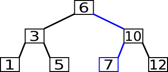{width="3.53125in" height="1.5in"}

Um ein Element zu finden, müssen wir im schlimmsten Fall von der Wurzel bis zur untersten Ebene wandern. Im besten Fall hat der Baum eine Höhe die logarithmisch von der Anzahl seiner Elemente abhängt. Dies gibt also in etwa eine Laufzeitkomplexität von O(log(n)), um ein Element zu suchen, wenn wir ungünstige Bäume ignorieren. n ist die Gesamtanzahl der Elemente im Baum.

### Maximum und Minimum

Da die Elemente geordnet im Baum vorliegen, ist das kleinste Element das, was sich am linken Ende des Baums befindet. Man findet es, indem man die Suche an der Wurzel beginnt und sie dann nach links fortsetzt bis man an einem Knoten angelangt, welcher keinen linken Unterbaum mehr hat. Das größte Element findet man ähnlich, nur dass man nach rechts wandern muss.

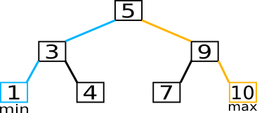

Im schlimmsten Fall müssen wir den Baum von oben nach unten durchwandern, also ist die Laufzeitkomplexität dieselbe, wie die bei der Suche eines Elements, das heißt O(log(n)).

### Durchwandern

Um die Elemente eines Baums in geordneter Reihenfolge zu durchwandern, beginnt man seine Suche beim Minimum und sucht dann immer das nächste größere Element, bis man beim Maximum angelangt ist.

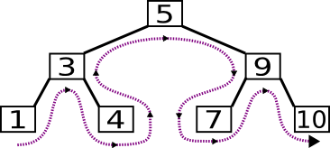

Wie man zum nachfolgenden Knoten im Baum gelangt, hängt von der Position im Baum ab von der man startet. Genauer gesagt hängt es davon ab, ob der Ausgangsknoten ein rechtes Kind besitzt oder nicht.

#### Knoten mit rechtem Kind

Falls es einen rechten Unterbaum gibt, so ist das nächste Element das Minimum dieses Unterbaums.

In folgendem Beispiel suchen wir das Element, das der 5 folgt. Dazu begeben wir uns zuerst in den rechten Unterbaum und dann suchen wir das Minimum, indem wir solange nach links wandern wie nur möglich.

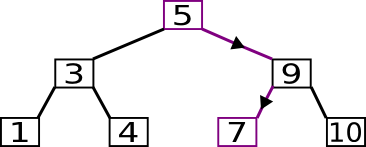

#### Knoten ohne rechtes Kind

Sollte es kein rechtes Kind geben, so muss man Richtung Wurzel des Baums klettern. Falls man unterwegs auf einen Knoten stößt, welchen man von seinem linken Kind aus erreicht hat, so hat man das nächste Element gefunden.

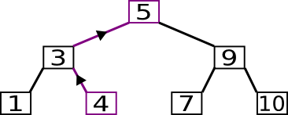

Der Algorithmus um den Baum vom Maximum zum Minimum zu durchwandern, ist genau spiegelverkehrt und darum werde ich nicht weiter auf ihn eingehen.

Beim Durchwandern des gesamten Baums wird jede Kante genau zweimal begangen, wenn man das Bestimmen des Minimums und Maximums hinzuzählt. Da es nur einen Knoten mehr gibt als Kanten, hat das Durchwandern eine Laufzeitkomplexität von O(n). Um das nächste Element zu finden, muss man im schlimmsten Fall von der untersten Ebene bis zur Wurzel oder andersherum wandern. Diese Operation hat also eine Laufzeitkomplexität von O(log(n)) im ungünstigsten Fall, ist aber meistens wesentlich besser.

Es gibt einen alternativen Ansatz, der die Knoten noch zusätzlich zum Baum in einer geordneten verketteten Liste zusammenstrickt. Dies beschleunigt das Durchwandern um einen konstanten Faktor und sorgt dafür, dass das Bestimmen des nächsten Elements immer eine konstante Laufzeit besitzt. Der Preis ist allerdings der Mehraufwand, um die verkettete Liste zu verwalten. Falls man den Baum oft durchwandern muss, sollte man diese Option in Betracht ziehen.

### Einfügen

Um einen Wert einzufügen, geht man ähnlich vor, wie bei der normalen Suche. Man wandert solange nach unten, bis man einen Knoten gefunden hat, der noch ein Kind, an der richtigen Seite, frei hat.

In folgendem Beispiel wird die 8 eingefügt.

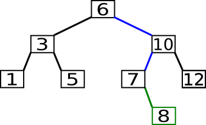

Da es sich im Wesentlichen um den gleichen Algorithmus handelt wie bei der Suche, ist auch die Komplexität die gleiche und zwar O(log(n)).

### Löschen

Als erstes sucht man den zu löschenden Knoten nach bekannter Methode. Wie man danach vorgeht, hängt von der Position des Knoten im Baum ab, das heißt wie viele Kinder der Knoten hat.

### Löschen eines Knoten ohne Kinder

Um ein Blatt zu löschen trennt man es einfach vom Elternknoten ab.

Folgendes Beispiel zeigt wie die 5 aus dem Baum gelöscht wird:

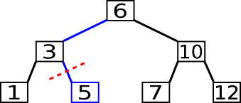

#### Löschen eines Knoten mit einem Kind

Falls es es nur ein Kind gibt, so wandert dieses an den Platz des Knoten. Man trennt den zu löschenden Knoten von Kind- und Elternknoten und verbindet danach diese zwei.

Im nächsten Beispiel wird die 3 gelöscht.

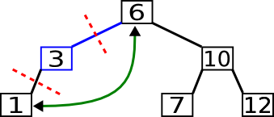{

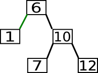

#### Löschen eines Knoten mit zwei Kindern

Ein Knoten mit zwei Kindern lässt sich nicht einfach löschen. Was aber leicht gelöscht werden kann, ist das vorhergehende oder nachfolgende Element. Bei beiden handelt es sich nämlich um das Maximum respektive das Minimum des linken beziehungsweise rechten Unterbaums. Aus diesem Grund haben sie höchstens ein Kind und können daher mit einem der beiden oben genannten Methoden gelöscht werden.

Ob man sich für das nachfolgende oder vorhergehende Element entscheidet, spielt keine große Rolle. Keine der beiden Optionen hat einen wirklichen Vorteil oder Nachteil.

In folgendem Beispiel wird die 7 gelöscht.

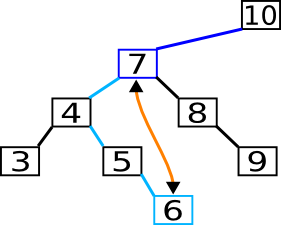

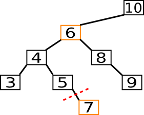

Manche Leser werden sich an diesem Punkt vielleicht fragen, ob es denn immer ein nachfolgendes und vorhergehendes Element gibt. Es könnte ja sein, dass man den Auftrag erhalten hat, das erste oder letzte Element zu löschen. Da es sich bei beiden allerdings um ein Minimum oder Maximum handelt, können sie keine zwei Kinder besitzen und daher ist ein Austauschen gar nicht erst nötig.

Die Geschwindigkeit der eigentlichen Löschverfahren sind alle unabhängig von der Größe des Baums. Lediglich die Suche des zu löschenden Elements und das Bestimmen des nachfolgenden oder vorhergehenden Elements hängen von der Größe ab, darum ist die Komplexität einer Löschoperation in etwa O(log(n)).

### Ausbalancierte Bäume und die, die es nicht sind

Eines der großen Probleme solcher Bäume ist, dass wenn die Reihenfolge der Einfügungen ungünstig ist, der Baum sehr schnell aus dem Gleichgewicht kommt und zu einer Seite hinkt. Dies macht den Baum sehr viel höher als nötig und somit die Suche viel langsamer, da diese ja von der Höhe des Baums abhängt.

In folgendem Baum wird die 8 gesucht und der Arbeitsaufwand kommt schon nahe an den einer sequenziellen Suche heran.

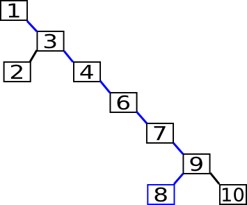

Um dem entgegenzuwirken, kann man Rotationen einsetzen.

### Rotationen

Es gibt Rotationen nach links und nach rechts. Da beide Operationen genau spiegelverkehrt sind, werde ich nur auf die Links-Rotation eingehen.

Als erstes trennt man das linke Kind vom rechten Kind der Wurzel ab und anschließend auch das rechte Kind.

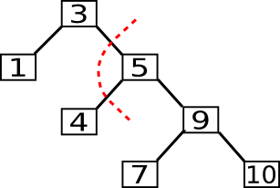

Danach wird das rechte Kind zur neuen Wurzel und die alte Wurzel wird ihr neues linkes Kind. Das Enkelkind wird zum neuen rechten Kind der alten Wurzel.

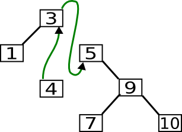

Nun ist der Baum wieder im Gleichgewicht.

Man sagt Links-Rotation, da sich das Gleichgewicht nach links verlagert. Man kann es sich wie eine Balkenwaage vorstellen, welche man in das Gleichgewicht bringt, indem man den Balken an einer anderen Stelle aufhängt.

{

Das Beispiel hinkt aber, da nach der Rotation beide Gewichte gleich schwer sind.

Die Geschwindigkeit einer Rotation hängt nicht von der Größe des Baums ab. Die Komplexität ist also O(1).

Das große Problem von Rotationen ist zu wissen, wann man sie einsetzen soll. Sie verbessern nämlich nicht immer das Gleichgewicht eines Baums wie folgendes Beispiel zeigt.

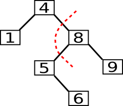{

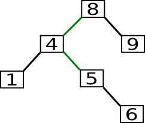

Es gibt verschiedene Strategien, um hier vorzugehen. Keine ist allerdings wirklich trivial und verdienen alle ihren eigenen Artikel. Da alle aber Rotationen nutzen, habe ich sie bereits jetzt eingeführt, damit nicht jeder Artikel diese Operation neu beschreiben muss und direkt mit dem wirklich interessanten Teil beginnen kann. Ich werde in diesem Artikel nicht weiter auf ihre Verwendung eingehen.

3 Implementierung

Das erste, was man bei einer Implementierung festlegen muss, ist die Darstellung. Die Knoten werden durch eine Struktur dargestellt und dann mit Pointern verbunden. Dies sieht in etwa so aus:

<table><colgroup><col style="width: 19%" /><col style="width: 66%" /><col style="width: 14%" /></colgroup><thead><tr class="header"><th><strong>C++:</strong></th><th></th><th></th></tr></thead><tbody><tr class="odd"><td>
1

2

3

4

5

6

7

8
</td><td>
templateclass T

struct Node

  Nodeparent, left, right

  T value

explicit Nodeconst Tvalue

    parent, left, right, valuevalue
</td><td></td></tr></tbody></table>

parent zeigt auf den Elternknoten. Falls es sich um die Wurzel handelt, ist dieser . und right zeigen jeweils auf die Wurzel des linken oder rechten Unterbaums oder , falls es diesen nicht gibt.

Um zu verhindern, dass Unbefugte an unserem Baum rumbasteln wird dieser durch eine Klasse gekapselt. Dies sieht dann in etwa folgendermaßen aus:

<table><colgroup><col style="width: 18%" /><col style="width: 67%" /><col style="width: 13%" /></colgroup><thead><tr class="header"><th><strong>C++:</strong></th><th></th><th></th></tr></thead><tbody><tr class="odd"><td>
1

2

3

4

5

6

7

8

9

10

11

12

13

14

15

16

17

18

19
</td><td>
templateclass T

class Tree

private

  struct Node

    Nodeparent, left, right

    T value

explicit Nodeconst Tvalue

      parent, left, right, valuevalue

  Noderoot

public

  Treeroot

is_emptyconst

    return root
</td><td></td></tr></tbody></table>

zeigt dabei auf die Wurzel des Baumes oder , falls der Baum leer ist. Ob der Baum leer ist, kann mittels is_empty überprüft werden.

Es gibt Variationen, in denen die Knoten keinen Zeiger auf den Elternknoten besitzen. Dies spart Speicher und erleichtert die Verwaltung der zusätzlichen Zeiger, jedoch macht es auch die Implementierung mancher Operationen, wie zum Beispiel des Durchwanderns, komplizierter. Oft sind diese nur noch durch den Einsatz eines Stacks oder Rekursion überhaupt möglich. Welche Option nun die beste ist, hängt vom Einsatzfall ab.

Manche Leser werden vielleicht auch auf den Gedanken gekommen sein, die Elemente in einem Array abzulegen und das Navigieren durch Multiplizieren der Indizes mit 2 abzuwickeln. Für manche Bäume ist dies sicherlich ein sinnvoller Ansatz, wie zum Beispiel bei Heaps, wie man in [Jesters Artikel](http://www.c-plusplus.de/forum/viewtopic-var-t-is-180990.html) dazu nachlesen kann. Für Suchbäume ist dieser Ansatz aber unbrauchbar da Rotationen sich nur sehr schwer implementieren lassen und unausbalancierte Bäume in dieser Darstellung echte Speicherfresser sind.

3.1 Navigation

Um uns beim Navigieren im Baum zu helfen, schreiben wir uns Funktionen, die prüfen, ob es sich um ein linkes oder rechtes Kind handelt.

<table><colgroup><col style="width: 16%" /><col style="width: 71%" /><col style="width: 12%" /></colgroup><thead><tr class="header"><th><strong>C++:</strong></th><th></th><th></th></tr></thead><tbody><tr class="odd"><td>
1

2

3

4

5

6

7

8

9

10

11

12

13

14
</td><td>
private

static is_left_childconst Nodenode

  nodeparent

    return false // Die Wurzel ist kein Kind

return nodeparent node

static is_right_childconst Nodenode

  nodeparent

    return false // Die Wurzel ist kein Kind

return nodeparentright node
</td><td></td></tr></tbody></table>

Um die Position eines Knotens ändern zu können, muss man auch einen einfachen Zugriff auf den Zeiger im Elternknoten haben. Dies bietet folgende Funktion:

<table><colgroup><col style="width: 20%" /><col style="width: 64%" /><col style="width: 15%" /></colgroup><thead><tr class="header"><th><strong>C++:</strong></th><th></th><th></th></tr></thead><tbody><tr class="odd"><td>
1

2

3

4

5

6

7

8

9
</td><td>
private

Nodeget_parent_ptrNodenode

  nodeparent

    return root

  is_left_childnode

    return nodeparent

return nodeparentright
</td><td></td></tr></tbody></table>

3.2 Debuggen

Da es sehr schwer ist, einen Baum fehlerfrei zu implementieren, müssen wir uns auch Gedanken machen, wie wir ihn debuggen. Wer sich nur für den eigentlichen Code interessiert kann diesen Teil des Artikels getrost überspringen.

3.2.1 Konsolenausgabe

Eine Funktion, die den Baum einfach komplett auf die Konsole ausgibt, wäre sehr nützlich da die meisten Debugger nicht sonderlich gut sind, um solche Datenstrukturen zu inspizieren, und nur Zeigersalat anzeigen.

Ziel ist es, den Baum ähnlich wie auf den Grafiken oben auszugeben. Dazu müssen wir als erstes festlegen, welche Informationen über einen Knoten ausgegeben werden. Dies macht folgende Funktion:

<table><colgroup><col style="width: 15%" /><col style="width: 72%" /><col style="width: 11%" /></colgroup><thead><tr class="header"><th><strong>C++:</strong></th><th></th><th></th></tr></thead><tbody><tr class="odd"><td>
1

2

3

4

5

6

7

8

9
</td><td>
private

static stdstring format_labelconst Nodenode

  node

    stdostringstream out

    out&lt;&lt;nodevalue

    return out.

return
</td><td></td></tr></tbody></table>

Wir müssen auch wissen, wie breit und hoch der Baum wird, damit wir wissen wie viel Platz frei gelassen werden muss. Folgende Funktionen berechnen diese Informationen für den Baum und jeden Unterbaum.

<table><colgroup><col style="width: 13%" /><col style="width: 75%" /><col style="width: 10%" /></colgroup><thead><tr class="header"><th><strong>C++:</strong></th><th></th><th></th></tr></thead><tbody><tr class="odd"><td>
1

2

3

4

5

6

7

8

9

10

11

12

13

14

15

16

17

18

19

20

21

22

23

24

25

26

27
</td><td>
private

static unsigned get_heightconst Nodenode

  node

    return

  unsigned left_height , right_height

node

    left_height get_heightnode

  noderight

    right_height get_heightnoderight

// Der höchste Unterbaum bestimmt die Gesamthöhe

  return stdleft_height, right_height

static unsigned get_widthconst Nodenode

  node

    return

  unsigned left_width , right_width

node

    left_width get_widthnode

  noderight

    right_width get_widthnoderight

return left_width format_labelnode.length right_width
</td><td></td></tr></tbody></table>

Da wir nur zeilenweise auf die Konsole schreiben können, müssen wir den Baum auch Zeile für Zeile ausgeben.

<table><colgroup><col style="width: 10%" /><col style="width: 80%" /><col style="width: 8%" /></colgroup><thead><tr class="header"><th><strong>C++:</strong></th><th></th><th></th></tr></thead><tbody><tr class="odd"><td>
1

2

3

4

5

6

7

8

9

10

11

12

13

14

15

16

17

18

19

20

21

22
</td><td>
private

static dump_spacesstdostreamout, unsigned count

  unsigned i icount i

    out.

static dump_linestdostreamout, const Nodenode, unsigned line

  node

    return

  line

    // Die Wurzel des Unterbaums soll ausgegeben werden

    dump_spacesout, get_widthnode

    out&lt;&lt;format_labelnode

    dump_spacesout, get_widthnoderight

// In beiden Unterbäumen sind die Wurzeln um eins niedriger und darum verändert

    // sich die Zeilennummerierung.

    dump_lineout, node, line

    dump_spacesout, format_labelnode.length

    dump_lineout, noderight, line
</td><td></td></tr></tbody></table>

Nun benötigen wir noch eine Möglichkeit, den gesamten Baum auszugeben und nicht nur eine Zeile.

<table><colgroup><col style="width: 13%" /><col style="width: 76%" /><col style="width: 9%" /></colgroup><thead><tr class="header"><th><strong>C++:</strong></th><th></th><th></th></tr></thead><tbody><tr class="odd"><td>
1

2

3

4

5

6

7

8

9

10

11

12

13
</td><td>
private

static dump_nodestdostreamout, const Nodenode

  unsigned line, height get_heightnode line &lt;= height line

    dump_lineout, node, line

    out.

out.flush

public

dumpstdostreamoutconst

  dump_nodeout, root
</td><td></td></tr></tbody></table>

Mit der Hilfe der -Funktion können wir nun den Baum für den Menschen lesbar anzeigen. Eine mögliche Ausgabe wäre:

<table><colgroup><col style="width: 57%" /><col style="width: 42%" /></colgroup><thead><tr class="header"><th><strong>Code:</strong></th><th></th></tr></thead><tbody><tr class="odd"><td>
 6  

3  10 

1 5 7 12
</td><td></td></tr></tbody></table>

Man könnte den Ausgabealgorithmus sicher noch sehr viel verbessern, was die Geschwindigkeit betrifft. Ich glaube jedoch kaum, dass er bei großen Bäumen überhaupt zum Einsatz kommen wird und deshalb werde ich dies sein lassen.

3.2.2 Tod dem Zeigersalat

Bei dem Implementieren von Bäumen wird man oft Zeigern begegnen, die nicht dahin zeigen, wohin sie eigentlich sollten. Eine Funktion, die testet, ob der Baum so überhaupt richtig sein kann, hilft, viele Fehler zu finden. Man testet zum Beispiel ob der Elternknoten des Kindes eines Knoten dieser selbst ist.

<table><colgroup><col style="width: 20%" /><col style="width: 63%" /><col style="width: 15%" /></colgroup><thead><tr class="header"><th><strong>C++:</strong></th><th></th><th></th></tr></thead><tbody><tr class="odd"><td>
1

2

3

4

5

6

7

8

9

10

11

12
</td><td>
private

is_wellformedNodenode

  node

    return

  get_parent_ptrnode node

    return false

  is_wellformednode

    return false

  is_wellformednoderight

    return false

  return
</td><td></td></tr></tbody></table>

Mit Hilfe eines assert(is_wellformed(root)) können sehr viele Fehler vorzeitig abgefangen werden. Durch ein Paar geschickt gesetzte Breakpoints innerhalb dieser Funktion, kann man auch sehr genau erfahren, welcher Zeiger falsch ist.

3.3 Kopierkonstruktor, Destruktor und Zuweisung

Da ein Baum keine triviale Datenstruktur ist, muss man auch den Kopierkonstruktor, den Destruktor und den Zuweisungsoperator implementieren.

Als erstes implementiere ich den Destruktor. Dieser ist leicht rekursiv zu realisieren.

<table><colgroup><col style="width: 20%" /><col style="width: 64%" /><col style="width: 15%" /></colgroup><thead><tr class="header"><th><strong>C++:</strong></th><th></th><th></th></tr></thead><tbody><tr class="odd"><td>
1

2

3

4

5

6

7

8

9

10

11

12

13
</td><td>
private

static destroy_nodeNodenode

  node

    destroy_nodenode

    destroy_nodenoderight

    delete node

public

~Tree

  destroy_noderoot
</td><td></td></tr></tbody></table>

Bei sehr großen Bäumen kann es bei diesem Destruktor zu einem Stapelüberlauf kommen. In diesem Fall muss man ihn iterativ formulieren. Die Idee ist immer, das Blatt zu löschen, das den kleinsten Wert aller Blätter darstellt, sich also auf der linken Seite des Baums befindet. Durch das Abschneiden der ersten Blätter entstehen neue und der Baum schrumpft zusammen, bis er schlussendlich nicht mehr existiert.

<table><colgroup><col style="width: 21%" /><col style="width: 61%" /><col style="width: 16%" /></colgroup><thead><tr class="header"><th><strong>C++:</strong></th><th></th><th></th></tr></thead><tbody><tr class="odd"><td>
1

2

3

4

5

6

7

8

9

10

11

12

13

14

15
</td><td>
~Tree

  Nodenow root

  whilenow

    now

      now now

    nowright

      now nowright

Nodenext nowparent

      get_parent_ptrnow

      delete now

      now next
</td><td></td></tr></tbody></table>

Der Kopierkonstruktor kann auch rekursiv implementiert werden, man muss jedoch aufpassen, ob eine Ausnahme fliegt oder nicht. Dies wird schnell unübersichtlich und fehleranfällig. Darum bevorzuge ich die iterative Version. Die Idee ist, den alten und neuen Baum so zu durchlaufen, wie wir es im Destruktor tun und dabei alle Knoten klonen welche im alten Baum vorhanden sind, jedoch nicht im neuen.

Mit dieser Methode ist der Baum immer in einem gesunden Zustand und kann vom Destruktor auch im unvollendeten Zustand gelöscht werden. Falls eine Ausnahme fliegt, brauchen wir nur den Destruktor mit der Arbeit zu beauftragen, den halbfertigen Baum zu löschen.

<table><colgroup><col style="width: 15%" /><col style="width: 73%" /><col style="width: 11%" /></colgroup><thead><tr class="header"><th><strong>C++:</strong></th><th></th><th></th></tr></thead><tbody><tr class="odd"><td>
1

2

3

4

5

6

7

8

9

10

11

12

13

14

15

16

17

18

19

20

21

22

23

24

25

26

27

28

29

30

31

32
</td><td>
Treeconst Treeother

  other.is_empty

    root

root Nodeother.value

Node

        now root,

        other_now other.

      whileother_now

        other_now now

          now Nodeother_nowvalue

          nowparent now

          now now

          other_now other_now

        other_nowright nowright

          nowright Nodeother_nowrightvalue

          nowrightparent now

          now nowright

          other_now other_nowright

now nowparent

          other_now other_nowparent

is_wellformedroot

catch...

      ~Tree

      throw
</td><td></td></tr></tbody></table>

Der Zuweisungs-Operator kann leicht mit Hilfe des Copy&Swap-Idioms implementiert werden.

<table><colgroup><col style="width: 20%" /><col style="width: 64%" /><col style="width: 15%" /></colgroup><thead><tr class="header"><th><strong>C++:</strong></th><th></th><th></th></tr></thead><tbody><tr class="odd"><td>
1

2

3

4

5

6

7

8

9

10
</td><td>
public

swapTreeother

  stdroot, other.

Treeoperatorconst Treeother

  Tree tempother

  swaptemp

  return
</td><td></td></tr></tbody></table>

3.4 Suchen

Implementieren wir nun die Suchfunktion. Da wir die innere Struktur der Klasse verstecken wollen, stellen wir dem Außenstehenden nur eine Funktion zur Verfügung, die testet, ob ein Wert im Baum enthalten ist.

Man sollte bemerken, dass man es dem Benutzer nicht erlauben sollte, den Wert des Knotens zu verändern, da dies die Position im Baum durcheinander bringen kann. Falls er dies beabsichtig, dann soll er den alten Wert rauslöschen und den neuen einfügen, damit sich das Element an der richtigen Stelle befindet.

Durch den Einsatz von Templates spare ich mir, eine const- und eine nicht-const-Version zu schreiben.

<table><colgroup><col style="width: 16%" /><col style="width: 71%" /><col style="width: 12%" /></colgroup><thead><tr class="header"><th><strong>C++:</strong></th><th></th><th></th></tr></thead><tbody><tr class="odd"><td>
1

2

3

4

5

6

7

8

9

10

11

12

13

14

15

16

17

18

19
</td><td>
private

templateclass NodeT

static NodeTsearchNodeTroot, const Tvalue

  NodeTnow root

  whilenow

    value nowvalue

      now now

    nowvalue value

      now nowright

return now

return

public

containsconst Ttconst

  return searchroot, t
</td><td></td></tr></tbody></table>

3.5 Einfügen

Um ein Element einzufügen, verfahren wir ähnlich, jedoch merken wir uns, wo sich der Elternknoten befindet.

<table><colgroup><col style="width: 15%" /><col style="width: 73%" /><col style="width: 11%" /></colgroup><thead><tr class="header"><th><strong>C++:</strong></th><th></th><th></th></tr></thead><tbody><tr class="odd"><td>
1

2

3

4

5

6

7

8

9

10

11

12

13

14

15

16

17

18

19

20

21

22

23

24

25

26

27

28

29

30

31

32

33
</td><td>
public

insertconst Tvalue

  Node

    parent ,

    now root

  is_left_child false

  whilenow

    parent now

    value nowvalue

      is_left_child

      now now

    nowvalue value

      is_left_child false

      now nowright

return false // Das Element ist bereits im Baum

Nodenew_node Nodevalue

  new_nodeparent parent

parent

    root new_node

  is_left_child

    parent new_node

parentright new_node

  // Wenn etwas mit den Zeigern falsch ist,

  // dann knallt es wahrscheinlich hier.

  assertis_wellformedroot

  return
</td><td></td></tr></tbody></table>

3.6 Austauschen

Knoten können durch Austauschen der Werte getauscht werden. Dies ist sicherlich der beste Weg, falls man Ganzzahlen speichern will. Es gibt jedoch auch Klassen, welche sehr teuer zu tauschen sind oder die gar nicht getauscht werden können. Es ist auch möglich, dass es Zeiger auf das Element gibt, die außerhalb des Baums liegen und verändert werden müssten, oder dass beim Tauschen eine Ausnahme fliegen kann. Diese Probleme kann man dadurch umgehen, dass man die Zeiger der Knoten neuverbindet. Hierbei ist der allgemeine Fall vom Fall, wo einer der beiden Knoten das Kind des anderen ist, zu unterscheiden.

Man sollte beachten, dass das Tauschen von Knoten wahrscheinlich die Ordnung im Baum durcheinander bringt. Es sollte also sicher gestellt sein, dass diese nachdem diese Funktion ihre Arbeit getan hat, wiederhergestellt wird.

<table style="width:100%;"><colgroup><col style="width: 12%" /><col style="width: 78%" /><col style="width: 9%" /></colgroup><thead><tr class="header"><th><strong>C++:</strong></th><th></th><th></th></tr></thead><tbody><tr class="odd"><td>
1

2

3

4

5

6

7

8

9

10

11

12

13

14

15

16

17

18

19

20

21

22

23

24

25

26

27

28

29

30

31

32

33

34

35

36

37

38

39

40

41

42

43

44

45

46

47

48

49

50

51

52

53

54

55

56

57

58

59

60

61

62

63

64
</td><td>
private

swap_near_nodesNodechild, Nodeparent

  // Als erstes passen wir den unbeteiligten Großelternknoten an.

  get_parent_ptrparent child

// Anschließend werden die Kind- und Elternzeiger ausgetauscht.

  stdparent, child

  stdparentright, childright

  stdparentparent, childparent

// Da eines der Kinder getauscht wird benötigt es eine

  // sonder Behandlung.

  child child

    child parent

childright parent

// Nun sind alle Kindzeiger richtig und die Elternzeiger können

  // dem angepasst werden.

  child

    childparent child

  childright

    childrightparent child

  parent

    parentparent parent

  parentright

    parentrightparent parent

// Na wer ist sich noch sicher ob wir nicht

  // bereits Zeigersalat haben? Besser testen!

  assertis_wellformedroot

swap_far_nodesNodea, Nodeb

  // Zuerst updaten wir die Zeiger der Eltern

  get_parent_ptra b

  get_parent_ptrb a

// Danach der Kinder

  a

    aparent b

  aright

    arightparent b

  b

    bparent a

  bright

    brightparent a

// Und als letztes die der beiden Knoten

  stda, b

  stdaright, bright

  stdaparent, bparent

assertis_wellformedroot

swap_nodesNodea, Nodeb

  aparent b

    swap_near_nodesa, b

  bparent a

    swap_near_nodesb, a

swap_far_nodesa, b
</td><td></td></tr></tbody></table>

3.7 Minimum und Maximum

Das Minimum eines Unterbaums findet man, indem man einfach den Links-Zeigern folgt bis man an einem Knoten ohne linken Unterbaum angelangt ist. Ähnlich geht man beim Maximum vor.

<table><colgroup><col style="width: 19%" /><col style="width: 66%" /><col style="width: 14%" /></colgroup><thead><tr class="header"><th><strong>C++:</strong></th><th></th><th></th></tr></thead><tbody><tr class="odd"><td>
1

2

3

4

5

6

7

8

9

10

11

12

13

14

15

16

17

18

19

20

21

22

23

24

25

26
</td><td>
private

templateclass NodeT

static NodeTget_minNodeTnode

  NodeTnow node

  whilenow

    now now

  return now

templateclass NodeT

static NodeTget_maxNodeTnode

  NodeTnow node

  whilenowright

    now nowright

  return now

public

const Tminconst

  return get_minrootvalue

const Tmaxconst

  return get_maxrootvalue
</td><td></td></tr></tbody></table>

3.8 Durchwandern

Um dem Benutzer die Möglichkeit zu geben, den Baum zu durchwandern, bietet sich der Einsatz von Iteratoren förmlich an. Da ich mich in diesem Artikel allerdings auf die Implementierung des Baum beschränken möchte und nicht eine Schnelleinführung zum Thema Iteratoren geben möchte, werde ich nur eine Funktion implementieren die den nächst größeren Wert sucht. nimmt einen Wert als Parameter und gibt einen Zeiger auf das nächste Element zurück oder ein Zeiger falls der Parameter das Maximum war oder ein Wert, der sich gar nicht im Baum befindet. ist eine ähnliche Funktion die jedoch das nächstkleinere Element sucht.

<table style="width:100%;"><colgroup><col style="width: 16%" /><col style="width: 71%" /><col style="width: 12%" /></colgroup><thead><tr class="header"><th><strong>C++:</strong></th><th></th><th></th></tr></thead><tbody><tr class="odd"><td>
1

2

3

4

5

6

7

8

9

10

11

12

13

14

15

16

17

18

19

20

21

22

23

24

25

26

27

28

29

30

31

32

33

34

35

36

37

38

39

40

41

42

43

44

45

46

47

48

49

50

51

52

53
</td><td>
private

templateclass NodeT

static NodeTget_next_nodeNodeTnow

  nowright

    return get_minnowright

whilenow

      is_left_childnow

        return nowparent

now nowparent

return // Wir sind am Ende angekommen

templateclass NodeT

static NodeTget_prev_nodeNodeTnow

  now

    return get_maxnow

whilenow

      is_right_childnow

        return nowparent

now nowparent

return // Wir sind am Anfang angekommen

public

const Tnextconst Tvalueconst

  const Nodenow searchroot, value

  now

    return

  now get_next_nodenow

  now

    return nowvalue

return

const Tprevconst Tvalueconst

  const Nodenow searchroot, value

  now

    return

  now get_prev_nodenow

  now

    return nowvalue

return
</td><td></td></tr></tbody></table>

3.9 Löschen

Das Löschverfahren von Knoten wurde tiefgehend in der Theorie behandelt und darum gibt es nicht viel zur Implementirung zu sagen.

<table><colgroup><col style="width: 14%" /><col style="width: 75%" /><col style="width: 10%" /></colgroup><thead><tr class="header"><th><strong>C++:</strong></th><th></th><th></th></tr></thead><tbody><tr class="odd"><td>
1

2

3

4

5

6

7

8

9

10

11

12

13

14

15

16

17

18

19

20

21

22

23

24

25

26

27

28

29

30

31

32

33

34

35

36
</td><td>
private

removeNodenode

  // Ein Blatt

  node noderight

    get_parent_ptrnode

    delete node

// Nur ein Kind

  node noderight

    get_parent_ptrnode node

    nodeparent nodeparent

    delete node

  node noderight

    get_parent_ptrnode noderight

    noderightparent nodeparent

    delete node

// Zwei Kinder

Nodeother get_prev_nodenode

    swap_nodesnode, other

    // Löschen des Knoten durch Benutzen von einer

    // der beiden anderen Methoden

    removenode

assertis_wellformedroot

public

removeconst Tvalue

  Nodenode searchroot, value

  node

    removenode

    return

return false
</td><td></td></tr></tbody></table>

3.10 Rotationen

Rotationen können sehr viel Stress verursachen, bevor sämtliche Zeiger richtig gestellt werden. Darum ist es sehr nützlich, den Baum zuerst zu zeichnen: wie er vorher aussieht und danach.

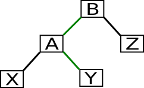

Die Rotationsfunktionen geben einen Zeiger auf die neue Wurzel zurück.

<table><colgroup><col style="width: 19%" /><col style="width: 65%" /><col style="width: 14%" /></colgroup><thead><tr class="header"><th><strong>C++:</strong></th><th></th><th></th></tr></thead><tbody><tr class="odd"><td>
1

2

3

4

5

6

7

8

9

10

11

12

13

14

15

16

17

18

19

20

21

22

23

24

25

26

27
</td><td>
private

Noderotate_leftNodeA

  Node

    root_ptr get_parent_ptrA,

    parent Aparent,

    B Aright,

    X A,

    Y B,

    Z Bright

root_ptr B

  B A

  Bright Z

  A X

  Aright Y

Bparent parent

  Aparent B

  Z

    Zparent B

  X

    Xparent A

  Y

    Yparent A

return B
</td><td></td></tr></tbody></table>

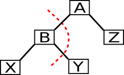

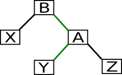

<table><colgroup><col style="width: 19%" /><col style="width: 65%" /><col style="width: 14%" /></colgroup><thead><tr class="header"><th><strong>C++:</strong></th><th></th><th></th></tr></thead><tbody><tr class="odd"><td>
1

2

3

4

5

6

7

8

9

10

11

12

13

14

15

16

17

18

19

20

21

22

23

24

25

26

27
</td><td>
private

Noderotate_rightNodeA

  Node

    root_ptr get_parent_ptrA,

    parent Aparent,

    B A,

    X B,

    Y Bright,

    Z Aright

root_ptr B

  B X

  Bright A

  A Y

  Aright Z

Bparent parent

  Aparent B

  Z

    Zparent A

  X

    Xparent B

  Y

    Yparent A

return B
</td><td></td></tr></tbody></table>

3.11 Tunen von new und delete

Bäume spielen ihren Vorteil gegenüber alternativen Datenstrukturen vor allem aus, wenn es viele Elemente gibt, doch auch bei kleinen Listen sind sie nicht hoffnungslos unterlegen. Wenn es nur sehr wenige Elemente gibt, dann wird nichts in der Liga einfacher Arrays spielen können, jedoch gilt es so nahe wie möglich ran zu kommen. Bei kleinen Bäumen fällt die Zeit, die durch die Speicherverwaltung, das heißt direkt in new und delete, verbracht wird, viel mehr ins Gewicht und darum bietet es sich an, hier was zu tun. Da sämtliche Knoten die gleiche Größe haben, kann der Einsatz von Memory Pools Wunder wirken. Bei großen Bäumen ist ihr Einsatz sicherlich nicht verkehrt, auch wenn der Gewinn proportional gesehen kleiner ausfallen wird. Zum Nachteil wird der Einsatz von Pools eigentlich so gut wie nie.

3.12 Download und Experimentierkonsole

Die Implementierung gibt es auch fertig in einer Datei verpackt, um das Herumexperimentieren zu erleichtern. Neben dem eigentlichen Baum ist auch eine Konsole enthalten, mit deren Hilfe man die einzelnen Funktionen in Aktion sehen kann. Alles was zum Übersetzen benötigt wird ist ein standardkonformer Compiler.

[Download-Link](http://www.c-plusplus.de/magazin/bilder/suchbaum/search_tree.cpp)

4 Bäume in der STL

Die Spezifikation der STL gibt wie immer keine Implementierung vor, allerdings ist es sehr wahrscheinlich, dass hinter std::set und std::map Bäume am Werk sind.

Wie der Baum eingesetzt wird, um std::set umzusetzen, sollte eigentlich nach dem Lesen dieses Artikels klar sein, da es doch gewaltige Ähnlichkeiten zwischen der hier entwickelten Baumklasse und std::set gibt. Bei std::map könnte es weniger deutlich sein. Hier weist man jedem Knoten einen Schlüssel und den entsprechenden Wert zu und sortiert den Baum dem Schlüssel entsprechend. Ein Suchen nach dem Schlüssel liefert also auch den Knoten in dem der entsprechende Wert gespeichert ist.

5 Ausblick

In diesem Artikel habe ich gezeigt wie Suchbäume aufgebaut sind und wie sie funktionieren, jedoch auch ihre Schwächen. Der Suchbaum, so wie er in diesem Artikel beschrieben wird, ist recht nutzlos weil er sehr einfach aus dem Gleichgewicht kommt. Um dagegen vorzugehen gibt es verschiedene Ansätze: AVL-Baum, Rot-Schwarz-Baum oder Splay-Baum um nur einige zu nennen. Alle haben ihre Stärken und Schwächen. In den nächsten Artikeln wird der hier vorgestellte Baum zu diesen Spezialbäumen umgebaut und die Rotationsfunktionen, die jetzt noch etwas in der Luft hängen, werden ihren Teil dazu beitragen.
