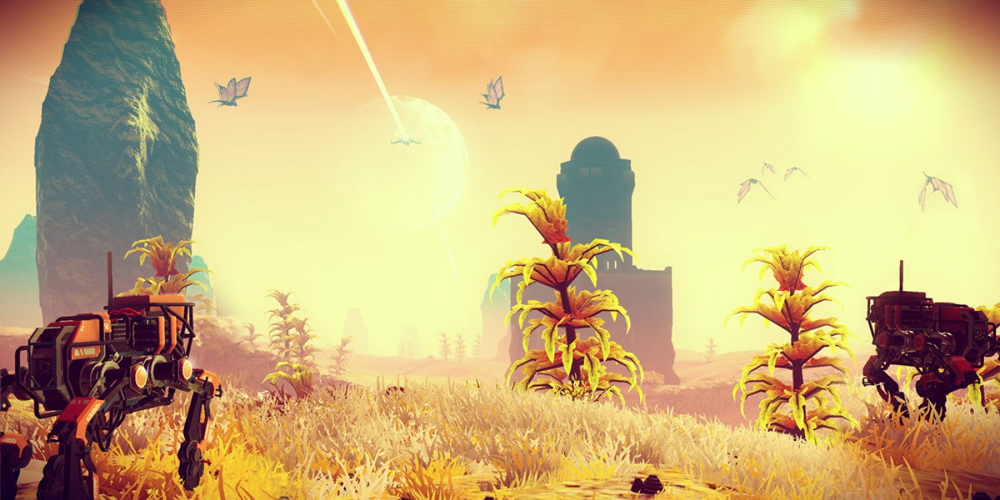
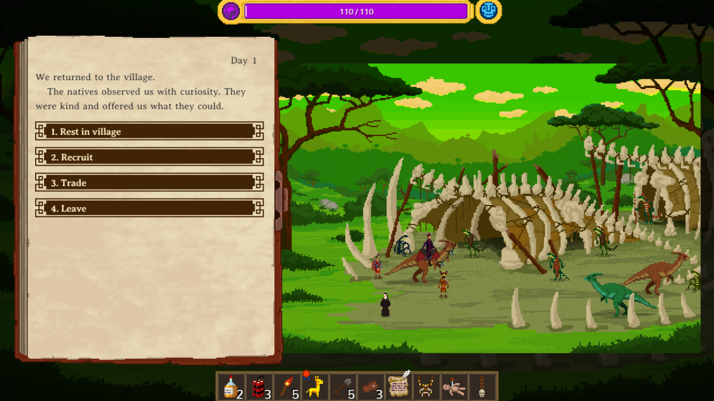
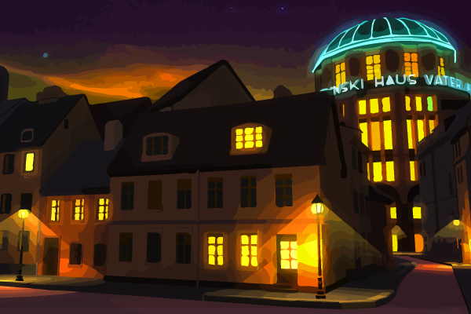

# Automatisch generierte Stories in Games

Das nächste No Man's Sky muss keine Enttäuschung werden

Daniel Ziegener

Freitag, September 30, 2016

Hello Games

Das lang erwartete „No Man's Sky“ erschuf Millionen von Planeten, doch sie waren alle leer, ihnen fehlten die Geschichten. Das Spiel zeigt Grenzen auf, denen von Algorithmen erschaffene Welten leider immer noch unterliegen. Doch ein Berliner Indiegame-Studio arbeitet schon an einer Lösung.

„Unser Spiel wird das No Man’s Sky der Detektivgeschichten“, sagt Riad Djemili und lacht. Für den Vergleich mit dem berühmten Titel ist ein Euro in die Kaffeekasse des Berliner Indiestudios Maschinen-Mensch fällig. Ganz vermeiden lässt er sich jedoch nicht, denn die Spiele, die Djemili zusammen mit seinem Kollegen Johannes Kristmann entwickelt, haben einige Ähnlichkeiten mit der umstrittenen Weltraumsimulation.

No Man’s Sky ist auch zwei Monate nach seiner Veröffentlichung ein großes Reizthema in der Gaming-Welt. Das Spiel erschuf – so versprach es zumindest Entwickler Hello Games – 18 Trillionen einzigartige Planeten. Möglich wurde das durch prozedurale Generierung. Dahinter verbirgt sich eine Technik, die Spielinhalte vom Computer erzeugen lässt. Anders als bei einem Zufallsgenerator definieren die Entwickler genaue Regeln. Das Ergebnis ist ein Algorithmus, der neue Inhalte zwar ohne direkten Einfluss eines Menschen, aber dennoch nach festen Vorgaben generiert.

Bei uns soll jede Spielfigur ein Leben haben: Eltern, Geschwister, Geliebte und so weiter

Riad Djemili und Johannes Kristmann, Entwicklerstudio Maschinen-Mensch

No Man’s Sky hat die prozedurale Generierung nicht erfunden. Schon Skyrim, Minecraft oder The Curious Expedition von Maschinen-Mensch nutzten diese Technik. Doch bei No Man’s Sky stießen die mathematischen Formeln an ihre Grenzen: Das endlose Universum wirkt leer, die Aliens auf den Planeten nur wie Statisten. Solche namenlosen NPCs bevölkern nicht nur den Weltraum, sondern fast jedes Videospiel.

Kristmann und Djemili wollen das ändern: „Du begegnest in fast jedem Spiel Charakteren, bei denen sofort klar ist, dass sie keine Rolle spielen. Wir wollen, dass die Grenzen verschwimmen. Bei uns soll jede Spielfigur ein Leben haben: Eltern, Geschwister, Geliebte und so weiter.“ Daraus entstand die Idee für The Curious Case, eine Detektivgeschichte im Berlin der 20er Jahre. Während im Vorgänger The Curious Expedition noch Urwälder und Wüsten generiert wurden, sind es jetzt Figuren. „Wir werden die Prozeduralität diesmal eher darauf anlegen, ein soziales Gefüge zu erzeugen.“

The Curious Expedition generiert seine Pixel-Welt ähnlich wie No Man's Sky
Maschinen-Mensch
Der erste Prototyp erinnert an den Social Graph von Facebook, der ein Netzwerk zwischenmenschlicher Beziehungen mit Knotenpunkten zeichnet. Der Algorithmus erzeugt Figuren in ihrem Geburtsjahr und lässt sie dann Aufwachsen. Manche gehen eine Beziehung ein, andere eröffnen ein Geschäft oder waren im Krieg. Anders als in Cluedo soll es so nicht nur ein Opfer und einen Täter, sondern auch echte Motive und falsche Fährten geben. Nicht jeder Handlungsverlauf führt immer zum richtigen Ende. Ander als in linearen Erzählungen wie L.A. Noire kann so auch mal die falsche Person verurteilt werden.

Auch die Idee, prozedurale Generierung für stets neue Stories zu nutzen, ist nicht völlig neu. Das Actionspiel Mittelerde: Mordors Schatten (Shadow of Mordor) gab Orks mit dem sogenannten Nemesis-System mehr Persönlichkeit. Name und Aussehen der feindlichen Anführer werden zufällig erzeugt. Außerdem sind sie in der Lage, sich an Begegnungen mit dem Spieler zu erinnern und wollen etwa nach einer Niederlage Rache nehmen. So gibt es keinen allgemeinen Endboss, sondern einen ganz persönlichen Erzfeind für jeden Spieler.

Einen noch umfassenderen Ansatz verfolgt Ken Levine, Autor von BioShock. 2014 stellte er das Konzept der Narrative Legos vor, bei dem jede Figur entsprechend ihrer eigenen Motivationen unterschiedlich auf die Handlungen des Spielers reagieren soll. Wie bei den namensgebenden Bausteinen soll aus kleinen Einzelteilen eine größere Geschichte entstehen. Bisher ist es allerdings bei der Theorie geblieben.

Während andere noch darüber reden, arbeitet die Indie-Szene schon an der Umsetzung dieser Vision. The Curious Case ist bei weitem nicht das einzige Beispiel: Das Textadventure Event[0] generiert Dialoge mit einer künstlichen Intelligenz und in Forest of Sleep soll mit diser Technik ein digitales Bilderbuch zusammengesetzt werden.

Dieser erste Entwurf soll die Atmosphäre der düsteren 20er-Jahre-Welt von The Curious Case einfangen
Maschinen-Mensch
Kleinere Projekte haben den Vorteil, dass sie nicht an die bombastischen Erwartungen großer Titel gebunden sind: „Normalerweise könntest du gar nicht so viele Gesichter gestalten und so viele Stimmen aufnehmen. Das war auch ein Grund, warum wir die reduzierte Pixelart gewählt haben.“ sagt Indie-Entwickler Djemili. „Eine Erfahrung, die wir gemacht haben, war, Lücken zu lassen, die Spieler mit ihrer Fantasie füllen können.“

Erzählungen, die bei jedem Spielen neu entstehen, sind eine Möglichkeit für das Medium Videospiel einzigartig zu sein. Und es ist nur eine Frage der Zeit, bis die algorithmischen Drehbuchautoren gut genug sind, um Geschichte zu schreiben, die begeistern. The Curious Case steht noch am Anfang seiner Entwicklung. Wenn es fertig ist, könnte der Ansatz von Maschinen-Mensch aber zukunftsweisend werden. Vielleicht ist das nächste No Man’s Sky dann nicht nur unendlich groß, sondern hat auch 18 Trillionen Geschichten zu erzählen.
