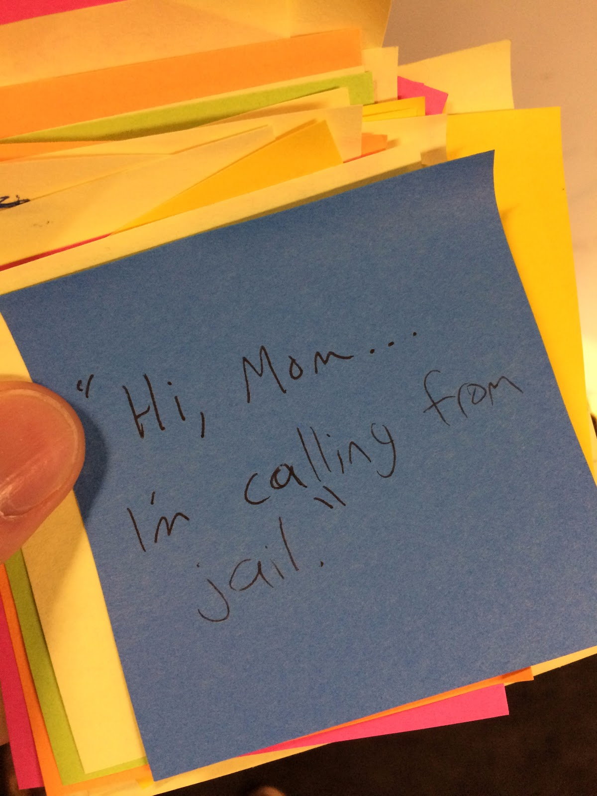

# Blog: Essential lessons for game dev managers

Created: 2021-10-25 09:39:47 +0200

Modified: 2021-10-25 09:39:56 +0200

---

[**Gamasutra**](http://nakedgameplay.com/ynnews/news?feed=2)

[**Blog: Essential lessons for game dev managers**](http://nakedgameplay.com/ynnews/news/view/blog-essential-lessons-for-game-dev-managers)

**The following is part one of a summation of what I've taught in the most comprehensive of my manager training classes for game devs, a version of which was recently held at a client's office over the course of two days. This is not all of the things you need to know as a people leader. It's not even all of the subjects I offer for training. But it's the most information I've ever accumulated in one place and it's been used in a real world setting to teach game dev managers, so I thought somebody might find it useful.**

**I typically present this material in a classroom setting using Google Slides, thus much of the value comes from my witty repartee and scintillating monologue as opposed to the written word. That's my way of apologizing in advance for sentence fragments, colloquialisms, and Twitter-inspired verbiage. This wasn't written for a book. It was, however, written to further my goal of putting myself out of a job by removing dysfunctionality from our industry's people operations. When that happens I can finally move on to my much more lucrative second career in residential landscaping.**

**And now (minus any client-specific, proprietary information), here's the training material.**

**For the uninitiated, you can read more about my background[on my website](http://www.fullergameproduction.com/about/). TL;DR I have a pretty good basis for teaching about quality leadership for game developers.**

**First up, let's clarify some terms.**

**Leader = Anyone responsible for the performance, behavior, or emotional or physical well-being of one or more employees. Other people use different definitions, this is mine. Dr. John Maxwell, for instance,[states leadership is simply influence](https://smile.amazon.com/21-Irrefutable-Laws-Leadership-Anniversary/dp/0785288376/), and that there's an important distinction between "leader" and "manager". Fair enough. I'm happy to go down the path of semantics, but not here. In this material, a manager is a leader...essentially interchangeable.**

**Also, I'll say "developer" a lot. A developer is anyone working at a company involved in the development of video games. HR? Accounting? Front desk? Developers.**

**As for the links and other sources I refer to in this documentation, it's all material I've read. That's not the same as an endorsement -- for instance, I'm not the biggest Maxwell fan -- but I think it's important for you to know[I didn't just randomly Google this stuff](http://keithfuller.tumblr.com/post/131361167596/leadership-books-i-recommend-and-some-i-wouldnt).**

**When I begin a class I want to get people thinking about what makes a leader good or bad in their mind. Rarely does anyone need much prompting to think of such an example. I ask everyone, "Take a post-it and think of a manager you've had that you'd consider Good or Bad. Write something on the post-it to explain why you'd categorize them that way." Common positive characteristics people write down are "good listener" and "mentor". Probably the single most popular negative trait is "micro-manager".**

**Often the bad outweighs the good by about two to one. I'll read aloud some of the common or noteworthy post-its and then start talking about some data from Google.**

**Courtesy of[Google's Project Oxygen](https://rework.withgoogle.com/subjects/managers/):**

**A High-Scoring Manager ...**

**1. Is a good coach**

**2. Empowers the team and does not micromanage**

**3. Expresses interest/concern for team members' success and personal well-being**

**4. Is productive and results-oriented**

**5. Is a good communicator -- listens and shares information**

**6. Helps with career development**

**7. Has a clear vision/strategy for the team**

**8. Has important technical skills that help him/her advise the team**

**This exercise serves a couple of important purposes. First, it gets people thinking about quality leadership and the impact it's had on them and others. Second, it serves as a decent icebreaker to encourage participation. My classes are never "just sit there quietly and listen to me". I think that's a crummy way to impart knowledge.**

**Next we move on to...**

**Much of this material comes from[Emotional Intelligence 2.0 by Travis Bradberry](https://smile.amazon.com/Emotional-Intelligence-2-0-Travis-Bradberry/dp/0974320625/), which I've found to be an easy read that uses realistic workplace and social situations as examples.**

**Not everyone's heard of Emotional Intelligence (often abbreviated EQ) so I lead in with "What are 'soft skills'?" because most people *have* heard of those.**

**The first exercise: What are soft skills and who doesn't need them? Write your thoughts on post-its and put them on a nearby wall.**

**Reading a few of the best responses tends to be pretty fun. So far, I've learned that the demographic of "doesn't need soft skills" includes zombies, shepherds, and some guy who spends six months at a stretch alone in a fire tower. Notwithstanding those exceptions, people quickly agree everyone needs soft skills. And what they're really saying -- although they may not realize it yet -- is that everyone needs to develop their emotional intelligence.**

**For a digestible definition of EQ I turn to the godfather of this field of study, Daniel Goleman:**

**"An array of competencies and skills centering around emotion that drive leadership performance"(lifted not-exactly-verbatim from[Emotional Intelligence](https://smile.amazon.com/Emotional-Intelligence-Matter-More-Than-ebook/dp/055338371X/))**

**Most simply put, EQ breaks down into personal competence (self-awareness and self-management) and social competence (social awareness and relationship management).**

**From[Working with Emotional Intelligence by Daniel Goleman](https://smile.amazon.com/Working-Emotional-Intelligence-Daniel-Goleman/dp/0553378589/):**

**(Top Six competencies that distinguish stars from average performers in tech)**

1.  **Strong achievement drive & high achievement standards**

2.  **Ability to influence**

3.  **Conceptual thinking**

4.  **Analytical ability**

5.  **Initiative in taking on challenges**

6.  **Self-confidence**

**This list of competencies is almost completely driven by EQ. That means if you want to see star performers in your company, seek to improve everyone's emotional intelligence.**

**An Over-Simplification of Neuroscience: The Physiological Reason EQ Matters**

**In your brain, every input you receive goes through your limbic system (aka "teh feelz") before reaching the rational center of thought in your prefrontal cortex. Literally, everything makes you feel something before you start logically considering it. For that reason alone it's critical to grasp the importance of emotions.**

**According to the authors of Emotional Intelligence 2.0, people with high IQ outperform people with average IQ 20% of the time. People with average IQ outperform those with high IQ 70% of the time. Only about 36% of people tested can accurately identify their own emotions as they occur.**

**Improving self-awareness**

1.  **Get objective feedback: ask friends, family, trusted coworkers. They *always* see things you don't. Later on in "Receiving Feedback" we'll talk more about blind spots.**

2.  **Record subjective observations:
    **

1.  **What are the physical symptoms of your happiness, anger, etc. Write them down. Time, date, situation. Shoulders tense? Tightness in your chest? Sweating?**

2.  **Know your triggers**

**Improving self-management**

1.  **Breathe, sleep, eat: Science has shown that taking even just one slow deep breath brings more of your brain's best faculties to bear on the situation. Sleep...well, you're a game developer and you don't get enough and that's bad because we all treat it like a joke but it isn't. Regarding eating, I talk about blood sugar and the effects of** [**ego fatigue**](https://www.psychologytoday.com/blog/addicted-brains/201202/ego-fatigue-and-the-pull-the-present) **and [decision fatigue](https://en.wikipedia.org/wiki/Decision_fatigue). These things are real, and they affect you and your coworkers more than you realize. Missing meals makes you a bad leader. That's not my opinion, that's science.**

2.  **Wait: Maybe count to ten, maybe take a drink, maybe sleep on it and come back to it.**

3.  **Get an objective viewpoint: Find someone not emotionally invested and ask them about your performance in a particular situation.**

**Improving social awareness**

1.  **Pay attention: Don't just wait for an opening to blurt out your response. While they're speaking, don't just spend the time thinking about what you're going to say.**

2.  **Body language**

3.  **Stop interrupting**

4.  **Listen better: [Zenger/Folkman have an excellent article on the subject](https://hbr.org/2016/07/what-great-listeners-actually-do), some of which may surprise you**

**Improving relationship management**

**I crib a few definitions from[Google](https://rework.withgoogle.com/)here because while empathy is very important, I agree with Google's focus on compassion, which is empathy with a predilection for action:**

**Sympathy is the awareness of another's feelings and experiences and understanding that one might help by easing those feelings.**

**Empathy takes the feelings and experiences of others and internalizes them, a vicarious experience of another's emotions and situation.**

**Compassion takes it a step further so that empathy then leads to a desire to take action to help alleviate the suffering of another person.**

**[Dr. Brene Brown on empathy](https://www.youtube.com/watch?v=1Evwgu369Jw)(3min video):**

**1. Perspective Taking -- Recognizing someone else's perspective is their truth**

**2. Staying Out of Judgment**

**3. Recognizing Emotion in Others**

**4. Communicating That Recognition**

**That's all for Emotional Intelligence. Next up is Difficult Conversations...**

**This section is based largely on information found in[Difficult Conversations](https://smile.amazon.com/Difficult-Conversations-Discuss-What-Matters/dp/0143118447/)by Douglas Stone, Bruce Patton, and Sheila Heen**

**In 2015 I had the honor of teaching a full day masterclass on leadership development at the Montreal International Games Summit. My class contained 30 students from game companies all over North America. Multiple disciplines and experience levels were represented.**

**When I opened the class I provided the students with the opportunity to prioritize which of four topics they wanted me to talk about first. The winner by a landslide was How to Have Difficult Conversations. Regardless of tenure or field of endeavor, I have yet to find any game developer who feels comfortable with this subject.**

/>

**Opening exercise involves attendees getting in small groups and writing on a post-it an example of a difficult conversation. I don't tell them it has to be work-related but they almost always are, except for the occasional outlier like the above image. The single most common difficult conversation people ask about? "How to tell someone their work isn't good enough."**

**I'm a big believer in the statement, "A 50% solution to a 100% understood problem is better than a 100% solution to a 50% understood problem." So I share with attendees that the problem we're trying to solve with a conversation -- any conversation -- is the creation of a pool of shared meaning. That's what dialogue is. Necessarily, this means both people talk, and both people listen. You can't create shared anything with a drive-by.**

**"You broke the build."**

**Really good bad example. Do not lead with this when talking to a programmer.**

**Perspective**

**Consider things from an outside viewpoint. Think of someone who isn't you and isn't the other party. What would they say if they saw this situation? "The build is broken."**

**Impact vs Intent**

**Attributions and judgments trigger defensiveness. Don't use statements like, "You're being rash." "Your stubbornness is getting you into trouble." You may think you're being helpful...maybe that was your intent...but the impact of attributing a characteristic to someone is that you're immediately poisoning the conversation.**

**What you can know: Your intent, and the impact of the other person's words and actions.**

**What you can't know: Their intent, and the impact of your words. You can guess at both -- and we usually do -- but as my close personal friend, Samuel L. Jackson, said in The Long Kiss Goodnight, "When you make an assumption, you make an a-s-s out of you and umption."**

**This is why you need to engage the other person. You need their help exploring the space and creating the pool of shared meaning. Because without them you can only know 50% of what you need.**

**Three Stories**

**"What happened?" isn't the only story. And isn't even the most important one. "How do I feel?" is another story. "What does this say about me?" is a third.**

**Contribution**

**Don't assume some kind of superiority by thinking "my viewpoint is the only correct one" or "it's entirely someone else's fault". You need to realize your own contribution to the situation. It's never 100% on just one party. Also worth considering: as @tha_rami once said, all absolute statements are bad.**

**How to Start**

**Ask the person to help in your conversation, don't just start off with a unilateral statement. Joint participation is how the two of you can explore each other's intent and impact. That's how you can better understand everyone's contribution.**

**And make sure you have the conversation. HAVE IT. Don't avoid it. The coworker with body odor isn't getting any less smelly as you continue to put off talking to them.**

**"Could you help me understand why the build's behaving this way?"**

**For a number of reasons, this is a better approach to the issue of the broken build. But this can still come off as patronizing, or even passive aggressive. Your tone and attitude are important here.**

**Next topic: Receiving Feedback...**

**This material is drawn almost entirely from the excellent book[Thanks for the Feedback](https://smile.amazon.com/Thanks-Feedback-Science-Receiving-Well/dp/0143127136/)by Douglas Stone and Sheila Heen.**

**For our purposes, "feedback" is very broadly used here. It could be information about anything: performance, character, interactions, knowledge, etc.**

**Blockers**

**There are three types of blockers that interfere with someone's reception of feedback:**

**Truth**

**If I think this feedback conflicts with my perception of the world, I'll have trouble hearing it, much less acting on it. If not the most common, this blocker is at least the most easily understood. "I don't think you're right."**

**Relationship**

**How do I feel about the feedback giver? How have I been treated by them? Later on in the section on one-on-one's we talk at length about building rapport with your team member. Right here is a prime reason behind why you need to forge that connection. If you don't, you're already making it more difficult for them to receive feedback from you.**

**Identity**

**Feedback doesn't change the type of person you perceive or desire yourself to be. But it may challenge both of those. It's important to stress that no comment ever means you're always a certain thing, or that everyone feels a particular way about you.**

**Types of Feedback**

**There are three main types of feedback. Which type is intended by the giver isn't necessarily what's interpreted by the receiver. And neither might be what the receiver is expecting or would prefer. That disparity in itself presents a communication challenge.**

**Appreciation**

**"Thanks." Pretty simple to understand. Execution is another topic, however. Public? Private? Here's another reason to make that one-on-one connection with your team member -- you need to understand how they prefer to receive appreciation. Some people would love it if you stood up on your desk and announced to the team, "Biff is awesome!" Some people would be traumatized.**

**Coaching**

**"Here's a better way to do it." Many of the concepts discussed in Difficult Conversations apply here. You may have benign intent, but your impact may be something else entirely. And that's because every piece of Coaching also implicitly contains a measure of...**

**Evaluation**

**"Here's where you stand." This may or may not contain any sort of judgment. It may be purely factual. But it can be difficult for some to receive. Any time you're coaching someone the implied statement is, "You could be doing better." Not everyone is ready to hear that.**

**When Receiving Feedback**

**Three questions I'd recommend you ask yourself:**
-   **"What kind of feedback is this?" It may be worth clarifying this with the giver. Is this intended to be purely appreciative? Because it feels like an evaluation.**
-   **"Do I understand it?" Impact vs intent can come into play here, too. You might think you get it, but consider restating it to the giver just to be sure.**
-   **"Am I considering my blind spots?" When we're talking about how people communicate it's important to realize two things about yourself: you don't see yourself (to those readers with prehensile eyestalks, I apologize) and you don't hear yourself. You're missing a lot of the input others receive from you because you don't see it. You also don't hear most of what others hear from you because [that part of your brain is literally inactive when you speak](http://www.sicotests.com/psyarticle.asp?id=416). What you're missing could perhaps be obtained from the observations of a third party ("Hey Biff, do I really do this?")**

**Due to All of the Above, Consider These Things When Giving Feedback**

**The receiver...**

1.  **Might not know about blockers.**

2.  **Might misunderstand what type of feedback you're giving. Or might expect a different kind.**

3.  **Might not know their blind spots.**