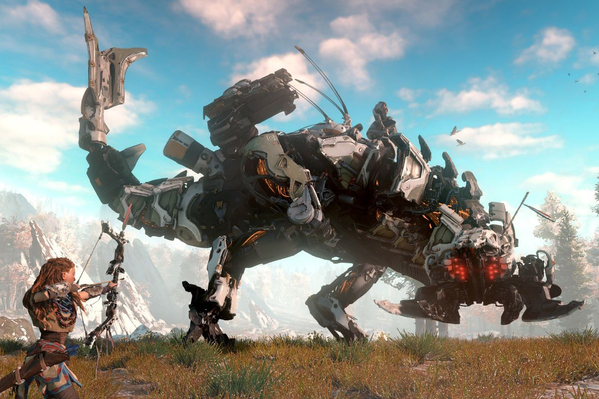

# Developers, don't mock people for being amazed by game dev techniques

Created: 2021-10-25 09:42:34 +0200

Modified: 2021-10-25 16:37:22 +0200

---

**Developers, don't mock people for being amazed by game dev techniques (update)**

**You WANT people curious about what you do**

by [Ben Kuchera](http://www.polygon.com/users/Ben%20Kuchera)

Apr 18, 2017, 12:15pm EDT

Guerrilla Games/Sony Interactive Entertainment

A [documentary about the creation of *Horizon: Zero Dawn*](https://www.youtube.com/watch?v=A0eaGRcdwpo) was created by the Dutch organization VPRO, and yesterday [Kotaku pulled an interesting GIF](http://kotaku.com/horizon-zero-dawn-uses-all-sorts-of-clever-tricks-to-lo-1794385026) from the video that showed how the game renders its large environments.

"Every time you move the camera in *Horizon Zero Dawn*, the game is doing all sorts of under-the-hood calculations, loading and unloading chunks of world to ensure that it all runs properly," [the post stated](http://kotaku.com/horizon-zero-dawn-uses-all-sorts-of-clever-tricks-to-lo-1794385026). "And that's not even counting the robot dinosaurs."

The post has become an object of ridicule among certain game development circles, because this is the internet and we needed a controversy today. What's annoying is that this is a really, really silly one.

**Why this is a thing**

The GIF in question *does* show something that's rudimentary if you've created a game. It also shows what's going on in a way that's easy to understand and explain, which is part of the reason why the story blew up in such a large way. The Kotaku post has a little under 80,000 pageviews at the time of this writing, and the GIF is near the top of [r/Gaming with over 1,800 comments](https://www.reddit.com/r/gaming/comments/65zr3h/heres_whats_happening_in_horizon_zero_dawn_every/).

So clearly it's interesting to people.

You can see the GIF below.

Neat, right?

[VPRO Documentary](https://www.youtube.com/watch?v=A0eaGRcdwpo) via Kotaku

Developers were quick to mock the post for daring to explain a detail of *Horizon*'s development.

Sigh.

Yes, of course. [Frustum culling](https://en.wikipedia.org/wiki/Viewing_frustum). Something everyone intuitively knows from the act of playing a game, so it's never worth discussing or explaining.

You are wrong to think the GIF was neat.

The humor is that a site with a gaming focus showed a small detail about how games actually work and readers were interested, and developers are greeting this with derision because it's common knowledge to them.

Other developers were a bit more adult about things.

Heck, I knew the *basics* of what the GIF showed, but I still found it interesting to see it laid out in that manner. It's the sort of thing that is rarely --- if ever --- explained to players, or even the press.

**So why aren't these things talked about more often?**

Developers and publishers often pass on explaining technical issues of how games are made, even at the basic level, and PR departments of larger publishers will often pass on sharing technical details of any kind in favor of explaining how great the game is going to be and what pre-order bonuses will be offered.

The press can sometimes be stuck dealing with tightly controlled messaging for larger games, and we can't explain this stuff without someone being willing to break down what's going on and why.

This goes for even the most basic of things in game development, and if the press struggles to get access to explanations that are easy for the layperson to understand, we can't pass it on. And the moment there is something that interests fans about how a game is rendered, developers make fun of people for not already knowing how it all works? It's a bad look.

And this double standard has very real consequences when players wonder why some very important thing they'd like in a game can't just be added in a few days. We've tried to explain, for instance, why multiplayer support for a game [can't just be added in a week](http://www.polygon.com/2016/8/17/12504244/no-mans-sky-multiplayer-difficulty).

It's easy to mock someone for not knowing how hard it is to add multiplayer to a game, and lord knows I've sometimes been salty online about basic ignorance about game development that bubbles up from forums or Reddit and goes viral, but it's much harder to actually explain what's going on and why.

What the Kotaku post proves, and why I like it so much even as developers look down their nose at the discussion, is that there is an audience for this sort of thing as long as there's an interesting way to show it to the reader. It proves the power of visualizing basic development techniques to explain how games are made, and how they run.

It's the sort of thing that is rarely --- if ever --- explained to players

Because this shit is hard. And it's complicated. I tried to figure out why checkpoints suck so often, and found out that [good save points are really frickin' hard to do](http://www.polygon.com/2014/2/25/5422328/the-passion-of-the-checkpoint-why-gamings-most-frustrating-failure-is). I was very thankful that these companies authorized my sources to talk about this technical aspect of game design, because developers at large studios usually *can't* talk to the press without clearing the process through PR if they want to keep their jobs.

Getting answers to technical questions is time-consuming for us, and PR will often avoid talking about the unsexy aspects of game development because it doesn't cleanly fit into a marketing plan.

The result is a generation of players who don't understand how games are made, and reporters who are often frustrated that we can't get these questions answered on the record. The rare time something like Kotaku's story breaks through and finds an audience should be cause for celebration, not anger.

And to that other developer's credit, they did offer to improve the situation after complaining about the story.

You *want* people curious about how you makes these games, developers. It's better for everyone.

**Update:** We've updated the story with images of the tweets rather than embed the tweets themselves for the privacy of the developers. The headline has also been updated.