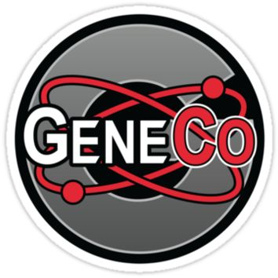
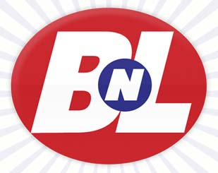
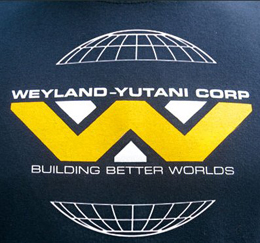
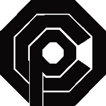
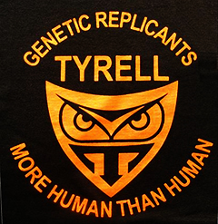
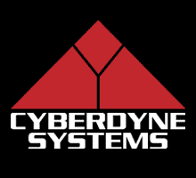
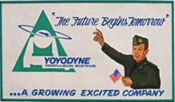

# Evil Companys

Created: 2021-10-25 09:52:00 +0200

Modified: 2021-10-25 09:52:04 +0200

---

As seen in:Repo! The Genetic Opera(2008).

The public face:A commercial medical organisation, GeneCo offers organ implants to patients in need and there are a lot of them about, since organ failure is at an all-time high.

The real horror:The bit that GeneCo dont advertise is that they have an aggressive repossession policy. Fall behind on your payments and the company will send out its Repo Men to take back that heart, liver, lung, eyeball, or whatever else you bought from them. By force. Argh.

**Momcorp**

As seen in:Futurama.

The public face:A friendly manufacturer of consumer goods, run by good old Mom (voiced by Tress MacNeille). Products include staplers, toasters, and killbots.

The real horror:Despite Moms cuddly exterior, shes a hard-hearted megalomaniac, and her company is dead set on crushing all opposition and creating weapons of war. Scary stuff.

**The Pinehearst Company**

As seen in:Heroes.

The public face:A biotech company working to create a better future for everyone by creating innovative medical products. They also run initiatives dedicated to studying energy usage and climate change. Nothing evil there, right?

The real horror:Pinehearsts Biotech Training Program is the scary bit the company is very interested in special humans with superpowers, and has been busy studying them by kidnapping them, tracking them, messing with their memories, or chopping them up for a closer look. Eek.

**Soylent Corporation**

As seen in:Soylent Green(1973).

The public face:In a world of scarcity and hunger, the Soylent Corporation is a shining light, a producer of revolutionary foods that keep a desperate population fed.

The real horror:The companys newest product, Soylent Green, is a kind of wafer made, according to the Soylent Corporation, from plankton. Except the oceans are too depleted for that, so the company has been looking for a more readily available source of protein. Yup, Soylent Green is people.

**N.E.R.D. (Nucleic Exchange Research and Development)**

As seen in:Splice(2009).

The public face:A medical company thats busy creating new kinds of hybrids and, you know, advancing science in all kinds of impressive ways.

The real horror:The public face isnt too far off the mark, but while revolutionary science is going on, some of NERDs projects are a bit unsavoury. And any biomedical company thats willing to buy a pregnant womans child right out of her womb has got to be a bit creepy.

**Multi-National United (MNU)**

As seen in:District 9(2009).

The public face:One of the largest weapons manufacturing companies in the world, MNU is put in charge of protecting the world from dangerous alien species. At least, according to their propaganda theyre protecting us

The real horror:Behind closed doors, MNU is performing all sorts of horrible experiments on the poor old prawns (plus any humans who get too close). The name shouldve been a giveaway, really; never trust any company with such a bland, unassuming brand.

**Buy N Large**

As seen in:Wall-E(2008)

The public face:Originally a frozen yogurt manufacturer, Buy N Large expanded over the years until it had acquired literally every other business and organisation on Earth. Its primary concern? Ensuring humanitys right to spend, spend, spend.

The real horror:Buy N Large might not have had evil intentions, but the consequences of its monopolisation are dire: Earth becomes a rubbish-covered wasteland. Even after all of Buy N Larges shareholders are long dead, its presence endures as blaring adverts championing non-existent products. Capitalism at its finest?

**Dante Laboratories**

As seen in:Dead Heat(1988).

The public face:Just your average unassuming medical research company. Nothing to see here

The real horror:Deep in the depths of the Dante Laboratories building, some seriously weird experiments are going on. Dantes founder, Arthur P. Laudemilk (Vincent Price), has found a way to reanimate the dead, and is using the tech for in two creepy ways: to resurrect rich people who want to live forever, and to create mindless zombie slaves. Not sure which is worse, really.

**Wolfram and Hart, Attorneys at Law**

As seen in:Angel.

The public face:A cutthroat law firm operating out of Los Angeles.

The real horror:Most lawyers are evil, but the ones working for Wolfram and Hart are especially evil theyre literally soulless, having signed terrifyingly thorough contracts when they took the job. The firm is owned by a shadowy trio of demons known as the Wolf, the Ram, and the Hart and their client list is full of horrors.

**Godfrey Institute for Biomedical Technologies**

As seen in:Hemlock Grove.

The public face:The Godfrey Institutes head office is in the White Tower, an imposing building that looms over the town of Hemlock Grove. Owned by the influential Godfrey family, its another biomedical facility thats probably just working on something like curing cancer or developing medicines for tropical diseases, right?

The real horror:Like every other biomedical science company in fiction, the Godfrey Institute is actually up to some seriously sinister stuff, like building Frankenstein-style monsters, and developing Project Ouroboros, which you just know from the name wont turn out to be anything good.

**PharmaKom Industries**

As seen in:Johnny Mnemonic(1995).

The public face:A Japanese pharmaceutical company, working on cures for deadly futuristic diseases like the Black Shakes.

The real horror:Not that different from the public version, except that PharmaKom is so fiercely protective of its drug patents that its willing to send assassins after anyone they suspect of threatening their secrets. Also, PharmaKom isnt actually keen on curing diseases so much as flogging treatments for the symptoms to a desperate public, which is pretty evil.

**OsCorp**

As seen in:Spider-Man(2002),Spider-Man 2(2004),Spider-Man 3(2007),The Amazing Spider-Man(2012), andThe Amazing Spider-Man 2(2014).

The public face:A huge multinational with fingers in so many pies no-one really knows exactly what it does, Oscorp was founded by chemist and tycoon Norman Osborn (Willem Dafoe in the Raimi films; Chris Cooper in the Webb ones).

The real horror:Crazy experimental stuff! Including creating radioactive spiders with a penchant for biting teenage boys, and developing serums to give people super strength, lizard skin, and maniacal cackles.

**Hanso Foundation**

As seen in:Lost.

The public face:The company behind the Dharma Initiative, the Hanso Foundation was founded by munitions mogul Alvar Hanso. Its not concerned with weaponry, though the Foundation is all about finding ways to prolong and improve life. Or so they say.

The real horror:The Foundations ethical, er, foundations might be a bit shaky. All that experimenting on unsuspecting human subjects? Not exactly best practice. Plus they seem to be messing with electromagnetic forces, which never ends well.

**Blue Sun Corporation**

As seen in:FireflyandSerenity(2005).

The public face:A reliable, ever present brand, Blue Sun manufactures packaged food and drinks that are sold in every shop, on every planet, and have been invaluable to settlers on difficult new worlds.

The real horror:Blue Sun mightve started out in the food industry but as it grew it gained influence, and now also creates everything from computer systems to spaceships. Inevitably, its got a biotech division, which is never good news, and its also got enough sway with the Alliance that it can do pretty much whatever it wants.

**The Spectacular Optical Corporation**

As seen in:Videodrome(1983).

The public face:Your average high street opticians. Theyve probably got a good two-for-one offer going on, or cheap sunglasses, if youre lucky.

The real horror:The rabbit hole goes deep on this one. Spectacular Optical are actually a front for a weapons manufacturer, and theyre also behind the production of the horrific Videodrome TV show, which features explicit footage of torture and murder. And some things you cant unsee.

**LuthorCorp**

As seen in:Smallville.

The public face:An innovative agricultural company, investing in finding new ways to feed the world. Originally founded by Lionel Luthor (John Glover), it was taken over after his death by his entrepreneurial son, Lex (Michael Rosenbaum).

The real horror:LuthorCorp mightve started out manufacturing fertiliser and pesticides, but it soon started getting into more esoteric research, especially when some meteoric rock was found to have interesting properties when applied to living beings. Also, theres a bionic research division, which might as well have a giant neon light reading evil! pointing right at it.

**The Weyland-Yutani Corporation**

As seen in:Alien(1979),Aliens(1986), andAlien 3(1992).

The public face:A British/Japanese megacorporation, supplying advanced technologies to various industries; its also involved in the colonisation of other planets, and does a sideline in shipping and transportation.

The real horror:A prime example of a company growing too big for its boots, Weyland-Yutani has a controlling interest in the United States Colonial Marine Corps, as well as half a dozen other things. Profit is everything, or nearly everything, as Weyland-Yutani pushes its employees into danger time and time again, and is a little too interested in getting hold of alien weaponry

**Omni Consumer Products**

As seen in:RoboCop(1987) andRoboCop(2014).

The public face:Omni Consumer Products, or OCP, is yet another mega-corporation with fingers in every pie available. Despite the name, OCP isnt just about making consumer bits and pieces it also runs hospitals, prisons, and even a whole privatised city.

The real horror:Although OCP claims its working for the good of the people, reducing crime and improving everyones quality of life, the effects speak for themselves the corporation runs Delta City like a police state, and prioritises profits above all.

**Umbrella Corporation**

As seen in:Resident Evil(2002),Resident Evil: Apocalypse(2004),Resident Evil: Extinction(2007),Resident Evil: Afterlife(2010), andResident Evil: Retribution.

The public face:A multinational pharmaceutical company, shipping drugs and other medical supplies all over the world. It also dabbles in more commercial products, like make-up and foodstuffs.

The real horror:Something horrible is pretty much always going on in the Umbrella Corporation Labs. The T-virus that destroys the world in theResident Eviluniverse was cooked up in there, and there are all sorts of other highly unethical human experiments going on. Plus its got a military subsidiary tasked with protecting its interests, even if that means sealing off entire cities and leaving their inhabitants to die.

**Zorg Industries**

As seen in:The Fifth Element(1997).

The public face:Headed up by the snazzily dressed Jean-Baptiste Emmanuel Zorg (Gary Oldman), Zorg Industries is a multinational that primarily builds robots and elaborate weapons, but also has sidelines in things like taxi firms.

The real horror:Zorg Industries might have the most evil CEO of them all not only is Zorg not picky about who he sells his terrifying guns to, hes also willing to sell out all of humanity to the Great Evil. Which youd think would eat into his profit margins, no?

**LexCorp (DC Comics)**

Hailed as one of the largest, most diversified multinational corporations in the world, it also happens to be founded by Lex Luthor, who runs it with his characteristic ruthlessness. The list of cities and countries where the corporation has holdings is basically as long as the list of cities and countries on Earth, and the number of companies controlled by LexCorp is almost as long and just as varied. Unfortunately, as ofOne Year Later, with Lana Lang acting as CEO, the corporation seems to be heading towards bankruptcy. The "No Helping Superman" rule still applies to all employees, however.

**Primatech (Heroes)**

The Primatech Paper Company of Odessa, Texas is the first Primatech facility the show introduces us to. Of course, they do a lot more than just make paper---They capture and "study" folks with enhanced abilities, but, really, what they do best is operate in a moral gray area. A very dark gray area.

**Merrick Biotech (The Island)**

Merrick Biotech's business is keeping clones of their customers around, just in case said customers should need a transplant of some kind. Basically like the ultimate life insurance, right? Except for the fact that it's illegal to allow the clones to be conscious and sentient, which, of course, Merrick Biotech lets happen and lies to their clients about. Therefore, the corporation has an entire population of fully-conscious human beings living totally unaware of the fact that they're basically just an organ farm. And that's just not cool.

**Fatboy Industries (The Middleman, TV series)**

In the final episode of the series, Wendy Watson is transported into a classic example of a Mirrorverse, where the megacorp of Fatboy Industries is a totalitarian presence, having taken the place of the government. Unfortunately, the morality of Fatboy in Wendy's real world is still unconfirmed, as there's a hint of "more than meets the eye" to both the corporation and its ambiguous founder, Manservant Neville. (This is underscored by the fact that the rest of Mirrorverse turns out to be not so very different from the real world.)

**Tyrell Corporation (Blade Runner)**

The Tyrell Corporation produces the replicants, lifelike androids designed to the work deemed to dangerous and demeaning for humans, and is named for Dr. Eldon Tyrell, the founder and genius inventor of the replicants. While it's debatable how truly "evil" the Tyrell Corporation is, there is a definite sinister quality to their dealings and it's nigh impossible to deny that they definitely smack of "evil corporation."

**Veidt Industries (Watchmen)**

A lot of what was said about LexCorp could be repeated here. Once again, the ruthless ambition of the corporation paired with the questionable morality of its founder leaves us wondering how much to trust this (powerful, financially successful) corporation. Meanwhile, the impending release of the film was paired with a Veidt Industries commercial contest, leading to all sorts of fake '80's advertising.

**Cyberdyne Systems Corporation (Terminatorfilms)**

While the corporation is said to be benign in the first two films, manufacturing parts for bigger companies, they then make the mistake of creating Skynet, a system of artificially intelligent supercomputers that control (among other things) nuclear missiles. This was not a smart move. In fact, it's just un-smart enough to warrant Cyberdyne's inclusion on this list.

**Yoyodyne (The Crying of Lot 49andV.by Thomas Pynchon)**

Yoyodyne is a defense contractor that's described inThe Crying of Lot 49as "a giant of the aerospace industry," and a few characters in the novel work for the company. While the morality of Yoyodyne isn't firmly sealed either way, the thread of conspiracy woven throughout the work suggests that it isn't all it seems. (The name "Yoyodyne" is mentioned, as you might remember, inThe Adventures of Buckaroo Banzai Across the 8th Dimension.)

**Earth Protectors (Up, Up, and Away, 2000 TV movie)**

Ostensibly a group designed to teach middle schoolers the importance of environmentalism, Earth Protectors' favorite method of persuasion is brainwashing. And while handing out CD's brainwashing kids into recycling isn't a completely bad thing, brainwashing the parents to rob banks is another thing entirely. (Actually, brainwashing in general? Not recommended.)
