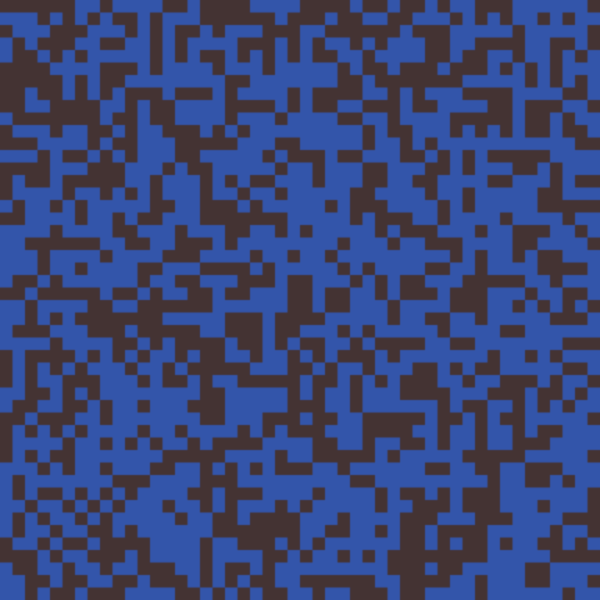
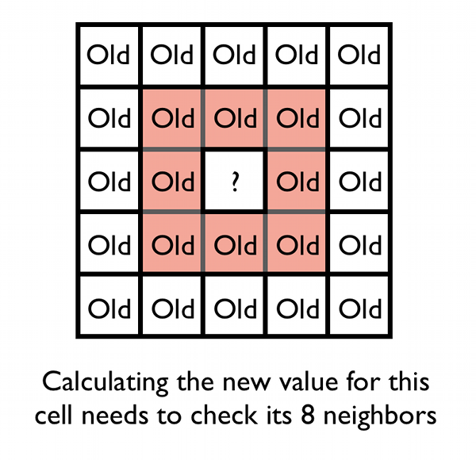
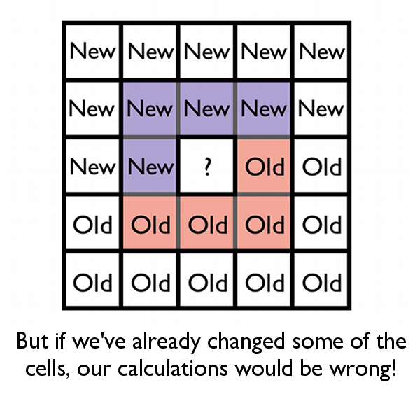
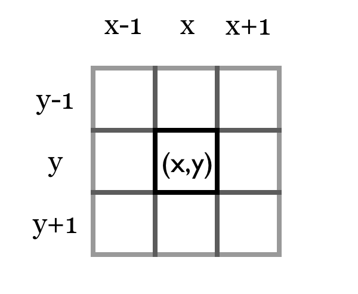
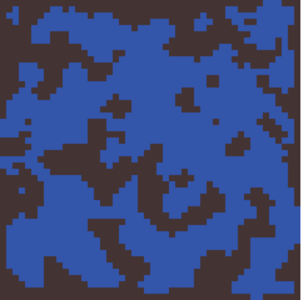
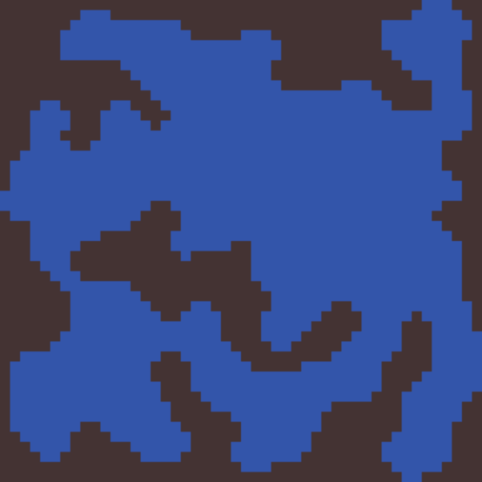

# Generate Random Cave Levels Using Cellular Automata

Created: 2021-10-25 09:47:55 +0200

Modified: 2021-10-25 09:47:59 +0200

---

**Generate Random Cave Levels Using Cellular Automata**

23 Jul 2013

Intermediate

Procedural content generators are bits of code written into your game that can create new pieces of game content at any time - even when the game is running! Game developers have tried to procedurally generate everything from 3D worlds to musical soundtracks. Adding some generation to your game is a great way to plug in extra value: players love it because they get new, unpredictable and exciting content each time they play.

In this tutorial, we'll look at a great method for generating random levels, and try to stretch the boundaries of what you might think can be generated.

**Welcome to the Caves!**

In this tutorial, we're going to build a cave generator. Caves are great for all sorts of game genres and settings, but they particularly remind me of old dungeons in role-playing games.

Take a look at the demo below to see the kinds of output you'll be able to get. Click 'New World' to produce a new cave to look at. We'll talk about what the different settings do in due course.

This generator actually returns us a big two-dimensional array of blocks, each of which is either solid or empty. So in fact, you could use this generator for all sorts of games besides dungeon-crawlers: random levels for strategy games, tilemaps for platform games, perhaps even as arenas for a multiplayer shooter! If you look carefully, flipping the solid and empty blocks makes an island-generator too. It all uses the same code and output, which makes this a really flexible tool.

Let's get started by asking a simple question: what on earth is a cellular automaton, anyway?

**Getting Started With Cells**

In the 1970s, a mathematician called John Conway published a description of The Game Of Life, sometimes just called Life. Life wasn't really a game; it was more like a simulation that took a grid of cells (that could be either alive or dead) and applied some simple rules to them.

Four rules were applied to each cell in every step of the simulation:

1.  If a living cell has less than two living neighbours, it dies.

2.  If a living cell has two or three living neighbours, it stays alive.

3.  If a living cell has more than three living neighbours, it dies.

4.  If a dead cell has exactly three living neighbours, it becomes alive.

Nice and simple! Yet if you try out different combinations of starting grids, you can get very strange outcomes. Infinite loops, machines that spit out shapes, and more. The Game of Life is an example of a *cellular automaton*- a grid of cells that are governed by certain rules.

We're going to implement a system very similar to Life, but instead of producing funny patterns and shapes, it's going to create amazing cave systems for our games.

**Implementing a Cellular Automaton**

We're going to represent our cellular grid as a two-dimensional array of Boolean (true or false) values. This suits us because we're only interested in whether a tile is solid or not.

Here's us initialising our grid of cells:

|    | boolean[][] cellmap = new boolean[width][height]; |
|-----|-----------------------------------------------------------|

**Tip:**Notice that the first index is the x-coordinate for the array, and the second index is the y-coordinate. This makes accessing the array more natural in code.

In most programming languages, this array will initialise with all its values set to false. That's fine for us! If an array index (x,y) is false, we'll say that the cell is empty; if it's true, that tile will be solid rock.

Each one of these array positions represents one of the 'cells' in our cellular grid. Now we need to set up our grid so we can begin building our caves.

We're going to start out by randomly setting each cell to either dead or alive. Each cell will have the same random chance of being made alive, and you should make sure that this chance value is set in a variable somewhere, because we'll definitely want to tweak it later and having it somewhere easy to access will help us with that. I'll use 45% to start off with.

<table><colgroup><col style="width: 13%" /><col style="width: 86%" /></colgroup><thead><tr class="header"><th></th><th>
float chanceToStartAlive = 0.45f;

public boolean[][] initialiseMap(boolean[][] map){

for(int x=0; x&lt;width; x++){

for(int y=0; y&lt;height; y++){

if(random() &lt; chanceToStartAlive){

map[x][y] = true;

}

}

}

return map;

}
</th></tr></thead><tbody></tbody></table>

Our random cave before any cellular automaton simulation steps.

If we run this code, we end up with a big grid of cells like the one above that are randomly alive or dead. It's messy, and it definitely doesn't look like any cave system I've ever seen. So what's next?

**Growing Our Caves**

Remember the rules that governed the cells in The Game Of Life? Each time the simulation went ahead by one step, every cell would check the rules of Life and see if it would change to being alive or dead. We're going to use exactly the same idea to build our caves - we'll write a function now that loops over every cell in the grid, and applies some basic rules to decide whether it lives or dies.

As you'll see later, we're going to use this bit of code more than once, so putting it in its own function means we can call it as many or as few times as we like. We'll give it a nice informative name like doSimulationStep(), too.

What does the function need to do? Well first, we're going to make a new grid that we can put our updated cell values in. To understand why we need to do this, remember that to calculate the new value of a cell in the grid, we need to look at its eight neighbours:

But if we've already calculated the new value of some of the cells and put them back in the grid, then our calculation will be a mix of new and old data, like this:

Oops! That's not what we want at all. So each time we calculate a new cell value, instead of putting it back in the old map, we're going to write it to a new one.

Let's begin writing that doSimulationStep() function, then:

<table><colgroup><col style="width: 13%" /><col style="width: 86%" /></colgroup><thead><tr class="header"><th></th><th>
public doSimulationStep(boolean[][] oldMap){

boolean[][] newMap = new boolean[width][height];

//...
</th></tr></thead><tbody></tbody></table>

We want to consider each cell in the grid in turn, and count how many of its neighbours are alive and dead. Counting your neighbours in an array is one of those boring bits of code you'll have to write a million times. Here's a quick implementation of it in a function I've called countAliveNeighbours():

<table><colgroup><col style="width: 11%" /><col style="width: 88%" /></colgroup><thead><tr class="header"><th></th><th>
//Returns the number of cells in a ring around (x,y) that are alive.

public countAliveNeighbours(boolean[][] map, int x, int y){

int count = 0;

for(int i=-1; i&lt;2; i++){

for(int j=-1; j&lt;2; j++){

int neighbour_x = x+i;

int neighbour_y = y+j;

//If we're looking at the middle point

if(i == 0 &amp;&amp; j == 0){

//Do nothing, we don't want to add ourselves in!

}

//In case the index we're looking at it off the edge of the map

else if(neighbour_x &lt; 0 || neighbour_y &lt; 0 || neighbour_x &gt;= map.length || neighbour_y &gt;= map[0].length){

count = count + 1;

}

//Otherwise, a normal check of the neighbour

else if(map[neighour_x][neighbour_y]){

count = count + 1;

}

}

}

}
</th></tr></thead><tbody></tbody></table>

A couple of things about this function:

First, the for loops are a little weird if you've not done something like this before. The idea is that we want to look at all the cells that are around the point (x,y). If you look at the illustration below, you can see how the indices we want are one less, equal to, and one more then the original index. Our two for loops give us just that, starting at -1, and looping through to +1. We then add that to the original index inside the for loop to find each neighbour.

Second, notice how if we're checking a grid reference that isn't real (for instance, it's off the edge of the map) we count it as a neighbour. I prefer this for cave generation because it tends to help fill in the edges of the map, but you can experiment by not doing this if you like.

So now, let's go back to our doSimulationStep() function and add in some more code:

<table><colgroup><col style="width: 11%" /><col style="width: 88%" /></colgroup><thead><tr class="header"><th></th><th>
public boolean[][] doSimulationStep(boolean[][] oldMap){

boolean[][] newMap = new boolean[width][height];

//Loop over each row and column of the map

for(int x=0; x&lt;oldMap.length; x++){

for(int y=0; y&lt;oldMap[0].length; y++){

int nbs = countAliveNeighbours(oldMap, x, y);

//The new value is based on our simulation rules

//First, if a cell is alive but has too few neighbours, kill it.

if(oldMap[x][y]){

if(nbs &lt; deathLimit){

newMap[x][y] = false;

}

else{

newMap[x][y] = true;

}

} //Otherwise, if the cell is dead now, check if it has the right number of neighbours to be 'born'

else{

if(nbs &gt; birthLimit){

newMap[x][y] = true;

}

else{

newMap[x][y] = false;

}

}

}

}

return newMap;

}
</th></tr></thead><tbody></tbody></table>

This loops over the whole map, applying our rules to each grid cell to compute the new value and placing it in newMap. The rules are simpler than the Game of Life - we have two special variables, one for birthing dead cells (birthLimit), and one for killing live cells (deathLimit). If living cells are surrounded by less than deathLimit cells they die, and if dead cells are near at least birthLimit cells they become alive. Nice and simple!

All that's left at the end is a final touch to return the updated map. This function represents a single step of our cellular automaton's rules - the next step is to understand what happens as we apply it once, twice or more times to our initial starting map.

**Tweaking and Tuning**

Let's look at what the main generation code now looks like, using the code we've written so far.

<table><colgroup><col style="width: 12%" /><col style="width: 87%" /></colgroup><thead><tr class="header"><th></th><th>
public boolean[][] generateMap(){

//Create a new map

boolean[][] cellmap = new boolean[width][height];

//Set up the map with random values

cellmap = initialiseMap(cellmap);

//And now run the simulation for a set number of steps

for(int i=0; i&lt;numberOfSteps; i++){

cellmap = doSimulationStep(cellmap);

}

}
</th></tr></thead><tbody></tbody></table>

The only really new bit of code is a for loop that runs our simulation method a set number of times. Again, pop it in a variable so we can change it, because we're going to start playing with these values now!

So far we've set these variables:
-   chanceToStartAlive sets how dense the initial grid is with living cells.
-   starvationLimit is the lower neighbour limit at which cells start dying.
-   overpopLimit is the upper neighbour limit at which cells start dying.
-   birthNumber is the number of neighbours that cause a dead cell to become alive.
-   numberOfSteps is the number of times we perform the simulation step.

Our random cave after two cellular automaton simulation steps.

You can fiddle with these variables in the demo at the top of the page. Each value will change the demo dramatically, so have a play around and see what suits.

One of the most interesting changes you can make is to the numberOfSteps variable. As you run the simulation for more steps, the roughness of the map disappears, and islands smooth away into nothing. I've added in a button so that you can call the function manually yourself, and see the effects. Experiment a bit and you'll find a combination of settings that suits your style and the kind of levels your game needs.

Our random cave after six cellular automaton simulation steps.

With that, you're done. Congratulations - you've just made a procedural level generator, well done! Sit back, run and re-run your code, and smile at the weird and wonderful cave systems that come out. Welcome to the world of procedural generation.

**Taking It Further**

If you're staring at your lovely cave generator and wondering what else you can do with it, here are a couple of 'extra credit' assignment ideas:

**Using Flood Fill to Do Quality Checking**

Flood fill is a very simple algorithm that you can use to find all the spaces in an array that connect to a particular point. Just like the name suggests, the algorithm works a bit like pouring a bucket of water into your level - it spreads out from the starting point and fills in all the corners.

Flood fill is great for cellular automata because you can use it to see how big a particular cave is. If you run the demo a few times you'll notice that some maps are made up of one big cave, while others have a few smaller caves that are separated from each other. Flood fill can help you detect how big a cave is, and then either regenerate the level if it's too small, or decide where you want the player to start if you think it's big enough. There's [a great outline of flood fill](http://en.wikipedia.org/wiki/Flood_fill) on Wikipedia.

Advertisement

**Quick and Simple Treasure Placement**

Placing treasure in cool areas sometimes requires a lot of code, but we can actually write quite a simple bit of code to place treasure out of the way in our cave systems. We already have our code that counts how many neighbours a square has, so by looping over our finished cave system, we can see how surrounded by walls a particular square is.

If an empty grid cell is surrounded by lots of solid walls, it's probably at the very end of a corridor or tucked away in the walls of the cave system. This is a great place to hide treasure - so by doing a simple check of our neighbours we can slip treasure into corners and down alleyways.

<table><colgroup><col style="width: 13%" /><col style="width: 86%" /></colgroup><thead><tr class="header"><th></th><th>
public void placeTreasure(boolean[][] world){

//How hidden does a spot need to be for treasure?

//I find 5 or 6 is good. 6 for very rare treasure.

int treasureHiddenLimit = 5;

for (int x=0; x &lt; worldWidth; x++){

for (int y=0; y &lt; worldHeight; y++){

if(!world[x][y]){

int nbs = countAliveNeighbours(world, x, y);

if(nbs &gt;= treasureHiddenLimit){

placeTreasure(x, y);

}

}

}

}

}
</th></tr></thead><tbody></tbody></table>

This isn't perfect. It sometimes puts treasure in inaccessible holes in the cave system, and sometimes the spots will be quite obvious, too. But, in a pinch, it's a great way to scatter collectibles around your level. Try it out in the demo by hitting the **placeTreasure()**button!

**Conclusions and Further Reading**

This tutorial showed you how to build a basic but complete procedural generator. With just a few simple steps we wrote code that can create new levels in the blink of an eye. Hopefully this has given you a taster of the potential of building procedural content generators for your games!

If you want to read more, [Roguebasin](http://roguebasin.roguelikedevelopment.org/) is a great source of information on procedural generation systems. It mostly focuses on roguelike games, but many of its techniques can be used in other types of game, and there's lots of inspiration for procedurally generating other parts of a game too!

If you want more on [Procedural Content Generation](http://gamedev.tutsplus.com/tag/procedural-content-generation/) or [Cellular Automata](http://gamedev.tutsplus.com/tag/cellular-automaton), here's a great online version of [The Game Of Life](http://pmav.eu/stuff/javascript-game-of-life-v3.1.1/) (although I highly recommend typing "Conway's Game Of Life" into Google). You might also like [Wolfram Tones](http://tones.wolfram.com/), a charming experiment in using cellular automata to generate music!

