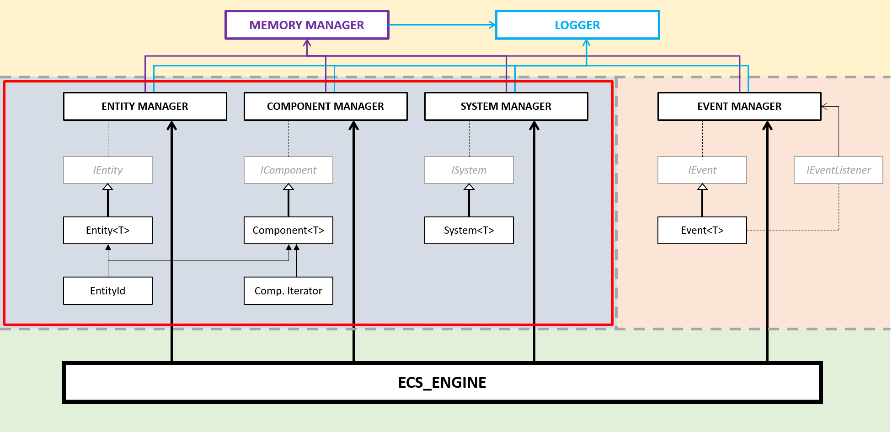
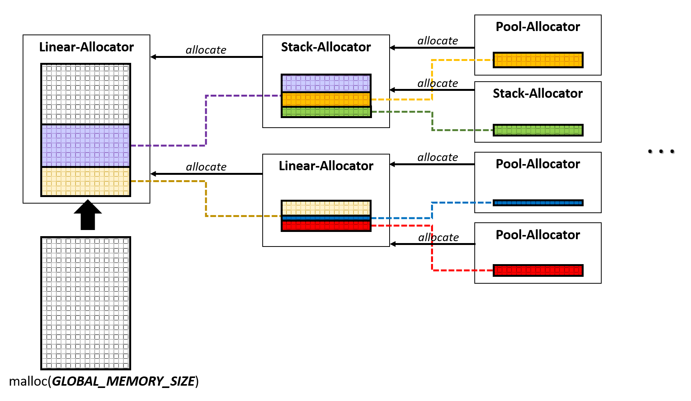
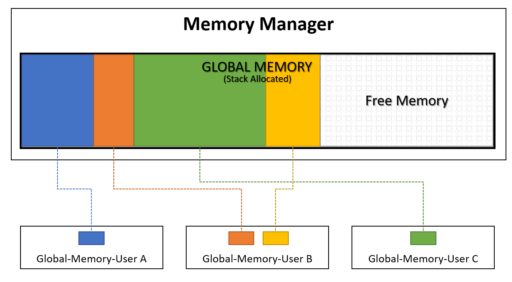
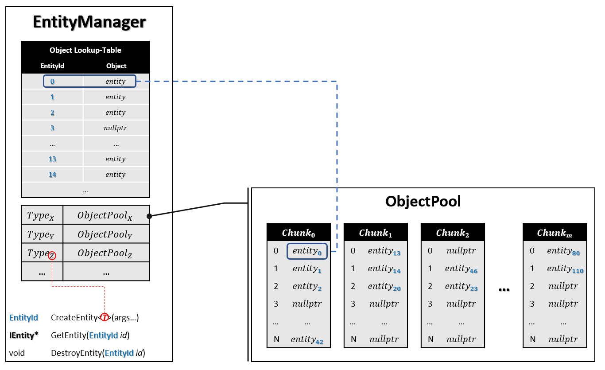
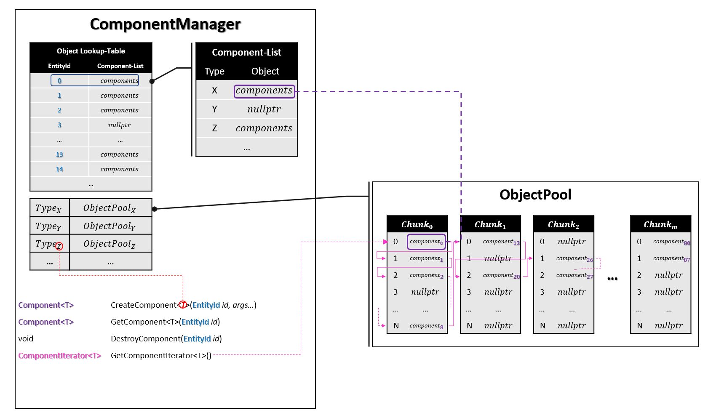
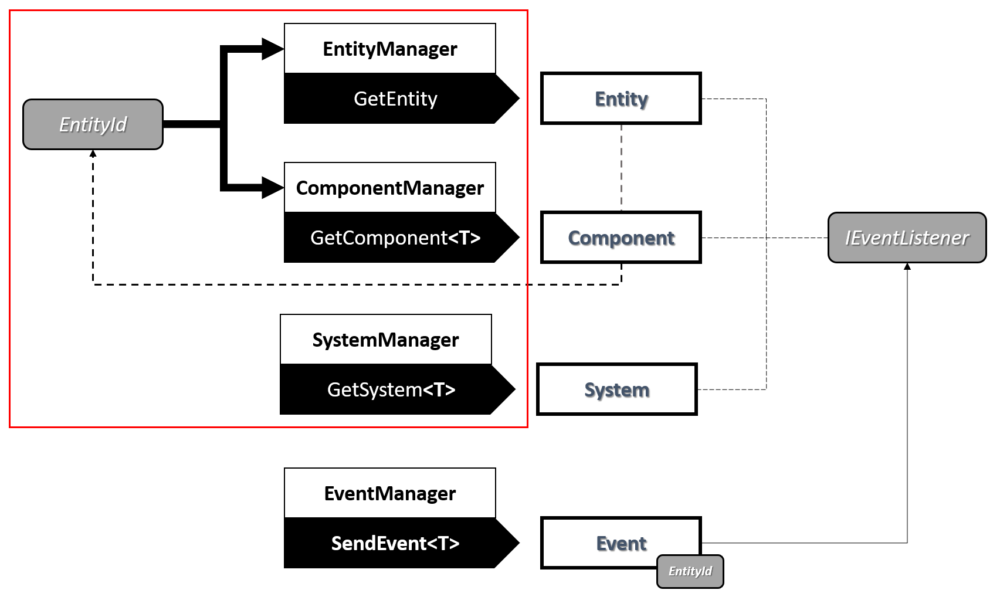

# The Entity-Component-System - An awesome game-design pattern in C++ (Part 1)

Hi Folks.

This is actually my first post on gamasutra :) I am here pretty much every day and checkout cool posts, today is gonna be the day I add one by myself :) You will find the origial post here.

In this article I want to talk about the Entity-Component-System (**ECS**). You can find a lot of information about the matter in the internet so I am not going to deep into explanation here, but talking more about my own implementation.

First things first. You will find the full source code of my ECS in my [github](https://github.com/tobias-stein/EntityComponentSystem) repository.

An Entity-Component-System – mostly encountered in video games – is a design pattern which allows you great flexibility in designing your overall software architecture[<sup>[1]</sup>](https://www.gamedeveloper.com/design/the-entity-component-system---an-awesome-game-design-pattern-in-c-part-1-#refs). Big companies like Unity, Epic or Crytek in-cooperate this pattern into their frameworks to provide a very rich tool for developers to build their software with. You can checkout these posts to follow a broad discussion about the matter[<sup>[2,3,4,5]</sup>](https://www.gamedeveloper.com/design/the-entity-component-system---an-awesome-game-design-pattern-in-c-part-1-#refs).

If you have read the articles I mentioned above you will notice they all share the same goal: distributing different concerns and tasks between Entities, Components and Systems. These are the three big players in this pattern and are fairly loose coupled. **Entities** are mainly used to provide a unique identifier, make the environment aware of the existence of a single individual and function as a sort of root object that bundles a set of components. **Components** are nothing more than container objects that do not possess any complex logic. Ideally they are simple plain old data objects (POD’s). Each type of a component can be attached to an entity to provide some sort of a property. Let's say for example a “Health-Component” can be attached to an entity to make it mortal by giving it _health_, which is not more than an integer or floating point value in memory.

Up to this point most of the articles I came across agree about the purpose and use of entity and component objects, but for systems opinions differ. Some people suggest that systems are only aware of components. Furthermore some say for each type of component there should be a system, e.g. for “Collision-Components” there is a “Collision-System”, for “Health-Components” there is a “Health-System” etc. This approach is kind of rigid and does not consider the interplay of different components. A less restrictive approach is to let different systems deal with all components they should be concerned with. For instance a “Physics-Systems” should be aware of “Collision-Components” and “Rigidbody-Components”, as both probably contain necessary information regarding physics simulation. In my humble opinion **systems** are "closed environments". That is, they do not take ownership of entities nor components. They do access them through independent manager objects, which in turn will take care of the entities and components life-cycle.

This raises an interesting question: how do entities, components and systems communicate with each other, if they are more or less independent of each other? Depending on the implementation the answer differs. As for the implementation I am going to show you, the answer is event sourcing[<sup>[6]</sup>](https://www.gamedeveloper.com/design/the-entity-component-system---an-awesome-game-design-pattern-in-c-part-1-#refs). Events are distributed through an “Event-Manager” and everyone who is interested in events can listen to what the manager has to say. If an entity or system or even a component has an important state change to communicate, e.g. "position changed" or "player died", it can tell the “Event-Manager”. He will broadcast the event and all subscriber for this event will get notified. This way everything can be interconnected.

Well I guess the introduction above got longer than I was actually planning to, but here we are :) Before we are going to dive deeper into the [code](https://github.com/tobias-stein/EntityComponentSystem), which is C++11 by the way, I will outline the main features of my architecture:

-   **memory efficiency** - to allow a quick creation and removal of entity, component and system objects as well as events I could not rely on standard new/delete managed heap-memory. The solution for this was of course a custom memory allocator.
-   **logging** - to see what is going on I used log4cplus[<sup>[7]</sup>](https://www.gamedeveloper.com/design/the-entity-component-system---an-awesome-game-design-pattern-in-c-part-1-#refs) for logging.
-   **scalable** \- it is easy to implement new types of entities, components, systems and events without any preset upper limit except your system's memory
-   **flexible** - no dependencies exist between entities, components and systems (entities and components sure do have a sort of dependency, but do not contain any pointer logic of each other)
-   **simple object lookup/access** - easy retrieval of entity objects and there components through an _EntityId_ or a component-iterator to iterate over all components of a certain type
-   **flow control** - systems have priorities and can depend on each other, therefore a topological order for their execution can be established
-   **easy to use** - the library can be easily in cooperate into other software; only one include.

The following figure depicts the overall architecture of my Entity-Component-System:

 Figure-01: ECS Architecture Overview (**_ECS.dll_**).

As you can see there are four different colored areas in this picture. Each area defines a modular piece of the architecture. At the very bottom - actually in the picture above at the very top; it should be upside down - we got the memory management and the logging stuff (yellow area). This first-tier modules are dealing with very low-level tasks. They are used by the second-tier modules in the Entity-Component-System (blue area) and the event sourcing (red area). These guys mainly deal with object management tasks. Sitting on top is the third-tier module, the ECS\_Engine (green area). This high-level global engine object orchestrates all second-tier modules and takes care of the initialization and destruction. All right, this was a short and very abstract overview now let's get more into the details.

#### Memory Manager

Let's start with the [Memory-Manager](https://github.com/tobias-stein/EntityComponentSystem/tree/master/EntityComponentSystem/include/ECS/Memory). It's implementation is based on an article[<sup>[8]</sup>](https://www.gamedeveloper.com/design/the-entity-component-system---an-awesome-game-design-pattern-in-c-part-1-#refs) I have found on _[gamedev.net](https://www.gamedev.net/)_. The idea is to keep heap-memory allocations and releases to an absolute minimum. Therefore only at application start a big chuck of system-memory is allocated with [_malloc_](http://en.cppreference.com/w/cpp/memory/c/malloc). This memory now will be managed by one or more custom allocator. There are many types of allocators[<sup>[9]</sup>](https://www.gamedeveloper.com/design/the-entity-component-system---an-awesome-game-design-pattern-in-c-part-1-#refs) ( linear, stack, free list...) and each one of them has it's pro's and con's (which I am not going to discuss here). But even if they internally work in a different way they all share a common public interface:

```
class Allocator
{
     public:
          virtual void* allocate(size_t size) = 0;
          virtual void free(void* p) = 0;
};
```

The code snippet above is not complete, but outlines the two major public methods each concrete allocator must provide:

1.  **allocate** - which allocates a certain amount of bytes and returns the memory-address to this chunk and
2.  **free** - to de-allocates a previously allocated chuck of memory given it's address.

Now with that said, we can do cool stuff like chaining-up multiple allocators like that:

 Figure-02: Custom allocator managed memory.

As you can see, one allocator can get it's chunk of memory - that it is going to manage - from another (parent) allocator, which in turn could get it's memory from another allocator and so on. That way you can establish different memory management strategies. For the implementation of my ECS I provide a root stack-allocator that get's an initial allocated chuck of 1GB system-memory. Second-tier modules will allocate as much memory as they need from this root allocator and only will free it when the application get's terminated.

 Figure-03: Possible distribution of global memory.

[Figure-03](https://www.gamedeveloper.com/design/the-entity-component-system---an-awesome-game-design-pattern-in-c-part-1-#fig01) shows how the global memory could be distributed among the second-tier modules: "_Global-Memory-User A"_ could be the Entity-Manager, "_Global-Memory-User B"_ the Component-Manager and _"Global-Memory-User C"_ the System-Manager.

#### Logging

I am not going to talk too much about logging as I simply used log4cplus[<sup>[7]</sup>](https://www.gamedeveloper.com/design/the-entity-component-system---an-awesome-game-design-pattern-in-c-part-1-#refs) doing this job for me. All I did was defining a [Logger](https://github.com/tobias-stein/EntityComponentSystem/blob/master/EntityComponentSystem/include/ECS/Log/Logger.h) base class hosting a _log4cplus::Logger_ object and a few wrapper methods forwarding simple log calls like "LogInfo()", "LogWarning()", etc.

#### Entity-Manager, IEntity, Entity and Co.

Okay now let's talk about the real meat of my architecture; the blue area in [Figure-01](https://www.gamedeveloper.com/design/the-entity-component-system---an-awesome-game-design-pattern-in-c-part-1-#fig01). You may have noticed the similar setup between all manager objects and their concerning classes. Have a look at the _[EntityManager](https://github.com/tobias-stein/EntityComponentSystem/blob/master/EntityComponentSystem/include/ECS/EntityManager.h)_, [_IEntity_](https://github.com/tobias-stein/EntityComponentSystem/blob/master/EntityComponentSystem/include/ECS/IEntity.h) and _[Entity](https://github.com/tobias-stein/EntityComponentSystem/blob/master/EntityComponentSystem/include/ECS/Entity.h)_ classes for example. The _EntityManger_ class is supposed to manage all entity objects during application run-time. This includes tasks like creating, deleting and accessing existing entity objects. _IEntity_ is an interface class and provides the very basic traits of an entity object, such as an object-identifier and (static-)type-identifier. It's static because it won't change after program initialization. This type-identifier is also consistent over multiple application runs and may only change, if source code was modified.

```
class IEntity
{
    // code not complete!
EntityId m_Id;

    public:
        IEntity();
        virtual ~IEntity();

        virtual const EntityTypeId GetStaticEntityTypeID() const = 0;

        inline const EntityId GetEntityID() const { return this->m_Id; }
};
```

The type-identifier is an integer value and varies for each concrete entity class. This allows us to check the type of an _IEntity_ object at run-time. Last but not least comes the _Entity_ template class.

```
template<class T>
class Entity : public IEntity
{
    // code not complete!

    void operator delete(void*) = delete;
    void operator delete[](void*) = delete;

public:

    static const EntityTypeId STATIC_ENTITY_TYPE_ID;

    Entity() {}
    virtual ~Entity() {}

    virtual const EntityTypeId GetStaticEntityTypeID() const override { return STATIC_ENTITY_TYPE_ID; }
};

// constant initialization of entity type identifier
template<class T>
const EntityTypeId Entity<T>::STATIC_ENTITY_TYPE_ID = util::Internal::FamilyTypeID::Get();
```

This class's soul purpose is the initialization of the unique type-identifier of a concrete entity class. I made use of two facts here: first constant initialization[<sup>[10]</sup>](https://www.gamedeveloper.com/design/the-entity-component-system---an-awesome-game-design-pattern-in-c-part-1-#refs) of static variables and second the nature of how template classes work. Each Version of the template class _Entity_ will have its own static variable _STATIC\_ENTITY\_TYPE\_ID_. Which in turn will be guaranteed to be initialized before any dynamic initialization happens. The term "_util::Internal::FamilyTypeID::Get()_" is used to implement a sort of type counter mechanism. It internally increments a counter every time it gets called with a different _T_, but always returns the same value when called with the same _T_ again. I am not sure if that patter has a special name, but it is pretty cool :) At this point I also got ride of the delete and delete\[\] operator. This way I made sure nobody would accidentally call these guys. This also - as long as your compiler is smart enough - would give you a warning when trying to use the new or new\[\] operator of entity objects as their counterparts are gone. These operators are not intended to be used since the _EntityManager_ class will take care of all this. Alright, let's summarize what we just learned. The manager class provides basic functionality such as creating, deleting and accessing objects. The interface class functions as the very root base class and provides an unique object-identifier and type-identifier. The template class ensures the correct initialization of the type-identifier and removes the delete/delete\[\] operator. This very same pattern of a manager, interface and template class is used for components, systems and events as well. The only, but important, thing these groups differ, is the way manger classes store and access their objects.

Let's have a look at the EntityManager class first. [Figure-04](https://www.gamedeveloper.com/design/the-entity-component-system---an-awesome-game-design-pattern-in-c-part-1-#fig01) shows the overall structure of how things are stored. 



Figure-04: Abstract view of EntityManager class and it's object storage.

When creating a new entity object one would use the _EntityManager::CreateEntity<**T**\>(args...)_ method. This public method first takes a template parameter which is the type of the concrete entity to be created. Secondly this method takes in an optional amount of parameters (can be empty) which are forwarded to the constructor of **T**. Forwarding  these parameters happens through a variadic template[<sup>[11]</sup>](https://www.gamedeveloper.com/design/the-entity-component-system---an-awesome-game-design-pattern-in-c-part-1-#refs). During creation the following things happen internally ...

1.  The _ObjectPool[<sup>[12]</sup>](https://www.gamedeveloper.com/design/the-entity-component-system---an-awesome-game-design-pattern-in-c-part-1-#refs)_ for entity objects of type **T** will be acquired, if this pool does not exists a new one will be created
2.  New memory will be allocated from this pool; just enough to store the **T** object
3.  Before actually calling the constructor of **T**, a new _EntityId_ is acquired from the manager. This id will be stored along with the before allocated memory into a look-up table, this way we can look-up the entity instance later with that id
4.  Next the C++ in-placement new operator_[<sup>[13]</sup>](https://www.gamedeveloper.com/design/the-entity-component-system---an-awesome-game-design-pattern-in-c-part-1-#refs)_ is called with the forwarded _args..._ as input to create a new instance of **T**
5.  finally the method returns the entity's identifier.

After a new instance of an entity object got created you can get access to it via it's unique **object** identifier (_EntityId_) and _EntityManager::GetEntity(EntityId id)_. To destroy an instance of an entity object one must call the _EntityManager::DestroyEntity(EntityId id)_ method.

The ComponentManager class works in the same way plus one extension. Besides the object pools for storing all sorts of components it must provide an additional mechanism for linking components to their owning entity objects. This constraint results in a second look-up step: first we check if there is an entry for a given _EntityId_, if there is one we will check if this entity has a certain type of component attached by looking it up in a component-list.

 Figure-05: Component-Manager object storage overview.

Using the _ComponentManager::CreateComponent(EntityId id, args...)_ method allows us to add a certain component to an entity. With _ComponentManager::GetComponent(EntityId id)_ we can access the entity's components, where T specifies what type of component we want to access. If the component is not present _nullptr_ is returned. To remove a component from an entity one would use the _ComponentManager::RemoveComponent(EntityId id)_ method. But wait there is more. Another way of accessing components is using the _ComponentIterator_. This way you can iterate over all existing components of a certain type T. This might be handy if a system like the "Physics-System" wants to apply gravity to all "Rigidbody-Components".

The SystemManager class does not have any fancy extras for storing and accessing systems. A simple map is used to store a system along with it's type-identifier as the key.

The EventManager class uses a linear-allocator that manages a chunk of memory. This memory is used as an event buffer. Events are stored into that buffer and dispatched later. Dispatching the event will clear the buffer so new events can be stored. This happens at least once every frame.

 Figure-06: Recap ECS architecture overview

I hope at this point you got a somewhat idea how things work in my ECS. If not, no worries, have a look at [Figure-06](https://www.gamedeveloper.com/design/the-entity-component-system---an-awesome-game-design-pattern-in-c-part-1-#fig01) and let's recap. You can see the _EntityId_ is quite important as you will use it to access a concrete entity object instance and all it's components. All components know their owner, that is, having a component object at hand you can easily get the entity by asking the EntityManager class with the given owner-id of that component. To pass an entity around you would never use it's pointer directly, but you can use events in combination with the _EntityId_. You could create a concrete event, let's say "_EntityDied_" for example, and this event (which must be a plain old data object) has a member of type _EntityId_. Now to notify all event listeners (_IEventListener_) - which could be Entities, Components or Systems - we use _EventManager::SendEvent(entityId)_. The event receiver on the other side now can use the provided _EntityId_ and ask the EntityManager class to get the entity object or the ComponentManager class to get a certain component of that entity. The reason for that detour is simple, at any point while running the application an entity or one of it's components could be deleted by some logic. Because you won't clutter your code by extra clean-up stuff you rely on this _EntityId_. If the manager returns _nullptr_ for that _EntityId_, you will know that an entity or component does no longer exists. The red square btw. is corresponding to the one in [Figure-01](https://www.gamedeveloper.com/design/the-entity-component-system---an-awesome-game-design-pattern-in-c-part-1-#fig01) and marks the boundaries of the ECS.

#### The Engine object

To make things a little bit more comfortable I created an engine object. The engine object ensures an easy integration and usage in client software. On client side one only has to include the “ECS/ECS.h” header and call the _ECS::Initialize()_ method. Now a static global engine object will be initialized (_ECS::ECS\_Engine_) and can be used at client side to get access to all the manager classes. Furthermore it provides  a _SendEvent_ method for broadcasting events and an Update method, which will automatically dispatch all events and update all systems. The _ECS::Terminate()_ should be called before exiting the main program. This will ensure that all acquired resources will be freed. The code snippet bellow demonstrates the very basic usage of the ECS's global engine object.

```
#include <ECS/ECS.h>

int main(int argc,char* argv[])
{
    // initialize global 'ECS_Engine' object
    ECS::Initialize();

    const float DELTA_TIME_STEP = 1.0f / 60.0f; // 60hz

    bool bQuit = false;

    // run main loop until quit
   while(bQuit == false)
   {
       // Update all Systems, dispatch all buffered events,
       // remove destroyed components and entities ...
       ECS::ECS_Engine->(DELTA_TIME_STEP);
       /*
           ECS::ECS_Engine->GetEntityManager()->...;
           ECS::ECS_Engine->GetComponentManager()->...;
           ECS::ECS_Engine->GetSystemManager()->...;

           ECS::ECS_Engine->SendEvent<T>(...);
       */
       // more logic ...
   }

   // destroy global 'ECS_Engine' object
   ECS::Terminate();
   return 0;
}
```

#### Conclusion

The Entity-Component-System described in this article is fully functional and ready to use. But as usual there are certainly a few thinks to improve. The following list outlines just a few ideas that I came up with:

-   Make it thread-safe,
-   Run each system or a group of systems in threats w.r.t. to their topological order,
-   Refactor event-sourcing and memory management and include them as modules,
-   serialization,
-   profiling
-   ...

I hope this article was helpful and you enjoyed reading it as much as I did writing it :) If you want to see my ECS in action check out this demo:

<iframe allowfullscreen="" frameborder="0" height="360" width="640" data-src="https://www.youtube.com/embed/idYdpPCUsyg"></iframe>

The _BountyHunter_ demo makes heavily use of the ECS and demonstrates the strength of this pattern. If you want to know how?, have a look at this [post](https://www.gamasutra.com/blogs/TobiasStein/20171122/310174/The_EntityComponentSystem__BountyHunter_game_Part_2.php).

So far …

Cheer’s, Tob’s.

___

#### Source
https://www.gamedeveloper.com/design/the-entity-component-system---an-awesome-game-design-pattern-in-c-part-1-

#### References

<sup>[1]</sup>[https://en.wikipedia.org/wiki/Entity-component-system](https://en.wikipedia.org/wiki/Entity%E2%80%93component%E2%80%93system) <sup>[2]</sup>[http://gameprogrammingpatterns.com/component.html](http://gameprogrammingpatterns.com/component.html) <sup>[3]</sup>[https://www.gamedev.net/articles/programming/general-and-gameplay-programming/understanding-component-entity-systems-r3013/](https://www.gamedev.net/articles/programming/general-and-gameplay-programming/understanding-component-entity-systems-r3013/)
<sup>[4]</sup>[https://github.com/junkdog/artemis-odb/wiki/Introduction-to-Entity-Systems](https://github.com/junkdog/artemis-odb/wiki/Introduction-to-Entity-Systems) <sup>[5]</sup>[http://scottbilas.com/files/2002/gdc\_san\_jose/game\_objects\_slides.pdf](http://scottbilas.com/files/2002/gdc_san_jose/game_objects_slides.pdf) <sup>[6]</sup>[https://docs.microsoft.com/en-us/azure/architecture/patterns/event-sourcing](https://docs.microsoft.com/en-us/azure/architecture/patterns/event-sourcing) <sup>[7]</sup>[https://sourceforge.net/p/log4cplus/wiki/Home/](https://sourceforge.net/p/log4cplus/wiki/Home/) <sup>[8]</sup>[https://www.gamedev.net/articles/programming/general-and-gameplay-programming/c-custom-memory-allocation-r3010/](https://www.gamedev.net/articles/programming/general-and-gameplay-programming/c-custom-memory-allocation-r3010/)
<sup>[9]</sup>[https://github.com/mtrebi/memory-allocatorshttps://www.gamedev.net/articles/programming/general-and-gameplay-programming/c-custom-memory-allocation-r3010/](https://www.gamedev.net/articles/programming/general-and-gameplay-programming/c-custom-memory-allocation-r3010/) <sup>[10]</sup>[http://en.cppreference.com/w/cpp/language/constant\_initialization](http://en.cppreference.com/w/cpp/language/constant_initialization) <sup>[11]</sup>[https://en.wikipedia.org/wiki/Variadic\_template](https://en.wikipedia.org/wiki/Variadic_template)
<sup>[12]</sup>[http://gameprogrammingpatterns.com/object-pool.html](http://gameprogrammingpatterns.com/object-pool.html) <sup>[13]</sup>[http://en.cppreference.com/w/cpp/language/new](http://en.cppreference.com/w/cpp/language/new)