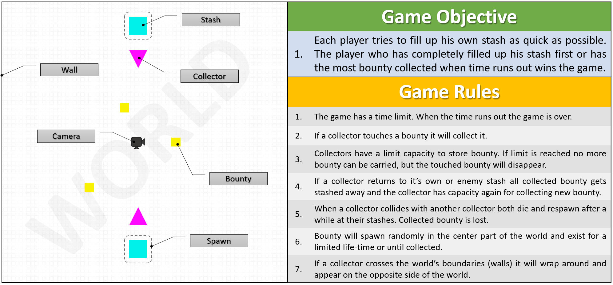
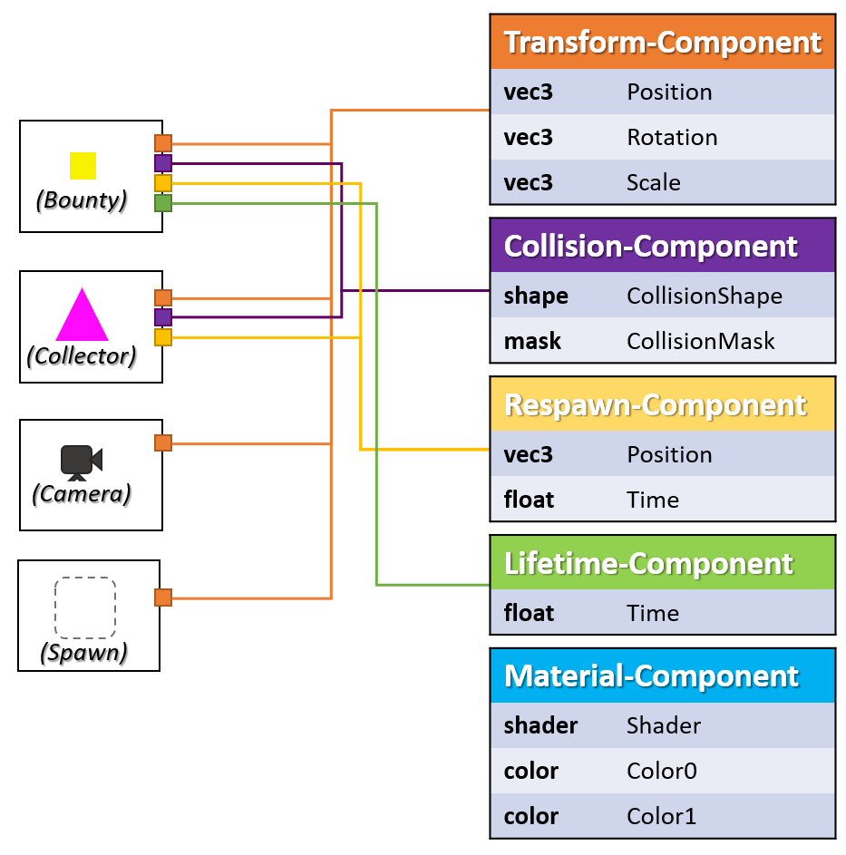
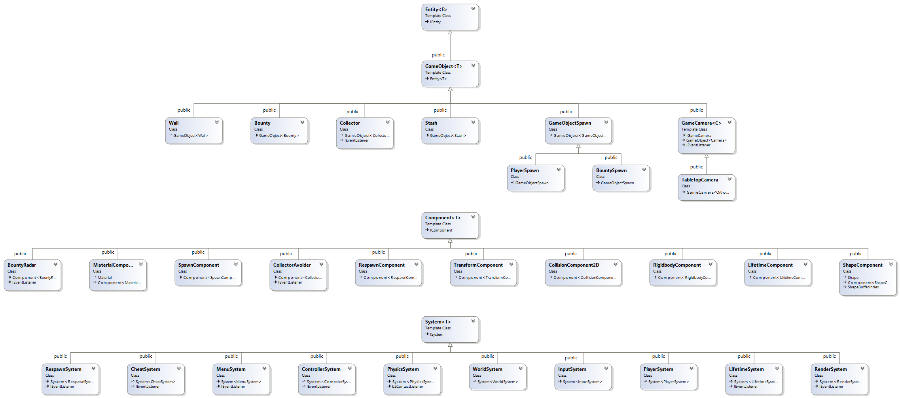

# The Entity-Component-System - BountyHunter game (Part 2)

Hey Folks :)

Welcome to part two of the series "_The Entity-Component-System_". As always you can checkout the original [post](https://tsprojectsblog.wordpress.com/2017/11/16/the-bountyhunter-game/).

Continuing writing from my last [post](The_EntityComponentSystem_An_awesome_gamedesign_pattern_in_C_Part_1.php), where I talked about the Entity-Component-System (ECS) design pattern. I now want to show you how to actually use it to build a game with it. If you not already have seen it, check out what kinda game I built with the help of my ECS.

<iframe allowfullscreen="" frameborder="0" height="360" width="640" data-src="https://www.youtube.com/embed/idYdpPCUsyg"></iframe>

I will admit this does not look much, but if you ever had build your own game without help of a big and fancy game engine, like [Unity](https://unity3d.com/) or [Unreal](http://unrealengine.com/), you might give me some credit here ;) So for the purpose of demonstrating my ECS I simply just need that much. If you still have not figured out what this game (BountyHunter) is about, let me help you out with the following picture:



Figure-01: BountyHunter objective and rules.

The picture on the left may look familiar as it is a more abstract view of the game you saw in the video clip. Focus is laid on game entities. On the right hand side you will find the game objective and rules. This should be pretty much self-explanatory. As you can see we got a bunch of entity types living in this game world and now you may wonder what they are actually made of? Well components of course. While some types of components are common for all this entities a few are unique for others. Check out the next picture.

 Figure-02: Entity and their components.

By looking at this picture you can easily see the relation between entities and their components (this is not a complete depiction!). All game entities have the _Transform-Component_ in common. Because game entities must be somewhere located in the world they have a transform, which describes the entities position, rotation and scale. This might be the one and only component attached to an entity. The camera object for instance does require more components especially not a _Material-Component_ as it will be never visible to the player (this might not be true if you would use it for post-effects). The _Bounty_ and _Collector_ entity objects on the other hand do have a visual appearance and therefore need a _Material-Component_ to get displayed. They also can collide with other objects in the game world and therefore have a _Collision-Component_ attached, which describes their physical form. The _Bounty_ entity has one more component attached to it; the _Lifetime-Component_. This component states the remaining life-time of a _Bounty_ object, when it's life-time is elapsed the bounty will fade away.

So what's next? Having all these different entities with their individual gathering of components does not complete the game. We also need someone who knows how to drive each one of them. I am talking about the systems of course. Systems are great. You can use systems to split up your entire game-logic into much smaller pieces. Each piece dealing with a different aspect of the game. There could or actually should be an _Input-System_, which is handling all the player input. Or a _Render-System_ that brings all the shapes and color onto screen. A _Respawn-System_ to respawn dead game objects. I guess you got the idea. The following picture shows a complete class-diagram of all the concrete entity, component and system types in _BountyHunter_.

 Figure-03: BountyHunter ECS class-diagram.

Now we got entities, components and system (ECS), but wait there is more.. events! To let systems and entities communicate with each other I provided a collection of 38 different events:

```
GameInitializedEvent GameRestartedEvent GameStartedEvent 
GamePausedEvent GameResumedEvent GameoverEvent GameQuitEvent 
PauseGameEvent ResumeGameEvent RestartGameEvent QuitGameEvent 
LeftButtonDownEvent LeftButtonUpEvent LeftButtonPressedEvent 
RightButtonDownEvent RightButtonUpEvent RightButtonPressedEvent
KeyDownEvent KeyUpEvent KeyPressedEvent ToggleFullscreenEvent
EnterFullscreenModeEvent StashFull EnterWindowModeEvent
GameObjectCreated GameObjectDestroyed PlayerLeft GameObjectSpawned
GameObjectKilled CameraCreated, CameraDestroyed ToggleDebugDrawEvent
WindowMinimizedEvent WindowRestoredEvent WindowResizedEvent
PlayerJoined CollisionBeginEvent CollisionEndEvent

```

And there is still more , what else did I need to make _BountyHunter_:

-   **general application framework** - [SDL2](https://www.libsdl.org/index.php) for getting the player input and setting up the basic application window.
-   **graphics** \- I used a custom OpenGL renderer to make rendering into that application window possible.
-   **math** \- for solid linear algebra I used [glm](https://glm.g-truc.net/0.9.8/index.html).
-   **collision detection** \- for collision detection I used [box2d](http://box2d.org/) physics.
-   **Finite-State-Machine** - used for simple AI and game states.

Obviously I am not going to talk about all these mechanics  as they are worth their own post, which I might do at a later point ;) But, if your are enthusiastic to get to know anyway I won't stop you and leave you with this [link](https://github.com/tobias-stein/EntityComponentSystem/tree/master/BountyHunterDemo). Looking at all the features I mentioned above you may realize that they are a good start for your own small game engine. Here are a few more things I got on my todo-list, but actually did not implement just because I wanted to get things done.

-   **Editor** - an editor managing entities, components, systems and more
-   **Savegame** - persist entities and their components into a database using some ORM library (e.g. [codesynthesis](https://www.codesynthesis.com/products/odb/))
-   **Replays** - recoding events at run-time and replay them at a later point
-   **GUI** - using a GUI framework (e.g. [librocket](https://github.com/libRocket/libRocket)) to build an interactive game-menu
-   **Resource-Manager** - synchronous and asynchronous loading of assets (textures, fonts, models etc.) through a custom resource manager
-   **Networking** - send events across the network and setup a multiplayer mode

I will leave these todo's up to you as a challenge to proof that you are an awesome programmer ;)

Finally let me provide you some code, which demonstrates the usage of the my ECS. Remember the _Bounty_ game entity? Bounties are the small yellow, big red and all in between squares spawning somewhere randomly in the center of the world. The following snipped shows the code of the class declaration of the _Bounty_ entity.

```
// Bounty.h

class Bounty : public GameObject<Bounty>
{
private:

    // cache components
    TransformComponent*   m_ThisTransform;
    RigidbodyComponent*   m_ThisRigidbody;
    CollisionComponent2D* m_ThisCollision;
    MaterialComponent*    m_ThisMaterial;
    LifetimeComponent*    m_ThisLifetime;

   // bounty class property
   float                 m_Value;

public:

    Bounty(GameObjectId spawnId);
    virtual ~Bounty();

    virtual void OnEnable() override;
    virtual void OnDisable() override;

    inline float GetBounty() const { return this->m_Value; }

    // called OnEnable, sets new randomly sampled bounty value
    void ShuffleBounty();
};
```

The code is pretty much straight forward. I've created a new game entity by deriving from _GameObject<**T**\>_ (which is derived from _ECS::Entity<**T**\>)_, with the class (_Bounty_) itself as **T**. Now the ECS is aware of that concrete entity type and a unique (static-)type-identifier will be created. We will also get access to the convenient methods _AddComponent<**U**\>_, _GetComponent<**U**\>_, _RemoveComponent<**U**\>_. Besides the components, which I show you in a second, there is another property; the bounty value. I am not sure why I did not put that property into a separate component, for instance a _BountyComponent_ component, because that would be the right way. Instead I just put the bounty value property as member into the _Bounty_ class, shame on me. But hey, this only shows you the great flexibility of this pattern, right? ;) Right, the components ...

```
// Bounty.cpp
Bounty::Bounty(GameObjectId spawnId)
{
    Shape shape = ShapeGenerator::CreateShape<QuadShape>();
    AddComponent<ShapeComponent>(shape);
    AddComponent<RespawnComponent>(BOUNTY_RESPAWNTIME, spawnId, true);

    // cache this components
    this->m_ThisTransform = GetComponent<TransformComponent>();
    this->m_ThisMaterial  = AddComponent<MaterialComponent>(MaterialGenerator::CreateMaterial<defaultmaterial>());
    this->m_ThisRigidbody = AddComponent<RigidbodyComponent>(0.0f, 0.0f, 0.0f, 0.0f, 0.0001f);
    this->m_ThisCollision = AddComponent<CollisionComponent2d>(shape, this->m_ThisTransform->AsTransform()->GetScale(), CollisionCategory::Bounty_Category, CollisionMask::Bounty_Collision);
    this->m_ThisLifetime  = AddComponent<LifetimeComponent>(BOUNTY_MIN_LIFETIME, BOUNTY_MAX_LIFETIME);
}
// other implementations ...
```

I've used the constructor to attach all the components required by the _Bounty_ entity. Note that this approach creates a prefabricate of an object and is not flexible, that is, you will always get a _Bounty_ object with the same components attached to it. Where this is a good enough solution for this game it might be not in a more complex one. In such a case you would provide a factory that produces custom tailored entity objects. As you can see in the code above there are quite a few components attached to the _Bounty_ entity. We got a _ShapeComponent_ and _MaterialComponent_ for the visual appearance. A _RigidbodyComponent_ and _CollisionComponent2D_ for physical behavior and collision response. A _RespawnComponent_ for giving _Bounty_ the ability to get respawned after death. Last but not least there is a _LifetimeComponent_ that will bind the existents of the entity on a certain amount of time. The _TransformComponent_ is automatically attached to any entity that is derived from _GameObject<**T**\>_. That's it. We've just added a new entity to the game.

Now you probably want to see how to make use of all this components. Let me give you two examples. First the _[RigidbodyComponent](https://github.com/tobias-stein/EntityComponentSystem/blob/master/BountyHunterDemo/RigidbodyComponent.h)_. This component contains information about some physical traits, e.g. friction, density or linear damping. Furthermore it functions as an adapter class which is used to in-cooperate the box2d physics into the game. The _RigidbodyComponent_ is rather important as it is used to synchronize the physics simulated body's transform (owned by box2d) and the the entities _TransformComponent_ (owned by the game). The _PhysicsSystem_ is responsable for this synchronization process.

```
// PhysicsEngine.h

class PhysicsSystem : public ECS::System<PhysicsSystem>, public b2ContactListener
{
public:
PhysicsSystem();
    virtual ~PhysicsSystem();

    virtual void PreUpdate(float dt) override;
    virtual void Update(float dt) override;
    virtual void PostUpdate(float dt) override;

    // Hook-in callbacks provided by box2d physics to inform about collisions
    virtual void BeginContact(b2Contact* contact) override;
    virtual void EndContact(b2Contact* contact) override;
}; // class PhysicsSystem
```

```
// PhysicsEngine.cpp

void PhysicsSystem::PreUpdate(float dt)
{
    // Sync physics rigidbody transformation and TransformComponent
    for (auto RB = ECS::ECS_Engine->GetComponentManager()->begin<RigidbodyComponent>(); RB != ECS::ECS_Engine->GetComponentManager()->end<RigidbodyComponent>(); ++RB)
    {
        if ((RB->m_Box2DBody->IsAwake() == true) && (RB->m_Box2DBody->IsActive() == true))
        {
            TransformComponent* TFC = ECS::ECS_Engine->GetComponentManager()->GetComponent<TransformComponent>(RB->GetOwner());
            const b2Vec2& pos = RB->m_Box2DBody->GetPosition();
            const float rot = RB->m_Box2DBody->GetAngle();

            TFC->SetTransform(glm::translate(glm::mat4(1.0f), Position(pos.x, pos.y, 0.0f)) * glm::yawPitchRoll(0.0f, 0.0f, rot) * glm::scale(TFC->AsTransform()->GetScale()));
        }
    }
}

// other implementations ...
```

From the implementation above you may have noticed the three different update functions. When systems get updated, first all _PreUpdate_ methods of all systems are called, then _Update_ and last the _PostUpdate_ methods. Since the _PhysicsSystem_ is called before any other _TransformComponent_ concerned system, the code above ensures a synchronized transform. Here you can also see the _ComponentIterator_ in action. Rather than asking every entity in the world, if it has a _RigidbodyComponent_, we ask the _ComponentManager_ to give us a _ComponentIterator_ for type _RigidbodyComponent_. Having the _RigidbodyComponent_ we easily can retrieve the entity's id and ask the _ComponentManager_ once more to give us the _TransformComponent_ for that id as well, too easy. Let's check out that second example I've promised. The [_RespawnComponent_](https://github.com/tobias-stein/EntityComponentSystem/blob/master/BountyHunterDemo/RespawnComponent.h) is used for entities which are intended to be respawned after they died. This component provides five properties which can be used to configure the entity's respawn behavior. You can decide to automatically respawn an entity when it dies, how much time must pass until it get's respawned and a spawn location and orientation. The actual respawn logic is implemented in the [_RespawnSystem_](https://github.com/tobias-stein/EntityComponentSystem/blob/master/BountyHunterDemo/RespawnSystem.h).

```
// RespawnSystem.h
class RespawnSystem : public ECS::System<RespawnSystem>, protected ECS::Event::IEventListener
{
private:

    // ... other stuff
    Spawns       m_Spawns;
    RespawnQueue m_RespawnQueue;

    // Event callbacks
    void OnGameObjectKilled(const GameObjectKilled* event);

public:

    RespawnSystem();
    virtual ~RespawnSystem();

    virtual void Update(float dt) override;

    // more ...
}; // class RespawnSystem
```

```
// RespawnSystem.cpp
// note: the following is only pseudo code!

voidRespawnSystem::OnGameObjectKilled(const GameObjectKilled * event)
{
    // check if entity has respawn ability
    RespawnComponent* entityRespawnComponent = ECS::ECS_Engine->GetComponentManager()->GetComponent<RespawnComponent>(event->m_EntityID);

    if(entityRespawnComponent == nullptr || (entityRespawnComponent->IsActive() == false) || (entityRespawnComponent->m_AutoRespawn == false))
        return;

    AddToRespawnQeueue(event->m_EntityID, entityRespawnComponent);
}

void RespawnSystem::Update(float dt)
{
    foreach(spawnable in this->m_RespawnQueue)
    {
        spawnable.m_RemainingDeathTime -= dt;
        if(spawnable.m_RemainingDeathTime <= 0.0f)
        {
            DoSpawn(spawnable);
            RemoveFromSpawnQueue(spawnable);
        }
    }
}
```

The code above is not complete, but grasps the important lines of code. The _RespawnSystem_ is holding and updating a queue of _EntityId's_ along with their _RespawnComponent's_. New entries are enqueued when the systems receives a _GameObjectKilled_ event. The system will check if the killed entity has the respawn ability, that is,  if there is a _RespawnComponent_ attached. If true, then the entity get's enqueued for respawning, else it is ignored. In the _RespawnSystem's_ update method, which is called each frame, the system will decrease the initial respawn-time of the queued entitys' _RespawnComponents_' (not sure if I got the single quotes right here?). If a respawn-time drops below zero, the entity will be respawned and removed from the respawn queue.

I know this was a quick tour, but I hope I could give you a rough idea how things work in the ECS world. Before ending this post I want to share some more of my own experiences with you. Working with my ECS was much a pleasure. It is so surprisingly easy to add new stuff to the game even third-party libraries. I simply added new components and systems, which would link the new feature into my game. I never got the feeling being at a dead end. Having the entire game logic split up into multiple systems is intuitive and comes for free using an ECS. The code looks much cleaner and becomes more maintainable as all this pointer-spaghetti-dependency-confusion is gone. Event sourcing is very powerful and helpful for inter system/entity/... communication, but it is also a double bleeding edge and can cause you some trouble eventually. I am speaking of event raise conditions. If you have ever worked with Unity's or Unreal Engine's editor you will be glad to have them. Such editors definitely boost your productivity as your are able to create new ECS objects in much less time than hacking all these line of code by hand. But once you have setup a rich foundation of entity, component, system and event objects it is almost child's play to plug them together and build something cool out of them. I guess I could go on and talk a while longer about how cool ECS's are, but I will stop here.

Thanks for swinging by and making it this far :)

Cheers, Tobs.


#### Source
https://www.gamedeveloper.com/design/the-entity-component-system---bountyhunter-game-part-2-