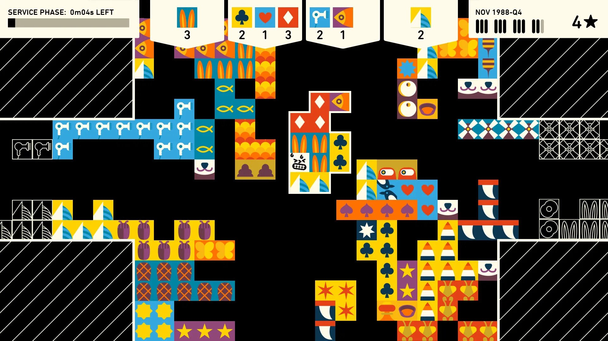

# Why community managers are a crucial connection between players and developers
_The job involves a lot more than just tweeting
By Jay Castello Apr 1, 2020, 11:55am EDT_

“Games aren’t just a product anymore…they’re now communities.” Victoria Tran does community management for Kitfox Games, which has previously published games like _Dwarf Fortress_ and is currently developing a handful more, including _Boyfriend Dungeon_. It’s a crucial role in an era where game companies have a direct connection to their players through large social media presences and chat communities. Community managers are often responsible for collecting feedback; advising developers and coordinating on update and marketing strategies; and building whole spaces from the ground up for fans to interact. It’s a job that involves a lot more than just tweeting.

“The bit \[players\] can see, it’s the tip of the iceberg,” says Grace Carroll, a community and social media manager at _Total War_ developer Creative Assembly. “Games are, above all, really made for players to enjoy - so it’s important to have the voice of the community within the studio. \[But\] we’re also working on strategies, reporting, advising, and the vast majority of our job encompasses more than just being the go-between - as important as that bit can be!”

“I tell people who are uninitiated that community management is essentially PR for the customers you already have,” explains Harris Foster, the community manager at collaborative game studio Finji, known for games like _Wilmot’s Warehouse_ and the upcoming _Tunic_. “Connecting with your existing customers, providing support to them, and being an open ear…being the throughline from developer to player.”

To be effective, community managers have to be wherever the communities are, which means being active on a lot of social media platforms. “The first thing \[I do every day\] is catch up on anything I might have missed overnight,” says Carroll. “I’ll read our subreddit, Twitter, Facebook, and various other platforms.” It’s not possible to respond to everything, but keeping informed allows these community managers to spot trends, which they can then feed back to developers.

Foster says that, after going through social media, he usually turns to fielding requests from enthusiast press and streamers before spending a large part of the day creating social media promotions for Finji’s games. “For lack of a better word, I’ll be making internet memes,” he adds.

_Tunic._

But he also emphasizes that community management is about more than a constant sales pitch. “We have a Discord \[server\] as well, which I’m super proud of,” he says. “We wanted it to be a place where our fans could connect with us, \[not\] this ivory tower setting. … We are just in there as ourselves, and not as our company, for the most part. At the end of the day, yes, this is a marketing tool that we are using to keep people invested in our games, but for a lot of us it is also our place to share memes and chat about things that are going on in our lives.” To demonstrate, he reads an enthusiastic message from a fan about their breakfast waffles. (The server actually has a channel dedicated to baking, with the title “ALL BREDD ALL THE TIME.” There are some very skilled bakers present.)

Sometimes, the Discord receives new members who aren’t yet acquainted with its laid-back style. Finji is currently publishing _Tunic_, an action-adventure game about an adorable fox with a tiny sword. It’s being made by a single developer, Andrew Shouldice, which is an understandably lengthy process. Fans often want to get a release date, and some are more polite about asking than others.

“We’ll occasionally have someone drop in and be like ‘Yo, tick tock, where’s _Tunic_? I’ve been waiting forever,’” says Foster. “And it’ll get, not shut down in a rude way, but people who have already been in \[the Discord server\] for a while will be like ‘yeah, no, we’re all waiting, you’re harshing our vibe, just chill out and hang out with us and be cool.’”

The server is moderated by Foster, other Finji developers, and some volunteers they know personally, but Foster says it approaches self-policing. He says they rarely have reason to ban anyone because the relaxed atmosphere attracts like-minded participants. “People who come in seem to get it, and if you don’t get it, you’re out pretty quick.”

Building these sorts of communities for kindness from the ground up is something that Tran is very invested in. (She was planning to give a talk on it at GDC this year before its cancellation.) “If you’re a community manager, you’re the one that gets to design your own little social system,” she says.

 

_Total War: Three Kingdoms._

She and Foster both discuss the importance of rules and how to get around what Foster calls “rules lawyering” — people arguing against the obvious spirit of the rules or looking for loopholes to excuse their behavior. But they have different approaches to this similar goal.

Foster says that the Finji Discord server rules deliberately blend specificity and vagueness. The main ones include phrases like “be friendly” and “use common sense,” and while they’re then explained in a little more detail (“any kind of harassment, abuse, speculation or hate speech will not be tolerated under any circumstance,”) they offer Finji the flexibility to evict anyone who is disruptive. “Because we’re not an online service, we’re not charging a subscription, we are just indie games, being in our Discord is a privilege rather than a right,” says Foster. “\[We\] offer this place out of fun, not out of necessity…we have more important things to do like develop games than argue about rules.”

Tran prefers specificity. “If you say ‘be nice, don’t be a dick,’ then someone’s gonna act like a dick and \[claim\] ‘I wasn’t technically being a dick because this, this, and this.’ So you want to be specific about that. Rules basically set the tone for how the community interacts; they see where your stance is from the very beginning.” She also notes that rule-breakers who aren’t obvious trolls often respond well to one-on-one interaction explaining why their behavior was unacceptable because it promotes understanding and respect. “A lot of the time…they become advocates for your community.”

Carroll emphasizes that there is no one-size-fits-all approach to ensuring communities remain safe and positive spaces. Encouraging that sort of behavior requires flexibility, and adapting to the different community’s quirks, so it’s perhaps not surprising that Tran and Foster have differing approaches.

Another key, says Tran, is for the community manager to set expectations with their own behavior. First, they need to build trust by becoming part of the community themselves and proving they’re not just “there to throw marketing stuff at \[players.\]” But being an authority figure also means community managers can set the tone. “The way you interact and the jokes you make become the acceptable way of communicating within the community. If you make a kind of spicy joke, people are going to \[assume\] that’s fine. And then if you start chiding people for that they are going to get mad at you because you look like a hypocrite.”

 

_Dwarf Fortress._

She says it’s also crucial to set boundaries. Though she says she loves chatting with fans, she makes sure they know that she’s working, and her hours are 9AM to 5PM, unless she happens to feel like dropping in in the evening. There are also players who want support that Tran can’t provide. “It’s not just the trolls that are really difficult to deal with, it’s the fact that a lot of people with very personal issues, they might be lonely, in times like this they’re very nervous and very paranoid, they might lean on you for a very therapy-like relationship,” she explains. “\[It can be\] very difficult and taxing, and we’re not professionals, we shouldn’t be giving out therapy.” But enforcing those boundaries again promotes a positive community. “If they don’t respect you, they won’t respect each other.”

Finally, Tran explains that to create “a sense of home,” community managers need to do more than put across a friendly tone in social media posts or open up a Discord. “I think a lot of people confuse just being able to talk to someone with connection and that isn’t the same thing,” she says. To facilitate more meaningful discussions, the Kitfox Discord server has areas sectioned off for smaller groups within the whole to reduce the density and create real bonds between players who get to talk often on topics they’re all more interested in.

But outside of the spaces carefully created by Foster, Tran, and others, community managers are something of a buffer between developers and players who may not always interact with kindness. “People will be a little more direct on social media,” says Foster. “\[For example\], we’ve put out a couple of games since publicly announcing _Tunic_ as a Finji game. So we’ll do a post excited about _Overland_ or _Wilmot’s Warehouse_. And the comments will be like ‘oh who cares, hurry up with _Tunic_.’”

He says that explaining how Finji operates — “that this game existing is not cutting into the existence of _Tunic_ at all” — and pointing them toward available information like _Tunic_’s mailing list ultimately says it doesn’t bother him much. But he also notes that not every community manager “is going to be as lucky.” Those working on massive online games have a different crowd to work with. “My previous job was doing customer support for an MMO company, and it’s such a stark contrast,” he says. “I always thought it was a joke whenever people would say it, but the day came when I did receive a death threat. People wanted free stuff in a game and found our office on Google Maps and were like ‘here’s the parking garage outside your office, I will stand up here with a sniper rifle and shoot you as you come out of the building.’”

 

_Wilmot’s Warehouse._

Carroll similarly says that “although there can be some \[negativity\] there,” her experience is generally positive. She explains that tension often comes from players not understanding the ways in which game development works and asking for impossible things as a result. “That doesn’t mean their perceived problems aren’t valid,” she notes. But when Creative Assembly has worked hard to come up with a compromise that is actually feasible and players still aren’t happy, “it can be difficult.”

“Communication is always the answer, as a lot of negativity revolves around people not feeling listened to, in my experience,” she says. “However, it’s important not to allow yourself to be a punching bag, and if people are being negative without being constructive, don’t be afraid to remove them from the space.”

“I’m sure everyone has different coping strategies \[for negative interactions\],” says Tran. She explains that, if she needs to, she often takes time away from her computer to reset. (“My work knows this!” she laughs.) She does note that this isn’t necessarily possible for people with less understanding bosses; in other jobs, she’s used bathroom breaks as an excuse to get some breathing space. Outside of work, she recommends having friends who aren’t involved in the games industry. “Being able to just message a friend and talk about literally anything but games is nice because it helps to put things into perspective.”

Overall, says Carroll, community management is about making sure that players and developers are on the same page. “If a studio is disconnected from their players - or vice versa - then it can lead to a lack of understanding of the others’ needs, which means that neither is getting what they want out of the game,” she says.

“I think community management brings a lot of compassion into technology,” says Tran. “It reminds everyone of the human aspect of games… \[that\] they’re places where people make friends and learn new things.”

“If your games get successful, you will have a community, period,” Foster points out. “So my job exists to make life easier.”

Source: https://www.theverge.com/2020/4/1/21202748/community-managers-video-game-development-reddit-discord-twitter