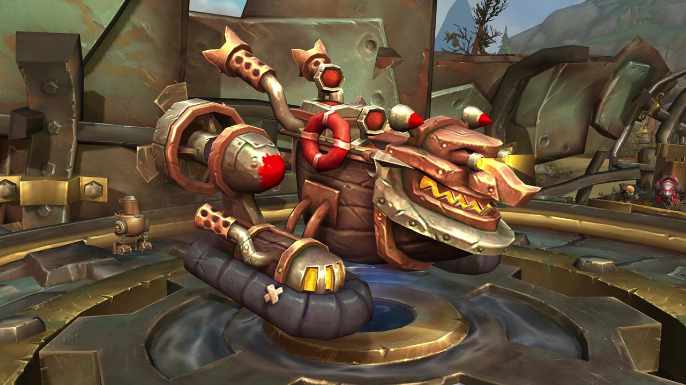
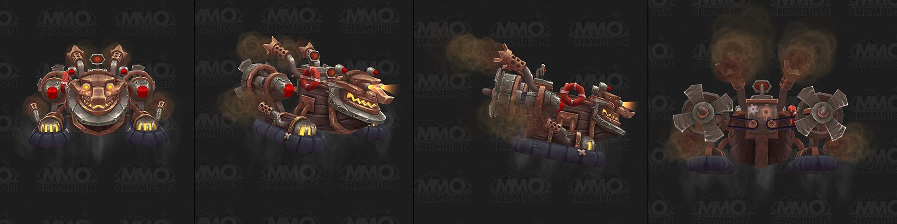

# Xiwyllag ATV

Xiwyllag ATV is a new customizable mount added in Patch 8.2 Rise of Azshara. Similar to the X-995 Mechanocat, you can unlock paint colors for it by completing different activities on the Mechagon Island.

Since [Xiwyllag ATV](https://www.wowdb.com/items/153594-xiwyllag-atv)'s paint colors are untrackable, unlike [X-995 Mechanocat](https://www.wowdb.com/spells/294143-x-995-mechanocat)'s paint colors in the achievement [Available in Eight Colors](https://www.wowdb.com/achievements/13513-available-in-eight-colors), we consider them secret collectibles and therefore we have added them in our [Secrets Database](https://warcraft-secrets.com/secrets).

## Acquiring Xiwyllag ATV

You can get the [Xiwyllag ATV](https://www.wowdb.com/items/153594-xiwyllag-atv) mount by purchasing it from the Auction House or by crafting these items: [Super-Charged Engine](https://www.wowdb.com/items/158886-super-charged-engine) and [Monelite Reinforced Chassis](https://www.wowdb.com/items/158887-monelite-reinforced-chassis).

If you have engineering or blacksmithing then you can farm [Schematic: Super-Charged Engine](https://www.wowdb.com/items/169609-schematic-super-charged-engine) and [Recipe: Monelite Reinforced Chassis](https://www.wowdb.com/items/169529-recipe-monelite-reinforced-chassis) from [K.U.-J.0.](https://www.wowdb.com/npcs/144246-k-u-j-0) in the dungeon Operation: Mechagon.

## Xiwyllag ATV Secret Paint Colors

There are three paint colors that you can unlock for the [Xiwyllag ATV](https://www.wowdb.com/items/153594-xiwyllag-atv) mount:

-   [Paint Bottle: Nukular Red](https://www.wowdb.com/items/170146-paint-bottle-nukular-red)
-   [Paint Bottle: Goblin Green](https://www.wowdb.com/items/170147-paint-bottle-goblin-green)
-   [Paint Bottle: Electric Blue](https://www.wowdb.com/items/170148-paint-bottle-electric-blue)

Once unlocked you can paint the [Xiwyllag ATV](https://www.wowdb.com/items/153594-xiwyllag-atv) by talking with [Kram Kelada](https://www.wowdb.com/npcs/155874-kram-kelada) in Bondo's Yard.

`/way 63.0 41.9 Kram Kelada`

  

## Paint Bottle: Nukular Red

You can find [Paint Bottle: Nukular Red](https://www.wowdb.com/items/170146-paint-bottle-nukular-red) inside [Irontide Lockboxes](https://www.wowdb.com/objects/330183-irontide-lockbox).

`/way 19.0 80.8   /way 23.3 56.9   /way 25.3 69.0   /way 25.6 76.1   /way 30.7 59.7`

To open the [Irontide Lockbox](https://www.wowdb.com/objects/330183-irontide-lockbox) you will need an [Irontide Lockbox Key](https://www.wowdb.com/items/169872-irontide-lockbox-key) which has a chance to drop from [Chief Curglrrmrgur](https://www.wowdb.com/npcs/154491-chief-curglrrmrgur) and the murlocs next to him.

`/way 16.2 85 Chief Curglrrmrgur`

Note that you can only get one key per day, and if you get an [Old Rusty Key](https://www.wowdb.com/items/169218-old-rusty-key) or a [Mechanized Supply Key](https://www.wowdb.com/items/169873-mechanized-supply-key) then you'll not be able to loot the [Irontide Lockbox Key](https://www.wowdb.com/items/169872-irontide-lockbox-key) that day.

## Paint Bottle: Goblin Green

You can find [Paint Bottle: Goblin Green](https://www.wowdb.com/items/170147-paint-bottle-goblin-green) inside [Mechanized Chests](https://www.wowdb.com/objects/325663-mechanized-chest) from Mechagon's Alternate Future.

To get to Mechagon's Alternate Future for the first time you will have to talk to Chromie at coordinates **70 31** in Mechagon when she is up as a daily visitor. If you've been to Mechagon's Alternate Future before and have obtained the [Blueprint: Personal Time Displacer](https://www.wowdb.com/items/168491-blueprint-personal-time-displacer) (random drop from npcs there), then you can craft and use a [Personal Time Displacer](https://www.wowdb.com/items/169114-personal-time-displacer) to travel to the alternate future of Mechagon.

There are five locations for this chest and once you have looted one, you will be unable to loot another one until the next day.

`/way 56.7 57.5   /way 58.8 41.7   /way 61.6 32.5   /way 64.5 59.6   /way 70.6 47.8`

## Paint Bottle: Electric Blue

You can find [Paint Bottle: Electric Blue](https://www.wowdb.com/items/170148-paint-bottle-electric-blue) inside [Small Metal Boxes](https://www.wowdb.com/items/168204-small-metal-box). To get these boxes you'll have to use the [Rare Metal Collector](https://www.wowdb.com/items/168183-rare-metal-collector) during the daily quest [One Gnome's Trash](https://www.wowdb.com/quests/55575-one-gnomes-trash) from [Moxie Lockspinner](https://www.wowdb.com/npcs/152499-moxie-lockspinner).

Note that the chances to find [Small Metal Boxes](https://www.wowdb.com/items/168204-small-metal-box) or the [Paint Bottle: Electric Blue](https://www.wowdb.com/items/170148-paint-bottle-electric-blue) are pretty low, it might take you a few hours to get it.

Make sure not to complete the quest as you will lose the [Rare Metal Collector](https://www.wowdb.com/items/168183-rare-metal-collector). Objectives also disappear so check the map below for the quest locations.

