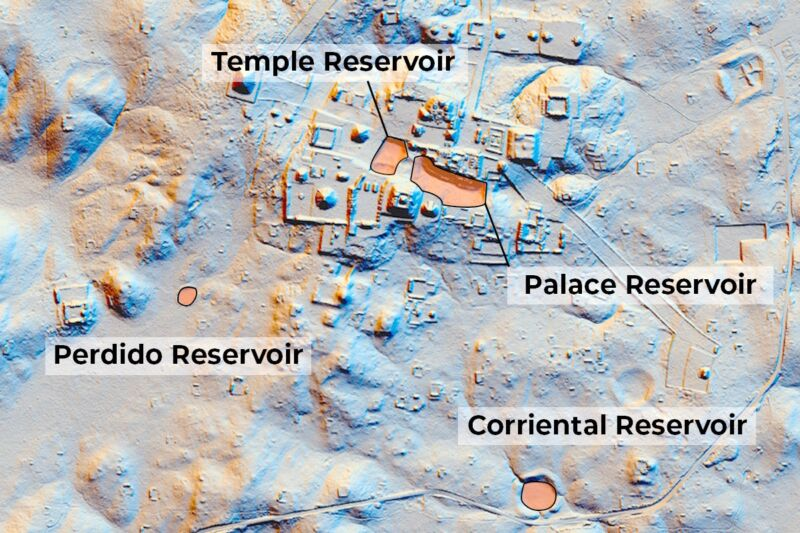
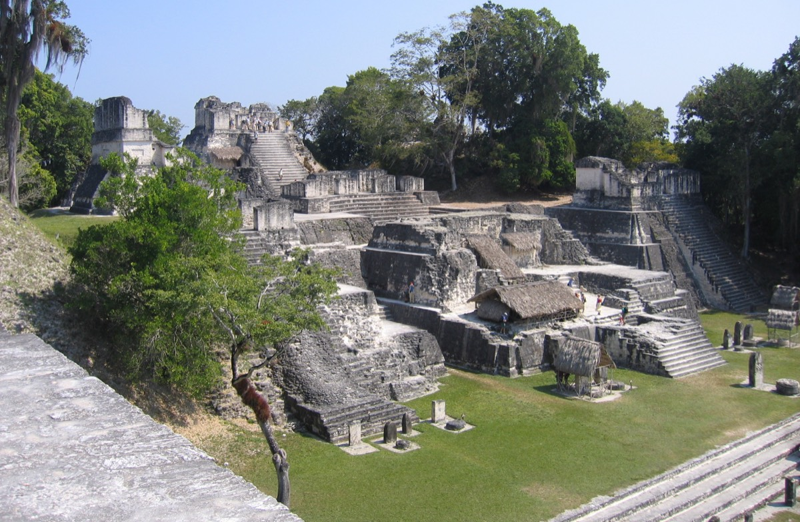
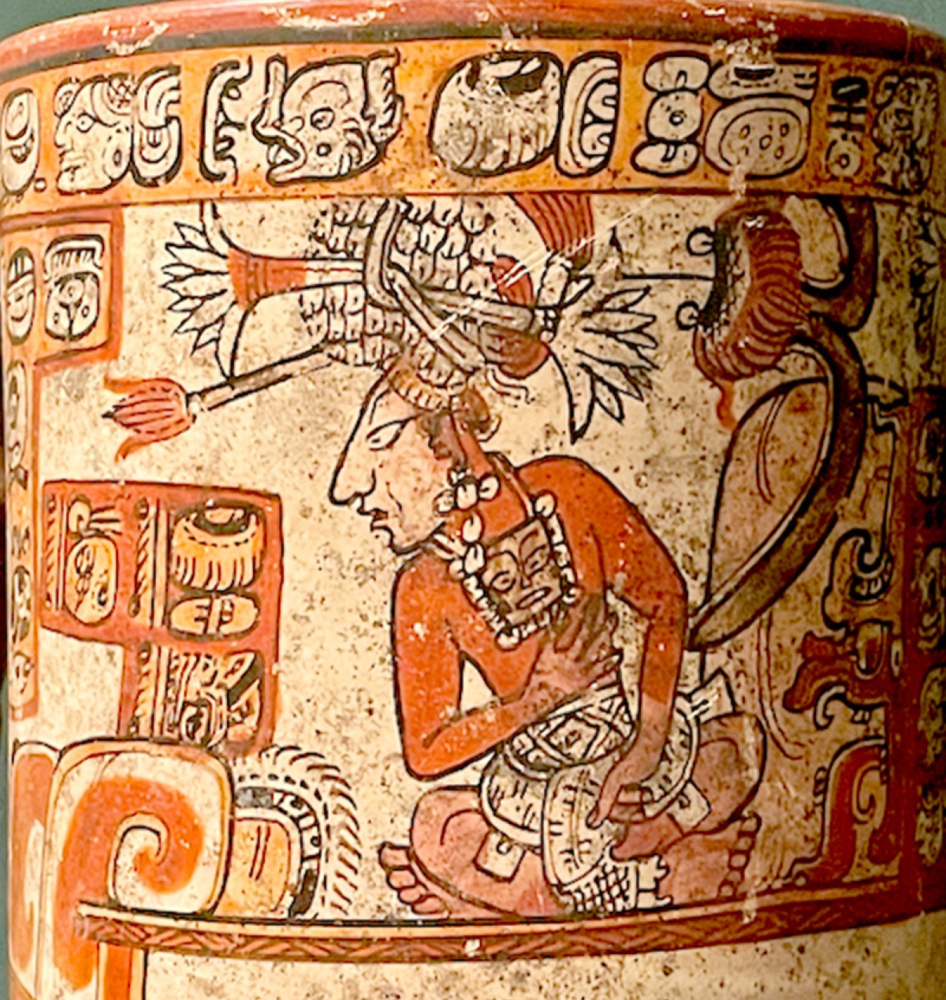

# Maya reservoirs relied on aquatic plants like water lilies to help keep water clean

## Aquatic biota essentially served as self-cleaning "constructed wetlands."

*Jennifer Ouellette - 10/9/2023, 9:00 PM*

*Image adapted Tankersley et al. 2020*

The ancient Maya city of [Tikal](https://en.wikipedia.org/wiki/Tikal) relied on urban reservoirs to supply water during periods of drought. They essentially built ["constructed wetlands"](https://www.epa.gov/wetlands/constructed-wetlands#:~:text=Constructed%20wetlands%20are%20treatment%20systems,assemblages%20to%20improve%20water%20quality.) that relied upon key minerals and aquatic plants and other biota to keep the water supply potable, a "self-cleaning" approach similar to that employed in constructed wetlands today, according to a new [paper](https://www.pnas.org/cgi/doi/10.1073/pnas.2306870120) published in the Proceedings of the National Academy of Sciences.

“Most major southern lowland Maya cities emerged in areas that lacked surface water but had great agricultural soils,” [said author Lisa Lucero](https://www.eurekalert.org/news-releases/1003855?), an anthropologist at the University of Illinois Urbana-Champaign. “They compensated by constructing reservoir systems that started small and grew in size and complexity.”

Like many Maya cities, Tikal was built on top of porous limestone, which limited access to drinking water during the seasonal droughts, which typically lasted five months, although more severe droughts also occurred, particularly in the ninth century CE. So the people of Tikal relied on collecting rainwater stored in reservoirs to survive. They quarried the limestone for bricks, mortar, and plaster, all used to construct buildings on site. The resulting depressions were plastered to waterproof them as reservoirs. Eventually, the Maya built a system of canals, dams, and sluices to store and transport water. It's estimated that Tikal's reservoirs could hold as much as 900,000 cubic meters of water for a population of up to 80,000 people between 600 to 800 CE.

However, any standing pool of water is prone to stagnation and the growth of algae blooms, as well as serving as breeding grounds for disease-carrying mosquitos. The Maya came up with ingenious solutions to keep their potable water fresh. Alas, despite these innovations, prolonged drought between 800 and 930 CE—ranging from three to eight years in duration, further exacerbated by intense tropical storms and hurricanes—likely contributed to the Maya abandonment of Tikal and other cities. Residents formed smaller communities near rivers, lakes, and coasts, per Lucero, as well as cities in the northern lowlands and highlands of Guatemala.

[One 2020 study](https://pubmed.ncbi.nlm.nih.gov/32587274/) found that two central reservoirs in Tikal held water that was probably undrinkable due to toxic pollution levels. University of Cincinnati researchers conducted a geochemical analysis of reservoir sediments and found toxic levels of mercury as well as an algae called cyanobacteria that produce toxic chemicals resistant even to boiling. Drinking that water would have made residents very sick. The team concluded that the residents likely got their potable water from two more distant reservoirs, Perdido and Corriental, where they found no evidence of mercury or cyanobacteria. They also determined the source of the mercury contamination: the cinnabar used to paint plaster murals, clay vessels, and other objects.

*Peter Andersen/CC BY 2.5*

The team's [follow-up study](https://www.nature.com/articles/s41598-020-75023-7) that same year used X-ray diffraction analysis to reveal evidence of a filter system at the Corriental reservoir, identifying crystalline quartz and zeolite in the sediments that would have acted like a natural molecular sieve—in fact, both are used today for water filtration purposes. The quartz and zeolite would have removed heavy metals like mercury and other toxins from the reservoir's water supply, including harmful microbes. It's likely that the Maya imported the quartz and zeolite from another site rich in those substances roughly 18 miles away, known to locals for its clean and sweet water. Samples taken from Tikal matched samples taken from the site, confirming it as a likely source.

In her latest paper, Lucero points out that zeolite is typically found in volcanic deposits in highland Guatemala and would not have been readily available to residents of the southern lowlands. This might explain why the Corriental reservoir is the only one of the 50 Maya reservoirs excavated or cored thus far to have a zeolite-based filtration system. She suggests that the Maya also used a diverse array of aquatic plants to keep their water clean, much like today's constructed wetlands—specifically cattails, sedges, reeds, bamboo, and water lilies. Lucero based this suggestion on evidence gleaned from archaeological excavations, settlement maps, sediment cores, current wetlands, and iconographic and hieroglyphic records.

The water lily (Nymphaea ampla) is especially prevalent, prompting many Maya archaeologists to conclude that these plants were crucial for maintaining clean water by uptaking nutrients like nitrogen and phosphorus. Water lily pads also block sunlight and prevent the buildup of too much algae; inhibit evaporation; keep water cool; and provide cover for dragonflies, fish, and turtles that feed on pesky mosquitoes and their larvae.

*Courtesy the Boston Museum of Fine Arts*

Lucero pointed out that water lilies only grow in clean water and cannot tolerate acidic conditions or thrive in water with too much calcium, iron, or manganese. They also can't thrive if the bottom sediment has too much decomposing organic matter. The Maya practice of lining their reservoirs would have stabilized pH levels, particularly if the Maya also added soil or exploited naturally occurring sediment to ensure water lilies and other beneficial biota could thrive. They probably had to dredge every year, per Lucero, and harvest and replenish the aquatic plants, using the removed nutrient-rich soils and plants to fertilize fields and gardens.

So the presence of water lilies in a reservoir would indicate clean, potable water, according to Lucero, and water lily pollen has been found in sediment cores from several Maya reservoirs. They were also a symbol of classic Maya kings, with many kings donning water lily headdresses to represent their vital role as water managers. "Clean water and political power were inextricably linked, as demonstrated by the fact that the largest reservoirs were built near palaces and temples," Lucero wrote.

Lucero ended her paper with a call to diversify our current means of providing clean water rather than relying too much on a single source, like reservoirs. "The evidence suggests that ancient Maya reservoirs supplied potable water as constructed wetlands for over 1,000 years," Lucero concluded. "The Maya relied on diverse practices to spread risk, including those they used to maintain water quality (acolyte and sand filtration, aquatic plants, and those currently unknown). Their enduring history embodies lessons for current and future water management practices in tropical areas and beyond. In fact, if we could determine exactly how Maya reservoirs functioned, we may be able to improve current and future constructed wetlands."

PNAS, 2023. DOI: [10.1073/pnas.2306870120](http://dx.doi.org/10.1073/pnas.2306870120)  ([About DOIs](http://arstechnica.com/science/news/2010/03/dois-and-their-discontents-1.ars)).

[Jennifer Ouellette](https://arstechnica.com/author/jenniferouellette) is a senior reporter at Ars Technica with a particular focus on where science meets culture, covering everything from physics and related interdisciplinary topics to her favorite films and TV series. Jennifer lives in Baltimore with her spouse, physicist Sean M. Carroll, and their two cats, Ariel and Caliban.

Source: [Ars Technica: Maya reservoirs relied on aquatic plants like water lilies to help keep water clean](https://arstechnica.com/science/2023/10/maya-reservoirs-relied-on-aquatic-plants-like-water-lilies-to-help-keep-water-clean/)