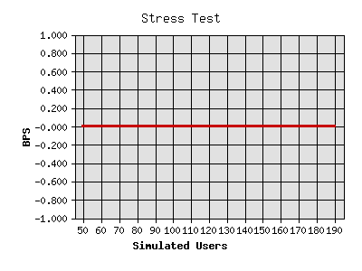
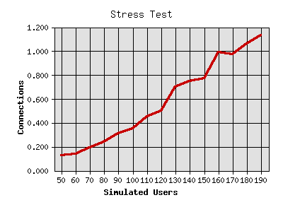
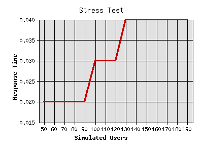
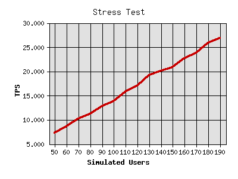

# API-Performance Messen

## Siege

```
siege - f siegeurls.txt
```

Default 
	• 25 concurrent Users

```
insulae@janhkrueger ~ $ siege --concurrent=25 --time=5m --file=siegeurls.txt --benchmark
	** SIEGE 4.0.2                                                                                                                                                                                                     
	** Preparing 25 concurrent users for battle.                                                                                                                                                                       
	The server is now under siege...                                                                                                                                                                                   
	Lifting the server siege...                                                                                                                                                                                        
	Transactions:                  93269 hits                                                                                                                                                                          
	Availability:                 100.00 %                                                                                                                                                                             
	Elapsed time:                 299.96 secs                                                                                                                                                                          
	Data transferred:              33.18 MB                                                                                                                                                                            
	Response time:                  0.08 secs                                                                                                                                                                          
	Transaction rate:             310.94 trans/sec                                                                                                                                                                     
	Throughput:                     0.11 MB/sec                                                                                                                                                                        
	Concurrency:                   24.98                                                                                                                                                                               
	Successful transactions:       93269                                                                                                                                                                               
	Failed transactions:               0                                                                                                                                                                               
	Longest transaction:            0.15                             
```

## Bombard
Bombard ist ein Wrapper für siege welcher mit eine Adresse mit einer steigenden Anzahl an Verbindungen bearbeitet.


Beispiel
```
bombard -f /home/insulae/siegeurls.txt -s50 -i10 -r10 -t1
```

• starting concurrency 50
• increment 10
• runs 10 times  (so it will try 50, 60, 70, 80, ..., 140)
• each run will take 1 minute

Mit der aktuellen Einstellung entstehen im Ordner ~/insulae-log/[LAUFDATUM] entsprechende Berichte.

```
insulae@janhkrueger ~ $ bombard -f /home/insulae/siegeurls.txt -s50 -i10 -r10 -t1                                                                                                                                  
** SIEGE 4.0.2                                                                                                                                                                                                     
** Preparing 50 concurrent users for battle.                                                                                                                                                                       
The server is now under siege...                                                                                                                                                                                   
Lifting the server siege...                                                                                                                                                                                        
Transactions:                    451 hits                                                                                                                                                                          
Availability:                 100.00 %                                                                                                                                                                             
Elapsed time:                  59.89 secs                                                                                                                                                                          
Data transferred:               0.16 MB                                                                                                                                                                            
Response time:                  0.02 secs                                                                                                                                                                          
Transaction rate:               7.53 trans/sec                                                                                                                                                                     
Throughput:                     0.00 MB/sec                                                                                                                                                                        
Concurrency:                    0.12                                                                                                                                                                               
Successful transactions:         451                                                                                                                                                                               
Failed transactions:               0                                                                                                                                                                               
Longest transaction:            0.17                                                                                                                                                                               
Shortest transaction:           0.00                                                                                                                                                                               

** SIEGE 4.0.2                                                                                                                                                                                                     
** Preparing 60 concurrent users for battle.                                                                                                                                                                       
The server is now under siege...                                                                                                                                                                                   
Lifting the server siege...                                                                                                                                                                                        
Transactions:                    517 hits                                                                                                                                                                          
Availability:                 100.00 %                                                                                                                                                                             
Elapsed time:                  59.97 secs                                                                                                                                                                          
Data transferred:               0.19 MB                                                                                                                                                                            
Response time:                  0.02 secs                                                                                                                                                                          
Transaction rate:               8.62 trans/sec                                                                                                                                                                     
Throughput:                     0.00 MB/sec                                                                                                                                                                        
Concurrency:                    0.16                                                                                                                                                                               
Successful transactions:         517                                                                                                                                                                               
Failed transactions:               0                                                                                                                                                                               
Longest transaction:            0.20                                                                                                                                                                               
Shortest transaction:           0.00                                                                                                                                                                               

** SIEGE 4.0.2                                                                                                                                                                                                     
** Preparing 70 concurrent users for battle.                                                                                                                                                                       
The server is now under siege...                                                                                                                                                                                   
Lifting the server siege...                                                                                                                                                                                        
Transactions:                    620 hits                                                                                                                                                                          
Availability:                 100.00 %                                                                                                                                                                             
Elapsed time:                  59.96 secs                                                                                                                                                                          
Data transferred:               0.22 MB                                                                                                                                                                            
Response time:                  0.02 secs                                                                                                                                                                          
Transaction rate:              10.34 trans/sec                                                                                                                                                                     
Throughput:                     0.00 MB/sec                                                                                                                                                                        
Concurrency:                    0.20                                                                                                                                                                               
Successful transactions:         620                                                                                                                                                                               
Failed transactions:               0                                                                                                                                                                               
Longest transaction:            0.24                                                                                                                                                                               
Shortest transaction:           0.00                                                                                                                                                                               

** SIEGE 4.0.2                                                                                                                                                                                                     
** Preparing 80 concurrent users for battle.                                                                                                                                                                       
The server is now under siege...                                                                                                                                                                                   
Lifting the server siege...                                                                                                                                                                                        
Transactions:                    704 hits                                                                                                                                                                          
Availability:                 100.00 %                                                                                                                                                                             
Elapsed time:                  59.95 secs                                                                                                                                                                          
Data transferred:               0.25 MB                                                                                                                                                                            
Response time:                  0.02 secs                                                                                                                                                                          
Transaction rate:              11.74 trans/sec                                                                                                                                                                     
Throughput:                     0.00 MB/sec                                                                                                                                                                        
Concurrency:                    0.25                                                                                                                                                                               
Successful transactions:         704                                                                                                                                                                               
Failed transactions:               0                                                                                                                                                                               
Longest transaction:            0.27                                                                                                                                                                               
Shortest transaction:           0.00                                                                                                                                                                               

** SIEGE 4.0.2                                                                                                                                                                                                     
** Preparing 90 concurrent users for battle.                                                                                                                                                                       
The server is now under siege...                                                                                                                                                                                   
Lifting the server siege...                                                                                                                                                                                        
Transactions:                    774 hits                                                                                                                                                                          
Availability:                 100.00 %                                                                                                                                                                             
Elapsed time:                  59.95 secs                                                                                                                                                                          
Data transferred:               0.28 MB                                                                                                                                                                            
Response time:                  0.02 secs                                                                                                                                                                          
Transaction rate:              12.91 trans/sec                                                                                                                                                                     
Throughput:                     0.00 MB/sec                                                                                                                                                                        
Concurrency:                    0.29                                                                                                                                                                               
Successful transactions:         774                                                                                                                                                                               
Failed transactions:               0                                                                                                                                                                               
Longest transaction:            0.28                                                                                                                                                                               
Shortest transaction:           0.00                                                                                                                                                                               

** SIEGE 4.0.2                                                                                                                                                                                                     
** Preparing 100 concurrent users for battle.                                                                                                                                                                      
The server is now under siege...                                                                                                                                                                                   
Lifting the server siege...                                                                                                                                                                                        
Transactions:                    849 hits                                                                                                                                                                          
Availability:                 100.00 %                                                                                                                                                                             
Elapsed time:                  59.96 secs                                                                                                                                                                          
Data transferred:               0.31 MB                                                                                                                                                                            
Response time:                  0.03 secs                                                                                                                                                                          
Transaction rate:              14.16 trans/sec                                                                                                                                                                     
Throughput:                     0.01 MB/sec                                                                                                                                                                        
Concurrency:                    0.37                                                                                                                                                                               
Successful transactions:         849                                                                                                                                                                               
Failed transactions:               0                                                                                                                                                                               
Longest transaction:            0.33                                                                                                                                                                               
Shortest transaction:           0.00                                                                                                                                                                               

** SIEGE 4.0.2                                                                                                                                                                                                     
** Preparing 110 concurrent users for battle.                                                                                                                                                                      
The server is now under siege...                                                                                                                                                                                   
Lifting the server siege...                                                                                                                                                                                        
Transactions:                    943 hits                                                                                                                                                                          
Availability:                 100.00 %                                                                                                                                                                             
Elapsed time:                  59.97 secs                                                                                                                                                                          
Data transferred:               0.34 MB                                                                                                                                                                            
Response time:                  0.03 secs                                                                                                                                                                          
Transaction rate:              15.72 trans/sec                                                                                                                                                                     
Throughput:                     0.01 MB/sec                                                                                                                                                                        
Concurrency:                    0.43                                                                                                                                                                               
Successful transactions:         943                                                                                                                                                                               
Failed transactions:               0                                                                                                                                                                               
Longest transaction:            0.37                                                                                                                                                                               
Shortest transaction:           0.00                                                                                                                                                                               

** SIEGE 4.0.2                                                                                                                                                                                                     
** Preparing 120 concurrent users for battle.                                                                                                                                                                      
The server is now under siege...                                                                                                                                                                                   
Lifting the server siege...                                                                                                                                                                                        
Transactions:                   1013 hits                                                                                                                                                                          
Availability:                 100.00 %                                                                                                                                                                             
Elapsed time:                  59.96 secs                                                                                                                                                                          
Data transferred:               0.37 MB                                                                                                                                                                            
Response time:                  0.03 secs                                                                                                                                                                          
Transaction rate:              16.89 trans/sec                                                                                                                                                                     
Throughput:                     0.01 MB/sec                                                                                                                                                                        
Concurrency:                    0.52                                                                                                                                                                               
Successful transactions:        1013                                                                                                                                                                               
Failed transactions:               0                                                                                                                                                                               
Longest transaction:            0.39                                                                                                                                                                               
Shortest transaction:           0.00                                                                                                                                                                               

** SIEGE 4.0.2                                                                                                                                                                                                     
** Preparing 130 concurrent users for battle.                                                                                                                                                                      
The server is now under siege...                                                                                                                                                                                   
Lifting the server siege...                                                                                                                                                                                        
Transactions:                   1100 hits                                                                                                                                                                          
Availability:                 100.00 %                                                                                                                                                                             
Elapsed time:                  59.97 secs                                                                                                                                                                          
Data transferred:               0.40 MB                                                                                                                                                                            
Response time:                  0.03 secs                                                                                                                                                                          
Transaction rate:              18.34 trans/sec                                                                                                                                                                     
Throughput:                     0.01 MB/sec                                                                                                                                                                        
Concurrency:                    0.55                                                                                                                                                                               
Successful transactions:        1100                                                                                                                                                                               
Failed transactions:               0                                                                                                                                                                               
Longest transaction:            0.41                                                                                                                                                                               
Shortest transaction:           0.00                                                                                                                                                                               

** SIEGE 4.0.2                                                                                                                                                                                                     
** Preparing 140 concurrent users for battle.                                                                                                                                                                      
The server is now under siege...                                                                                                                                                                                   
Lifting the server siege...                                                                                                                                                                                        
Transactions:                   1224 hits                                                                                                                                                                          
Availability:                 100.00 %                                                                                                                                                                             
Elapsed time:                  59.96 secs                                                                                                                                                                          
Data transferred:               0.44 MB                                                                                                                                                                            
Response time:                  0.03 secs                                                                                                                                                                          
Transaction rate:              20.41 trans/sec                                                                                                                                                                     
Throughput:                     0.01 MB/sec                                                                                                                                                                        
Concurrency:                    0.65                                                                                                                                                                               
Successful transactions:        1224                                                                                                                                                                               
Failed transactions:               0                                                                                                                                                                               
Longest transaction:            0.45                                                                                                                                                                               
Shortest transaction:           0.00                                                                                                                                                                               

Generating graphs...                                                                          
```                                                                                







Was passiert ab 90, repsektive ab 120 Usern?