# Alohla-Pokédex

 Nr. | Icon                                             | Name |
-----|---------------------------------------------------------------------------|---------------------------------- |
 001 |  | [[Bauz]]
 002 |  | [[Arboretoss]]
 003 | 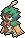 | [[Silvarro]]
 004 | 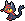 | [[Flamiau]]
 005 | 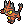 | [[Miezunder]]
 006 | 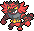 | [[Fuegro]]
 007 | 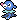 | [[Robball]]
 008 |  | [[Marikeck]]
 009 | 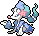 | [[Primarene]]
 010 |  | [[Peppeck]]
 011 |  | [[Trompeck]]
 012 |  | [[Tukanon]]
 013 |  | [[Mangunior]]
 014 |  | [[Manguspektor]]
 015 |  {{#icon:019a}}                | [[Rattfratz]] (Alola-Form)
 016 |  {{#icon:020a}}                | [[Rattikarl]] (Alola-Form)
 017 |                                     | [[Raupy]]
 018 |                                     | [[Safcon]]
 019 |                                     | [[Smettbo]]
 020 | {{#icon:165}}                                    | [[Ledyba]]
 021 | {{#icon:166}}                                    | [[Ledian]]
 022 | {{#icon:167}}                                    | [[Webarak]]
 023 | {{#icon:168}}                                    | [[Ariados]]
 024 | {{#icon:427}}                                    | [[Haspiror]]
 025 | {{#icon:428}}                                    | [[Schlapor]]
 026 | {{#icon:686}}                                    | [[Iscalar]]
 027 | {{#icon:687}}                                    | [[Calamanero]]
 028 | {{#icon:570}}                                    | [[Zorua]]
 029 | {{#icon:571}}                                    | [[Zoroark]]
 030 | {{#icon:676}}                                    | [[Coiffwaff]]
 031 | {{#icon:172}}                                    | [[Pichu]]
 032 |                                     | [Pikachu](DexEntries/Pikachu.md)
 033 |  {{#icon:026a}}                | [[Raichu]] (Alola-Form)
 034 |  | [[Mabula]]
 035 |  | [[Akkup]]
 036 |  | [[Donarion]]
 037 | {{#icon:438}}                                    | [[Mobai]]
 038 | {{#icon:185}}                                    | [[Mogelbaum]]
 039 | {{#icon:440}}                                    | [[Wonneira]]
 040 |                                     | [[Chaneira]]
 041 | {{#icon:242}}                                    | [[Heiteira]]
 042 | {{#icon:446}}                                    | [[Mampfaxo]]
 043 |                                     | [[Relaxo]]
 044 |                                     | [[Flegmon]]
 045 |                                     | [[Lahmus]]
 046 | {{#icon:199}}                                    | [[Laschoking]]
 047 | {{#icon:278}}                                    | [[Wingull]]
 048 | {{#icon:279}}                                    | [[Pelipper]]
 049 |                                     | [[Abra]]
 050 |                                     | [[Kadabra]]
 051 |                                     | [[Simsala]]
 052 |  {{#icon:052a}}                | [[Mauzi]] (Alola-Form)
 053 | ](pokemonimages/Pokémon-Icon_053.png) {{#icon:053a}}                | [[]] (Alola-Form)
 054 |                                     | [[Magnetilo]]
 055 |                                     | [[Magneton]]
 056 | {{#icon:462}}                                    | [[Magnezone]]
 057 |  {{#icon:088a}}                | [[Sleima]] (Alola-Form)
 058 |  {{#icon:089a}}                | [[Sleimok]] (Alola-Form)
 059 | {{#icon:439}}                                    | [[Pantimimi]]
 060 |                                     | [[Pantimos]]
 061 |                                     | [[Rettan]]
 062 |                                     | [[Arbok]]
 063 | {{#icon:206}}                                    | [[Dummisel]]
 064 |                                     | [[Fukano]]
 065 |                                     | [[Arkani]]
 066 |                                     | [[Traumato]]
 067 |                                     | [[Hypno]]
 068 | {{#icon:296}}                                    | [[Makuhita]]
 069 | {{#icon:297}}                                    | [[Hariyama]]
 070 | {{#icon:235}}                                    | [[Farbeagle]]
 071 |  | [[Krabbox]]
 072 |  | [[Krawell]]
 073 |                                     | [[Nebulak]]
 074 |                                     | [[Alpollo]]
 075 |                                     | [[Gengar]]
 076 | {{#icon:425}}                                    | [[Driftlon]]
 077 | {{#icon:426}}                                    | [[Drifzepeli]]
 078 | {{#icon:198}}                                    | [[Kramurx]]
 079 | {{#icon:430}}                                    | [[Kramshef]]
 080 |                                     | [[Zubat]]
 081 |                                     | [[Golbat]]
 082 | {{#icon:169}}                                    | [[Iksbat]]
 083 | {{#icon:714}}                                    | [[eF-eM]]
 084 | {{#icon:715}}                                    | [[UHaFnir]]
 085 |  {{#icon:050a}}                | [[Digda]] (Alola-Form)
 086 |  {{#icon:051a}}                | [[Digdri]] (Alola-Form)
 087 |                                     | [[Habitak]]
 088 |                                     | [[Ibitak]]
 089 | {{#icon:627}}                                    | [[Geronimatz]]
 090 | {{#icon:628}}                                    | [[Washakwil]]
 091 | {{#icon:629}}                                    | [[Skallyk]]
 092 | {{#icon:630}}                                    | [[Grypheldis]]
 093 |                                     | [[Menki]]
 094 |                                     | [[Rasaff]]
 095 | {{#icon:225}}                                    | [[Botogel]]
 096 | {{#icon:701}}                                    | [[Resladero]]
 097 |  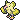 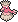 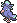 | [[Choreogel]]
 098 | 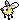 | [[Wommel]]
 099 | 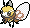 | [[Bandelby]]
 100 | {{#icon:669}}                                    | [[Flabébé]]
 101 | {{#icon:670}}                                    | [[Floette]]
 102 | {{#icon:671}}                                    | [[Florges]]
 103 | {{#icon:548}}                                    | [[Lilminip]]
 104 | {{#icon:549}}                                    | [[Dressella]]
 105 | {{#icon:546}}                                    | [[Waumboll]]
 106 | {{#icon:547}}                                    | [[Elfun]]
 107 |                                     | [[Enton]]
 108 |                                     | [[Entoron]]
 109 | {{#icon:238}}                                    | [[Kussilla]]
 110 |                                     | [[Rossana]]
 111 |                                     | [[Karpador]]
 112 |                                     | [[Garados]]
 113 | {{#icon:339}}                                    | [[Schmerbe]]
 114 | {{#icon:340}}                                    | [[Welsar]]
 115 |                                     | [[Jurob]]
 116 |                                     | [[Jugong]]
 117 |                                     | [[Machollo]]
 118 |                                     | [[Maschock]]
 119 |                                     | [[Machomei]]
 120 | {{#icon:524}}                                    | [[Kiesling]]
 121 | {{#icon:525}}                                    | [[Sedimantur]]
 122 | {{#icon:526}}                                    | [[Brockoloss]]
 123 | {{#icon:703}}                                    | [[Rocara]]
 124 |                                     | [[Zobiris]]
 125 | {{#icon:303}}                                    | [[Flunkifer]]
 126 |  | [[Wuffels]]
 127 |  | [[Wolwerock]]
 128 | {{#icon:327}}                                    | [[Pandir]]
 129 |                                     | [[Tentacha]]
 130 |                                     | [[Tentoxa]]
 131 | {{#icon:456}}                                    | [[Finneon]]
 132 | {{#icon:457}}                                    | [[Lumineon]]
 133 |  | [[Lusardin]]
 134 | {{#icon:370}}                                    | [[Liebiskus]]
 135 | {{#icon:222}}                                    | [[Corasonn]]
 136 |  | [[Garstella]]
 137 |  | [[Aggrostella]]
 138 |                                     | [[Muschas]]
 139 |                                     | [[Austos]]
 140 | {{#icon:366}}                                    | [[Perlu]]
 141 | {{#icon:367}}                                    | [[Aalabyss]]
 142 | {{#icon:368}}                                    | [[Saganabyss]]
 143 | {{#icon:223}}                                    | [[Remoraid]]
 144 | {{#icon:224}}                                    | [[Octillery]]
 145 | {{#icon:458}}                                    | [[Mantirps]]
 146 | {{#icon:226}}                                    | [[Mantax]]
 147 | {{#icon:371}}                                    | [[Kindwurm]]
 148 | {{#icon:372}}                                    | [[Draschel]]
 149 | {{#icon:373}}                                    | [[Brutalanda]]
 150 | {{#icon:506}}                                    | [[Yorkleff]]
 151 | {{#icon:507}}                                    | [[Terribark]]
 152 | {{#icon:508}}                                    | [[Bissbark]]
 153 |                                     | [[Evoli]]
 154 |                                     | [[Aquana]]
 155 |                                     | [[Blitza]]
 156 |                                     | [[Flamara]]
 157 | {{#icon:196}}                                    | [[Psiana]]
 158 | {{#icon:197}}                                    | [[Nachtara]]
 159 | {{#icon:470}}                                    | [[Folipurba]]
 160 | {{#icon:471}}                                    | [[Glaziola]]
 161 | {{#icon:700}}                                    | [[Feelinara]]
 162 | {{#icon:179}}                                    | [[Voltilamm]]
 163 | {{#icon:180}}                                    | [[Waaty]]
 164 | {{#icon:181}}                                    | [[Ampharos]]
 165 | 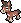 | [[Pampuli]]
 166 | 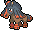 | [[Pampross]]
 167 | {{#icon:174}}                                    | [[Fluffeluff]]
 168 |                                     | [[Pummeluff]]
 169 |                                     | [[Knuddeluff]]
 170 |                                     | [[Tauros]]
 171 | {{#icon:241}}                                    | [[Miltank]]
 172 | {{#icon:283}}                                    | [[Gehweiher]]
 173 | {{#icon:284}}                                    | [[Maskeregen]]
 174 | 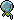 | [[Araqua]]
 175 | 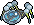 | [[Aranestro]]
 176 |  | [[Imantis]]
 177 |  | [[Mantidea]]
 178 | {{#icon:755}}                                    | [[Bubungus]]
 179 | {{#icon:756}}                                    | [[Lamellux]]
 180 |                                     | [[Paras]]
 181 |                                     | [[Parasek]]
 182 |                                     | [[Quapsel]]
 183 |                                     | [[Quaputzi]]
 184 |                                     | [[Quappo]]
 185 | {{#icon:186}}                                    | [[Quaxo]]
 186 |                                     | [[Goldini]]
 187 |                                     | [[Golking]]
 188 | {{#icon:550}}                                    | [[Barschuft]]
 189 | {{#icon:349}}                                    | [[Barschwa]]
 190 | {{#icon:350}}                                    | [[Milotic]]
 191 | {{#icon:594}}                                    | [[Mamolida]]
 192 | {{#icon:661}}                                    | [[Dartiri]]
 193 | {{#icon:662}}                                    | [[Dartignis]]
 194 | {{#icon:663}}                                    | [[Fiaro]]
 195 | {{#icon:757}}                                    | [[Molunk]]
 196 | {{#icon:758}}                                    | [[Amfira]]
 197 |                                     | [[Tragosso]]
 198 |  {{#icon:105a}}                | [[Knogga]] (Alola-Form)
 199 |                                     | [[Kangama]]
 200 | {{#icon:240}}                                    | [[Magby]]
 201 |                                     | [[Magmar]]
 202 | {{#icon:467}}                                    | [[Magbrant]]
 203 | {{#icon:636}}                                    | [[Ignivor]]
 204 | {{#icon:637}}                                    | [[Ramoth]]
 205 | {{#icon:759}}                                    | [[Velursi]]
 206 | {{#icon:760}}                                    | [[Kosturso]]
 207 | {{#icon:761}}                                    | [[Frubberl]]
 208 | {{#icon:762}}                                    | [[Frubaila]]
 209 | {{#icon:763}}                                    | [[Fruyal]]
 210 | {{#icon:764}}                                    | [[Curelei]]
 211 |                                     | [[Pinsir]]
 212 | {{#icon:163}}                                    | [[Hoothoot]]
 213 | {{#icon:164}}                                    | [[Noctuh]]
 214 | {{#icon:352}}                                    | [[Kecleon]]
 215 | {{#icon:765}}                                    | [[Kommandutan]]
 216 | {{#icon:766}}                                    | [[Quartermak]]
 217 | {{#icon:704}}                                    | [[Viscora]]
 218 | {{#icon:705}}                                    | [[Viscargot]]
 219 | {{#icon:706}}                                    | [[Viscogon]]
 220 | {{#icon:351}}                                    | [[Formeo]]
 221 | {{#icon:767}}                                    | [[Reißlaus]]
 222 | {{#icon:768}}                                    | [[Tectass]]
 223 |                                     | [[Sterndu]]
 224 |                                     | [[Starmie]]
 225 | {{#icon:769}}                                    | [[Sankabuh]]
 226 | {{#icon:770}}                                    | [[Colossand]]
 227 |                                     | [[Amonitas]]
 228 |                                     | [[Amoroso]]
 229 |                                     | [[Kabuto]]
 230 |                                     | [[Kabutops]]
 231 | {{#icon:345}}                                    | [[Liliep]]
 232 | {{#icon:346}}                                    | [[Wielie]]
 233 | {{#icon:347}}                                    | [[Anorith]]
 234 | {{#icon:348}}                                    | [[Armaldo]]
 235 | {{#icon:408}}                                    | [[Koknodon]]
 236 | {{#icon:409}}                                    | [[Rameidon]]
 237 | {{#icon:410}}                                    | [[Schilterus]]
 238 | {{#icon:411}}                                    | [[Bollterus]]
 239 | {{#icon:566}}                                    | [[Flapteryx]]
 240 | {{#icon:567}}                                    | [[Aeropteryx]]
 241 | {{#icon:564}}                                    | [[Galapaflos]]
 242 | {{#icon:565}}                                    | [[Karippas]]
 243 | {{#icon:696}}                                    | [[Balgoras]]
 244 | {{#icon:697}}                                    | [[Monargoras]]
 245 | {{#icon:698}}                                    | [[Amarino]]
 246 | {{#icon:699}}                                    | [[Amagarga]]
 247 | {{#icon:246}}                                    | [[Larvitar]]
 248 | {{#icon:247}}                                    | [[Pupitar]]
 249 | {{#icon:248}}                                    | [[Despotar]]
 250 | {{#icon:708}}                                    | [[Paragoni]]
 251 | {{#icon:709}}                                    | [[Trombork]]
 252 | {{#icon:177}}                                    | [[Natu]]
 253 | {{#icon:178}}                                    | [[Xatu]]
 254 | {{#icon:299}}                                    | [[Nasgnet]]
 255 | {{#icon:476}}                                    | [[Voluminas]]
 256 | {{#icon:771}}                                    | [[Gufa]]
 257 | {{#icon:170}}                                    | [[Lampi]]
 258 | {{#icon:171}}                                    | [[Lanturn]]
 259 | {{#icon:772}}                                    | [[Typ:Null]]
 260 | {{#icon:773}}                                    | [[Amigento]]
 261 | {{#icon:803}}                                    | [[Venicro]]
 262 | {{#icon:804}}                                    | [[Agoyon]]
 263 | {{#icon:718}}                                    | [[Zygarde]]
 264 | {{#icon:568}}                                    | [[Unratütox]]
 265 | {{#icon:569}}                                    | [[Deponitox]]
 266 | {{#icon:572}}                                    | [[Picochilla]]
 267 | {{#icon:573}}                                    | [[Chillabell]]
 268 | {{#icon:204}}                                    | [[Tannza]]
 269 | {{#icon:205}}                                    | [[Forstellka]]
 270 | {{#icon:227}}                                    | [[Panzaeron]]
 271 |                                     | [[Ditto]]
 272 | {{#icon:173}}                                    | [[Pii]]
 273 |                                     | [[Piepi]]
 274 |                                     | [[Pixi]]
 275 | {{#icon:605}}                                    | [[Pygraulon]]
 276 | {{#icon:606}}                                    | [[Megalon]]
 277 | {{#icon:774}}                                    | [[Meteno]]
 278 | {{#icon:374}}                                    | [[Tanhel]]
 279 | {{#icon:375}}                                    | [[Metang]]
 280 | {{#icon:376}}                                    | [[Metagross]]
 281 |                                     | [[Porygon]]
 282 | {{#icon:233}}                                    | [[Porygon2]]
 283 | {{#icon:474}}                                    | [[Porygon-Z]]
 284 | {{#icon:674}}                                    | [[Pam-Pam]]
 285 | {{#icon:675}}                                    | [[Pandagro]]
 286 | {{#icon:775}}                                    | [[Koalelu]]
 287 |                                     | [[Qurtel]]
 288 | {{#icon:776}}                                    | [[Tortunator]]
 289 | {{#icon:228}}                                    | [[Hunduster]]
 290 | {{#icon:229}}                                    | [[Hundemon]]
 291 | {{#icon:702}}                                    | [[Dedenne]]
 292 | {{#icon:777}}                                    | [[Togedemaru]]
 293 | {{#icon:309}}                                    | [[Frizelbliz]]
 294 | {{#icon:310}}                                    | [[Voltenso]]
 295 | {{#icon:239}}                                    | [[Elekid]]
 296 |                                     | [[Elektek]]
 297 | {{#icon:466}}                                    | [[Elevoltek]]
 298 |  {{#icon:074a}}                | [[Kleinstein]] (Alola-Form)
 299 |  {{#icon:075a}}                | [[Georok]] (Alola-Form)
 300 |  {{#icon:076a}}                | [[Geowaz]] (Alola-Form)
 301 | {{#icon:551}}                                    | [[Ganovil]]
 302 | {{#icon:552}}                                    | [[Rokkaiman]]
 303 | {{#icon:553}}                                    | [[Rabigator]]
 304 | {{#icon:328}}                                    | [[Knacklion]]
 305 | {{#icon:329}}                                    | [[Vibrava]]
 306 | {{#icon:330}}                                    | [[Libelldra]]
 307 | {{#icon:443}}                                    | [[Kaumalat]]
 308 | {{#icon:444}}                                    | [[Knarksel]]
 309 | {{#icon:445}}                                    | [[Knakrack]]
 310 | {{#icon:343}}                                    | [[Puppance]]
 311 | {{#icon:344}}                                    | [[Lepumentas]]
 312 | {{#icon:622}}                                    | [[Golbit]]
 313 | {{#icon:623}}                                    | [[Golgantes]]
 314 | {{#icon:707}}                                    | [[Clavion]]
 315 | {{#icon:778}}                                    | [[Mimigma]]
 316 | {{#icon:353}}                                    | [[Shuppet]]
 317 | {{#icon:354}}                                    | [[Banette]]
 318 | {{#icon:592}}                                    | [[Quabbel]]
 319 | {{#icon:593}}                                    | [[Apoquallyp]]
 320 | {{#icon:779}}                                    | [[Knirfish]]
 321 | {{#icon:780}}                                    | [[Sen-Long]]
 322 | {{#icon:359}}                                    | [[Absol]]
 323 | {{#icon:361}}                                    | [[Schneppke]]
 324 | {{#icon:362}}                                    | [[Firnontor]]
 325 | {{#icon:478}}                                    | [[Frosdedje]]
 326 | {{#icon:215}}                                    | [[Sniebel]]
 327 | {{#icon:461}}                                    | [[Snibunna]]
 328 |  {{#icon:027a}}                | [[Sandan]] (Alola-Form)
 329 |  {{#icon:028a}}                | [[Sandamer]] (Alola-Form)
 330 |  {{#icon:037a}}                | [[Vulpix]] (Alola-Form)
 331 |  {{#icon:038a}}                | [[Vulnona]] (Alola-Form)
 332 | {{#icon:582}}                                    | [[Gelatini]]
 333 | {{#icon:583}}                                    | [[Gelatroppo]]
 334 | {{#icon:584}}                                    | [[Gelatwino]]
 335 | {{#icon:559}}                                    | [[Zurrokex]]
 336 | {{#icon:560}}                                    | [[Irokex]]
 337 | {{#icon:624}}                                    | [[Gladiantri]]
 338 | {{#icon:625}}                                    | [[Caesurio]]
 339 | {{#icon:209}}                                    | [[Snubbull]]
 340 | {{#icon:210}}                                    | [[Granbull]]
 341 | {{#icon:422}}                                    | [[Schalellos]]
 342 | {{#icon:423}}                                    | [[Gastrodon]]
 343 | {{#icon:369}}                                    | [[Relicanth]]
 344 | {{#icon:781}}                                    | [[Moruda]]
 345 | {{#icon:318}}                                    | [[Kanivanha]]
 346 | {{#icon:319}}                                    | [[Tohaido]]
 347 | {{#icon:690}}                                    | [[Algitt]]
 348 | {{#icon:691}}                                    | [[Tandrak]]
 349 | {{#icon:692}}                                    | [[Scampisto]]
 350 | {{#icon:693}}                                    | [[Wummer]]
 351 | {{#icon:320}}                                    | [[Wailmer]]
 352 | {{#icon:321}}                                    | [[Wailord]]
 353 |                                     | [[Lapras]]
 354 | {{#icon:357}}                                    | [[Tropius]]
 355 |                                     | [[Owei]]
 356 |  {{#icon:103a}}                | [[Kokowei]] (Alola-Form)
 357 | {{#icon:341}}                                    | [[Krebscorps]]
 358 | {{#icon:342}}                                    | [[Krebutack]]
 359 | {{#icon:619}}                                    | [[Lin-Fu]]
 360 | {{#icon:620}}                                    | [[Wie-Shu]]
 361 | {{#icon:782}}                                    | [[Miniras]]
 362 | {{#icon:783}}                                    | [[Mediras]]
 363 | {{#icon:784}}                                    | [[Grandiras]]
 364 | {{#icon:587}}                                    | [[Emolga]]
 365 |                                     | [[Sichlor]]
 366 | {{#icon:212}}                                    | [[Scherox]]
 367 | {{#icon:214}}                                    | [[Skaraborn]]
 368 | {{#icon:190}}                                    | [[Griffel]]
 369 | {{#icon:424}}                                    | [[Ambidiffel]]
 370 | {{#icon:667}}                                    | [[Leufeo]]
 371 | {{#icon:668}}                                    | [[Pyroleo]]
 372 | {{#icon:200}}                                    | [[Traunfugil]]
 373 | {{#icon:429}}                                    | [[Traunmagil]]
 374 | {{#icon:621}}                                    | [[Shardrago]]
 375 |                                     | [[Schlurp]]
 376 | {{#icon:463}}                                    | [[Schlurplek]]
 377 | {{#icon:447}}                                    | [[Riolu]]
 378 | {{#icon:448}}                                    | [[Lucario]]
 379 | }                                    | [[Dratini]]
 380 | }                                    | [[Dragonir]]
 381 | }                                    | [[Dragoran]]
 382 |                                     | [[Aerodactyl]]
 383 | {{#icon:785}}                                    | [[Kapu-Riki]]
 384 | {{#icon:786}}                                    | [[Kapu-Fala]]
 385 | {{#icon:787}}                                    | [[Kapu-Toro]]
 386 | {{#icon:788}}                                    | [[Kapu-Kime]]
 387 | {{#icon:789}}                                    | [[Cosmog]]
 388 | {{#icon:790}}                                    | [[Cosmovum]]
 389 | {{#icon:791}}                                    | [[Solgaleo]]
 390 | {{#icon:792}}                                    | [[Lunala]]
 391 | {{#icon:793}}                                    | [[Anego]]
 392 | {{#icon:805}}                                    | [[Muramura]]
 393 | {{#icon:806}}                                    | [[Kopplosio]]
 394 | {{#icon:794}}                                    | [[Masskito]]
 395 | {{#icon:795}}                                    | [[Schabelle]]
 396 | {{#icon:796}}                                    | [[Voltriant]]
 397 | {{#icon:797}}                                    | [[Kaguron]]
 398 | {{#icon:798}}                                    | [[Katagami]] |
 399 | {{#icon:799}}                                    | [[Schlingking]]
 400 | {{#icon:800}}                                    | [[Necrozma]] |
 401 | {{#icon:801}}                                    | [[Magearna]] |
 402 | {{#icon:802}}                                    | [[Marshadow]] |
 403 | {{#icon:807}}                                    | [[Zeraora]] |

| ----- | ----- | ------ | ------ |
| Kanto | Johto | Sinnoh | Hoehnn |

#pokemon
