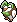
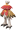
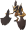
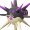
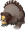
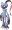
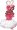

# Hisui-Pokédex

 Nr. | Icon      | Name
-----|------------------------------------|----------------------------------
 001 |  | [[Bauz]]
 002 |   | [[Arboretoss]]
 003 |  | [[Silvarro]] (Hisui-Form)
 004 | [[Datei:Pokémonsprite 155 PLA.png  | [[Feurigel]]
 005 | [[Datei:Pokémonsprite 156 PLA.png  | [[Igelavar]]
 006 | [[Datei:Pokémonsprite 157a PLA.png | [[Tornupto]] (Hisui-Form)
 007 | [[Datei:Pokémonsprite 501 PLA.png  | [[Ottaro]]
 008 | [[Datei:Pokémonsprite 502 PLA.png  | [[Zwottronin]]
 009 | [[Datei:Pokémonsprite 503a PLA.png | [[Admurai]] (Hisui-Form)
 010 | [[Datei:Pokémonsprite 399 PLA.png  | [[Bidiza]]
 011 | [[Datei:Pokémonsprite 400 PLA.png  | [[Bidifas]]
 012 | [[Datei:Pokémonsprite 396 PLA.png  | [[Staralili]]
 013 | [[Datei:Pokémonsprite 397 PLA.png  | [[Staravia]]
 014 | [[Datei:Pokémonsprite 398 PLA.png  | [[Staraptor]]
 015 | [[Datei:Pokémonsprite 403 PLA.png  | [[Sheinux]]
 016 | [[Datei:Pokémonsprite 404 PLA.png  | [[Luxio]]
 017 | [[Datei:Pokémonsprite 405 PLA.png  | [[Luxtra]]
 018 | [[Datei:Pokémonsprite 265 PLA.png  | [[Waumpel]]
 019 | [[Datei:Pokémonsprite 266 PLA.png  | [[Schaloko]]
 020 | [[Datei:Pokémonsprite 267 PLA.png  | [[Papinella]]
 021 | [[Datei:Pokémonsprite 268 PLA.png  | [[Panekon]]
 022 | [[Datei:Pokémonsprite 269 PLA.png  | [[Pudox]]
 023 | [[Datei:Pokémonsprite 077 PLA.png  | [[Ponita]]
 024 | [[Datei:Pokémonsprite 078 PLA.png  | [[Gallopa]]
 025 | [[Datei:Pokémonsprite 133 PLA.png  | [[Evoli]]
 026 | [[Datei:Pokémonsprite 134 PLA.png  | [[Aquana]]
 027 | [[Datei:Pokémonsprite 135 PLA.png  | [[Blitza]]
 028 | [[Datei:Pokémonsprite 136 PLA.png  | [[Flamara]]
 029 | [[Datei:Pokémonsprite 196 PLA.png  | [[Psiana]]
 030 | [[Datei:Pokémonsprite 197 PLA.png  | [[Nachtara]]
 031 | [[Datei:Pokémonsprite 470 PLA.png  | [[Folipurba]]
 032 | [[Datei:Pokémonsprite 471 PLA.png  | [[Glaziola]]
 033 | [[Datei:Pokémonsprite 700 PLA.png  | [[Feelinara]]
 034 | [[Datei:Pokémonsprite 041 PLA.png  | [[Zubat]]
 035 | [[Datei:Pokémonsprite 042 PLA.png  | [[Golbat]]
 036 | [[Datei:Pokémonsprite 169 PLA.png  | [[Iksbat]]
 037 | [[Datei:Pokémonsprite 425 PLA.png  | [[Driftlon]]
 038 | [[Datei:Pokémonsprite 426 PLA.png  | [[Drifzepeli]]
 039 | [[Datei:Pokémonsprite 401 PLA.png  | [[Zirpurze]]
 040 | [[Datei:Pokémonsprite 402 PLA.png  | [[Zirpeise]]
 041 | [[Datei:Pokémonsprite 418 PLA.png  | [[Bamelin]]
 042 | [[Datei:Pokémonsprite 419 PLA.png  | [[Bojelin]]
 043 | [[Datei:Pokémonsprite 412 PLA.png  | [[Burmy]]
 044 | [[Datei:Pokémonsprite 413 PLA.png  | [[Burmadame]]
 045 | [[Datei:Pokémonsprite 414 PLA.png  | [[Moterpel]]
 046 | [[Datei:Pokémonsprite 074 PLA.png  | [[Kleinstein]]
 047 | [[Datei:Pokémonsprite 075 PLA.png  | [[Georok]]
 048 | [[Datei:Pokémonsprite 076 PLA.png  | [[Geowaz]]
 049 | [[Datei:Pokémonsprite 234 PLA.png  | [[Damhirplex]]
 050 |  | [[Damythir]]
 051 | [[Datei:Pokémonsprite 446 PLA.png  | [[Mampfaxo]]
 052 | [[Datei:Pokémonsprite 143 PLA.png  | [[Relaxo]]
 053 | [[Datei:Pokémonsprite 046 PLA.png  | [[Paras]]
 054 | [[Datei:Pokémonsprite 047 PLA.png  | [[Parasek]]
 055 | [[Datei:Pokémonsprite 172 PLA.png  | [[Pichu]]
 056 | [[Datei:Pokémonsprite 025 PLA.png  | [Pikachu](DexEntries/Pikachu.md)
 057 | [[Datei:Pokémonsprite 026 PLA.png  | [[Raichu]]
 058 | [[Datei:Pokémonsprite 063 PLA.png  | [[Abra]]
 059 | [[Datei:Pokémonsprite 064 PLA.png  | [[Kadabra]]
 060 | [[Datei:Pokémonsprite 065 PLA.png  | [[Simsala]]
 061 | [[Datei:Pokémonsprite 390 PLA.png  | [[Panflam]]
 062 | [[Datei:Pokémonsprite 391 PLA.png  | [[Panpyro]]
 063 | [[Datei:Pokémonsprite 392 PLA.png  | [[Panferno]]
 064 | [[Datei:Pokémonsprite 427 PLA.png  | [[Haspiror]]
 065 | [[Datei:Pokémonsprite 428 PLA.png  | [[Schlapor]]
 066 | [[Datei:Pokémonsprite 420 PLA.png  | [[Kikugi]]
 067 | [[Datei:Pokémonsprite 421 PLA.png  | [[Kinoso]]
 068 | [[Datei:Pokémonsprite 054 PLA.png  | [[Enton]]
 069 | [[Datei:Pokémonsprite 055 PLA.png  | [[Entoron]]
 070 | [[Datei:Pokémonsprite 415 PLA.png  | [[Wadribie]]
 071 | [[Datei:Pokémonsprite 416 PLA.png  | [[Honweisel]]
 072 | [[Datei:Pokémonsprite 123 PLA.png  | [[Sichlor]]
 073 |  | [[Axantor]]
 074 | [[Datei:Pokémonsprite 212 PLA.png  | [[Scherox]]
 075 | [[Datei:Pokémonsprite 214 PLA.png  | [[Skaraborn]]
 076 | [[Datei:Pokémonsprite 439 PLA.png  | [[Pantimimi]]
 077 | [[Datei:Pokémonsprite 122 PLA.png  | [[Pantimos]]
 078 | [[Datei:Pokémonsprite 190 PLA.png  | [[Griffel]]
 079 | [[Datei:Pokémonsprite 424 PLA.png  | [[Ambidiffel]]
 080 | [[Datei:Pokémonsprite 129 PLA.png  | [[Karpador]]
 081 | [[Datei:Pokémonsprite 130 PLA.png  | [[Garados]]
 082 | [[Datei:Pokémonsprite 422 PLA.png  | [[Schalellos]]
 083 | [[Datei:Pokémonsprite 423 PLA.png  | [[Gastrodon]]
 084 | [[Datei:Pokémonsprite 211a PLA.png | [[Baldorfish]] (Hisui-Form)
 085 |  | [[Myriador]]
 086 | [[Datei:Pokémonsprite 440 PLA.png  | [[Wonneira]]
 087 | [[Datei:Pokémonsprite 113 PLA.png  | [[Chaneira]]
 088 | [[Datei:Pokémonsprite 242 PLA.png  | [[Heiteira]]
 089 | [[Datei:Pokémonsprite 406 PLA.png  | [[Knospi]]
 090 | [[Datei:Pokémonsprite 315 PLA.png  | [[Roselia]]
 091 | [[Datei:Pokémonsprite 407 PLA.png  | [[Roserade]]
 092 | [[Datei:Pokémonsprite 455 PLA.png  | [[Venuflibis]]
 093 | [[Datei:Pokémonsprite 548 PLA.png  | [[Lilminip]]
 094 | [[Datei:Pokémonsprite 549a PLA.png | [[Dressella]] (Hisui-Form)
 095 | [[Datei:Pokémonsprite 114 PLA.png  | [[Tangela]]
 096 | [[Datei:Pokémonsprite 465 PLA.png  | [[Tangoloss]]
 097 | [[Datei:Pokémonsprite 339 PLA.png  | [[Schmerbe]]
 098 | [[Datei:Pokémonsprite 340 PLA.png  | [[Welsar]]
 099 | [[Datei:Pokémonsprite 453 PLA.png  | [[Glibunkel]]
 100 | [[Datei:Pokémonsprite 454 PLA.png  | [[Toxiquak]]
 101 | [[Datei:Pokémonsprite 280 PLA.png  | [[Trasla]]
 102 | [[Datei:Pokémonsprite 281 PLA.png  | [[Kirlia]]
 103 | [[Datei:Pokémonsprite 282 PLA.png  | [[Guardevoir]]
 104 | [[Datei:Pokémonsprite 475 PLA.png  | [[Galagladi]]
 105 | [[Datei:Pokémonsprite 193 PLA.png  | [[Yanma]]
 106 | [[Datei:Pokémonsprite 469 PLA.png  | [[Yanmega]]
 107 | [[Datei:Pokémonsprite 449 PLA.png  | [[Hippopotas]]
 108 | [[Datei:Pokémonsprite 450 PLA.png  | [[Hippoterus]]
 109 | [[Datei:Pokémonsprite 417 PLA.png  | [[Pachirisu]]
 110 | [[Datei:Pokémonsprite 434 PLA.png  | [[Skunkapuh]]
 111 | [[Datei:Pokémonsprite 435 PLA.png  | [[Skuntank]]
 112 | [[Datei:Pokémonsprite 216 PLA.png  | [[Teddiursa]]
 113 | [[Datei:Pokémonsprite 217 PLA.png  | [[Ursaring]]
 114 |  | [[Ursaluna]]
 115 | [[Datei:Pokémonsprite 704 PLA.png  | [[Viscora]]
 116 | [[Datei:Pokémonsprite 705a PLA.png | [[Viscargot]] (Hisui-Form)
 117 | [[Datei:Pokémonsprite 706a PLA.png | [[Viscogon]] (Hisui-Form)
 118 | [[Datei:Pokémonsprite 095 PLA.png  | [[Onix]]
 119 | [[Datei:Pokémonsprite 208 PLA.png  | [[Stahlos]]
 120 | [[Datei:Pokémonsprite 111 PLA.png  | [[Rihorn]]
 121 | [[Datei:Pokémonsprite 112 PLA.png  | [[Rizeros]]
 122 | [[Datei:Pokémonsprite 464 PLA.png  | [[Rihornior]]
 123 | [[Datei:Pokémonsprite 438 PLA.png  | [[Mobai]]
 124 | [[Datei:Pokémonsprite 185 PLA.png  | [[Mogelbaum]]
 125 | [[Datei:Pokémonsprite 108 PLA.png  | [[Schlurp]]
 126 | [[Datei:Pokémonsprite 463 PLA.png  | [[Schlurplek]]
 127 | [[Datei:Pokémonsprite 175 PLA.png  | [[Togepi]]
 128 | [[Datei:Pokémonsprite 176 PLA.png  | [[Togetic]]
 129 | [[Datei:Pokémonsprite 468 PLA.png  | [[Togekiss]]
 130 | [[Datei:Pokémonsprite 387 PLA.png  | [[Chelast]]
 131 | [[Datei:Pokémonsprite 388 PLA.png  | [[Chelcarain]]
 132 | [[Datei:Pokémonsprite 389 PLA.png  | [[Chelterrar]]
 133 | [[Datei:Pokémonsprite 137 PLA.png  | [[Porygon]]
 134 | [[Datei:Pokémonsprite 233 PLA.png  | [[Porygon2]]
 135 | [[Datei:Pokémonsprite 474 PLA.png  | [[Porygon-Z]]
 136 | [[Datei:Pokémonsprite 092 PLA.png  | [[Nebulak]]
 137 | [[Datei:Pokémonsprite 093 PLA.png  | [[Alpollo]]
 138 | [[Datei:Pokémonsprite 094 PLA.png  | [[Gengar]]
 139 | [[Datei:Pokémonsprite 442 PLA.png  | [[Kryppuk]]
 140 | [[Datei:Pokémonsprite 198 PLA.png  | [[Kramurx]]
 141 | [[Datei:Pokémonsprite 430 PLA.png  | [[Kramshef]]
 142 | [[Datei:Pokémonsprite 201 PLA.png  | [[Icognito]]
 143 | [[Datei:Pokémonsprite 363 PLA.png  | [[Seemops]]
 144 | [[Datei:Pokémonsprite 364 PLA.png  | [[Seejong]]
 145 | [[Datei:Pokémonsprite 365 PLA.png  | [[Walraisa]]
 146 | [[Datei:Pokémonsprite 223 PLA.png  | [[Remoraid]]
 147 | [[Datei:Pokémonsprite 224 PLA.png  | [[Octillery]]
 148 | [[Datei:Pokémonsprite 451 PLA.png  | [[Pionskora]]
 149 | [[Datei:Pokémonsprite 452 PLA.png  | [[Piondragi]]
 150 | [[Datei:Pokémonsprite 058a PLA.png | [[Fukano]] (Hisui-Form)
 151 | [[Datei:Pokémonsprite 059a PLA.png | [[Arkani]] (Hisui-Form)
 152 | [[Datei:Pokémonsprite 431 PLA.png  | [[Charmian]]
 153 | [[Datei:Pokémonsprite 432 PLA.png  | [[Shnurgarst]]
 154 | [[Datei:Pokémonsprite 066 PLA.png  | [[Machollo]]
 155 | [[Datei:Pokémonsprite 067 PLA.png  | [[Maschock]]
 156 | [[Datei:Pokémonsprite 068 PLA.png  | [[Machomei]]
 157 | [[Datei:Pokémonsprite 441 PLA.png  | [[Plaudagei]]
 158 | [[Datei:Pokémonsprite 355 PLA.png  | [[Zwirrlicht]]
 159 | [[Datei:Pokémonsprite 356 PLA.png  | [[Zwirrklop]]
 160 | [[Datei:Pokémonsprite 477 PLA.png  | [[Zwirrfinst]]
 161 | [[Datei:Pokémonsprite 393 PLA.png  | [[Plinfa]]
 162 | [[Datei:Pokémonsprite 394 PLA.png  | [[Pliprin]]
 163 | [[Datei:Pokémonsprite 395 PLA.png  | [[Impoleon]]
 164 | [[Datei:Pokémonsprite 458 PLA.png  | [[Mantirps]]
 165 | [[Datei:Pokémonsprite 226 PLA.png  | [[Mantax]]
 166 | [[Datei:Pokémonsprite 550b PLA.png | [[Barschuft]]
 167 |  | [[Salmagnis]]
 168 | [[Datei:Pokémonsprite 037 PLA.png  | [[Vulpix]]
 168 | [[Datei:Pokémonsprite 037a PLA.png | [[Vulpix]] (Alola-Form)
 169 | [[Datei:Pokémonsprite 038 PLA.png  | [[Vulnona]]
 169 | [[Datei:Pokémonsprite 038a PLA.png | [[Vulnona]] (Alola-Form)
 170 | [[Datei:Pokémonsprite 072 PLA.png  | [[Tentacha]]
 171 | [[Datei:Pokémonsprite 073 PLA.png  | [[Tentoxa]]
 172 | [[Datei:Pokémonsprite 456 PLA.png  | [[Finneon]]
 173 | [[Datei:Pokémonsprite 457 PLA.png  | [[Lumineon]]
 174 | [[Datei:Pokémonsprite 240 PLA.png  | [[Magby]]
 175 | [[Datei:Pokémonsprite 126 PLA.png  | [[Magmar]]
 176 | [[Datei:Pokémonsprite 467 PLA.png  | [[Magbrant]]
 177 | [[Datei:Pokémonsprite 081 PLA.png  | [[Magnetilo]]
 178 | [[Datei:Pokémonsprite 082 PLA.png  | [[Magneton]]
 179 | [[Datei:Pokémonsprite 462 PLA.png  | [[Magnezone]]
 180 | [[Datei:Pokémonsprite 436 PLA.png  | [[Bronzel]]
 181 | [[Datei:Pokémonsprite 437 PLA.png  | [[Bronzong]]
 182 | [[Datei:Pokémonsprite 239 PLA.png  | [[Elekid]]
 183 | [[Datei:Pokémonsprite 125 PLA.png  | [[Elektek]]
 184 | [[Datei:Pokémonsprite 466 PLA.png  | [[Elevoltek]]
 185 | [[Datei:Pokémonsprite 207 PLA.png  | [[Skorgla]]
 186 | [[Datei:Pokémonsprite 472 PLA.png  | [[Skorgro]]
 187 | [[Datei:Pokémonsprite 443 PLA.png  | [[Kaumalat]]
 188 | [[Datei:Pokémonsprite 444 PLA.png  | [[Knarksel]]
 189 | [[Datei:Pokémonsprite 445 PLA.png  | [[Knakrack]]
 190 | [[Datei:Pokémonsprite 299 PLA.png  | [[Nasgnet]]
 191 | [[Datei:Pokémonsprite 476 PLA.png  | [[Voluminas]]
 192 | [[Datei:Pokémonsprite 100a PLA.png | [[Voltobal]] (Hisui-Form)
 193 | [[Datei:Pokémonsprite 101a PLA.png | [[Lektrobal]] (Hisui-Form)
 194 | [[Datei:Pokémonsprite 479 PLA.png  | [[Rotom]]
 195 | [[Datei:Pokémonsprite 433 PLA.png  | [[Klingplim]]
 196 | [[Datei:Pokémonsprite 358 PLA.png  | [[Palimpalim]]
 197 | [[Datei:Pokémonsprite 200 PLA.png  | [[Traunfugil]]
 198 | [[Datei:Pokémonsprite 429 PLA.png  | [[Traunmagil]]
 199 | [[Datei:Pokémonsprite 173 PLA.png  | [[Pii]]
 200 | [[Datei:Pokémonsprite 035 PLA.png  | [[Piepi]]
 201 | [[Datei:Pokémonsprite 036 PLA.png  | [[Pixi]]
 202 | [[Datei:Pokémonsprite 215a PLA.png | [[Sniebel]] (Hisui-Form)
 202 | [[Datei:Pokémonsprite 215 PLA.png  | [[Sniebel]]
 203 |  | [[Snieboss]]
 204 | [[Datei:Pokémonsprite 461 PLA.png  | [[Snibunna]]
 205 | [[Datei:Pokémonsprite 361 PLA.png  | [[Schneppke]]
 206 | [[Datei:Pokémonsprite 362 PLA.png  | [[Firnontor]]
 207 | [[Datei:Pokémonsprite 478 PLA.png  | [[Frosdedje]]
 208 | [[Datei:Pokémonsprite 408 PLA.png  | [[Koknodon]]
 209 | [[Datei:Pokémonsprite 409 PLA.png  | [[Rameidon]]
 210 | [[Datei:Pokémonsprite 410 PLA.png  | [[Schilterus]]
 211 | [[Datei:Pokémonsprite 411 PLA.png  | [[Bollterus]]
 212 | [[Datei:Pokémonsprite 220 PLA.png  | [[Quiekel]]
 213 | [[Datei:Pokémonsprite 221 PLA.png  | [[Keifel]]
 214 | [[Datei:Pokémonsprite 473 PLA.png  | [[Mamutel]]
 215 | [[Datei:Pokémonsprite 712 PLA.png  | [[Arktip]]
 216 | [[Datei:Pokémonsprite 713a PLA.png | [[Arktilas]] (Hisui-Form)
 217 | [[Datei:Pokémonsprite 459 PLA.png  | [[Shnebedeck]]
 218 | [[Datei:Pokémonsprite 460 PLA.png  | [[Rexblisar]]
 219 | [[Datei:Pokémonsprite 570a PLA.png | [[Zorua]] (Hisui-Form)
 220 | [[Datei:Pokémonsprite 571a PLA.png | [[Zoroark]] (Hisui-Form)
 221 | [[Datei:Pokémonsprite 627 PLA.png  | [[Geronimatz]]
 222 | [[Datei:Pokémonsprite 628a PLA.png | [[Washakwil]] (Hisui-Form)
 223 | [[Datei:Pokémonsprite 447 PLA.png  | [[Riolu]]
 224 | [[Datei:Pokémonsprite 448 PLA.png  | [[Lucario]]
 225 | [[Datei:Pokémonsprite 480 PLA.png  | [[Selfe]]
 226 | [[Datei:Pokémonsprite 481 PLA.png  | [[Vesprit]]
 227 | [[Datei:Pokémonsprite 482 PLA.png  | [[Tobutz]]
 228 | [[Datei:Pokémonsprite 485 PLA.png  | [[Heatran]]
 229 | [[Datei:Pokémonsprite 486 PLA.png  | [[Regigigas]]
 230 | [[Datei:Pokémonsprite 488 PLA.png  | [[Cresselia]]
 231 | [[Datei:Pokémonsprite 641 PLA.png  | [[Boreos]]
 232 | [[Datei:Pokémonsprite 642 PLA.png  | [[Voltolos]]
 233 | [[Datei:Pokémonsprite 645 PLA.png  | [[Demeteros]]
 234 |  | [[Cupidos]]
 235 | [[Datei:Pokémonsprite 483 PLA.png  | [[Dialga]]
 236 | [[Datei:Pokémonsprite 484 PLA.png  | [[Palkia]]
 237 | [[Datei:Pokémonsprite 487 PLA.png  | [[Giratina]]
 238 | [[Datei:Pokémonsprite 493 PLA.png  | [[Arceus]]
 239 | [[Datei:Pokémonsprite 489 PLA.png  | [[Phione]]
 240 | [[Datei:Pokémonsprite 490 PLA.png  | [[Manaphy]]
 241 | [[Datei:Pokémonsprite 492 PLA.png  | [[Shaymin]]
 242 | [[Datei:Pokémonsprite 491 PLA.png  | [[Darkrai]]

#pokemon
