# Kanto-Pokédex

 Nr. | Icon          | Name
-----|---------------|----------------
 001 |  | [[Bisasam]]
 002 |  | [[Bisaknosp]]
 003 |  | [[Bisaflor]]
 004 | 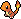 | [[Glumanda]]
 005 | 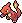 | [[Glutexo]]
 006 |  | [[Glurak]]
 007 | 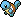 | [[Schiggy]]
 008 | 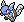 | [[Schillok]]
 009 | 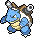 | [[Turtok]]
 010 | 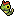 | [[Raupy]]
 011 |  | [[Safcon]]
 012 | 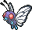 | [[Smettbo]]
 013 |  | [[Hornliu]]
 014 |  | [[Kokuna]]
 015 |  | [[Bibor]]
 016 |  | [[Taubsi]]
 017 |  | [[Tauboga]]
 018 | 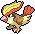 | [[Tauboss]]
 019 |  | [[Rattfratz]]
 020 |  | [[Rattikarl]]
 021 |  | [[Habitak]]
 022 |  | [[Ibitak]]
 023 |  | [[Rettan]]
 024 |  | [[Arbok]]
 025 | 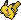 | [Pikachu](DexEntries/Pikachu.md)
 026 | 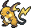 | [[Raichu]]
 027 |  | [[Sandan]]
 028 |  | [[Sandamer]]
 029 | 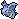 | [[Nidoran♀]]
 030 | 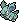 | [[Nidorina]]
 031 |  | [[Nidoqueen]]
 032 | 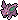 | [[Nidoran♂]]
 033 | 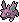 | [[Nidorino]]
 034 | 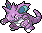 | [[Nidoking]]
 035 |  | [[Piepi]]
 036 |  | [[Pixi]]
 037 |  | [[Vulpix]]
 038 |  | [[Vulnona]]
 039 |  | [[Pummeluff]]
 040 |  | [[Knuddeluff]]
 041 |  | [[Zubat]]
 042 |  | [[Golbat]]
 043 | 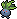 | [[Myrapla]]
 044 | 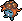 | [[Duflor]]
 045 | 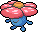 | [[Giflor]]
 046 |  | [[Paras]]
 047 |  | [[Parasek]]
 048 |  | [[Bluzuk]]
 049 | 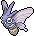 | [[Omot]]
 050 |  | [[Digda]]
 051 |  | [[Digdri]]
 052 | 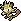 | [[Mauzi]]
 053 | 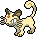 | [[Snobilikat]]
 054 |  | [[Enton]]
 055 |  | [[Entoron]]
 056 |  | [[Menki]]
 057 |  | [[Rasaff]]
 058 |  | [[Fukano]]
 059 |  | [[Arkani]]
 060 |  | [[Quapsel]]
 061 |  | [[Quaputzi]]
 062 |  | [[Quappo]]
 063 | 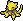 | [[Abra]]
 064 | 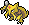 | [[Kadabra]]
 065 | 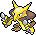 | [[Simsala]]
 066 | 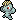 | [[Machollo]]
 067 | 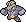 | [[Maschock]]
 068 | 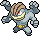 | [[Machomei]]
 069 |  | [[Knofensa]]
 070 |  | [[Ultrigaria]]
 071 |  | [[Sarzenia]]
 072 | 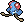 | [[Tentacha]]
 073 | 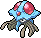 | [[Tentoxa]]
 074 |  | [[Kleinstein]]
 075 |  | [[Georok]]
 076 |  | [[Geowaz]]
 077 | 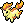 | [[Ponita]]
 078 | 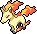 | [[Gallopa]]
 079 | 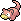 | [[Flegmon]]
 080 | 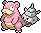 | [[Lahmus]]
 081 |  | [[Magnetilo]]
 082 |  | [[Magneton]]
 083 | 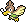 | [[Porenta]]
 084 |  | [[Dodu]]
 085 |  | [[Dodri]]
 086 |  | [[Jurob]]
 087 |  | [[Jugong]]
 088 |  | [[Sleima]]
 089 |  | [[Sleimok]]
 090 | 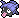 | [[Muschas]]
 091 | 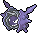 | [[Austos]]
 092 |  | [[Nebulak]]
 093 |  | [[Alpollo]]
 094 |  | [[Gengar]]
 095 |  | [[Onix]]
 096 |  | [[Traumato]]
 097 | 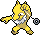 | [[Hypno]]
 098 | 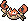 | [[Krabby]]
 099 | 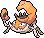 | [[Kingler]]
 100 |  | [[Voltobal]]
 101 |  | [[Lektrobal]]
 102 | 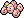 | [[Owei]]
 103 | 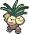 | [[Kokowei]]
 104 |  | [[Tragosso]]
 105 | 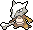 | [[Knogga]]
 106 |  | [[Kicklee]]
 107 | 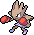 | [[Nockchan]]
 108 |  | [[Schlurp]]
 109 |  | [[Smogon]]
 110 |  | [[Smogmog]]
 111 | 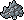 | [[Rihorn]]
 112 | 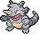 | [[Rizeros]]
 113 | 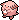 | [[Chaneira]]
 114 |  | [[Tangela]]
 115 | 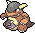 | [[Kangama]]
 116 | 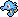 | [[Seeper]]
 117 | 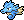 | [[Seemon]]
 118 | 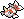 | [[Goldini]]
 119 |  | [[Golking]]
 120 |  | [[Sterndu]]
 121 |  | [[Starmie]]
 122 |  | [[Pantimos]]
 123 |  | [[Sichlor]]
 124 |  | [[Rossana]]
 125 |  | [[Elektek]]
 126 |  | [[Magmar]]
 127 |  | [[Pinsir]]
 128 |  | [[Tauros]]
 129 |  | [[Karpador]]
 130 |  | [[Garados]]
 131 |  | [[Lapras]]
 132 |  | [[Ditto]]
 133 |  | [[Evoli]]
 134 |  | [[Aquana]]
 135 |  | [[Blitza]]
 136 |  | [[Flamara]]
 137 |  | [[Porygon]]
 138 |  | [[Amonitas]]
 139 |  | [[Amoroso]]
 140 |  | [[Kabuto]]
 141 |  | [[Kabutops]]
 142 |  | [[Aerodactyl]]
 143 |  | [[Relaxo]]
 144 |  | [[Arktos]]
 145 |  | [[Zapdos]]
 146 |  | [[Lavados]]
 147 |  | [[Dratini]]
 148 |  | [[Dragonir]]
 149 |  | [[Dragoran]]
 150 |  | [[Mewtu]]
 151 |  | [[Mew]]

#pokemon #dex #kanto #dexkanto
