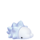
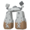

 Nr. | Icon                                | Name                          
-----|-------------------------------------|-------------------------------
 001 | [[Datei:Sugimori Felori.png         | [[Felori]]                    
 004 | [[Datei:Sugimori Krokel.png         | [[Krokel]]                    
 007 | [[Datei:Sugimori Kwaks.png          | [[Kwaks]]                     
 010 | [[Datei:Sugimori Ferkuli.png        | [[Ferkuli]]                   
 019 | [[Datei:Pokémonsprite 661 HOME.png  | [[Dartiri]]                   
 020 | [[Datei:Pokémonsprite 662 HOME.png  | [[Dartignis]]                 
 021 | [[Datei:Pokémonsprite 663 HOME.png  | [[Fiaro]]                     
 022 | [[Datei:Sugimori Pamo.png           | [[Pamo]]                      
 025 | [[Datei:Pokémonsprite 228 HOME.png  | [[Hunduster]]                 
 026 | [[Datei:Pokémonsprite 229 HOME.png  | [[Hundemon]]                  
 076 | [[Datei:Sugimori Hefel.png          | [[Hefel]]                     
 134 | [[Datei:Pokémonsprite 129 HOME.png  | [[Karpador]]                  
 135 | [[Datei:Pokémonsprite 130 HOME.png  | [[Garados]]                   
 179 | [[Datei:Pokémonsprite 133 HOME.png  | [[Evoli]]                     
 180 | [[Datei:Pokémonsprite 134 HOME.png  | [[Aquana]]                    
 181 | [[Datei:Pokémonsprite 135 HOME.png  | [[Blitza]]                    
 182 | [[Datei:Pokémonsprite 136 HOME.png  | [[Flamara]]                   
 183 | [[Datei:Pokémonsprite 196 HOME.png  | [[Psiana]]                    
 184 | [[Datei:Pokémonsprite 197 HOME.png  | [[Nachtara]]                  
 185 | [[Datei:Pokémonsprite 470 HOME.png  | [[Folipurba]]                 
 186 | [[Datei:Pokémonsprite 471 HOME.png  | [[Glaziola]]                  
 187 | [[Datei:Pokémonsprite 700 HOME.png  | [[Feelinara]]                 
 192 | [[Datei:Pokémonsprite 203 HOME.png  | [[Girafarig]]                 
 193 | [[Datei:Sugimori Farigiraf.png      | [[Farigiraf]]                 
 198 | [[Datei:Pokémonsprite 848 HOME.png  | [[Toxel]]                     
 ??? | [[Datei:Pokémonsprite 172 HOME.png  | [[Pichu]]                     
 ??? | [[Datei:Pokémonsprite 025 HOME.png  | [[Pikachu]]                   
 ??? | [[Datei:Pokémonsprite 026 HOME.png  | [[Raichu]]                    
 ??? | [[Datei:Pokémonsprite 050 HOME.png  | [[Digda]]                     
 ??? | [[Datei:Pokémonsprite 174 HOME.png  | [[Fluffeluff]]                
 ??? | [[Datei:Pokémonsprite 039 HOME.png  | [[Pummeluff]]                 
 ??? | [[Datei:Pokémonsprite 040 HOME.png  | [[Knuddeluff]]                
 ??? | [[Datei:Pokémonsprite 048 HOME.png  | [[Bluzuk]]                    
 ??? | [[Datei:Pokémonsprite 052 HOME.png  | [[Mauzi]]                     
 ??? | [[Datei:Pokémonsprite 053 HOME.png  | [[Snobilikat]]                
 ??? | [[Datei:Pokémonsprite 054 HOME.png  | [[Enton]]                     
 ??? | [[Datei:Pokémonsprite 055 HOME.png  | [[Entoron]]                   
 ??? | [[Datei:Pokémonsprite 058 HOME.png  | [[Fukano]]                    
 ??? | [[Datei:Pokémonsprite 059 HOME.png  | [[Arkani]]                    
 ??? | [[Datei:Pokémonsprite 079 HOME.png  | [[Flegmon]]                   
 ??? | [[Datei:Pokémonsprite 080 HOME.png  | [[Lahmus]]                    
 ??? | [[Datei:Pokémonsprite 199 HOME.png  | [[Laschoking]]                
 ??? | [[Datei:Pokémonsprite 081 HOME.png  | [[Magnetilo]]                 
 ??? | [[Datei:Pokémonsprite 082 HOME.png  | [[Magneton]]                  
 ??? | [[Datei:Pokémonsprite 462 HOME.png  | [[Magnezone]]                 
 ??? | [[Datei:Pokémonsprite 088 HOME.png  | [[Sleima]]                    
 ??? | [[Datei:Pokémonsprite 090 HOME.png  | [[Muschas]]                   
 ??? | [[Datei:Pokémonsprite 091 HOME.png  | [[Austos]]                    
 ??? | [[Datei:Pokémonsprite 092 HOME.png  | [[Nebulak]]                   
 ??? | [[Datei:Pokémonsprite 093 HOME.png  | [[Alpollo]]                   
 ??? | [[Datei:Pokémonsprite 094 HOME.png  | [[Gengar]]                    
 ??? | [[Datei:Pokémonsprite 096 HOME.png  | [[Traumato]]                  
 ??? | [[Datei:Pokémonsprite 440 HOME.png  | [[Wonneira]]                  
 ??? | [[Datei:Pokémonsprite 113 HOME.png  | [[Chaneira]]                  
 ??? | [[Datei:Pokémonsprite 242 HOME.png  | [[Heiteira]]                  
 ??? | [[Datei:Pokémonsprite 123 HOME.png  | [[Sichlor]]                   
 ??? | [[Datei:Pokémonsprite 212 HOME.png  | [[Scherox]]                   
 ??? | [[Datei:Pokémonsprite 147 HOME.png  | [[Dratini]]                   
 ??? | [[Datei:Pokémonsprite 148 HOME.png  | [[Dragonir]]                  
 ??? | [[Datei:Pokémonsprite 149 HOME.png  | [[Dragoran]]                  
 ??? | [[Datei:Pokémonsprite 179 HOME.png  | [[Voltilamm]]                 
 ??? | [[Datei:Pokémonsprite 180 HOME.png  | [[Waaty]]                     
 ??? | [[Datei:Pokémonsprite 298 HOME.png  | [[Azurill]]                   
 ??? | [[Datei:Pokémonsprite 183 HOME.png  | [[Marill]]                    
 ??? | [[Datei:Pokémonsprite 184 HOME.png  | [[Azumarill]]                 
 ??? | [[Datei:Pokémonsprite 438 HOME.png  | [[Mobai]]                     
 ??? | [[Datei:Pokémonsprite 185 HOME.png  | [[Mogelbaum]]                 
 ??? | [[Datei:Pokémonsprite 187 HOME.png  | [[Hoppspross]]                
 ??? | [[Datei:Pokémonsprite 188 HOME.png  | [[Hubelupf]]                  
 ??? | [[Datei:Pokémonsprite 189 HOME.png  | [[Papungha]]                  
 ??? | [[Datei:Pokémonsprite 191 HOME.png  | [[Sonnkern]]                  
 ??? | [[Datei:Pokémonsprite 192 HOME.png  | [[Sonnflora]]                 
 ??? | [[Datei:Pokémonsprite 198 HOME.png  | [[Kramurx]]                   
 ??? | [[Datei:Pokémonsprite 430 HOME.png  | [[Kramshef]]                  
 ??? | [[Datei:Pokémonsprite 200 HOME.png  | [[Traunfugil]]                
 ??? | [[Datei:Pokémonsprite 429 HOME.png  | [[Traunmagil]]                
 ??? | [[Datei:Pokémonsprite 204 HOME.png  | [[Tannza]]                    
 ??? | [[Datei:Pokémonsprite 205 HOME.png  | [[Forstellka]]                
 ??? | [[Datei:Pokémonsprite 206 HOME.png  | [[Dummisel]]                  
 ??? | [[Datei:Pokémonsprite 215 HOME.png  | [[Sniebel]]                   
 ??? | [[Datei:Pokémonsprite 461 HOME.png  | [[Snibunna]]                  
 ??? | [[Datei:Pokémonsprite 216 HOME.png  | [[Teddiursa]]                 
 ??? | [[Datei:Pokémonsprite 231 HOME.png  | [[Phanpy]]                    
 ??? | [[Datei:Pokémonsprite 232 HOME.png  | [[Donphan]]                   
 ??? | [[Datei:Pokémonsprite 246 HOME.png  | [[Larvitar]]                  
 ??? | [[Datei:Pokémonsprite 247 HOME.png  | [[Pupitar]]                   
 ??? | [[Datei:Pokémonsprite 248 HOME.png  | [[Despotar]]                  
 ??? | [[Datei:Pokémonsprite 278 HOME.png  | [[Wingull]]                   
 ??? | [[Datei:Pokémonsprite 279 HOME.png  | [[Pelipper]]                  
 ??? | [[Datei:Pokémonsprite 280 HOME.png  | [[Trasla]]                    
 ??? | [[Datei:Pokémonsprite 281 HOME.png  | [[Kirlia]]                    
 ??? | [[Datei:Pokémonsprite 282 HOME.png  | [[Guardevoir]]                
 ??? | [[Datei:Pokémonsprite 475 HOME.png  | [[Galagladi]]                 
 ??? | [[Datei:Pokémonsprite 285 HOME.png  | [[Knilz]]                     
 ??? | [[Datei:Pokémonsprite 286 HOME.png  | [[Kapilz]]                    
 ??? | [[Datei:Pokémonsprite 287 HOME.png  | [[Bummelz]]                   
 ??? | [[Datei:Pokémonsprite 288 HOME.png  | [[Muntier]]                   
 ??? | [[Datei:Pokémonsprite 289 HOME.png  | [[Letarking]]                 
 ??? | [[Datei:Pokémonsprite 296 HOME.png  | [[Makuhita]]                  
 ??? | [[Datei:Pokémonsprite 297 HOME.png  | [[Hariyama]]                  
 ??? | [[Datei:Pokémonsprite 302 HOME.png  | [[Zobiris]]                   
 ??? | [[Datei:Pokémonsprite 307 HOME.png  | [[Meditie]]                   
 ??? | [[Datei:Pokémonsprite 308 HOME.png  | [[Meditalis]]                 
 ??? | [[Datei:Pokémonsprite 324 HOME.png  | [[Qurtel]]                    
 ??? | [[Datei:Pokémonsprite 331 HOME.png  | [[Tuska]]                     
 ??? | [[Datei:Pokémonsprite 332 HOME.png  | [[Noktuska]]                  
 ??? | [[Datei:Pokémonsprite 333 HOME.png  | [[Wablu]]                     
 ??? | [[Datei:Pokémonsprite 334 HOME.png  | [[Altaria]]                   
 ??? | [[Datei:Pokémonsprite 335 HOME.png  | [[Sengo]]                     
 ??? | [[Datei:Pokémonsprite 336 HOME.png  | [[Vipitis]]                   
 ??? | [[Datei:Pokémonsprite 357 HOME.png  | [[Tropius]]                   
 ??? | [[Datei:Pokémonsprite 361 HOME.png  | [[Schneppke]]                 
 ??? | [[Datei:Pokémonsprite 362 HOME.png  | [[Firnontor]]                 
 ??? | [[Datei:Pokémonsprite 371 HOME.png  | [[Kindwurm]]                  
 ??? | [[Datei:Pokémonsprite 372 HOME.png  | [[Draschel]]                  
 ??? | [[Datei:Pokémonsprite 373 HOME.png  | [[Brutalanda]]                
 ??? | [[Datei:Pokémonsprite 396 HOME.png  | [[Staralili]]                 
 ??? | [[Datei:Pokémonsprite 397 HOME.png  | [[Staravia]]                  
 ??? | [[Datei:Pokémonsprite 398 HOME.png  | [[Staraptor]]                 
 ??? | [[Datei:Pokémonsprite 403 HOME.png  | [[Sheinux]]                   
 ??? | [[Datei:Pokémonsprite 404 HOME.png  | [[Luxio]]                     
 ??? | [[Datei:Pokémonsprite 405 HOME.png  | [[Luxtra]]                    
 ??? | [[Datei:Pokémonsprite 415 HOME.png  | [[Wadribie]]                  
 ??? | [[Datei:Pokémonsprite 417 HOME.png  | [[Pachirisu]]                 
 ??? | [[Datei:Pokémonsprite 425 HOME.png  | [[Driftlon]]                  
 ??? | [[Datei:Pokémonsprite 426 HOME.png  | [[Drifzepeli]]                
 ??? | [[Datei:Pokémonsprite 436 HOME.png  | [[Bronzel]]                   
 ??? | [[Datei:Pokémonsprite 437 HOME.png  | [[Bronzong]]                  
 ??? | [[Datei:Pokémonsprite 447 HOME.png  | [[Riolu]]                     
 ??? | [[Datei:Pokémonsprite 448 HOME.png  | [[Lucario]]                   
 ??? | [[Datei:Pokémonsprite 449 HOME.png  | [[Hippopotas]]                
 ??? | [[Datei:Pokémonsprite 450 HOME.png  | [[Hippoterus]]                
 ??? | [[Datei:Pokémonsprite 453 HOME.png  | [[Glibunkel]]                 
 ??? | [[Datei:Pokémonsprite 456 HOME.png  | [[Finneon]]                   
 ??? | [[Datei:Pokémonsprite 457 HOME.png  | [[Lumineon]]                  
 ??? | [[Datei:Pokémonsprite 459 HOME.png  | [[Shnebedeck]]                
 ??? | [[Datei:Pokémonsprite 460 HOME.png  | [[Rexblisar]]                 
 ??? | [[Datei:Pokémonsprite 479 HOME.png  | [[Rotom]]                     
 ??? | [[Datei:Pokémonsprite 548 HOME.png  | [[Lilminip]]                  
 ??? | [[Datei:Pokémonsprite 549 HOME.png  | [[Dressella]]                 
 ??? | [[Datei:Pokémonsprite 551 HOME.png  | [[Ganovil]]                   
 ??? | [[Datei:Pokémonsprite 552 HOME.png  | [[Rokkaiman]]                 
 ??? | [[Datei:Pokémonsprite 570a HOME.png | [[Zorua]] (Hisui-Form)   
 ??? | [[Datei:Pokémonsprite 571a HOME.png | [[Zoroark]] (Hisui-Form) 
 ??? | [[Datei:Pokémonsprite 585 HOME.png  | [[Sesokitz]]                  
 ??? | [[Datei:Pokémonsprite 586 HOME.png  | [[Kronjuwild]]                
 ??? | [[Datei:Pokémonsprite 602 HOME.png  | [[Zapplardin]]                
 ??? | [[Datei:Pokémonsprite 603 HOME.png  | [[Zapplalek]]                 
 ??? | [[Datei:Pokémonsprite 604 HOME.png  | [[Zapplarang]]                
 ??? | [[Datei:Pokémonsprite 613 HOME.png  | [[Petznief]]                  
 ??? | [[Datei:Pokémonsprite 614 HOME.png  | [[Siberio]]                   
 ??? | [[Datei:Pokémonsprite 615 HOME.png  | [[Frigometri]]                
 ??? | [[Datei:Pokémonsprite 633 HOME.png  | [[Kapuno]]                    
 ??? | [[Datei:Pokémonsprite 634 HOME.png  | [[Duodino]]                   
 ??? | [[Datei:Pokémonsprite 635 HOME.png  | [[Trikephalo]]                
 ??? | [[Datei:Pokémonsprite 664 HOME.png  | [[Purmel]]                    
 ??? | [[Datei:Pokémonsprite 665 HOME.png  | [[Puponcho]]                  
 ??? | [[Datei:Pokémonsprite 666f HOME.png | [[Vivillon]]                  
 ??? | [[Datei:Pokémonsprite 667 HOME.png  | [[Leufeo]]                    
 ??? | [[Datei:Pokémonsprite 669 HOME.png  | [[Flabébé]]                   
 ??? | [[Datei:Pokémonsprite 672 HOME.png  | [[Mähikel]]                   
 ??? | [[Datei:Pokémonsprite 673 HOME.png  | [[Chevrumm]]                  
 ??? | [[Datei:Pokémonsprite 692 HOME.png  | [[Scampisto]]                 
 ??? | [[Datei:Pokémonsprite 693 HOME.png  | [[Wummer]]                    
 ??? | [[Datei:Pokémonsprite 704 HOME.png  | [[Viscora]]                   
 ??? | [[Datei:Pokémonsprite 705 HOME.png  | [[Viscargot]]                 
 ??? | [[Datei:Pokémonsprite 706 HOME.png  | [[Viscogon]]                  
 ??? | [[Datei:Pokémonsprite 714 HOME.png  | [[eF-eM]]                     
 ??? | [[Datei:Pokémonsprite 715 HOME.png  | [[UHaFnir]]                   
 ??? | [[Datei:Pokémonsprite 741 HOME.png  | [[Choreogel]]                 
 ??? | [[Datei:Pokémonsprite 744 HOME.png  | [[Wuffels]]                   
 ??? | [[Datei:Pokémonsprite 747 HOME.png  | [[Garstella]]                 
 ??? | [[Datei:Pokémonsprite 748 HOME.png  | [[Aggrostella]]               
 ??? | [[Datei:Pokémonsprite 749 HOME.png  | [[Pampuli]]                   
 ??? | [[Datei:Pokémonsprite 753 HOME.png  | [[Imantis]]                   
 ??? | [[Datei:Pokémonsprite 754 HOME.png  | [[Mantidea]]                  
 ??? | [[Datei:Pokémonsprite 761 HOME.png  | [[Frubberl]]                  
 ??? | [[Datei:Pokémonsprite 762 HOME.png  | [[Frubaila]]                  
 ??? | [[Datei:Pokémonsprite 763 HOME.png  | [[Fruyal]]                    
 ??? | [[Datei:Pokémonsprite 769 HOME.png  | [[Sankabuh]]                  
 ??? | [[Datei:Pokémonsprite 775 HOME.png  | [[Koalelu]]                   
 ??? | [[Datei:Pokémonsprite 819 HOME.png  | [[Raffel]]                    
 ??? | [[Datei:Pokémonsprite 820 HOME.png  | [[Schlaraffel]]               
 ??? | [[Datei:Pokémonsprite 833 HOME.png  | [[Kamehaps]]                  
 ??? | [[Datei:Pokémonsprite 834 HOME.png  | [[Kamalm]]                    
 ??? | [[Datei:Pokémonsprite 837 HOME.png  | [[Klonkett]]                  
 ??? | [[Datei:Pokémonsprite 838 HOME.png  | [[Wagong]]                    
 ??? | [[Datei:Pokémonsprite 839 HOME.png  | [[Montecarbo]]                
 ??? | [[Datei:Pokémonsprite 840 HOME.png  | [[Knapfel]]                   
 ??? | [[Datei:Pokémonsprite 854 HOME.png  | [[Fatalitee]]                 
 ??? | [[Datei:Pokémonsprite 855 HOME.png  | [[Mortipot]]                  
 ??? | [[Datei:Pokémonsprite 856 HOME.png  | [[Brimova]]                   
 ??? | [[Datei:Pokémonsprite 857 HOME.png  | [[Brimano]]                   
 ??? | [[Datei:Pokémonsprite 858 HOME.png  | [[Silembrim]]                 
 ??? | [[Datei:Pokémonsprite 871 HOME.png  | [[Britzigel]]                 
 ??? |  | [[Snomnom]]       
 ??? |   | [[Humanolith]]                
 ??? | [[Datei:Pokémonsprite 875 HOME.png  | [[Kubuin]]                    
 ??? | [[Datei:Pokémonsprite 878 HOME.png  | [[Kupfanti]]                  
 ??? | [[Datei:Sugimori 194a.png           | [[Felino]] (Paldea-Form) 
 ??? | [[Datei:Sugimori Olini.png          | [[Olini]]                     
 ??? | [[Datei:Sugimori Kolowal.png        | [[Kolowal]]                   
 ??? | [[Datei:Sugimori Mopex.png          | [[Mopex]]                     
 ??? | [[Datei:Sugimori Affiti.png         | [[Affiti]]                    
 ??? | [[Datei:Sugimori Klibbe.png         | [[Klibbe]]                    
 ??? | [[Datei:Sugimori Schligda.png       | [[Schligda]]                  
 ??? | [[Datei:Sugimori Crimanzo.png       | [[Crimanzo]]                  
 ??? | [[Datei:Sugimori Azugladis.png      | [[Azugladis]]                 
 ??? | [[Datei:Sugimori Koraidon.png       | [[Koraidon]]                  
 ??? | [[Datei:Sugimori Miraidon.png       | [[Miraidon]]                  

