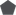
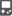
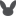
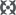

## Game of origin

The game of origin is a value in the Pokémon data structure that indicates the game a Pokémon was originally obtained in. This value was introduced in Generation III. It determines the origin mark of the Pokémon.

| Game               | Origin Mark | Met location following transfer                                          |
|--------------------|-------------|--------------------------------------------------------------------------|
| unused             |             | a distant land                                                           |
| Sapphire           |             | the Hoenn region                                                         |
| Ruby               |             | the Hoenn region                                                         |
| Emerald            |             | the Hoenn region                                                         |
| FireRed            |             | the Kanto region                                                         |
| LeafGreen          |             | the Kanto region                                                         |
| unused             |             | a distant land                                                           |
| HeartGold          |             | the Johto region                                                         |
| SoulSilver         |             | the Johto region                                                         |
| unused             |             | a distant land                                                           |
| Diamond            |             | the Sinnoh region                                                        |
| Pearl              |             | the Sinnoh region                                                        |
| Platinum           |             | the Sinnoh region                                                        |
| unused             |             | a distant land                                                           |
| unused             |             | a distant land                                                           |
| Colosseum & XD     |             | a distant land                                                           |
| unused             |             | a distant land                                                           |
| unused             |             | a distant land                                                           |
| unused             |             | a distant land                                                           |
| unused             |             | a distant land                                                           |
| White              |             | the Unova region                                                         |
| Black              |             | the Unova region                                                         |
| White 2            |             | the Unova region                                                         |
| Black 2            |             | the Unova region                                                         |
| X                  |  | the Kalos region                                                         |
| Y                  |  | the Kalos region                                                         |
| Alpha Sapphire     |  | the Hoenn region                                                         |
| Omega Ruby         |  | the Hoenn region                                                         |
| unused             |  | the Kalos region                                                         |
| unused             |  | the Kalos region                                                         |
| Sun                |  | the Alola region                                                         |
| Moon               |  | the Alola region                                                         |
| Ultra Sun          |  | the Alola region                                                         |
| Ultra Moon         |  | the Alola region                                                         |
| Pokémon GO         |  | Pokémon GO                                                               |
| Red                |  | the Kanto region in the good old days                                    |
| Blue or Green      |  | the Kanto region in the good old days                                    |
| Blue (Japanese)    |  | the Kanto region in the good old days                                    |
| Yellow             |  | the Kanto region in the good old days                                    |
| Gold               |  | the Johto region in the good old days                                    |
| Silver             |  | the Johto region in the good old days                                    |
| Crystal            |  | the Johto region in the good old days                                    |
| Let's Go, Pikachu! |  | the Kanto region                                                         |
| Let's Go, Eevee!   |  | the Kanto region                                                         |
| Sword              |  | the Galar region                                                         |
| Shield             |  | the Galar region                                                         |
| unused             |             | Pokémon HOME                                                             |
| Legends: Arceus    |  | the Hisui region; the Sinnoh region of oldBDSP; the Faraway placeSwSh  |
| Brilliant Diamond  |  | the Sinnoh region; the Sinnoh region made newLA; the Faraway placeSwSh |
| Shining Pearl      |  | the Sinnoh region the Sinnoh region made the Faraway placeSwSh         |
| Scarlet            |  | the Paldea region; the Faraway placeSwSh; a distant landBDSPLA        |
| Violet             |  | the Paldea region; the Faraway placeSwSh; a distant landBDSPLA        |
