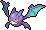
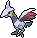
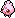
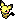

# Hoenn-Pokédex

 Nr. | Icon          | Name
-----|---------------|----------------
 001 |  | [[Geckarbor]]
 002 |  | [[Reptain]]
 003 |  | [[Gewaldro]]
 004 |  | [[Flemmli]]
 005 |  | [[Jungglut]]
 006 |  | [[Lohgock]]
 007 |  | [[Hydropi]]
 008 |  | [[Moorabbel]]
 009 |  | [[Sumpex]]
 010 | {{#icon:261}} | [[Fiffyen]]
 011 | {{#icon:262}} | [[Magnayen]]
 012 | {{#icon:263}} | [[Zigzachs]]
 013 | {{#icon:264}} | [[Geradaks]]
 014 | {{#icon:265}} | [[Waumpel]]
 015 | {{#icon:266}} | [[Schaloko]]
 016 | {{#icon:267}} | [[Papinella]]
 017 | {{#icon:268}} | [[Panekon]]
 018 | {{#icon:269}} | [[Pudox]]
 019 | {{#icon:270}} | [[Loturzel]]
 020 | {{#icon:271}} | [[Lombrero]]
 021 | {{#icon:272}} | [[Kappalores]]
 022 | {{#icon:273}} | [[Samurzel]]
 023 | {{#icon:274}} | [[Blanas]]
 024 | {{#icon:275}} | [[Tengulist]]
 025 | {{#icon:276}} | [[Schwalbini]]
 026 | {{#icon:277}} | [[Schwalboss]]
 027 | {{#icon:278}} | [[Wingull]]
 028 | {{#icon:279}} | [[Pelipper]]
 029 | {{#icon:280}} | [[Trasla]]
 030 | {{#icon:281}} | [[Kirlia]]
 031 | {{#icon:282}} | [[Guardevoir]]
 032 | {{#icon:475}} | [[Galagladi]]
 033 | {{#icon:283}} | [[Gehweiher]]
 034 | {{#icon:284}} | [[Maskeregen]]
 035 | {{#icon:285}} | [[Knilz]]
 036 | {{#icon:286}} | [[Kapilz]]
 037 | {{#icon:287}} | [[Bummelz]]
 038 | {{#icon:288}} | [[Muntier]]
 039 | {{#icon:289}} | [[Letarking]]
 040 |  | [[Abra]]
 041 |  | [[Kadabra]]
 042 |  | [[Simsala]]
 043 | {{#icon:290}} | [[Nincada]]
 044 | {{#icon:291}} | [[Ninjask]]
 045 | {{#icon:292}} | [[Ninjatom]]
 046 | {{#icon:293}} | [[Flurmel]]
 047 | {{#icon:294}} | [[Krakeelo]]
 048 | {{#icon:295}} | [[Krawumms]]
 049 | {{#icon:296}} | [[Makuhita]]
 050 | {{#icon:297}} | [[Hariyama]]
 051 |  | [[Goldini]]
 052 |  | [[Golking]]
 053 |  | [[Karpador]]
 054 |  | [[Garados]]
 055 | {{#icon:298}} | [[Azurill]]
 056 | {{#icon:183}} | [[Marill]]
 057 | {{#icon:184}} | [[Azumarill]]
 058 |  | [[Kleinstein]]
 059 |  | [[Georok]]
 060 |  | [[Geowaz]]
 061 | {{#icon:299}} | [[Nasgnet]]
 062 | {{#icon:476}} | [[Voluminas]]
 063 | {{#icon:300}} | [[Eneco]]
 064 | {{#icon:301}} | [[Enekoro]]
 065 |  | [[Zubat]]
 066 |  | [[Golbat]]
 067 |  | [[Iksbat]]
 068 |  | [[Tentacha]]
 069 |  | [[Tentoxa]]
 070 |  | [[Zobiris]]
 071 | {{#icon:303}} | [[Flunkifer]]
 072 | {{#icon:304}} | [[Stollunior]]
 073 | {{#icon:305}} | [[Stollrak]]
 074 | {{#icon:306}} | [[Stolloss]]
 075 |  | [[Machollo]]
 076 |  | [[Maschock]]
 077 |  | [[Machomei]]
 078 | {{#icon:307}} | [[Meditie]]
 079 | {{#icon:308}} | [[Meditalis]]
 080 | {{#icon:309}} | [[Frizelbliz]]
 081 | {{#icon:310}} | [[Voltenso]]
 082 | {{#icon:311}} | [[Plusle]]
 083 | {{#icon:312}} | [[Minun]]
 084 |  | [[Magnetilo]]
 085 |  | [[Magneton]]
 086 | {{#icon:462}} | [[Magnezone]]
 087 |  | [[Voltobal]]
 088 |  | [[Lektrobal]]
 089 | {{#icon:313}} | [[Volbeat]]
 090 | {{#icon:314}} | [[Illumise]]
 091 |  | [[Myrapla]]
 092 |  | [[Duflor]]
 093 |  | [[Giflor]]
 094 | {{#icon:182}} | [[Blubella]]
 095 |  | [[Dodu]]
 096 |  | [[Dodri]]
 097 | {{#icon:406}} | [[Knospi]]
 098 | {{#icon:315}} | [[Roselia]]
 099 | {{#icon:407}} | [[Roserade]]
 100 | {{#icon:316}} | [[Schluppuck]]
 101 | {{#icon:317}} | [[Schlukwech]]
 102 | {{#icon:318}} | [[Kanivanha]]
 103 | {{#icon:319}} | [[Tohaido]]
 104 | {{#icon:320}} | [[Wailmer]]
 105 | {{#icon:321}} | [[Wailord]]
 106 |  | [[Camaub]]
 107 |  | [[Camerupt]]
 108 |  | [[Schneckmag]]
 109 |  | [[Magcargo]]
 110 |  | [[Qurtel]]
 111 |  | [[Sleima]]
 112 |  | [[Sleimok]]
 113 |  | [[Smogon]]
 114 |  | [[Smogmog]]
 115 | {{#icon:325}} | [[Spoink]]
 116 | {{#icon:326}} | [[Groink]]
 117 |  | [[Sandan]]
 118 |  | [[Sandamer]]
 119 | {{#icon:327}} | [[Pandir]]
 120 |  | [[Panzaeron]]
 121 | {{#icon:328}} | [[Knacklion]]
 122 | {{#icon:329}} | [[Vibrava]]
 123 | {{#icon:330}} | [[Libelldra]]
 124 | {{#icon:331}} | [[Tuska]]
 125 | {{#icon:332}} | [[Noktuska]]
 126 | {{#icon:333}} | [[Wablu]]
 127 | {{#icon:334}} | [[Altaria]]
 128 | {{#icon:335}} | [[Sengo]]
 129 | {{#icon:336}} | [[Vipitis]]
 130 | {{#icon:337}} | [[Lunastein]]
 131 | {{#icon:338}} | [[Sonnfel]]
 132 | {{#icon:339}} | [[Schmerbe]]
 133 | {{#icon:340}} | [[Welsar]]
 134 | {{#icon:341}} | [[Krebscorps]]
 135 | {{#icon:342}} | [[Krebutack]]
 136 | {{#icon:343}} | [[Puppance]]
 137 | {{#icon:344}} | [[Lepumentas]]
 138 | {{#icon:345}} | [[Liliep]]
 139 | {{#icon:346}} | [[Wielie]]
 140 | {{#icon:347}} | [[Anorith]]
 141 | {{#icon:348}} | [[Armaldo]]
 142 |  | [[Fluffeluff]]
 143 |  | [[Pummeluff]]
 144 |  | [[Knuddeluff]]
 145 | {{#icon:349}} | [[Barschwa]]
 146 | {{#icon:350}} | [[Milotic]]
 147 | {{#icon:351}} | [[Formeo]]
 148 |  | [[Sterndu]]
 149 |  | [[Starmie]]
 150 | {{#icon:352}} | [[Kecleon]]
 151 | {{#icon:353}} | [[Shuppet]]
 152 | {{#icon:354}} | [[Banette]]
 153 | {{#icon:355}} | [[Zwirrlicht]]
 154 | {{#icon:356}} | [[Zwirrklop]]
 155 | {{#icon:477}} | [[Zwirrfinst]]
 156 | {{#icon:357}} | [[Tropius]]
 157 | {{#icon:433}} | [[Klingplim]]
 158 | {{#icon:358}} | [[Palimpalim]]
 159 | {{#icon:359}} | [[Absol]]
 160 |  | [[Vulpix]]
 161 |  | [[Vulnona]]
 162 |  | [[Pichu]]
 163 |  | [Pikachu](DexEntries/Pikachu.md)
 164 |  | [[Raichu]]
 165 |  | [[Enton]]
 166 |  | [[Entoron]]
 167 | {{#icon:360}} | [[Isso]]
 168 | {{#icon:202}} | [[Woingenau]]
 169 | {{#icon:177}} | [[Natu]]
 170 | {{#icon:178}} | [[Xatu]]
 171 | {{#icon:203}} | [[Girafarig]]
 172 |  | [[Phanpy]]
 173 |  | [[Donphan]]
 174 |  | [[Pinsir]]
 175 | {{#icon:214}} | [[Skaraborn]]
 176 |  | [[Rihorn]]
 177 |  | [[Rizeros]]
 178 | {{#icon:464}} | [[Rihornior]]
 179 | {{#icon:361}} | [[Schneppke]]
 180 | {{#icon:362}} | [[Firnontor]]
 181 | {{#icon:478}} | [[Frosdedje]]
 182 | {{#icon:363}} | [[Seemops]]
 183 | {{#icon:364}} | [[Seejong]]
 184 | {{#icon:365}} | [[Walraisa]]
 185 | {{#icon:366}} | [[Perlu]]
 186 | {{#icon:367}} | [[Aalabyss]]
 187 | {{#icon:368}} | [[Saganabyss]]
 188 | {{#icon:369}} | [[Relicanth]]
 189 | {{#icon:222}} | [[Corasonn]]
 190 | {{#icon:170}} | [[Lampi]]
 191 | {{#icon:171}} | [[Lanturn]]
 192 | {{#icon:370}} | [[Liebiskus]]
 193 |  | [[Seeper]]
 194 |  | [[Seemon]]
 195 | {{#icon:230}} | [[Seedraking]]
 196 | {{#icon:371}} | [[Kindwurm]]
 197 | {{#icon:372}} | [[Draschel]]
 198 | {{#icon:373}} | [[Brutalanda]]
 199 | {{#icon:374}} | [[Tanhel]]
 200 | {{#icon:375}} | [[Metang]]
 201 | {{#icon:376}} | [[Metagross]]
 202 | {{#icon:377}} | [[Regirock]]
 203 | {{#icon:378}} | [[Regice]]
 204 | {{#icon:379}} | [[Registeel]]
 205 | {{#icon:380}} | [[Latias]]
 206 | {{#icon:381}} | [[Latios]]
 207 | {{#icon:382}} | [[Kyogre]]
 208 | {{#icon:383}} | [[Groudon]]
 209 | {{#icon:384}} | [[Rayquaza]]
 210 | {{#icon:385}} | [[Jirachi]]
 211 | {{#icon:386}} | [[Deoxys]]

#pokemon
