# Galar-Pokédex

 Nr. | Icon  | Name
-----|----------------------------------------------------------------------------------|------------------------------------------------------------------------
 001 |  | [[Chimpep]]
 002 | {{#icon:Chimstix}}   | [[Chimstix]]
 003 | {{#icon:Gortrom}}    | [[Gortrom]]
 004 | {{#icon:Hopplo}}     | [[Hopplo]]
 005 | {{#icon:Kickerlo}}   | [[Kickerlo]]
 006 | {{#icon:Liberlo}}    | [[Liberlo]]
 007 | {{#icon:Memmeon}}    | [[Memmeon]]
 008 | {{#icon:Phlegleon}}  | [[Phlegleon]]
 009 | {{#icon:Intelleon}}  | [[Intelleon]]
 010 | 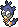    | [[Sensect]]
 011 | 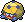    | [[Keradar]]
 012 | 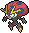 | [[Maritellit]]
 013 | {{#icon:Raupy}}      | [[Raupy]]
 014 | {{#icon:Safcon}}     | [[Safcon]]
 015 | {{#icon:Smettbo}}    | [[Smettbo]]
 016 |  | [[Mabula]]
 017 |  | [[Akkup]]
 018 |  | [[Donarion]]
 019 | {{#icon:Hoothoot}}   | [[Hoothoot]]
 020 | {{#icon:Noctuh}}     | [[Noctuh]]
 021 | {{#icon:Meikro}}     | [[Meikro]]
 022 | {{#icon:Kranoviz}}   | [[Kranoviz]]
 023 | {{#icon:Krarmor}}    | [[Krarmor]]
 024 | {{#icon:Raffel}}     | [[Raffel]]
 025 | {{#icon:Schlaraffel}}     | [[Schlaraffel]]
 026 | {{#icon:Dusselgurr}} | [[Dusselgurr]]
 027 | {{#icon:Navitaub}}   | [[Navitaub]]
 028 | {{#icon:Fasasnob}}   | [[Fasasnob]]
 029 | {{#icon:Kleptifux}}  | [[Kleptifux]]
 030 | {{#icon:Gaunux}}     | [[Gaunux]]
 031 | {{#icon:Zigzachs}} {{#icon:263a}}   | [[Zigzachs]] (Galar-Form)
 032 | {{#icon:Geradaks}} {{#icon:264a}}   | [[Geradaks]] (Galar-Form)
 033 | {{#icon:Barrikadax}} | [[Barrikadax]]
 034 | {{#icon:Wolly}}      | [[Wolly]]
 035 | {{#icon:Zwollock}}   | [[Zwollock]]
 036 | {{#icon:Loturzel}}   | [[Loturzel]]
 037 | {{#icon:Lombrero}}   | [[Lombrero]]
 038 | {{#icon:Kappalores}} | [[Kappalores]]
 039 | {{#icon:Samurzel}}   | [[Samurzel]]
 040 | {{#icon:Blanas}}     | [[Blanas]]
 041 | {{#icon:Tengulist}}  | [[Tengulist]]
 042 |    | [[Kamehaps]]
 043 |      | [[Kamalm]]
 044 | {{#icon:Felilou}}    | [[Felilou]]
 045 | {{#icon:Kleoparda}}  | [[Kleoparda]]
 046 | {{#icon:Voldi}}      | [[Voldi]]
 047 | {{#icon:Bellektro}}  | [[Bellektro]]
 048 | {{#icon:Scoppel}}    | [[Scoppel]]
 049 | {{#icon:Grebbit}}    | [[Grebbit]]
 050 | {{#icon:Picochilla}} | [[Picochilla]]
 051 | {{#icon:Chillabell}} | [[Chillabell]]
 052 | {{#icon:Frubberl}}   | [[Frubberl]]
 053 | {{#icon:Frubaila}}   | [[Frubaila]]
 054 | {{#icon:Fruyal}}     | [[Fruyal]]
 055 | {{#icon:Myrapla}}    | [[Myrapla]]
 056 | {{#icon:Duflor}}     | [[Duflor]]
 057 | {{#icon:Giflor}}     | [[Giflor]]
 058 | {{#icon:Blubella}}   | [[Blubella]]
 059 | {{#icon:Knospi}}     | [[Knospi]]
 060 | {{#icon:Roselia}}    | [[Roselia]]
 061 | {{#icon:Roserade}}   | [[Roserade]]
 062 |     | [[Wingull]]
 063 |    | [[Pelipper]]
 064 | {{#icon:Wattzapf}}   | [[Wattzapf]]
 065 | {{#icon:Voltula}}    | [[Voltula]]
 066 | {{#icon:Frizelbliz}} | [[Frizelbliz]]
 067 | {{#icon:Voltenso}}   | [[Voltenso]]
 068 | {{#icon:Vulpix}}     | [[Vulpix]]
 069 | {{#icon:Vulnona}}    | [[Vulnona]]
 070 | {{#icon:Fukano}}     | [[Fukano]]
 071 | {{#icon:Arkani}}     | [[Arkani]]
 072 | {{#icon:Gelatini}}   | [[Gelatini]]
 073 | {{#icon:Gelatroppo}} | [[Gelatroppo]]
 074 | {{#icon:Gelatwino}}  | [[Gelatwino]]
 075 | {{#icon:Quiekel}}    | [[Quiekel]]
 076 | {{#icon:Keifel}}     | [[Keifel]]
 077 | {{#icon:Mamutel}}    | [[Mamutel]]
 078 | {{#icon:Botogel}}    | [[Botogel]]
 079 | {{#icon:Schneppke}}  | [[Schneppke]]
 080 | {{#icon:Firnontor}}  | [[Firnontor]]
 081 | {{#icon:Frosdedje}}  | [[Frosdedje]]
 082 | {{#icon:Puppance}}   | [[Puppance]]
 083 | {{#icon:Lepumentas}} | [[Lepumentas]]
 084 | {{#icon:Pampuli}}    | [[Pampuli]]
 085 | {{#icon:Pampross}}   | [[Pampross]]
 086 | 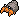  | [[Lithomith]]
 087 | 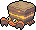 | [[Castellith]]
 088 | {{#icon:Golbit}}     | [[Golbit]]
 089 | {{#icon:Golgantes}}  | [[Golgantes]]
 090 | {{#icon:Somniam}}    | [[Somniam]]
 091 | {{#icon:Somnivora}}  | [[Somnivora]]
 092 | {{#icon:Natu}}       | [[Natu]]
 093 | {{#icon:Xatu}}       | [[Xatu]]
 094 | {{#icon:Velursi}}    | [[Velursi]]
 095 | {{#icon:Kosturso}}   | [[Kosturso]]
 096 | {{#icon:Shnebedeck}} | [[Shnebedeck]]
 097 | {{#icon:Rexblisar}}  | [[Rexblisar]]
 098 |      | [[Krabby]]
 099 |     | [[Kingler]]
 100 |      | [[Felino]]
 101 | 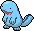    | [[Morlord]]
 102 | 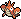 | [[Krebscorps]]
 103 | 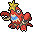  | [[Krebutack]]
 104 | {{#icon:Nincada}}    | [[Nincada]]
 105 | {{#icon:Ninjask}}    | [[Ninjask]]
 106 | {{#icon:Ninjatom}}   | [[Ninjatom]]
 107 | {{#icon:Rabauz}}     | [[Rabauz]]
 108 | {{#icon:Kicklee}}    | [[Kicklee]]
 109 | {{#icon:Nockchan}}   | [[Nockchan]]
 110 | {{#icon:Kapoera}}    | [[Kapoera]]
 111 | {{#icon:Pam-Pam}}    | [[Pam-Pam]]
 112 | {{#icon:Pandagro}}   | [[Pandagro]]
 113 | {{#icon:Klikk}}      | [[Klikk]]
 114 | {{#icon:Kliklak}}    | [[Kliklak]]
 115 | {{#icon:Klikdiklak}} | [[Klikdiklak]]
 116 |    | [[Wadribie]]
 117 |   | [[Honweisel]]
 118 | {{#icon:Bronzel}}    | [[Bronzel]]
 119 | {{#icon:Bronzong}}   | [[Bronzong]]
 120 |      | [[Trasla]]
 121 |      | [[Kirlia]]
 122 |  | [[Guardevoir]]
 123 |   | [[Galagladi]]
 124 |    | [[Driftlon]]
 125 |  | [[Drifzepeli]]
 126 | {{#icon:Cottini}}    | [[Cottini]]
 127 | {{#icon:Cottomi}}    | [[Cottomi]]
 128 | {{#icon:Kikugi}}     | [[Kikugi]]
 129 | {{#icon:Kinoso}}     | [[Kinoso]]
 130 | {{#icon:Skunkapuh}}  | [[Skunkapuh]]
 131 | {{#icon:Skuntank}}   | [[Skuntank]]
 132 | {{#icon:Schallquap}} | [[Schallquap]]
 133 | {{#icon:Mebrana}}    | [[Mebrana]]
 134 | {{#icon:Branawarz}}  | [[Branawarz]]
 135 | {{#icon:Zwirrlicht}} | [[Zwirrlicht]]
 136 | {{#icon:Zwirrklop}}  | [[Zwirrklop]]
 137 | {{#icon:Zwirrfinst}} | [[Zwirrfinst]]
 138 | {{#icon:Machollo}}   | [[Machollo]]
 139 | {{#icon:Maschock}}   | [[Maschock]]
 140 | {{#icon:Machomei}}   | [[Machomei]]
 141 | {{#icon:Nebulak}}    | [[Nebulak]]
 142 | {{#icon:Alpollo}}    | [[Alpollo]]
 143 | {{#icon:Gengar}}     | [[Gengar]]
 144 |    | [[Karpador]]
 145 |     | [[Garados]]
 146 |     | [[Goldini]]
 147 |     | [[Golking]]
 148 | 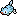   | [[Remoraid]]
 149 | 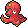  | [[Octillery]]
 150 |     | [[Muschas]]
 151 |      | [[Austos]]
 152 | {{#icon:Barschwa}}   | [[Barschwa]]
 153 | {{#icon:Milotic}}    | [[Milotic]]
 154 | {{#icon:Barschuft}}  | [[Barschuft]]
 155 |    | [[Lusardin]]
 156 | {{#icon:Gufa}}       | [[Gufa]]
 157 | {{#icon:Unratütox}}  | [[Unratütox]]
 158 | {{#icon:Deponitox}}  | [[Deponitox]]
 159 | {{#icon:Thermopod}}  | [[Thermopod]]
 160 | {{#icon:Infernopod}} | [[Infernopod]]
 161 | {{#icon:Klonkett}}   | [[Klonkett]]
 162 | {{#icon:Wagong}}     | [[Wagong]]
 163 | {{#icon:Montecarbo}} | [[Montecarbo]]
 164 | {{#icon:Digda}}      | [[Digda]]
 165 | {{#icon:Digdri}}     | [[Digdri]]
 166 | {{#icon:Rotomurf}}   | [[Rotomurf]]
 167 | {{#icon:Stalobor}}   | [[Stalobor]]
 168 | 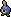   | [[Kiesling]]
 169 | 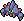 | [[Sedimantur]]
 170 | 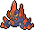 | [[Brockoloss]]
 171 | {{#icon:Praktibalk}} | [[Praktibalk]]
 172 | {{#icon:Strepoli}}   | [[Strepoli]]
 173 | {{#icon:Meistagrif}} | [[Meistagrif]]
 174 | 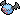   | [[Fleknoil]]
 175 | 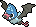   | [[Fletiamo]]
 176 | {{#icon:eF-eM}}      | [[eF-eM]]
 177 | {{#icon:UHaFnir}}    | [[UHaFnir]]
 178 | {{#icon:Onix}}       | [[Onix]]
 179 | {{#icon:Stahlos}}    | [[Stahlos]]
 180 |      | [[Pikuda]]
 181 |  | [[Barrakiefa]]
 182 | {{#icon:Mauzi}} {{#icon:052b}}      | [[Mauzi]] (Galar-Form)
 183 | {{#icon:Mauzinger}}  | [[Mauzinger]]
 184 | {{#icon:}} | [[]]
 185 | {{#icon:Hokumil}}    | [[Hokumil]]
 186 | {{#icon:Pokusan}}    | [[Pokusan]]
 187 | {{#icon:Wommel}}     | [[Wommel]]
 188 | {{#icon:Bandelby}}   | [[Bandelby]]
 189 | {{#icon:Kastadur}}   | [[Kastadur]]
 190 | {{#icon:Tentantel}}  | [[Tentantel]]
 191 | {{#icon:Irrbis}}     | [[Irrbis]]
 192 | {{#icon:Pumpdjinn}}  | [[Pumpdjinn]]
 193 |       | [[Pichu]]
 194 |     | [Pikachu](DexEntries/Pikachu.md)
 195 |      | [[Raichu]]
 196 | {{#icon:Evoli}}      | [[Evoli]]
 197 | {{#icon:Aquana}}     | [[Aquana]]
 198 | {{#icon:Blitza}}     | [[Blitza]]
 199 | {{#icon:Flamara}}    | [[Flamara]]
 200 | {{#icon:Psiana}}     | [[Psiana]]
 201 | {{#icon:Nachtara}}   | [[Nachtara]]
 202 | {{#icon:Folipurba}}  | [[Folipurba]]
 203 | {{#icon:Glaziola}}   | [[Glaziola]]
 204 | {{#icon:Feelinara}}  | [[Feelinara]]
 205 |     | [[Knapfel]]
 206 |     | [[Drapfel]]
 207 |   | [[Schlapfel]]
 208 | {{#icon:Psiau}}      | [[Psiau]]
 209 | {{#icon:Psiaugon}}   | [[Psiaugon]]
 210 | {{#icon:Flauschling}}     | [[Flauschling]]
 211 | {{#icon:Sabbaione}}  | [[Sabbaione]]
 212 | {{#icon:Parfi}}      | [[Parfi]]
 213 | {{#icon:Parfinesse}} | [[Parfinesse]]
 214 | {{#icon:Araqua}}     | [[Araqua]]
 215 | {{#icon:Aranestro}}  | [[Aranestro]]
 216 | {{#icon:Isso}}       | [[Isso]]
 217 | {{#icon:Woingenau}}  | [[Woingenau]]
 218 | {{#icon:Porenta}} {{#icon:083a}}    | [[Porenta]] (Galar-Form)
 219 | {{#icon:Lauchzelot}} | [[Lauchzelot]]
 220 | 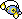}      | [[Lampi]]
 221 | 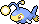}    | [[Lanturn]]
 222 |   | [[Glibunkel]]
 223 |    | [[Toxiquak]]
 224 | 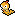   | [[Zurrokex]]
 225 |      | [[Irokex]]
 226 | {{#icon:Flunschlik}} {{#icon:618a}} | [[Flunschlik]] (Galar-Form)
 227 | {{#icon:Pottrott}}   | [[Pottrott]]
 228 |    | [[Schmerbe]]
 229 |      | [[Welsar]]
 230 | {{#icon:Schalellos}} | [[Schalellos]]
 231 | {{#icon:Gastrodon}}  | [[Gastrodon]]
 232 | 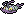   | [[Reißlaus]]
 233 | 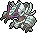    | [[Tectass]]
 234 | {{#icon:Bithora}}    | [[Bithora]]
 235 | {{#icon:Thanathora}} | [[Thanathora]]
 236 | {{#icon:Corasonn}} {{#icon:222a}}   | [[Corasonn]] (Galar-Form)
 237 | {{#icon:Gorgasonn}}  | [[Gorgasonn]]
 238 | {{#icon:Bähmon}}     | [[Bähmon]]
 239 | {{#icon:Pelzebub}}   | [[Pelzebub]]
 240 | {{#icon:Olangaar}}   | [[Olangaar]]
 241 | {{#icon:Brimova}}    | [[Brimova]]
 242 | {{#icon:Brimano}}    | [[Brimano]]
 243 | {{#icon:Silembrim}}  | [[Silembrim]]
 244 |      | [[Molunk]]
 245 |      | [[Amfira]]
 246 |  | [[Gladiantri]]
 247 |    | [[Caesurio]]
 248 | {{#icon:Jiutesto}}   | [[Jiutesto]]
 249 | {{#icon:Karadonis}}  | [[Karadonis]]
 250 | {{#icon:Smogon}}     | [[Smogon]]
 251 | {{#icon:Smogmog}} {{#icon:110a}}    | [[Smogmog]] (Galar-Form)
 252 | {{#icon:Mobai}}      | [[Mobai]]
 253 | {{#icon:Mogelbaum}}  | [[Mogelbaum]]
 254 | {{#icon:Pii}}        | [[Pii]]
 255 | {{#icon:Piepi}}      | [[Piepi]]
 256 | {{#icon:Pixi}}       | [[Pixi]]
 257 | {{#icon:Togepi}}     | [[Togepi]]
 258 | {{#icon:Togetic}}    | [[Togetic]]
 259 | {{#icon:Togekiss}}   | [[Togekiss]]
 260 | {{#icon:Mampfaxo}}   | [[Mampfaxo]]
 261 | {{#icon:Relaxo}}     | [[Relaxo]]
 262 | {{#icon:Waumboll}}   | [[Waumboll]]
 263 | {{#icon:Elfun}}      | [[Elfun]]
 264 |      | [[Rihorn]]
 265 |     | [[Rizeros]]
 266 |   | [[Rihornior]]
 267 | {{#icon:Mollimorba}} | [[Mollimorba]]
 268 | {{#icon:Hypnomorba}} | [[Hypnomorba]]
 269 | {{#icon:Morbitesse}} | [[Morbitesse]]
 270 | {{#icon:Monozyto}}   | [[Monozyto]]
 271 | {{#icon:Mitodos}}    | [[Mitodos]]
 272 | {{#icon:Zytomega}}   | [[Zytomega]]
 273 | 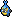    | [[Laukaps]]
 274 | 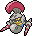 | [[Cavalanzas]]
 275 | 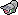 | [[Schnuthelm]]
 276 | 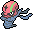   | [[Hydragil]]
 277 | {{#icon:Pygraulon}}  | [[Pygraulon]]
 278 | {{#icon:Megalon}}    | [[Megalon]]
 279 | {{#icon:Petznief}}   | [[Petznief]]
 280 | {{#icon:Siberio}}    | [[Siberio]]
 281 |  | [[Geronimatz]]
 282 |   | [[Washakwil]]
 283 | 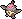    | [[Skallyk]]
 284 | 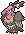 | [[Grypheldis]]
 285 |   | [[Pionskora]]
 286 | 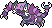  | [[Piondragi]]
 287 | {{#icon:Lichtel}}    | [[Lichtel]]
 288 | {{#icon:Laternecto}} | [[Laternecto]]
 289 | {{#icon:Skelabra}}   | [[Skelabra]]
 290 |     | [[Iscalar]]
 291 |  | [[Calamanero]]
 292 | {{#icon:Sniebel}}    | [[Sniebel]]
 293 | {{#icon:Snibunna}}   | [[Snibunna]]
 294 | {{#icon:Zobiris}}    | [[Zobiris]]
 295 | {{#icon:Flunkifer}}  | [[Flunkifer]]
 296 | {{#icon:Maracamba}}  | [[Maracamba]]
 297 | {{#icon:Symvolara}}  | [[Symvolara]]
 298 | {{#icon:Riolu}}      | [[Riolu]]
 299 | {{#icon:Lucario}}    | [[Lucario]]
 300 |      | [[Qurtel]]
 301 | {{#icon:Mimigma}}    | [[Mimigma]]
 302 |    | [[Kupfanti]]
 303 |  | [[Patinaraja]]
 304 | {{#icon:Baldorfish}} | [[Baldorfish]]
 305 | 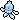    | [[Quabbel]]
 306 | 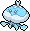 | [[Apoquallyp]]
 307 | {{#icon:Garstella}}  | [[Garstella]]
 308 | {{#icon:Aggrostella}}     | [[Aggrostella]]
 309 | 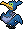       | [[Urgl]]
 310 | {{#icon:Toxel}}      | [[Toxel]]
 311 | {{#icon:Riffex}}     | [[Riffex]]
 312 |     | [[Salanga]]
 313 |   | [[Sanaconda]]
 314 | {{#icon:Hippopotas}} | [[Hippopotas]]
 315 | {{#icon:Hippoterus}} | [[Hippoterus]]
 316 | {{#icon:Fermicula}}  | [[Fermicula]]
 317 | {{#icon:Furnifraß}}  | [[Furnifraß]]
 318 | {{#icon:Eguana}}     | [[Eguana]]
 319 | {{#icon:Elezard}}    | [[Elezard]]
 320 | {{#icon:Resladero}}  | [[Resladero]]
 321 | {{#icon:Knacklion}}  | [[Knacklion]]
 322 | {{#icon:Vibrava}}    | [[Vibrava]]
 323 | {{#icon:Libelldra}}  | [[Libelldra]]
 324 | {{#icon:Milza}}      | [[Milza]]
 325 | {{#icon:Sharfax}}    | [[Sharfax]]
 326 | {{#icon:Maxax}}      | [[Maxax]]
 327 | {{#icon:Makabaja}} {{#icon:562a}}   | [[Makabaja]] (Galar-Form)
 328 | {{#icon:Oghnatoll}}  | [[Oghnatoll]]
 329 | {{#icon:Echnatoll}}  | [[Echnatoll]]
 330 | {{#icon:Gramokles}}  | [[Gramokles]]
 331 | {{#icon:Duokles}}    | [[Duokles]]
 332 | {{#icon:Durengard}}  | [[Durengard]]
 333 | {{#icon:Ponita}} {{#icon:077a}}     | [[Ponita]] (Galar-Form)
 334 | {{#icon:Gallopa}} {{#icon:078a}}    | [[Gallopa]] (Galar-Form)
 335 | {{#icon:Fatalitee}}  | [[Fatalitee]]
 336 | {{#icon:Mortipot}}   | [[Mortipot]]
 337 |      | [[Servol]]
 338 | {{#icon:Paragoni}}   | [[Paragoni]]
 339 | {{#icon:Trombork}}   | [[Trombork]]
 340 | {{#icon:Bubungus}}   | [[Bubungus]]
 341 | {{#icon:Lamellux}}   | [[Lamellux]]
 342 |      | [[Kommandutan]]
 343 |  | [[Quartermak]]
 344 |     | [[Morpeko]]
 345 | {{#icon:Legios}}     | [[Legios]]
 346 | {{#icon:Sen-Long}}   | [[Sen-Long]]
 347 | {{#icon:Tortunator}} | [[Tortunator]]
 348 | {{#icon:Togedemaru}} | [[Togedemaru]]
 349 |  | [[Snomnom]]
 350 | {{#icon:Mottineva}}  | [[Mottineva]]
 351 | 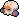 | [[Klopptopus]]
 352 | 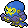     | [[Kaocto]]
 353 |   | [[Britzigel]]
 354 | 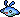   | [[Mantirps]]
 355 |      | [[Mantax]]
 356 | 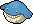    | [[Wailmer]]
 357 | 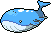    | [[Wailord]]
 358 | {{#icon:Arktip}}     | [[Arktip]]
 359 | {{#icon:Arktilas}}   | [[Arktilas]]
 360 | {{#icon:Moruda}}     | [[Moruda]]
 361 | {{#icon:Lapras}}     | [[Lapras]]
 362 | {{#icon:Lunastein}}  | [[Lunastein]]
 363 | {{#icon:Sonnfel}}    | [[Sonnfel]]
 364 | {{#icon:Pantimimi}}  | [[Pantimimi]]
 365 | {{#icon:Pantimos}} {{#icon:122a}}   | [[Pantimos]] (Galar-Form)
 366 | {{#icon:Pantifrost}} | [[Pantifrost]]
 367 | {{#icon:Flampion}} {{#icon:554a}}   | [[Flampion]] (Galar-Form)
 368 | {{#icon:Flampivian}} {{#icon:555b}} {{#icon:555a}} {{#icon:555c}} | [[Flampivian]] (Galar-Form) (Trance-Modus) (Galar-Form)
 369 |   | [[Humanolith]]
 370 |     | [[Kubuin]]
 371 |  | [[Duraludon]]
 372 | {{#icon:Rotom}}      | [[Rotom]]
 373 |       | [[Ditto]]
 374 |   | [[Lectragon]]
 375 |   | [[Lecryodon]]
 376 |  | [[Pescragon]]
 377 |  | [[Pescryodon]]
 378 | {{#icon:Glumanda}}   | [[Glumanda]]
 379 | {{#icon:Glutexo}}    | [[Glutexo]]
 380 | {{#icon:Glurak}}     | [[Glurak]]
 381 | {{#icon:Typ:Null}}   | [[Typ:Null]]
 382 | {{#icon:Amigento}}   | [[Amigento]]
 383 | {{#icon:Larvitar}}   | [[Larvitar]]
 384 | {{#icon:Pupitar}}    | [[Pupitar]]
 385 | {{#icon:Despotar}}   | [[Despotar]]
 386 | {{#icon:Kapuno}}     | [[Kapuno]]
 387 | {{#icon:Duodino}}    | [[Duodino]]
 388 | {{#icon:Trikephalo}} | [[Trikephalo]]
 389 |     | [[Viscora]]
 390 |   | [[Viscargot]]
 391 |    | [[Viscogon]]
 392 | 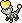    | [[Miniras]]
 393 | 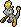    | [[Mediras]]
 394 | 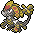  | [[Grandiras]]
 395 |  | [[Grolldra]]
 396 |  | [[Phandra]]
 397 |  | [[Katapuldra]]
 398 |  | [[Zacian]]
 399 |  | [[Zamazenta]]
 400 |  | [[Endynalos]]

#pokemon
