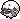
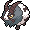
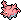
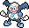
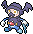
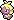
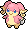

# Galar-Pokédex, Schneelande der Krone

 Nr. | Icon  | Name
-----|----------------------------------------------------------------------------------|------------------------------------------------------------------------
 001 |     | [[Snomnom]]
 002 | | [[Mottineva]]
 003 |     | [[Wolly]]
 004 |  | [[Zwollock]]
 005 |    | [[Raffel]]
 006 |    | [[Schlaraffel]]
 007 |   | [[Quiekel]]
 008 |    | [[Keifel]]
 009 |   | [[Mamutel]]
 010 | | [[Pantimimi]]
 011 |   | [[Pantimos]] (Galar-Form)
 012 |  | [[Pantifrost]]
 013 |    | [[Kussilla]]
 014 |     | [[Rossana]]
 015 |      | [[Elekid]]
 016 |     | [[Elektek]]
 017 |   | [[Elevoltek]]
 018 |       | [[Magby]]
 019 |      | [[Magmar]]
 020 |    | [[Magbrant]]
 021 |     | [[Ohrdoch]]
 022 |    | [[Gelatini]]
 023 |  | [[Gelatroppo]]
 024 |   | [[Gelatwino]]
 025 | {{#icon:Schneppke}}  | [[Schneppke]]
 026 | {{#icon:Firnontor}}  | [[Firnontor]]
 027 | {{#icon:Frosdedje}}  | [[Frosdedje]]
 028 | {{#icon:Sniebel}}    | [[Sniebel]]
 029 | {{#icon:Snibunna}}   | [[Snibunna]]
 030 | {{#icon:Frigometri}} | [[Frigometri]]
 031 | {{#icon:Shnebedeck}} | [[Shnebedeck]]
 032 | {{#icon:Rexblisar}}  | [[Rexblisar]]
 033 | {{#icon:Paragoni}}   | [[Paragoni]]
 034 | {{#icon:Trombork}}   | [[Trombork]]
 035 | {{#icon:Wablu}}      | [[Wablu]]
 036 | {{#icon:Altaria}}    | [[Altaria]]
 037 | {{#icon:Bähmon}}     | [[Bähmon]]
 038 | {{#icon:Pelzebub}}   | [[Pelzebub]]
 039 | {{#icon:Olangaar}}   | [[Olangaar]]
 040 | {{#icon:Brimova}}    | [[Brimova]]
 041 | {{#icon:Brimano}}    | [[Brimano]]
 042 | {{#icon:Silembrim}}  | [[Silembrim]]
 043 | {{#icon:Pii}}        | [[Pii]]
 044 | {{#icon:Piepi}}      | [[Piepi]]
 045 | {{#icon:Pixi}}       | [[Pixi]]
 046 | {{#icon:Mimigma}}    | [[Mimigma]]
 047 | {{#icon:Kryppuk}}    | [[Kryppuk]]
 048 | {{#icon:Lichtel}}    | [[Lichtel]]
 049 | {{#icon:Laternecto}} | [[Laternecto]]
 050 | {{#icon:Skelabra}}   | [[Skelabra]]
 051 | {{#icon:Mollimorba}} | [[Mollimorba]]
 052 | {{#icon:Hypnomorba}} | [[Hypnomorba]]
 053 | {{#icon:Morbitesse}} | [[Morbitesse]]
 054 | {{#icon:Monozyto}}   | [[Monozyto]]
 055 | {{#icon:Mitodos}}    | [[Mitodos]]
 056 | {{#icon:Zytomega}}   | [[Zytomega]]
 057 | {{#icon:Praktibalk}} | [[Praktibalk]]
 058 | {{#icon:Strepoli}}   | [[Strepoli]]
 059 | {{#icon:Meistagrif}} | [[Meistagrif]]
 060 |    | [[Schmerbe]]
 061 |      | [[Welsar]]
 062 |    | [[Karpador]]
 063 |     | [[Garados]]
 064 | {{#icon:Barschuft}}  | [[Barschuft]]
 065 | {{#icon:Nidoran♀}}   | [[Nidoran♀]]
 066 | {{#icon:Nidorina}}   | [[Nidorina]]
 067 | {{#icon:Nidoqueen}}  | [[Nidoqueen]]
 068 | {{#icon:Nidoran♂}}   | [[Nidoran♂]]
 069 | {{#icon:Nidorino}}   | [[Nidorino]]
 070 | {{#icon:Nidoking}}   | [[Nidoking]]
 071 | {{#icon:Zigzachs}} {{#icon:263a}}   | [[Zigzachs]] (Galar-Form)
 072 | {{#icon:Geradaks}} {{#icon:264a}}   | [[Geradaks]] (Galar-Form)
 073 | {{#icon:Barrikadax}} | [[Barrikadax]]
 074 | {{#icon:Evoli}}      | [[Evoli]]
 075 | {{#icon:Aquana}}     | [[Aquana]]
 076 | {{#icon:Blitza}}     | [[Blitza]]
 077 | {{#icon:Flamara}}    | [[Flamara]]
 078 | {{#icon:Nachtara}}   | [[Nachtara]]
 079 | {{#icon:Psiana}}     | [[Psiana]]
 080 | {{#icon:Glaziola}}   | [[Glaziola]]
 081 | {{#icon:Folipurba}}  | [[Folipurba]]
 082 | {{#icon:Feelinara}}  | [[Feelinara]]
 083 | {{#icon:Balgoras}}   | [[Balgoras]]
 084 | {{#icon:Monargoras}} | [[Monargoras]]
 085 | {{#icon:Amarino}}    | [[Amarino]]
 086 | {{#icon:Amagarga}}   | [[Amagarga]]
 087 | {{#icon:Bronzel}}    | [[Bronzel]]
 088 | {{#icon:Bronzong}}   | [[Bronzong]]
 089 |  | [[Humanolith]]
 090 |      | [[Kubuin]]
 091 |  | [[Araqua]]
 092 |  | [[Aranestro]]
 093 | {{#icon:Wattzapf}}   | [[Wattzapf]]
 094 | {{#icon:Voltula}}    | [[Voltula]]
 095 |     | [[Laukaps]]
 096 |  | [[Cavalanzas]]
 097 |  | [[Schnuthelm]]
 098 |    | [[Hydragil]]
 099 | {{#icon:Thermopod}}  | [[Thermopod]]
 100 | {{#icon:Infernopod}} | [[Infernopod]]
 101 | {{#icon:Fermicula}}  | [[Fermicula]]
 102 | {{#icon:Furnifraß}}  | [[Furnifraß]]
 103 | {{#icon:Flampion}} {{#icon:554a}}   | [[Flampion]] (Galar-Form)
 104 | {{#icon:Flampivian}} {{#icon:555b}} {{#icon:555a}} {{#icon:555c}} | [[Flampivian]] (Galar-Form) (Trance-Modus) (Galar-Form)
 105 | {{#icon:Ponita}} {{#icon:077a}}     | [[Ponita]] (Galar-Form)
 106 | {{#icon:Gallopa}} {{#icon:078a}}    | [[Gallopa]] (Galar-Form)
 107 | {{#icon:Absol}}      | [[Absol]]
 108 |   | [[Kupfanti]]
 109 |  | [[Patinaraja]]
 110 |  | [[Grolldra]]
 111 |  | [[Phandra]]
 112 |  | [[Katapuldra]]
 113 | {{#icon:Kindwurm}}   | [[Kindwurm]]
 114 | {{#icon:Draschel}}   | [[Draschel]]
 115 | {{#icon:Brutalanda}} | [[Brutalanda]]
 116 | {{#icon:Kaumalat}}   | [[Kaumalat]]
 117 | {{#icon:Knarksel}}   | [[Knarksel]]
 118 | {{#icon:Knakrack}}   | [[Knakrack]]
 119 |   | [[Shardrago]]
 120 | {{#icon:Botogel}}    | [[Botogel]]
 121 | {{#icon:Petznief}}   | [[Petznief]]
 122 | {{#icon:Siberio}}    | [[Siberio]]
 123 | {{#icon:Amonitas}}   | [[Amonitas]]
 124 | {{#icon:Amoroso}}    | [[Amoroso]]
 125 | {{#icon:Kabuto}}     | [[Kabuto]]
 126 | {{#icon:Kabutops}}   | [[Kabutops]]
 127 | {{#icon:Aerodactyl}} | [[Aerodactyl]]
 128 | {{#icon:Rocara}}     | [[Rocara]]
 129 | {{#icon:Tanhel}}     | [[Tanhel]]
 130 | {{#icon:Metang}}     | [[Metang]]
 131 | {{#icon:Metagross}}  | [[Metagross]]
 132 | {{#icon:Fatalitee}}  | [[Fatalitee]]
 133 | {{#icon:Mortipot}}   | [[Mortipot]]
 134 | {{#icon:Riolu}}      | [[Riolu]]
 135 | {{#icon:Lucario}}    | [[Lucario]]
 136 | {{#icon:Kapuno}}     | [[Kapuno]]
 137 | {{#icon:Duodino}}    | [[Duodino]]
 138 | {{#icon:Trikephalo}} | [[Trikephalo]]
 139 | {{#icon:Larvitar}}   | [[Larvitar]]
 140 | {{#icon:Pupitar}}    | [[Pupitar]]
 141 | {{#icon:Despotar}}   | [[Despotar]]
 142 | {{#icon:Arktip}}     | [[Arktip]]
 143 | {{#icon:Arktilas}}   | [[Arktilas]]
 144 | {{#icon:Zubat}}      | [[Zubat]]
 145 | {{#icon:Golbat}}     | [[Golbat]]
 146 | {{#icon:Iksbat}}     | [[Iksbat]]
 147 | {{#icon:Galapaflos}} | [[Galapaflos]]
 148 | {{#icon:Karippas}}   | [[Karippas]]
 149 | {{#icon:Flapteryx}}  | [[Flapteryx]]
 150 | {{#icon:Aeropteryx}} | [[Aeropteryx]]
 151 | {{#icon:Puppance}}   | [[Puppance]]
 152 | {{#icon:Lepumentas}} | [[Lepumentas]]
 153 | {{#icon:Golbit}}     | [[Golbit]]
 154 | {{#icon:Golgantes}}  | [[Golgantes]]
 155 | {{#icon:Voldi}}      | [[Voldi]]
 156 | {{#icon:Bellektro}}  | [[Bellektro]]
 157 | {{#icon:Morpeko}}    | [[Morpeko]]
 158 |   | [[Britzigel]]
 159 | {{#icon:Seemops}}    | [[Seemops]]
 160 | {{#icon:Seejong}}    | [[Seejong]]
 161 | {{#icon:Walraisa}}   | [[Walraisa]]
 162 | {{#icon:Moruda}}     | [[Moruda]]
 163 |    | [[Meikro]]
 164 |  | [[Kranoviz]]
 165 |   | [[Krarmor]]
 166 | {{#icon:Cottini}}    | [[Cottini]]
 167 | {{#icon:Cottomi}}    | [[Cottomi]]
 168 | {{#icon:Waumboll}}   | [[Waumboll]]
 169 | {{#icon:Elfun}}      | [[Elfun]]
 170 | {{#icon:Pottrott}}   | [[Pottrott]]
 171 |  | [[Servol]]
 172 | {{#icon:Mampfaxo}}   | [[Mampfaxo]]
 173 | {{#icon:Relaxo}}     | [[Relaxo]]
 174 | {{#icon:Zobiris}}    | [[Zobiris]]
 175 | {{#icon:Flunkifer}}  | [[Flunkifer]]
 176 | {{#icon:Klonkett}}   | [[Klonkett]]
 177 | {{#icon:Wagong}}     | [[Wagong]]
 178 | {{#icon:Montecarbo}} | [[Montecarbo]]
 179 | {{#icon:Kastadur}}   | [[Kastadur]]
 180 | {{#icon:Tentantel}}  | [[Tentantel]]
 181 | {{#icon:eF-eM}}      | [[eF-eM]]
 182 | {{#icon:UHaFnir}}    | [[UHaFnir]]
 183 | {{#icon:Liliep}}     | [[Liliep]]
 184 | {{#icon:Wielie}}     | [[Wielie]]
 185 | {{#icon:Anorith}}    | [[Anorith]]
 186 | {{#icon:Armaldo}}    | [[Armaldo]]
 187 | {{#icon:Relicanth}}  | [[Relicanth]]
 188 | {{#icon:Barschwa}}   | [[Barschwa]]
 189 | {{#icon:Milotic}}    | [[Milotic]]
 190 | {{#icon:Lapras}}     | [[Lapras]]
 191 | {{#icon:Stollunior}} | [[Stollunior]]
 192 | {{#icon:Stollrak}}   | [[Stollrak]]
 193 | {{#icon:Stolloss}}   | [[Stolloss]]
 194 | {{#icon:Dratini}}    | [[Dratini]]
 195 | {{#icon:Dragonir}}   | [[Dragonir]]
 196 | {{#icon:Dragoran}}   | [[Dragoran]]
 197 | {{#icon:Regirock}}   | [[Regirock]]
 198 | {{#icon:Regice}}     | [[Regice]]
 199 | {{#icon:Registeel}}  | [[Registeel]]
 200 |  | [[Regieleki]]
 201 |  | [[Regidrago]]
 202 | {{#icon:Arktos}} {{#icon:144a}}     | [[Arktos]] (Galar-Form)
 203 | {{#icon:Zapdos}} {{#icon:145a}}     | [[Zapdos]] (Galar-Form)
 204 | {{#icon:Lavados}} {{#icon:146a}}    | [[Lavados]] (Galar-Form)
 205 | {{#icon:Kobalium}}   | [[Kobalium]]
 206 | {{#icon:Terrakium}}  | [[Terrakium]]
 207 | {{#icon:Viridium}}   | [[Viridium]]
 208 |  | [[Polaross]]
 209 |  | [[Phantoross]]
 210 |  | [[Coronospa]]

#pokemon
