# Galar-Pokédex, Rüstungsinsel

 Nr. | Icon            | Name
-----|------------------------------------------|--------------------------------------------------------------------
 001 | 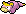 | [Flegmon] (Galar-Form)
 002 | 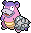 | [Lahmus] (Galar-Form)
 003 |  | [Laschoking] (Galar-Form)
 004 |  | [Haspiror]
 005 |  | [Schlapor]
 006 |  | [Wonneira]
 007 |  | [Chaneira]
 008 |  | [Heiteira]
 009 |  | [Raffel]
 010 |  | [Schlaraffel]
 011 |  | [Fluffeluff]
 012 |  | [Pummeluff]
 013 |  | [Knuddeluff]
 014 |  | [Sensect]
 015 |  | [Keradar]
 016 |  | [Maritellit]
 017 |  | [Imantis]
 018 |  | [Mantidea]
 019 |          | [Knapfel]
 020 |          | [Drapfel]
 021 |        | [Schlapfel]
 022 |          | [Dartiri]
 023 |        | [Dartignis]
 024 |  | [Fiaro]
 025 |          | [Sheinux]
 026 |  | [Luxio]
 027 |           | [Luxtra]
 028 |          | [Clavion]
 029 |       | [Gladiantri]
 030 |         | [Caesurio]
 031 |   | [Abra]
 032 |          | [Kadabra]
 033 |          | [Simsala]
 034 |           | [Trasla]
 035 |           | [Kirlia]
 036 |       | [Guardevoir]
 037 |        | [Galagladi]
 038 |           | [Krabby]
 039 |          | [Kingler]
 040 |         | [Tentacha]
 041 |          | [Tentoxa]
 042 |         | [Karpador]
 043 |          | [Garados]
 044 |         | [Remoraid]
 045 |        | [Octillery]
 046 |         | [Mantirps]
 047 |           | [Mantax]
 048 |          | [Wingull]
 049 |         | [Pelipper]
 050 |        | [Pionskora]
 051 |        | [Piondragi]
 052 |         | [Dummisel]
 053 | 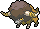        | [Bisofank]
 054 |          | [Schlurp]
 055 |       | [Schlurplek]
 056 |         | [Kamehaps]
 057 |           | [Kamalm]
 058 |           | [Felino]
 059 |          | [Morlord]
 060 |          | [Viscora]
 061 |        | [Viscargot]
 062 |         | [Viscogon]
 063 |        | [Shardrago]
 064 |       | [Schnuthelm]
 065 |         | [Hydragil]
 066 |          | [Laukaps]
 067 |       | [Cavalanzas]
 068 |          | [Bisasam]
 069 |        | [Bisaknosp]
 070 |         | [Bisaflor]
 071 |          | [Schiggy]
 072 |         | [Schillok]
 073 |           | [Turtok]
 074 | 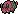         | [Toxiped]
 075 | 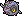          | [Rollum]
 076 | 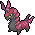      | [Cerapendra]
 077 |       | [Tarnpignon]
 078 |         | [Hutsassa]
 079 | 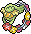         | [Curelei]
 080 |          | [Tangela]
 081 |        | [Tangoloss]
 082 |        | [Glibunkel]
 083 |         | [Toxiquak]
 084 |  | [Pichu]
 085 |          | [Pikachu](DexEntries/Pikachu.md)
 086 |           | [Raichu]
 087 |  | [Zorua]
 088 |          | [Zoroark]
 089 |      | [Kommandutan]
 090 |       | [Quartermak]
 091 |       | [Krebscorps]
 092 |        | [Krebutack]
 093 |   | [Urgl]
 094 |          | [Goldini]
 095 |          | [Golking]
 096 |           | [Pikuda]
 097 |       | [Barrakiefa]
 098 |          | [Sterndu]
 099 |          | [Starmie]
 100 |  | [Dakuma]
 101 |  | [Wulaosu] (Fokussierter Stil) [[Wulaosu] (Fließender Stil)
 102 | 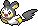          | [Emolga]
 103 |          | [Dedenne]
 104 |           | [Morpeko]
 105 |        | [Magnetilo]
 106 |         | [Magneton]
 107 |        | [Magnezone]
 108 |          | [Iscalar]
 109 |       | [Calamanero]
 110 |         | [Lusardin]
 111 | 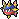       | [Kanivanha]
 112 | 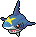         | [Tohaido]
 113 | 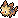        | [Yorkleff]
 114 | 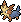       | [Terribark]
 115 | 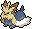        | [Bissbark]
 116 |           | [Tauros]
 117 | 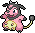         | [Miltank]
 118 |          | [Sichlor]
 119 |          | [Scherox]
 120 |           | [Pinsir]
 121 |        | [Skaraborn]
 122 |        | [Lithomith]
 123 |       | [Castellith]
 124 |         | [Reißlaus]
 125 |          | [Tectass]
 126 |        | [Britzigel]
 127 |  | [Garstella]
 128 |  | [Aggrostella]
 129 |       | [Klopptopus]
 130 |           | [Kaocto]
 131 |          | [Muschas]
 132 |           | [Austos]
 133 |         | [Sankabuh]
 134 |        | [Colossand]
 135 |         | [Driftlon]
 136 |       | [Drifzepeli]
 137 |         | [Schmerbe]
 138 |           | [Welsar]
 139 |          | [Azurill]
 140 |           | [Marill]
 141 |        | [Azumarill]
 142 |          | [Quapsel]
 143 |         | [Quaputzi]
 144 |           | [Quappo]
 145 |  | [Quaxo]
 146 |  | [Enton]
 147 |          | [Entoron]
 148 | 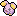         | [Flurmel]
 149 | 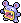        | [Krakeelo]
 150 | 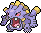        | [Krawumms]
 151 |         | [Fleknoil]
 152 |         | [Fletiamo]
 153 |        | [Panzaeron]
 154 |         | [Kiesling]
 155 |       | [Sedimantur]
 156 |       | [Brockoloss]
 157 |  | [Wuffels]
 158 |  | [Wolwerock]
 159 |           | [Molunk]
 160 |           | [Amfira]
 161 |         | [Zurrokex]
 162 |           | [Irokex]
 163 | 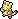          | [Lin-Fu]
 164 | 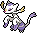         | [Wie-Shu]
 165 |          | [Miniras]
 166 |          | [Mediras]
 167 |        | [Grandiras]
 168 |           | [Sandan]
 169 |         | [Sandamer]
 170 |         | [Tragosso]
 171 |           | [Knogga]
 172 |          | [Kangama]
 173 |           | [Qurtel]
 174 |          | [Salanga]
 175 |        | [Sanaconda]
 176 |          | [Ganovil]
 177 |        | [Rokkaiman]
 178 |        | [Rabigator]
 179 |       | [Geronimatz]
 180 |        | [Washakwil]
 181 |          | [Skallyk]
 182 |       | [Grypheldis]
 183 |           | [Rihorn]
 184 |          | [Rizeros]
 185 |        | [Rihornior]
 186 |          | [Ignivor]
 187 |           | [Ramoth]
 188 |  | [Lampi]
 189 |          | [Lanturn]
 190 |          | [Wailmer]
 191 |          | [Wailord]
 192 |          | [Quabbel]
 193 |       | [Apoquallyp]
 194 |           | [Algitt]
 195 |          | [Tandrak]
 196 |        | [Scampisto]
 197 |           | [Wummer]
 198 |           | [Seeper]
 199 |           | [Seemon]
 200 | 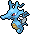      | [Seedraking]
 201 |         | [Lilminip]
 202 |        | [Dressella]
 203 |         | [Wadribie]
 204 |        | [Honweisel]
 205 |   | [Owei]
 206 |          | [Kokowei]
 207 |  | [Ditto]
 208 |          | [Porygon]
 209 |         | [Porygon2]
 210 |        | [Porygon-Z]
 211 |  | [Zarude]

#pokemon #galar #isleofarmor
