# Hisui-Pokédex

 Nr. | Icon      | Name
-----|------------------------------------|----------------------------------
 001 |  | [Bauz]
 002 |   | [Arboretoss]
 003 |  | [Silvarro] (Hisui-Form)
 004 |  | [Feurigel]
 005 |   | [Igelavar]
 006 | 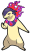 | [Tornupto] (Hisui-Form)
 007 |   | [Ottaro]
 008 |   | [Zwottronin]
 009 | 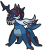 | [Admurai] (Hisui-Form)
 010 |   | [Bidiza]
 011 |   | [Bidifas]
 012 |   | [Staralili]
 013 |   | [Staravia]
 014 |   | [Staraptor]
 015 |   | [Sheinux]
 016 |   | [Luxio]
 017 |   | [Waumpel]
 018 |   | [Waumpel]
 019 |   | [Schaloko]
 020 |   | [Papinella]
 021 |   | [Panekon]
 022 |   | [Pudox]
 023 |   | [Ponita]
 024 |   | [Gallopa]
 025 |   | [Evoli]
 026 |   | [Aquana]
 027 |   | [Blitza]
 028 |   | [Flamara]
 029 |   | [Psiana]
 030 |   | [Nachtara]
 031 |   | [Folipurba]
 032 |   | [Glaziola]
 033 |   | [Feelinara]
 034 |   | [Zubat]
 035 |   | [Golbat]
 036 |   | [Iksbat]
 037 |   | [Driftlon]
 038 |   | [Drifzepeli]
 039 |   | [Zirpurze]
 040 |   | [Zirpeise]
 041 |   | [Bamelin]
 042 |   | [Bojelin]
 043 |   | [Burmy]
 044 |   | [Burmadame]
 045 |   | [Moterpel]
 046 |   | [Kleinstein]
 047 |   | [Georok]
 048 |   | [Geowaz]
 049 |   | [Damhirplex]
 050 |  | [Damythir]
 051 | 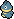  | [Mampfaxo]
 052 |   | [Relaxo]
 053 |   | [Paras]
 054 |   | [Parasek]
 055 |   | [Pichu]
 056 |   | [Pikachu](DexEntries/Pikachu.md)
 057 |   | [Raichu]
 058 |   | [Abra]
 059 |   | [Kadabra]
 060 |   | [Simsala]
 061 |   | [Panflam]
 062 |   | [Panpyro]
 063 |   | [Panferno]
 064 |   | [Haspiror]
 065 |   | [Schlapor]
 066 |   | [Kikugi]
 067 | 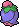  | [Kinoso]
 068 |   | [Enton]
 069 |   | [Entoron]
 070 |   | [Wadribie]
 071 |   | [Honweisel]
 072 |   | [Sichlor]
 073 |  | [Axantor]
 074 |   | [Scherox]
 075 |   | [Skaraborn]
 076 | 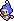  | [Pantimimi]
 077 |   | [Pantimos]
 078 |   | [Griffel]
 079 |   | [Ambidiffel]
 080 |   | [Karpador]
 081 |   | [Garados]
 082 |   | [Schalellos]
 083 |   | [Gastrodon]
 084 | 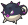 | [Baldorfish] (Hisui-Form)
 085 |  | [Myriador]
 086 |   | [Wonneira]
 087 |   | [Chaneira]
 088 |   | [Heiteira]
 089 |   | [Knospi]
 090 | 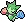  | [Roselia]
 091 | 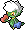  | [Roserade]
 092 |   | [Venuflibis]
 093 |   | [Lilminip]
 094 | 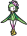 | [Dressella] (Hisui-Form)
 095 |   | [Tangela]
 096 | 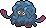  | [Tangoloss]
 097 |   | [Schmerbe]
 098 |   | [Welsar]
 099 |   | [Glibunkel]
 100 |   | [Toxiquak]
 101 |   | [Trasla]
 102 |   | [Kirlia]
 103 |   | [Guardevoir]
 104 |   | [Galagladi]
 105 |   | [Yanma]
 106 |   | [Yanmega]
 107 |   | [Hippopotas]
 108 |   | [Hippoterus]
 109 |   | [Pachirisu]
 110 |   | [Skunkapuh]
 111 |   | [Skuntank]
 112 |   | [Teddiursa]
 113 |   | [Ursaring]
 114 |  | [Ursaluna]
 115 |   | [Viscora]
 116 | 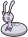 | [Viscargot] (Hisui-Form)
 117 | 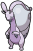 | [Viscogon] (Hisui-Form)
 118 |   | [Onix]
 119 |   | [Stahlos]
 120 |   | [Rihorn]
 121 |   | [Rizeros]
 122 | 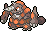  | [Rihornior]
 123 |   | [Mobai]
 124 |   | [Mogelbaum]
 125 |   | [Schlurp]
 126 | 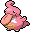  | [Schlurplek]
 127 | 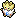  | [Togepi]
 128 | 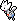  | [Togetic]
 129 | 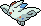  | [Togekiss]
 130 |   | [Chelast]
 131 |   | [Chelcarain]
 132 |   | [Chelterrar]
 133 |   | [Porygon]
 134 |   | [Porygon2]
 135 | 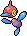  | [Porygon-Z]
 136 |   | [Nebulak]
 137 |   | [Alpollo]
 138 |   | [Gengar]
 139 |   | [Kryppuk]
 140 |   | [Kramurx]
 141 |   | [Kramshef]
 142 |   | [Icognito]
 143 | 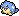  | [Seemops]
 144 |   | [Seejong]
 145 |   | [Walraisa]
 146 |   | [Remoraid]
 147 |   | [Octillery]
 148 |   | [Pionskora]
 149 |   | [Piondragi]
 150 |  | [Fukano] (Hisui-Form)
 151 | 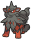 | [Arkani] (Hisui-Form)
 152 |   | [Charmian]
 153 |   | [Shnurgarst]
 154 |   | [Machollo]
 155 |   | [Maschock]
 156 |   | [Machomei]
 157 |   | [Plaudagei]
 158 | 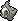  | [Zwirrlicht]
 159 | 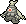  | [Zwirrklop]
 160 | 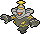  | [Zwirrfinst]
 161 |   | [Plinfa]
 162 |   | [Pliprin]
 163 |   | [Impoleon]
 164 |   | [Mantirps]
 165 |   | [Mantax]
 166 | 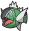 | [Barschuft]
 167 |  | [Salmagnis]
 168 |   | [Vulpix]
 168 | 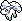 | [Vulpix] (Alola-Form)
 169 |   | [Vulnona]
 169 | 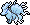 | [Vulnona] (Alola-Form)
 170 |   | [Tentacha]
 171 |   | [Tentoxa]
 172 |   | [Finneon]
 173 |   | [Lumineon]
 174 | 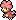  | [Magby]
 175 |   | [Magmar]
 176 | 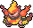  | [Magbrant]
 177 |   | [Magnetilo]
 178 |   | [Magneton]
 179 |   | [Magnezone]
 180 |   | [Bronzel]
 181 |   | [Bronzong]
 182 | 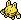  | [Elekid]
 183 |   | [Elektek]
 184 | 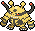  | [Elevoltek]
 185 |   | [Skorgla]
 186 |   | [Skorgro]
 187 |   | [Kaumalat]
 188 |   | [Knarksel]
 189 |   | [Knakrack]
 190 |   | [Nasgnet]
 191 |   | [Voluminas]
 192 |  | [Voltobal] (Hisui-Form)
 193 |  | [Lektrobal] (Hisui-Form)
 194 |   | [Rotom]
 195 |   | [Klingplim]
 196 |   | [Palimpalim]
 197 |   | [Traunfugil]
 198 |   | [Traunmagil]
 199 | 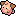  | [Pii]
 200 |   | [Piepi]
 201 |   | [Pixi]
 202 | 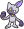 | [Sniebel] (Hisui-Form)
 202 |   | [Sniebel]
 203 |  | [Snieboss]
 204 |   | [Snibunna]
 205 |   | [Schneppke]
 206 |   | [Firnontor]
 207 |   | [Frosdedje]
 208 |   | [Koknodon]
 209 |   | [Rameidon]
 210 |   | [Schilterus]
 211 |   | [Bollterus]
 212 | 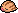  | [Quiekel]
 213 |   | [Keifel]
 214 |   | [Mamutel]
 215 |   | [Arktip]
 216 | 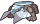 | [Arktilas] (Hisui-Form)
 217 |   | [Shnebedeck]
 218 |   | [Rexblisar]
 219 | 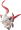 | [Zorua] (Hisui-Form)
 220 | 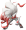 | [Zoroark] (Hisui-Form)
 221 |   | [Geronimatz]
 222 |  | [Washakwil] (Hisui-Form)
 223 |   | [Riolu]
 224 |   | [Lucario]
 225 | 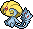  | [Selfe]
 226 | 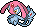  | [Vesprit]
 227 | 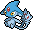  | [Tobutz]
 228 | 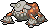  | [Heatran]
 229 | 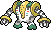  | [Regigigas]
 230 | 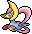  | [Cresselia]
 231 |   | [Boreos]
 232 |   | [Voltolos]
 233 | 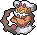  | [Demeteros]
 234 |  | [Cupidos]
 235 | 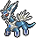  | [Dialga]
 236 | 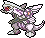  | [Palkia]
 237 | 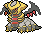  | [Giratina]
 238 |   | [Arceus]
 239 |   | [Phione]
 240 |   | [Manaphy]
 241 |   | [Shaymin]
 242 |   | [Darkrai]

#pokemon #hisui
