# Einall-Pokédex

 Nr. | Icon          | Name
-----|---------------|----------------
 000 |  | [[Victini]]
 001 | {{#icon:495}} | [[Serpifeu]]
 002 | {{#icon:496}} | [[Efoserp]]
 003 | {{#icon:497}} | [[Serpiroyal]]
 004 | {{#icon:498}} | [[Floink]]
 005 | {{#icon:499}} | [[Ferkokel]]
 006 | {{#icon:500}} | [[Flambirex]]
 007 | {{#icon:501}} | [[Ottaro]]
 008 | {{#icon:502}} | [[Zwottronin]]
 009 | {{#icon:503}} | [[Admurai]]
 010 | {{#icon:504}} | [[Nagelotz]]
 011 | {{#icon:505}} | [[Kukmarda]]
 012 | {{#icon:509}} | [[Felilou]]
 013 | {{#icon:510}} | [[Kleoparda]]
 014 | {{#icon:519}} | [[Dusselgurr]]
 015 | {{#icon:520}} | [[Navitaub]]
 016 | {{#icon:521}} | [[Fasasnob]]
 017 | {{#icon:540}} | [[Strawickl]]
 018 | {{#icon:541}} | [[Folikon]]
 019 | {{#icon:542}} | [[Matrifol]]
 020 | {{#icon:191}} | [[Sonnkern]]
 021 | {{#icon:192}} | [[Sonnflora]]
 022 | {{#icon:506}} | [[Yorkleff]]
 023 | {{#icon:507}} | [[Terribark]]
 024 | {{#icon:508}} | [[Bissbark]]
 025 | {{#icon:179}} | [[Voltilamm]]
 026 | {{#icon:180}} | [[Waaty]]
 027 | {{#icon:181}} | [[Ampharos]]
 028 |  | [[Enton]]
 029 | 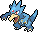 | [[Entoron]]
 030 | {{#icon:298}} | [[Azurill]]
 031 | {{#icon:183}} | [[Marill]]
 032 | {{#icon:184}} | [[Azumarill]]
 033 | {{#icon:447}} | [[Riolu]]
 034 | {{#icon:448}} | [[Lucario]]
 035 | {{#icon:206}} | [[Dummisel]]
 036 | {{#icon:531}} | [[Ohrdoch]]
 037 | {{#icon:511}} | [[Vegimak]]
 038 | {{#icon:512}} | [[Vegichita]]
 039 | {{#icon:513}} | [[Grillmak]]
 040 | {{#icon:514}} | [[Grillchita]]
 041 | {{#icon:515}} | [[Sodamak]]
 042 | {{#icon:516}} | [[Sodachita]]
 043 | {{#icon:543}} | [[Toxiped]]
 044 | {{#icon:544}} | [[Rollum]]
 045 | {{#icon:545}} | [[Cerapendra]]
 046 | 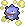 | [[Smogon]]
 047 | 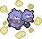 | [[Smogmog]]
 048 | 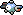 | [[Magnetilo]]
 049 | 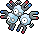 | [[Magneton]]
 050 | {{#icon:462}} | [[Magnezone]]
 051 | 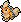 | [[Fukano]]
 052 | 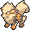 | [[Arkani]]
 053 | {{#icon:240}} | [[Magby]]
 054 | 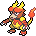 | [[Magmar]]
 055 | {{#icon:467}} | [[Magbrant]]
 056 | {{#icon:239}} | [[Elekid]]
 057 | 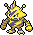 | [[Elektek]]
 058 | {{#icon:466}} | [[Elevoltek]]
 059 |  | [[Rattfratz]]
 060 |  | [[Rattikarl]]
 061 | 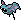 | [[Zubat]]
 062 | 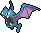 | [[Golbat]]
 063 | {{#icon:169}} | [[Iksbat]]
 064 |  | [[Sleima]]
 065 |  | [[Sleimok]]
 066 | {{#icon:527}} | [[Fleknoil]]
 067 | {{#icon:528}} | [[Fletiamo]]
 068 | {{#icon:524}} | [[Kiesling]]
 069 | {{#icon:525}} | [[Sedimantur]]
 070 | {{#icon:526}} | [[Brockoloss]]
 071 | 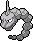 | [[Onix]]
 072 | {{#icon:208}} | [[Stahlos]]
 073 | {{#icon:532}} | [[Praktibalk]]
 074 | {{#icon:533}} | [[Strepoli]]
 075 | {{#icon:534}} | [[Meistagrif]]
 076 | {{#icon:529}} | [[Rotomurf]]
 077 | {{#icon:530}} | [[Stalobor]]
 078 | {{#icon:300}} | [[Eneco]]
 079 | {{#icon:301}} | [[Enekoro]]
 080 | 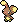 | [[Haspiror]]
 081 | 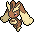 | [[Schlapor]]
 082 | {{#icon:546}} | [[Waumboll]]
 083 | {{#icon:547}} | [[Elfun]]
 084 | {{#icon:548}} | [[Lilminip]]
 085 | {{#icon:549}} | [[Dressella]]
 086 | {{#icon:517}} | [[Somniam]]
 087 | {{#icon:518}} | [[Somnivora]]
 088 | {{#icon:173}} | [[Pii]]
 089 | 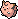 | [[Piepi]]
 090 | 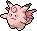 | [[Pixi]]
 091 | 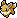 | [[Evoli]]
 092 | 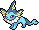 | [[Aquana]]
 093 | 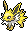 | [[Blitza]]
 094 | 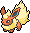 | [[Flamara]]
 095 | {{#icon:196}} | [[Psiana]]
 096 | {{#icon:197}} | [[Nachtara]]
 097 | {{#icon:470}} | [[Folipurba]]
 098 | {{#icon:471}} | [[Glaziola]]
 099 | {{#icon:551}} | [[Ganovil]]
 100 | {{#icon:552}} | [[Rokkaiman]]
 101 | {{#icon:553}} | [[Rabigator]]
 102 | {{#icon:554}} | [[Flampion]]
 103 | {{#icon:555}} | [[Flampivian]]
 104 | {{#icon:550}} | [[Barschuft]]
 105 | {{#icon:568}} | [[Unratütox]]
 106 | {{#icon:569}} | [[Deponitox]]
 107 | {{#icon:572}} | [[Picochilla]]
 108 | {{#icon:573}} | [[Chillabell]]
 109 | {{#icon:627}} | [[Geronimatz]]
 110 | {{#icon:628}} | [[Washakwil]]
 111 | {{#icon:629}} | [[Skallyk]]
 112 | {{#icon:630}} | [[Grypheldis]]
 113 | 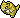 | [[Sandan]]
 114 | 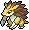 | [[Sandamer]]
 115 | {{#icon:557}} | [[Lithomith]]
 116 | {{#icon:558}} | [[Castellith]]
 117 | {{#icon:559}} | [[Zurrokex]]
 118 | {{#icon:560}} | [[Irokex]]
 119 | {{#icon:556}} | [[Maracamba]]
 120 | {{#icon:561}} | [[Symvolara]]
 121 | {{#icon:328}} | [[Knacklion]]
 122 | {{#icon:329}} | [[Vibrava]]
 123 | {{#icon:330}} | [[Libelldra]]
 124 | {{#icon:562}} | [[Makabaja]]
 125 | {{#icon:563}} | [[Echnatoll]]
 126 | {{#icon:564}} | [[Galapaflos]]
 127 | {{#icon:565}} | [[Karippas]]
 128 | {{#icon:566}} | [[Flapteryx]]
 129 | {{#icon:567}} | [[Aeropteryx]]
 130 | {{#icon:599}} | [[Klikk]]
 131 | {{#icon:600}} | [[Kliklak]]
 132 | {{#icon:601}} | [[Klikdiklak]]
 133 | {{#icon:406}} | [[Knospi]]
 134 | {{#icon:315}} | [[Roselia]]
 135 | {{#icon:407}} | [[Roserade]]
 136 | {{#icon:574}} | [[Mollimorba]]
 137 | {{#icon:575}} | [[Hypnomorba]]
 138 | {{#icon:576}} | [[Morbitesse]]
 139 | {{#icon:577}} | [[Monozyto]]
 140 | {{#icon:578}} | [[Mitodos]]
 141 | {{#icon:579}} | [[Zytomega]]
 142 | {{#icon:415}} | [[Wadribie]]
 143 | {{#icon:416}} | [[Honweisel]]
 144 | {{#icon:587}} | [[Emolga]]
 145 | {{#icon:214}} | [[Skaraborn]]
 146 | 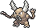 | [[Pinsir]]
 147 | {{#icon:522}} | [[Elezeba]]
 148 | {{#icon:523}} | [[Zebritz]]
 149 | {{#icon:418}} | [[Bamelin]]
 150 | {{#icon:419}} | [[Bojelin]]
 151 | 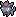 | [[Zorua]]
 152 |  | [[Zoroark]]
 153 | {{#icon:580}} | [[Piccolente]]
 154 | {{#icon:581}} | [[Swaroness]]
 155 | {{#icon:588}} | [[Laukaps]]
 156 | {{#icon:589}} | [[Cavalanzas]]
 157 | {{#icon:616}} | [[Schnuthelm]]
 158 | {{#icon:617}} | [[Hydragil]]
 159 | {{#icon:585}} | [[Sesokitz]]
 160 | {{#icon:586}} | [[Kronjuwild]]
 161 | {{#icon:590}} | [[Tarnpignon]]
 162 | {{#icon:591}} | [[Hutsassa]]
 163 | {{#icon:351}} | [[Formeo]]
 164 | {{#icon:299}} | [[Nasgnet]]
 165 | {{#icon:476}} | [[Voluminas]]
 166 | {{#icon:304}} | [[Stollunior]]
 167 | {{#icon:305}} | [[Stollrak]]
 168 | {{#icon:306}} | [[Stolloss]]
 169 | {{#icon:343}} | [[Puppance]]
 170 | {{#icon:344}} | [[Lepumentas]]
 171 | {{#icon:636}} | [[Ignivor]]
 172 | {{#icon:637}} | [[Ramoth]]
 173 | {{#icon:595}} | [[Wattzapf]]
 174 | {{#icon:596}} | [[Voltula]]
 175 | {{#icon:597}} | [[Kastadur]]
 176 | {{#icon:598}} | [[Tentantel]]
 177 | {{#icon:602}} | [[Zapplardin]]
 178 | {{#icon:603}} | [[Zapplalek]]
 179 | {{#icon:604}} | [[Zapplarang]]
 180 | {{#icon:592}} | [[Quabbel]]
 181 | {{#icon:593}} | [[Apoquallyp]]
 182 | {{#icon:594}} | [[Mamolida]]
 183 | {{#icon:610}} | [[Milza]]
 184 | {{#icon:611}} | [[Sharfax]]
 185 | {{#icon:612}} | [[Maxax]]
 186 | {{#icon:335}} | [[Sengo]]
 187 | {{#icon:336}} | [[Vipitis]]
 188 | {{#icon:605}} | [[Pygraulon]]
 189 | {{#icon:606}} | [[Megalon]]
 190 | {{#icon:607}} | [[Lichtel]]
 191 | {{#icon:608}} | [[Laternecto]]
 192 | {{#icon:609}} | [[Skelabra]]
 193 | {{#icon:631}} | [[Furnifraß]]
 194 | {{#icon:632}} | [[Fermicula]]
 195 | {{#icon:613}} | [[Petznief]]
 196 | {{#icon:614}} | [[Siberio]]
 197 | {{#icon:615}} | [[Frigometri]]
 198 |  | [[Boreos]]
 199 |  | [[Voltolos]]
 200 | {{#icon:645}} | [[Demeteros]]
 201 | {{#icon:451}} | [[Pionskora]]
 202 | {{#icon:452}} | [[Piondragi]]
 203 | {{#icon:227}} | [[Panzaeron]]
 204 |  | [[Camaub]]
 205 |  | [[Camerupt]]
 206 | {{#icon:325}} | [[Spoink]]
 207 | {{#icon:326}} | [[Groink]]
 208 | {{#icon:425}} | [[Driftlon]]
 209 | {{#icon:426}} | [[Drifzepeli]]
 210 | {{#icon:353}} | [[Shuppet]]
 211 | {{#icon:354}} | [[Banette]]
 212 | {{#icon:278}} | [[Wingull]]
 213 | {{#icon:279}} | [[Pelipper]]
 214 | {{#icon:337}} | [[Lunastein]]
 215 | {{#icon:338}} | [[Sonnfel]]
 216 | {{#icon:359}} | [[Absol]]
 217 | 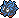 | [[Tangela]]
 218 | {{#icon:465}} | [[Tangoloss]]
 219 | {{#icon:619}} | [[Lin-Fu]]
 220 | {{#icon:620}} | [[Wie-Shu]]
 221 | {{#icon:207}} | [[Skorgla]]
 222 | {{#icon:472}} | [[Skorgro]]
 223 | {{#icon:624}} | [[Gladiantri]]
 224 | {{#icon:625}} | [[Caesurio]]
 225 | {{#icon:638}} | [[Kobalium]]
 226 | {{#icon:639}} | [[Terrakium]]
 227 |  | [[Viridium]]
 228 | {{#icon:535}} | [[Schallquap]]
 229 | {{#icon:536}} | [[Mebrana]]
 230 | {{#icon:537}} | [[Branawarz]]
 231 | {{#icon:618}} | [[Flunschlik]]
 232 | {{#icon:213}} | [[Pottrott]]
 233 | {{#icon:458}} | [[Mantirps]]
 234 | {{#icon:226}} | [[Mantax]]
 235 | {{#icon:223}} | [[Remoraid]]
 236 | {{#icon:224}} | [[Octillery]]
 237 | {{#icon:222}} | [[Corasonn]]
 238 | 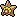 | [[Sterndu]]
 239 | 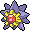 | [[Starmie]]
 240 | {{#icon:320}} | [[Wailmer]]
 241 | {{#icon:321}} | [[Wailord]]
 242 | 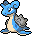 | [[Lapras]]
 243 | {{#icon:363}} | [[Seemops]]
 244 | {{#icon:364}} | [[Seejong]]
 245 | {{#icon:365}} | [[Walraisa]]
 246 | {{#icon:333}} | [[Wablu]]
 247 | {{#icon:334}} | [[Altaria]]
 248 |  | [[Vulpix]]
 249 | 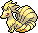 | [[Vulnona]]
 250 | {{#icon:436}} | [[Bronzel]]
 251 | {{#icon:437}} | [[Bronzong]]
 252 | {{#icon:215}} | [[Sniebel]]
 253 | {{#icon:461}} | [[Snibunna]]
 254 | {{#icon:225}} | [[Botogel]]
 255 | {{#icon:582}} | [[Gelatini]]
 256 | {{#icon:583}} | [[Gelatroppo]]
 257 | {{#icon:584}} | [[Gelatwino]]
 258 | {{#icon:220}} | [[Quiekel]]
 259 | {{#icon:221}} | [[Keifel]]
 260 | {{#icon:473}} | [[Mamutel]]
 261 |  | [[Ditto]]
 262 | {{#icon:374}} | [[Tanhel]]
 263 | {{#icon:375}} | [[Metang]]
 264 | {{#icon:376}} | [[Metagross]]
 265 |  | [[Jurob]]
 266 |  | [[Jugong]]
 267 | {{#icon:538}} | [[Jiutesto]]
 268 | {{#icon:539}} | [[Karadonis]]
 269 | {{#icon:626}} | [[Bisofank]]
 270 | {{#icon:621}} | [[Shardrago]]
 271 | {{#icon:622}} | [[Golbit]]
 272 | {{#icon:623}} | [[Golgantes]]
 273 | {{#icon:633}} | [[Kapuno]]
 274 | {{#icon:634}} | [[Duodino]]
 275 | {{#icon:635}} | [[Trikephalo]]
 276 | {{#icon:287}} | [[Bummelz]]
 277 | {{#icon:288}} | [[Muntier]]
 278 | {{#icon:289}} | [[Letarking]]
 279 | {{#icon:341}} | [[Krebscorps]]
 280 | {{#icon:342}} | [[Krebutack]]
 281 | {{#icon:174}} | [[Fluffeluff]]
 282 | 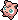 | [[Pummeluff]]
 283 | 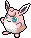 | [[Knuddeluff]]
 284 | 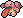 | [[Schlurp]]
 285 | {{#icon:463}} | [[Schlurplek]]
 286 | {{#icon:193}} | [[Yanma]]
 287 | {{#icon:469}} | [[Yanmega]]
 288 | {{#icon:357}} | [[Tropius]]
 289 | {{#icon:455}} | [[Venuflibis]]
 290 | {{#icon:453}} | [[Glibunkel]]
 291 | {{#icon:454}} | [[Toxiquak]]
 292 | {{#icon:246}} | [[Larvitar]]
 293 | {{#icon:247}} | [[Pupitar]]
 294 | {{#icon:248}} | [[Despotar]]
 295 | {{#icon:643}} | [[Reshiram]]
 296 | {{#icon:644}} | [[Zekrom]]
 297 | {{#icon:646}} | [[Kyurem]]
 298 | {{#icon:647}} | [[Keldeo]]
 299 | {{#icon:648}} | [[Meloetta]]
 300 | {{#icon:649}} | [[Genesect]]

#pokemon
