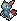
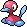
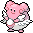
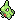
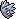
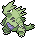
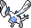
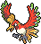
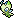

# Johto-Pokédex

 Nr. | Icon          | Name
-----|---------------|----------------
 001 |  | [[Endivie]]
 002 |  | [[Lorblatt]]
 003 |  | [[Meganie]]
 004 | {{#icon:155}} | [[Feurigel]]
 005 | {{#icon:156}} | [[Igelavar]]
 006 | {{#icon:157}} | [[Tornupto]]
 007 | {{#icon:158}} | [[Karnimani]]
 008 | {{#icon:159}} | [[Tyracroc]]
 009 | {{#icon:160}} | [[Impergator]]
 010 |  | [[Taubsi]]
 011 |  | [[Tauboga]]
 012 |  | [[Tauboss]]
 013 |  | [[Habitak]]
 014 |  | [[Ibitak]]
 015 | {{#icon:163}} | [[Hoothoot]]
 016 | {{#icon:164}} | [[Noctuh]]
 017 |  | [[Rattfratz]]
 018 |  | [[Rattikarl]]
 019 | {{#icon:161}} | [[Wiesor]]
 020 | {{#icon:162}} | [[Wiesenior]]
 021 | {{#icon:172}} | [[Pichu]]
 022 | | [[Pikachu]]
 023 | | [[Raichu]]
 024 |  | [[Raupy]]
 025 |  | [[Safcon]]
 026 |  | [[Smettbo]]
 027 |  | [[Hornliu]]
 028 |  | [[Kokuna]]
 029 |  | [[Bibor]]
 030 |  | [[Ledyba]]
 031 |  | [[Ledian]]
 032 |  | [[Webarak]]
 033 |  | [[Ariados]]
 034 | {{#icon:074}} | [[Kleinstein]]
 035 | {{#icon:075}} | [[Georok]]
 036 | {{#icon:076}} | [[Geowaz]]
 037 |  | [[Zubat]]
 038 |  | [[Golbat]]
 039 | {{#icon:169}} | [[Iksbat]]
 040 | {{#icon:173}} | [[Pii]]
 041 | | [[Piepi]]
 042 | | [[Pixi]]
 043 | {{#icon:174}} | [[Fluffeluff]]
 044 | | [[Pummeluff]]
 045 | | [[Knuddeluff]]
 046 | {{#icon:175}} | [[Togepi]]
 047 | {{#icon:176}} | [[Togetic]]
 048 | | [[Sandan]]
 049 | | [[Sandamer]]
 050 | | [[Rettan]]
 051 | | [[Arbok]]
 052 | {{#icon:206}} | [[Dummisel]]
 053 | {{#icon:179}} | [[Voltilamm]]
 054 | {{#icon:180}} | [[Waaty]]
 055 | {{#icon:181}} | [[Ampharos]]
 056 | {{#icon:194}} | [[Felino]]
 057 | {{#icon:195}} | [[Morlord]]
 058 | {{#icon:092}} | [[Nebulak]]
 059 | {{#icon:093}} | [[Alpollo]]
 060 | {{#icon:094}} | [[Gengar]]
 061 | {{#icon:201}} | [[Icognito]]
 062 | {{#icon:095}} | [[Onix]]
 063 | {{#icon:208}} | [[Stahlos]]
 064 | {{#icon:069}} | [[Knofensa]]
 065 | {{#icon:070}} | [[Ultrigaria]]
 066 | {{#icon:071}} | [[Sarzenia]]
 067 | {{#icon:187}} | [[Hoppspross]]
 068 | {{#icon:188}} | [[Hubelupf]]
 069 | {{#icon:189}} | [[Papungha]]
 070 | | [[Paras]]
 071 | | [[Parasek]]
 072 |  | [[Quapsel]]
 073 |  | [[Quaputzi]]
 074 | {{#icon:062}} | [[Quappo]]
 075 | {{#icon:186}} | [[Quaxo]]
 076 | {{#icon:129}} | [[Karpador]]
 077 | {{#icon:130}} | [[Garados]]
 078 | | [[Goldini]]
 079 | | [[Golking]]
 080 | {{#icon:079}} | [[Flegmon]]
 081 | {{#icon:080}} | [[Lahmus]]
 082 | {{#icon:199}} | [[Laschoking]]
 083 | | [[Myrapla]]
 084 | | [[Duflor]]
 085 | | [[Giflor]]
 086 | {{#icon:182}} | [[Blubella]]
 087 | {{#icon:096}} | [[Traumato]]
 088 | {{#icon:097}} | [[Hypno]]
 089 | {{#icon:063}} | [[Abra]]
 090 | {{#icon:064}} | [[Kadabra]]
 091 | {{#icon:065}} | [[Simsala]]
 092 | {{#icon:132}} | [[Ditto]]
 093 | {{#icon:204}} | [[Tannza]]
 094 | {{#icon:205}} | [[Forstellka]]
 095 | | [[Nidoran♀]]
 096 | | [[Nidorina]]
 097 | | [[Nidoqueen]]
 098 | | [[Nidoran♂]]
 099 | | [[Nidorino]]
 100 | | [[Nidoking]]
 101 | {{#icon:193}} | [[Yanma]]
 102 | {{#icon:469}} | [[Yanmega]]
 103 | {{#icon:191}} | [[Sonnkern]]
 104 | {{#icon:192}} | [[Sonnflora]]
 105 | {{#icon:102}} | [[Owei]]
 106 | {{#icon:103}} | [[Kokowei]]
 107 | {{#icon:185}} | [[Mogelbaum]]
 108 | {{#icon:202}} | [[Woingenau]]
 109 | | [[Bluzuk]]
 110 | | [[Omot]]
 111 | | [[Sichlor]]
 112 | {{#icon:212}} | [[Scherox]]
 113 | {{#icon:127}} | [[Pinsir]]
 114 | {{#icon:214}} | [[Skaraborn]]
 115 | | [[Smogon]]
 116 | | [[Smogmog]]
 117 | {{#icon:088}} | [[Sleima]]
 118 | {{#icon:089}} | [[Sleimok]]
 119 | {{#icon:081}} | [[Magnetilo]]
 120 | {{#icon:082}} | [[Magneton]]
 121 | {{#icon:100}} | [[Voltobal]]
 122 | {{#icon:101}} | [[Lektrobal]]
 123 | {{#icon:190}} | [[Griffel]]
 124 | {{#icon:424}} | [[Ambidiffel]]
 125 | {{#icon:209}} | [[Snubbull]]
 126 | {{#icon:210}} | [[Granbull]]
 127 | | [[Vulpix]]
 128 | | [[Vulnona]]
 129 |  | [[Fukano]]
 130 |  | [[Arkani]]
 131 | {{#icon:234}} | [[Damhirplex]]
 132 | {{#icon:183}} | [[Marill]]
 133 | {{#icon:184}} | [[Azumarill]]
 134 |  | [[Digda]]
 135 |  | [[Digdri]]
 136 | {{#icon:056}} | [[Menki]]
 137 |  | [[Rasaff]]
 138 |  | [[Mauzi]]
 139 | ](../pokemonimages/Pokémon-Icon_053.png) | [[Snobilikat]]
 140 |  | [[Enton]]
 141 |  | [[Entoron]]
 142 | {{#icon:066}} | [[Machollo]]
 143 | {{#icon:067}} | [[Maschock]]
 144 | {{#icon:068}} | [[Machomei]]
 145 | {{#icon:236}} | [[Rabauz]]
 146 | {{#icon:106}} | [[Kicklee]]
 147 | {{#icon:107}} | [[Nockchan]]
 148 | {{#icon:237}} | [[Kapoera]]
 149 | {{#icon:203}} | [[Girafarig]]
 150 | {{#icon:128}} | [[Tauros]]
 151 | {{#icon:241}} | [[Miltank]]
 152 | {{#icon:240}} | [[Magby]]
 153 | {{#icon:126}} | [[Magmar]]
 154 | {{#icon:238}} | [[Kussilla]]
 155 | | [[Rossana]]
 156 | {{#icon:239}} | [[Elekid]]
 157 | | [[Elektek]]
 158 | | [[Pantimos]]
 159 | {{#icon:235}} | [[Farbeagle]]
 160 | {{#icon:083}} | [[Porenta]]
 161 | {{#icon:177}} | [[Natu]]
 162 | {{#icon:178}} | [[Xatu]]
 163 | {{#icon:211}} | [[Baldorfish]]
 164 | {{#icon:072}} | [[Tentacha]]
 165 | {{#icon:073}} | [[Tentoxa]]
 166 | {{#icon:098}} | [[Krabby]]
 167 | {{#icon:099}} | [[Kingler]]
 168 | {{#icon:213}} | [[Pottrott]]
 169 | | [[Sterndu]]
 170 | | [[Starmie]]
 171 | {{#icon:090}} | [[Muschas]]
 172 | {{#icon:091}} | [[Austos]]
 173 | {{#icon:222}} | [[Corasonn]]
 174 | {{#icon:223}} | [[Remoraid]]
 175 | {{#icon:224}} | [[Octillery]]
 176 | {{#icon:170}} | [[Lampi]]
 177 | {{#icon:171}} | [[Lanturn]]
 178 | {{#icon:086}} | [[Jurob]]
 179 | {{#icon:087}} | [[Jugong]]
 180 | | [[Schlurp]]
 181 | {{#icon:463}} | [[Schlurplek]]
 182 | | [[Tangela]]
 183 | {{#icon:465}} | [[Tangoloss]]
 184 | {{#icon:133}} | [[Evoli]]
 185 | {{#icon:134}} | [[Aquana]]
 186 | {{#icon:135}} | [[Blitza]]
 187 | {{#icon:136}} | [[Flamara]]
 188 | {{#icon:196}} | [[Psiana]]
 189 | {{#icon:197}} | [[Nachtara]]
 190 | | [[Seeper]]
 191 | | [[Seemon]]
 192 | {{#icon:230}} | [[Seedraking]]
 193 | {{#icon:207}} | [[Skorgla]]
 194 | {{#icon:225}} | [[Botogel]]
 195 | {{#icon:220}} | [[Quiekel]]
 196 | {{#icon:221}} | [[Keifel]]
 197 | {{#icon:473}} | [[Mamutel]]
 198 | {{#icon:216}} | [[Teddiursa]]
 199 | {{#icon:217}} | [[Ursaring]]
 200 | {{#icon:231}} | [[Phanpy]]
 201 | {{#icon:232}} | [[Donphan]]
 202 | {{#icon:226}} | [[Mantax]]
 203 | {{#icon:227}} | [[Panzaeron]]
 204 | {{#icon:084}} | [[Dodu]]
 205 | {{#icon:085}} | [[Dodri]]
 206 | {{#icon:077}} | [[Ponita]]
 207 | {{#icon:078}} | [[Gallopa]]
 208 | {{#icon:104}} | [[Tragosso]]
 209 | {{#icon:105}} | [[Knogga]]
 210 | | [[Kangama]]
 211 | | [[Rihorn]]
 212 | | [[Rizeros]]
 213 |  | [[Kramurx]]
 214 |  | [[Hunduster]]
 215 |  | [[Hundemon]]
 216 |  | [[Schneckmag]]
 217 |  | [[Magcargo]]
 218 |  | [[Sniebel]]
 219 |  | [[Traunfugil]]
 220 |  | [[Porygon]]
 221 |  | [[Porygon2]]
 222 | | [[Chaneira]]
 223 |  | [[Heiteira]]
 224 |  | [[Lapras]]
 225 |  | [[Amonitas]]
 226 |  | [[Amoroso]]
 227 |  | [[Kabuto]]
 228 |  | [[Kabutops]]
 229 |  | [[Aerodactyl]]
 230 |  | [[Relaxo]]
 231 | | [[Bisasam]]
 232 | | [[Bisaknosp]]
 233 | | [[Bisaflor]]
 234 |  | [[Glumanda]]
 235 |  | [[Glutexo]]
 236 |  | [[Glurak]]
 237 |  | [[Schiggy]]
 238 |  | [[Schillok]]
 239 |  | [[Turtok]]
 240 |  | [[Arktos]]
 241 |  | [[Zapdos]]
 242 | {{#icon:146}} | [[Lavados]]
 243 | {{#icon:243}} | [[Raikou]]
 244 | {{#icon:244}} | [[Entei]]
 245 | {{#icon:245}} | [[Suicune]]
 246 | {{#icon:147}} | [[Dratini]]
 247 | {{#icon:148}} | [[Dragonir]]
 248 |  | [[Dragoran]]
 249 |  | [[Larvitar]]
 250 |  | [[Pupitar]]
 251 |  | [[Despotar]]
 252 |  | [[Lugia]]
 253 |  | [[Ho-Oh]]
 254 |  | [[Mewtu]]
 255 |  | [[Mew]]
 256 |  | [[Celebi]]

#pokemon #dex #Johto #dexJohto
