# Kalos-Pokédex, Gebirge

 Nr. | Icon          | Name
-----|---------------|----------------
 001 | 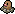 | [[Digda]]
 002 |  | [[Digdri]]
 003 | {{#icon:328}} | [[Knacklion]]
 004 | {{#icon:329}} | [[Vibrava]]
 005 | {{#icon:330}} | [[Libelldra]]
 006 | {{#icon:443}} | [[Kaumalat]]
 007 | {{#icon:444}} | [[Knarksel]]
 008 | {{#icon:445}} | [[Knakrack]]
 009 |  | [[Kleinstein]]
 010 |  | [[Georok]]
 011 | 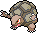 | [[Geowaz]]
 012 | {{#icon:218}} | [[Schneckmag]]
 013 | {{#icon:219}} | [[Magcargo]]
 014 | {{#icon:213}} | [[Pottrott]]
 015 | {{#icon:451}} | [[Pionskora]]
 016 | {{#icon:452}} | [[Piondragi]]
 017 | {{#icon:194}} | [[Felino]]
 018 | {{#icon:195}} | [[Morlord]]
 019 | {{#icon:704}} | [[Viscora]]
 020 | {{#icon:705}} | [[Viscargot]]
 021 | {{#icon:706}} | [[Viscogon]]
 022 | {{#icon:588}} | [[Laukaps]]
 023 | {{#icon:589}} | [[Cavalanzas]]
 024 | {{#icon:616}} | [[Schnuthelm]]
 025 | {{#icon:617}} | [[Hydragil]]
 026 |  | [[Knofensa]]
 027 |  | [[Ultrigaria]]
 028 |  | [[Sarzenia]]
 029 | {{#icon:455}} | [[Venuflibis]]
 030 | 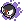 | [[Nebulak]]
 031 | 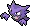 | [[Alpollo]]
 032 | 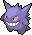 | [[Gengar]]
 033 | 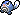 | [[Quapsel]]
 034 | 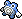 | [[Quaputzi]]
 035 | 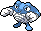 | [[Quappo]]
 036 | {{#icon:186}} | [[Quaxo]]
 037 |  | [[Rettan]]
 038 |  | [[Arbok]]
 039 | {{#icon:618}} | [[Flunschlik]]
 040 | {{#icon:339}} | [[Schmerbe]]
 041 | {{#icon:340}} | [[Welsar]]
 042 | {{#icon:509}} | [[Felilou]]
 043 | {{#icon:510}} | [[Kleoparda]]
 044 | {{#icon:261}} | [[Fiffyen]]
 045 | {{#icon:262}} | [[Magnayen]]
 046 | {{#icon:504}} | [[Nagelotz]]
 047 | {{#icon:505}} | [[Kukmarda]]
 048 | {{#icon:624}} | [[Gladiantri]]
 049 | {{#icon:625}} | [[Caesurio]]
 050 | {{#icon:707}} | [[Clavion]]
 051 |  | [[Kramurx]]
 052 | {{#icon:430}} | [[Kramshef]]
 053 | {{#icon:590}} | [[Tarnpignon]]
 054 | {{#icon:591}} | [[Hutsassa]]
 055 | {{#icon:270}} | [[Loturzel]]
 056 | {{#icon:271}} | [[Lombrero]]
 057 | {{#icon:272}} | [[Kappalores]]
 058 | {{#icon:418}} | [[Bamelin]]
 059 | {{#icon:419}} | [[Bojelin]]
 060 | {{#icon:550}} | [[Barschuft]]
 061 | {{#icon:708}} | [[Paragoni]]
 062 | {{#icon:709}} | [[Trombork]]
 063 | {{#icon:710}} | [[Irrbis]]
 064 | {{#icon:711}} | [[Pumpdjinn]]
 065 | {{#icon:607}} | [[Lichtel]]
 066 | {{#icon:608}} | [[Laternecto]]
 067 | {{#icon:609}} | [[Skelabra]]
 068 | {{#icon:479}} | [[Rotom]]
 069 |  | [[Magnetilo]]
 070 |  | [[Magneton]]
 071 | {{#icon:462}} | [[Magnezone]]
 072 |  | [[Voltobal]]
 073 |  | [[Lektrobal]]
 074 | {{#icon:568}} | [[Unratütox]]
 075 | {{#icon:569}} | [[Deponitox]]
 076 | {{#icon:220}} | [[Quiekel]]
 077 | {{#icon:221}} | [[Keifel]]
 078 | {{#icon:473}} | [[Mamutel]]
 079 | {{#icon:712}} | [[Arktip]]
 080 | {{#icon:713}} | [[Arktilas]]
 081 | {{#icon:613}} | [[Petznief]]
 082 | {{#icon:614}} | [[Siberio]]
 083 | {{#icon:238}} | [[Kussilla]]
 084 | 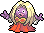 | [[Rossana]]
 085 | {{#icon:582}} | [[Gelatini]]
 086 | {{#icon:583}} | [[Gelatroppo]]
 087 | {{#icon:584}} | [[Gelatwino]]
 088 | {{#icon:459}} | [[Shnebedeck]]
 089 | {{#icon:460}} | [[Rexblisar]]
 090 | {{#icon:225}} | [[Botogel]]
 091 | {{#icon:215}} | [[Sniebel]]
 092 | {{#icon:461}} | [[Snibunna]]
 093 | {{#icon:532}} | [[Praktibalk]]
 094 | {{#icon:533}} | [[Strepoli]]
 095 | {{#icon:534}} | [[Meistagrif]]
 096 | 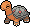 | [[Qurtel]]
 097 |  | [[Sandan]]
 098 |  | [[Sandamer]]
 099 | {{#icon:304}} | [[Stollunior]]
 100 | {{#icon:305}} | [[Stollrak]]
 101 | {{#icon:306}} | [[Stolloss]]
 102 | {{#icon:246}} | [[Larvitar]]
 103 | {{#icon:247}} | [[Pupitar]]
 104 | {{#icon:248}} | [[Despotar]]
 105 | {{#icon:631}} | [[Furnifraß]]
 106 | {{#icon:632}} | [[Fermicula]]
 107 |  | [[Webarak]]
 108 |  | [[Ariados]]
 109 |  | [[Habitak]]
 110 |  | [[Ibitak]]
 111 | {{#icon:615}} | [[Frigometri]]
 112 | {{#icon:227}} | [[Panzaeron]]
 113 | {{#icon:714}} | [[eF-eM]]
 114 | {{#icon:715}} | [[UHaFnir]]
 115 | {{#icon:207}} | [[Skorgla]]
 116 | {{#icon:472}} | [[Skorgro]]
 117 | {{#icon:163}} | [[Hoothoot]]
 118 | {{#icon:164}} | [[Noctuh]]
 119 | {{#icon:174}} | [[Fluffeluff]]
 120 |  | [[Pummeluff]]
 121 |  | [[Knuddeluff]]
 122 | {{#icon:353}} | [[Shuppet]]
 123 | {{#icon:354}} | [[Banette]]
 124 |  | [[Zorua]]
 125 |  | [[Zoroark]]
 126 | {{#icon:574}} | [[Mollimorba]]
 127 | {{#icon:575}} | [[Hypnomorba]]
 128 | {{#icon:576}} | [[Morbitesse]]
 129 | {{#icon:438}} | [[Mobai]]
 130 | {{#icon:185}} | [[Mogelbaum]]
 131 | {{#icon:327}} | [[Pandir]]
 132 | {{#icon:216}} | [[Teddiursa]]
 133 | {{#icon:217}} | [[Ursaring]]
 134 |  | [[Schlurp]]
 135 | {{#icon:463}} | [[Schlurplek]]
 136 | 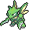 | [[Sichlor]]
 137 | {{#icon:212}} | [[Scherox]]
 138 |  | [[Ditto]]
 139 | {{#icon:333}} | [[Wablu]]
 140 | {{#icon:334}} | [[Altaria]]
 141 | {{#icon:621}} | [[Shardrago]]
 142 | {{#icon:633}} | [[Kapuno]]
 143 | {{#icon:634}} | [[Duodino]]
 144 | {{#icon:635}} | [[Trikephalo]]
 145 | 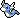} | [[Dratini]]
 146 | } | [[Dragonir]]
 147 | 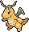} | [[Dragoran]]
 148 | {{#icon:716}} | [[Xerneas]]
 149 | {{#icon:717}} | [[Yveltal]]
 150 | {{#icon:718}} | [[Zygarde]]
 151 | 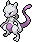 | [[Mewtu]]

#pokemon
