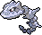

# Kalos-Pokédex, Küste

 Nr. | Icon          | Name
-----|---------------|----------------
 001 | {{#icon:425}} | [[Driftlon]]
 002 | {{#icon:426}} | [[Drifzepeli]]
 003 | {{#icon:619}} | [[Lin-Fu]]
 004 | {{#icon:620}} | [[Wie-Shu]]
 005 | {{#icon:335}} | [[Sengo]]
 006 | {{#icon:336}} | [[Vipitis]]
 007 | {{#icon:325}} | [[Spoink]]
 008 | {{#icon:326}} | [[Groink]]
 009 | {{#icon:359}} | [[Absol]]
 010 |  | [[Iscalar]]
 011 |  | [[Calamanero]]
 012 | {{#icon:337}} | [[Lunastein]]
 013 | {{#icon:338}} | [[Sonnfel]]
 014 | {{#icon:371}} | [[Kindwurm]]
 015 | {{#icon:372}} | [[Draschel]]
 016 | {{#icon:373}} | [[Brutalanda]]
 017 | {{#icon:278}} | [[Wingull]]
 018 | {{#icon:279}} | [[Pelipper]]
 019 | {{#icon:276}} | [[Schwalbini]]
 020 | {{#icon:277}} | [[Schwalboss]]
 021 | {{#icon:688}} | [[Bithora]]
 022 | {{#icon:689}} | [[Thanathora]]
 023 | {{#icon:557}} | [[Lithomith]]
 024 | {{#icon:558}} | [[Castellith]]
 025 |  | [[Tentacha]]
 026 |  | [[Tentoxa]]
 027 | {{#icon:320}} | [[Wailmer]]
 028 | {{#icon:321}} | [[Wailord]]
 029 | {{#icon:370}} | [[Liebiskus]]
 030 | {{#icon:690}} | [[Algitt]]
 031 | {{#icon:691}} | [[Tandrak]]
 032 | {{#icon:692}} | [[Scampisto]]
 033 | {{#icon:693}} | [[Wummer]]
 034 |  | [[Sterndu]]
 035 |  | [[Starmie]]
 036 |  | [[Muschas]]
 037 |  | [[Austos]]
 038 | {{#icon:211}} | [[Baldorfish]]
 039 |  | [[Seeper]]
 040 |  | [[Seemon]]
 041 | {{#icon:230}} | [[Seedraking]]
 042 | {{#icon:369}} | [[Relicanth]]
 043 | {{#icon:551}} | [[Ganovil]]
 044 | {{#icon:552}} | [[Rokkaiman]]
 045 | {{#icon:553}} | [[Rabigator]]
 046 | {{#icon:694}} | [[Eguana]]
 047 | {{#icon:695}} | [[Elezard]]
 048 | {{#icon:449}} | [[Hippopotas]]
 049 | {{#icon:450}} | [[Hippoterus]]
 050 |  | [[Rihorn]]
 051 |  | [[Rizeros]]
 052 | {{#icon:464}} | [[Rihornior]]
 053 |  | [[Onix]]
 054 |  | [[Stahlos]]
 055 | {{#icon:527}} | [[Fleknoil]]
 056 | {{#icon:528}} | [[Fletiamo]]
 057 |  | [[Machollo]]
 058 |  | [[Maschock]]
 059 |  | [[Machomei]]
 060 |  | [[Tragosso]]
 061 |  | [[Knogga]]
 062 |  | [[Kangama]]
 063 | {{#icon:303}} | [[Flunkifer]]
 064 | {{#icon:696}} | [[Balgoras]]
 065 | {{#icon:697}} | [[Monargoras]]
 066 | {{#icon:698}} | [[Amarino]]
 067 | {{#icon:699}} | [[Amagarga]]
 068 |  | [[Aerodactyl]]
 069 | {{#icon:597}} | [[Kastadur]]
 070 | {{#icon:598}} | [[Tentantel]]
 071 | {{#icon:209}} | [[Snubbull]]
 072 | {{#icon:210}} | [[Granbull]]
 073 | {{#icon:309}} | [[Frizelbliz]]
 074 | {{#icon:310}} | [[Voltenso]]
 075 |  | [[Hunduster]]
 076 |  | [[Hundemon]]
 077 |  | [[Evoli]]
 078 |  | [[Aquana]]
 079 |  | [[Blitza]]
 080 |  | [[Flamara]]
 081 | {{#icon:196}} | [[Psiana]]
 082 | {{#icon:197}} | [[Nachtara]]
 083 | {{#icon:470}} | [[Folipurba]]
 084 | {{#icon:471}} | [[Glaziola]]
 085 | {{#icon:700}} | [[Feelinara]]
 086 | {{#icon:587}} | [[Emolga]]
 087 | {{#icon:193}} | [[Yanma]]
 088 | {{#icon:469}} | [[Yanmega]]
 089 | {{#icon:701}} | [[Resladero]]
 090 | {{#icon:561}} | [[Symvolara]]
 091 | {{#icon:622}} | [[Golbit]]
 092 | {{#icon:623}} | [[Golgantes]]
 093 | {{#icon:299}} | [[Nasgnet]]
 094 | {{#icon:476}} | [[Voluminas]]
 095 | {{#icon:296}} | [[Makuhita]]
 096 | {{#icon:297}} | [[Hariyama]]
 097 | {{#icon:538}} | [[Jiutesto]]
 098 | {{#icon:539}} | [[Karadonis]]
 099 | {{#icon:396}} | [[Staralili]]
 100 | {{#icon:397}} | [[Staravia]]
 101 | {{#icon:398}} | [[Staraptor]]
 102 | {{#icon:434}} | [[Skunkapuh]]
 103 | {{#icon:435}} | [[Skuntank]]
 104 |  | [[Nidoran♀]]
 105 |  | [[Nidorina]]
 106 |  | [[Nidoqueen]]
 107 |  | [[Nidoran♂]]
 108 |  | [[Nidorino]]
 109 |  | [[Nidoking]]
 110 | {{#icon:702}} | [[Dedenne]]
 111 | {{#icon:433}} | [[Klingplim]]
 112 | {{#icon:358}} | [[Palimpalim]]
 113 | {{#icon:439}} | [[Pantimimi]]
 114 |  | [[Pantimos]]
 115 | {{#icon:577}} | [[Monozyto]]
 116 | {{#icon:578}} | [[Mitodos]]
 117 | {{#icon:579}} | [[Zytomega]]
 118 | {{#icon:360}} | [[Isso]]
 119 | {{#icon:202}} | [[Woingenau]]
 120 | {{#icon:524}} | [[Kiesling]]
 121 | {{#icon:525}} | [[Sedimantur]]
 122 | {{#icon:526}} | [[Brockoloss]]
 123 |  | [[Zobiris]]
 124 | {{#icon:703}} | [[Rocara]]
 125 |  | [[Tauros]]
 126 | {{#icon:241}} | [[Miltank]]
 127 |  | [[Voltilamm]]
 128 |  | [[Waaty]]
 129 |  | [[Ampharos]]
 130 |  | [[Pinsir]]
 131 | {{#icon:214}} | [[Skaraborn]]
 132 | {{#icon:417}} | [[Pachirisu]]
 133 |  | [[Flegmon]]
 134 |  | [[Lahmus]]
 135 | {{#icon:199}} | [[Laschoking]]
 136 |  | [[Owei]]
 137 |  | [[Kokowei]]
 138 | {{#icon:441}} | [[Plaudagei]]
 139 | {{#icon:458}} | [[Mantirps]]
 140 |  | [[Mantax]]
 141 | {{#icon:366}} | [[Perlu]]
 142 | {{#icon:367}} | [[Aalabyss]]
 143 | {{#icon:368}} | [[Saganabyss]]
 144 | {{#icon:223}} | [[Remoraid]]
 145 | {{#icon:224}} | [[Octillery]]
 146 | {{#icon:222}} | [[Corasonn]]
 147 | {{#icon:170}} | [[Lampi]]
 148 | {{#icon:171}} | [[Lanturn]]
 149 | {{#icon:594}} | [[Mamolida]]
 150 |  | [[Lapras]]
 151 |  | [[Arktos]]
 152 | } | [[Zapdos]]
 153 | } | [[Lavados]]

#pokemon
