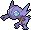
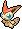
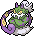
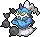
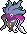

# Pokémon-List

| Dex# | Icon  | Name             | Deutsch      | Englisch      |
|------------------------------|--------------------------------|------------------|--------------|---------------|
| 001 |   | [[Bisasam]]      | Bulbasaur    | Bulbizarre    |
| 002 |   | [[Bisaknosp]]    | Ivysaur      | Herbizarre    |
| 003 |   | [[Bisaflor]]     | Venusaur     | Florizarre    |
| 004 |    | [[Glumanda]]     | Charmander   | Salamèche     |
| 005 |    | [[Glutexo]]      | Charmeleon   | Reptincel     |
| 006 |    | [[Glurak]]       | Charizard    | Dracaufeu     |
| 007 |    | [[Schiggy]]      | Squirtle     | Carapuce      |
| 008 |    | [[Schillok]]     | Wartortle    | Carabaffe     |
| 009 |    | [[Turtok]]       | Blastoise    | Tortank       |
| 010 |    | [[Raupy]]        | Caterpie     | Chenipan      |
| 011 |    | [[Safcon]]       | Metapod      | Chrysacier    |
| 012 |    | [[Smettbo]]      | Butterfree   | Papilusion    |
| 013 |    | [[Hornliu]]      | Weedle       | Aspicot       |
| 014 |    | [[Kokuna]]       | Kakuna       | Coconfort     |
| 015 |    | [[Bibor]]        | Beedrill     | Dardargnan    |
| 016 |    | [[Taubsi]]       | Pidgey       | Roucool       |
| 017 |    | [[Tauboga]]      | Pidgeotto    | Roucoups      |
| 018 |    | [[Tauboss]]      | Pidgeot      | Roucarnage    |
| 019 |    | [[Rattfratz]]    | Rattata      | Rattata       |
| 020 |    | [[Rattikarl]]    | Raticate     | Rattatac      |
| 021 |    | [[Habitak]]      | Spearow      | Piafabec      |
| 022 |    | [[Ibitak]]       | Fearow       | Rapasdepic    |
| 023 |   | [[Rettan]]       | Ekans        | Abo           |
| 024 |   | [[Arbok]]        | Arbok        | Arbok         |
| 025 |   | [[Pikachu]]      | Pikachu      | Pikachu       |
| 026 |   | [[Raichu]]       | Raichu       | Raichu        |
| 027 |   | [[Sandan]]       | Sandshrew    | Sabelette     |
| 028 |   | [[Sandamer]]     | Sandslash    | Sablaireau    |
| 029 |   | [[Nidoran♀]]     | Nidoran♀     | Nidoran♀      |
| 030 |   | [[Nidorina]]     | Nidorina     | Nidorina      |
| 031 |   | [[Nidoqueen]]    | Nidoqueen    | Nidoqueen     |
| 032 |   | [[Nidoran♂]]     | Nidoran♂     | Nidoran♂      |
| 033 |   | [[Nidorino]]     | Nidorino     | Nidorino      |
| 034 |   | [[Nidoking]]     | Nidoking     | Nidoking      |
| 035 |   | [[Piepi]]        | Clefairy     | Mélofée       |
| 036 |   | [[Pixi]]         | Clefable     | Mélodelfe     |
| 037 |   | [[Vulpix]]       | Vulpix       | Goupix        |
| 038 |   | [[Vulnona]]      | Ninetales    | Feunard       |
| 039 |   | [[Pummeluff]]    | Jigglypuff   | Rondoudou     |
| 040 |   | [[Knuddeluff]]   | Wigglytuff   | Grodoudou     |
| 041 |    | [[Zubat]]        | Zubat        | Nosferapti    |
| 042 |    | [[Golbat]]       | Golbat       | Nosferalto    |
| 043 |   | [[Myrapla]]      | Oddish       | Mystherbe     |
| 044 |   | [[Duflor]]       | Gloom        | Ortide        |
| 045 |   | [[Giflor]]       | Vileplume    | Rafflesia     |
| 046 |   | [[Paras]]        | Paras        | Paras         |
| 047 |   | [[Parasek]]      | Parasect     | Parasect      |
| 048 |   | [[Bluzuk]]       | Venonat      | Mimitoss      |
| 049 |   | [[Omot]]         | Venomoth     | Aéromite      |
| 050 |    | [[Digda]]        | Diglett      | Taupiqueur    |
| 051 |    | [[Digdri]]       | Dugtrio      | Triopikeur    |
| 052 |    | [[Mauzi]]        | Meowth       | Miaouss       |
| 053 | ](../pokemonimages/Pokémon-Icon_053.png)              | [[Snobilikat]]   | Persian      | Persian       |
| 054 |    | [[Enton]]        | Psyduck      | Psykokwak     |
| 055 |    | [[Entoron]]      | Golduck      | Akwakwak      |
| 056 | {{#icon:056}}   | [[Menki]]        | Mankey       | Férosinge     |
| 057 |    | [[Rasaff]]       | Primeape     | Colossinge    |
| 058 |    | [[Fukano]]       | Growlithe    | Caninos       |
| 059 |    | [[Arkani]]       | Arcanine     | Arcanin       |
| 060 |    | [[Quapsel]]      | Poliwag      | Ptitard       |
| 061 |    | [[Quaputzi]]     | Poliwhirl    | Têtarte       |
| 062 | {{#icon:062}}   | [[Quappo]]       | Poliwrath    | Tartard       |
| 063 | {{#icon:063}}   | [[Abra]]         | Abra         | Abra          |
| 064 | {{#icon:064}}   | [[Kadabra]]      | Kadabra      | Kadabra       |
| 065 | {{#icon:065}}   | [[Simsala]]      | Alakazam     | Alakazam      |
| 066 | {{#icon:066}}   | [[Machollo]]     | Machop       | Machoc        |
| 067 | {{#icon:067}}   | [[Maschock]]     | Machoke      | Machopeur     |
| 068 | {{#icon:068}}   | [[Machomei]]     | Machamp      | Mackogneur    |
| 069 | {{#icon:069}}   | [[Knofensa]]     | Bellsprout   | Chétiflor     |
| 070 | {{#icon:070}}   | [[Ultrigaria]]   | Weepinbell   | Boustiflor    |
| 071 | {{#icon:071}}   | [[Sarzenia]]     | Victreebel   | Empiflor      |
| 072 | {{#icon:072}}   | [[Tentacha]]     | Tentacool    | Tentacool     |
| 073 | {{#icon:073}}   | [[Tentoxa]]      | Tentacruel   | Tentacruel    |
| 074 | {{#icon:074}}   | [[Kleinstein]]   | Geodude      | Racaillou     |
| 075 | {{#icon:075}}   | [[Georok]]       | Graveler     | Gravalanch    |
| 076 | {{#icon:076}}   | [[Geowaz]]       | Golem        | Grolem        |
| 077 | {{#icon:077}}   | [[Ponita]]       | Ponyta       | Ponyta        |
| 078 | {{#icon:078}}   | [[Gallopa]]      | Rapidash     | Galopa        |
| 079 | {{#icon:079}}   | [[Flegmon]]      | Slowpoke     | Ramoloss      |
| 080 | {{#icon:080}}   | [[Lahmus]]       | Slowbro      | Flagadoss     |
| 081 | {{#icon:081}}   | [[Magnetilo]]    | Magnemite    | Magnéti       |
| 082 | {{#icon:082}}   | [[Magneton]]     | Magneton     | Magnéton      |
| 083 | {{#icon:083}}   | [[Porenta]]      | Farfetch’d   | Canarticho    |
| 084 | {{#icon:084}}   | [[Dodu]]         | Doduo        | Doduo         |
| 085 | {{#icon:085}}   | [[Dodri]]        | Dodrio       | Dodrio        |
| 086 | {{#icon:086}}   | [[Jurob]]        | Seel         | Otaria        |
| 087 | {{#icon:087}}   | [[Jugong]]       | Dewgong      | Lamantine     |
| 088 | {{#icon:088}}   | [[Sleima]]       | Grimer       | Tadmorv       |
| 089 | {{#icon:089}}   | [[Sleimok]]      | Muk          | Grotadmorv    |
| 090 | {{#icon:090}}   | [[Muschas]]      | Shellder     | Kokiyas       |
| 091 | {{#icon:091}}   | [[Austos]]       | Cloyster     | Crustabri     |
| 092 | {{#icon:092}}   | [[Nebulak]]      | Gastly       | Fantominus    |
| 093 | {{#icon:093}}   | [[Alpollo]]      | Haunter      | Spectrum      |
| 094 | {{#icon:094}}   | [[Gengar]]       | Gengar       | Ectoplasma    |
| 095 | {{#icon:095}}   | [[Onix]]         | Onix         | Onix          |
| 096 | {{#icon:096}}   | [[Traumato]]     | Drowzee      | Soporifik     |
| 097 | {{#icon:097}}   | [[Hypno]]        | Hypno        | Hypnomade     |
| 098 | {{#icon:098}}   | [[Krabby]]       | Krabby       | Krabby        |
| 099 | {{#icon:099}}   | [[Kingler]]      | Kingler      | Krabboss      |
| 100 | {{#icon:100}}   | [[Voltobal]]     | Voltorb      | Voltorbe      |
| 101 | {{#icon:101}}   | [[Lektrobal]]    | Electrode    | Électrode     |
| 102 | {{#icon:102}}   | [[Owei]]         | Exeggcute    | Noeunoeuf     |
| 103 | {{#icon:103}}   | [[Kokowei]]      | Exeggutor    | Noadkoko      |
| 104 | {{#icon:104}}   | [[Tragosso]]     | Cubone       | Osselait      |
| 105 | {{#icon:105}}   | [[Knogga]]       | Marowak      | Ossatueur     |
| 106 | {{#icon:106}}   | [[Kicklee]]      | Hitmonlee    | Kicklee       |
| 107 | {{#icon:107}}   | [[Nockchan]]     | Hitmonchan   | Tygnon        |
| 108 |   | [[Schlurp]]      | Lickitung    | Excelangue    |
| 109 |   | [[Smogon]]       | Koffing      | Smogo         |
| 110 |   | [[Smogmog]]      | Weezing      | Smogogo       |
| 111 |   | [[Rihorn]]       | Rhyhorn      | Rhinocorne    |
| 112 |   | [[Rizeros]]      | Rhydon       | Rhinoféros    |
| 113 |   | [[Chaneira]]     | Chansey      | Leveinard     |
| 114 |   | [[Tangela]]      | Tangela      | Saquedeneu    |
| 115 |   | [[Kangama]]      | Kangaskhan   | Kangourex     |
| 116 |   | [[Seeper]]       | Horsea       | Hypotrempe    |
| 117 |   | [[Seemon]]       | Seadra       | Hypocéan      |
| 118 |   | [[Goldini]]      | Goldeen      | Poissirène    |
| 119 |   | [[Golking]]      | Seaking      | Poissoroy     |
| 120 |   | [[Sterndu]]      | Staryu       | Stari         |
| 121 |   | [[Starmie]]      | Starmie      | Staross       |
| 122 |   | [[Pantimos]]     | Mr. Mime     | M. Mime       |
| 123 |   | [[Sichlor]]      | Scyther      | Insécateur    |
| 124 |   | [[Rossana]]      | Jynx         | Lippoutou     |
| 125 |   | [[Elektek]]      | Electabuzz   | Élektek       |
| 126 | {{#icon:126}}   | [[Magmar]]       | Magmar       | Magmar        |
| 127 | {{#icon:127}}   | [[Pinsir]]       | Pinsir       | Scarabrute    |
| 128 | {{#icon:128}}   | [[Tauros]]       | Tauros       | Tauros        |
| 129 | {{#icon:129}}   | [[Karpador]]     | Magikarp     | Magicarpe     |
| 130 | {{#icon:130}}   | [[Garados]]      | Gyarados     | Léviator      |
| 131 |    | [[Lapras]]       | Lapras       | Lokhlass      |
| 132 | {{#icon:132}}   | [[Ditto]]        | Ditto        | Métamorph     |
| 133 | {{#icon:133}}   | [[Evoli]]        | Eevee        | Évoli         |
| 134 | {{#icon:134}}   | [[Aquana]]       | Vaporeon     | Aquali        |
| 135 | {{#icon:135}}   | [[Blitza]]       | Jolteon      | Voltali       |
| 136 | {{#icon:136}}   | [[Flamara]]      | Flareon      | Pyroli        |
| 137 |    | [[Porygon]]      | Porygon      | Porygon       |
| 138 |    | [[Amonitas]]     | Omanyte      | Amonita       |
| 139 |    | [[Amoroso]]      | Omastar      | Amonistar     |
| 140 |    | [[Kabuto]]       | Kabuto       | Kabuto        |
| 141 |    | [[Kabutops]]     | Kabutops     | Kabutops      |
| 142 |    | [[Aerodactyl]]   | Aerodactyl   | Ptéra         |
| 143 |    | [[Relaxo]]       | Snorlax      | Ronflex       |
| 144 |    | [[Arktos]]       | Articuno     | Artikodin     |
| 145 |    | [[Zapdos]]       | Zapdos       | Électhor      |
| 146 | {{#icon:146}}   | [[Lavados]]      | Moltres      | Sulfura       |
| 147 |    | [[Dratini]]      | Dratini      | Minidraco     |
| 148 |    | [[Dragonir]]     | Dragonair    | Draco         |
| 149 |    | [[Dragoran]]     | Dragonite    | Dracolosse    |
| 150 |    | [[Mewtu]]        | Mewtwo       | Mewtwo        |
| 151 |    | [[Mew]]          | Mew          | Mew           |
| 152 |    | [[Endivie]]      | Chikorita    | Germignon     |
| 153 |    | [[Lorblatt]]     | Bayleef      | Macronium     |
| 154 |    | [[Meganie]]      | Meganium     | Méganium      |
| 155 | {{#icon:155}}   | [[Feurigel]]     | Cyndaquil    | Héricendre    |
| 156 | {{#icon:156}}   | [[Igelavar]]     | Quilava      | Feurisson     |
| 157 | {{#icon:157}}   | [[Tornupto]]     | Typhlosion   | Typhlosion    |
| 158 | {{#icon:158}}   | [[Karnimani]]    | Totodile     | Kaiminus      |
| 159 | {{#icon:159}}   | [[Tyracroc]]     | Croconaw     | Crocrodil     |
| 160 | {{#icon:160}}   | [[Impergator]]   | Feraligatr   | Aligatueur    |
| 161 | {{#icon:161}}   | [[Wiesor]]       | Sentret      | Fouinette     |
| 162 | {{#icon:162}}   | [[Wiesenior]]    | Furret       | Fouinar       |
| 163 | {{#icon:163}}   | [[Hoothoot]]     | Hoothoot     | Hoothoot      |
| 164 | {{#icon:164}}   | [[Noctuh]]       | Noctowl      | Noarfang      |
| 165 |    | [[Ledyba]]       | Ledyba       | Coxy          |
| 166 |    | [[Ledian]]       | Ledian       | Coxyclaque    |
| 167 |    | [[Webarak]]      | Spinarak     | Mimigal       |
| 168 |    | [[Ariados]]      | Ariados      | Migalos       |
| 169 | {{#icon:169}}   | [[Iksbat]]       | Crobat       | Nostenfer     |
| 170 | {{#icon:170}}   | [[Lampi]]        | Chinchou     | Loupio        |
| 171 | {{#icon:171}}   | [[Lanturn]]      | Lanturn      | Lanturn       |
| 172 | {{#icon:172}}   | [[Pichu]]        | Pichu        | Pichu         |
| 173 | {{#icon:173}}   | [[Pii]]          | Cleffa       | Mélo          |
| 174 | {{#icon:174}}   | [[Fluffeluff]]   | Igglybuff    | Toudoudou     |
| 175 | {{#icon:175}}   | [[Togepi]]       | Togepi       | Togepi        |
| 176 | {{#icon:176}}   | [[Togetic]]      | Togetic      | Togetic       |
| 177 | {{#icon:177}}   | [[Natu]]         | Natu         | Natu          |
| 178 | {{#icon:178}}   | [[Xatu]]         | Xatu         | Xatu          |
| 179 | {{#icon:179}}   | [[Voltilamm]]    | Mareep       | Wattouat      |
| 180 | {{#icon:180}}   | [[Waaty]]        | Flaaffy      | Lainergie     |
| 181 | {{#icon:181}}   | [[Ampharos]]     | Ampharos     | Pharamp       |
| 182 | {{#icon:182}}   | [[Blubella]]     | Bellossom    | Joliflor      |
| 183 | {{#icon:183}}   | [[Marill]]       | Marill       | Marill        |
| 184 | {{#icon:184}}   | [[Azumarill]]    | Azumarill    | Azumarill     |
| 185 | {{#icon:185}}   | [[Mogelbaum]]    | Sudowoodo    | Simularbre    |
| 186 | {{#icon:186}}   | [[Quaxo]]        | Politoed     | Tarpaud       |
| 187 | {{#icon:187}}   | [[Hoppspross]]   | Hoppip       | Granivol      |
| 188 | {{#icon:188}}   | [[Hubelupf]]     | Skiploom     | Floravol      |
| 189 | {{#icon:189}}   | [[Papungha]]     | Jumpluff     | Cotovol       |
| 190 | {{#icon:190}}   | [[Griffel]]      | Aipom        | Capumain      |
| 191 | {{#icon:191}}   | [[Sonnkern]]     | Sunkern      | Tournegrin    |
| 192 | {{#icon:192}}   | [[Sonnflora]]    | Sunflora     | Héliatronc    |
| 193 | {{#icon:193}}   | [[Yanma]]        | Yanma        | Yanma         |
| 194 | {{#icon:194}}   | [[Felino]]       | Wooper       | Axoloto       |
| 195 | {{#icon:195}}   | [[Morlord]]      | Quagsire     | Maraiste      |
| 196 | {{#icon:196}}   | [[Psiana]]       | Espeon       | Mentali       |
| 197 | {{#icon:197}}   | [[Nachtara]]     | Umbreon      | Noctali       |
| 198 |    | [[Kramurx]]      | Murkrow      | Cornèbre      |
| 199 | {{#icon:199}}   | [[Laschoking]]   | Slowking     | Roigada       |
| 200 |    | [[Traunfugil]]   | Misdreavus   | Feuforêve     |
| 201 | {{#icon:201}}   | [[Icognito]]     | Unown        | Zarbi         |
| 202 | {{#icon:202}}   | [[Woingenau]]    | Wobbuffet    | Qulbutoké     |
| 203 | {{#icon:203}}   | [[Girafarig]]    | Girafarig    | Girafarig     |
| 204 | {{#icon:204}}   | [[Tannza]]       | Pineco       | Pomdepik      |
| 205 | {{#icon:205}}   | [[Forstellka]]   | Forretress   | Foretress     |
| 206 | {{#icon:206}}   | [[Dummisel]]     | Dunsparce    | Insolourdo    |
| 207 | {{#icon:207}}   | [[Skorgla]]      | Gligar       | Scorplane     |
| 208 | {{#icon:208}}   | [[Stahlos]]      | Steelix      | Steelix       |
| 209 | {{#icon:209}}   | [[Snubbull]]     | Snubbull     | Snubbull      |
| 210 | {{#icon:210}}   | [[Granbull]]     | Granbull     | Granbull      |
| 211 | {{#icon:211}}   | [[Baldorfish]]   | Qwilfish     | Qwilfish      |
| 212 | {{#icon:212}}   | [[Scherox]]      | Scizor       | Cizayox       |
| 213 | {{#icon:213}}   | [[Pottrott]]     | Shuckle      | Caratroc      |
| 214 | {{#icon:214}}   | [[Skaraborn]]    | Heracross    | Scarhino      |
| 215 |    | [[Sniebel]]      | Sneasel      | Farfuret      |
| 216 | {{#icon:216}}   | [[Teddiursa]]    | Teddiursa    | Teddiursa     |
| 217 | {{#icon:217}}   | [[Ursaring]]     | Ursaring     | Ursaring      |
| 218 |    | [[Schneckmag]]   | Slugma       | Limagma       |
| 219 |    | [[Magcargo]]     | Magcargo     | Volcaropod    |
| 220 | {{#icon:220}}   | [[Quiekel]]      | Swinub       | Marcacrin     |
| 221 | {{#icon:221}}   | [[Keifel]]       | Piloswine    | Cochignon     |
| 222 | {{#icon:222}}   | [[Corasonn]]     | Corsola      | Corayon       |
| 223 | {{#icon:223}}   | [[Remoraid]]     | Remoraid     | Rémoraid      |
| 224 | {{#icon:224}}   | [[Octillery]]    | Octillery    | Octillery     |
| 225 | {{#icon:225}}   | [[Botogel]]      | Delibird     | Cadoizo       |
| 226 | {{#icon:226}}   | [[Mantax]]       | Mantine      | Démanta       |
| 227 | {{#icon:227}}   | [[Panzaeron]]    | Skarmory     | Airmure       |
| 228 |    | [[Hunduster]]    | Houndour     | Malosse       |
| 229 |    | [[Hundemon]]     | Houndoom     | Démolosse     |
| 230 | {{#icon:230}}   | [[Seedraking]]   | Kingdra      | Hyporoi       |
| 231 | {{#icon:231}}   | [[Phanpy]]       | Phanpy       | Phanpy        |
| 232 | {{#icon:232}}   | [[Donphan]]      | Donphan      | Donphan       |
| 233 |    | [[Porygon2]]     | Porygon2     | Porygon2      |
| 234 | {{#icon:234}}   | [[Damhirplex]]   | Stantler     | Cerfrousse    |
| 235 | {{#icon:235}}   | [[Farbeagle]]    | Smeargle     | Queulorior    |
| 236 | {{#icon:236}}   | [[Rabauz]]       | Tyrogue      | Debugant      |
| 237 | {{#icon:237}}   | [[Kapoera]]      | Hitmontop    | Kapoera       |
| 238 | {{#icon:238}}   | [[Kussilla]]     | Smoochum     | Lippouti      |
| 239 | {{#icon:239}}   | [[Elekid]]       | Elekid       | Élekid        |
| 240 | {{#icon:240}}   | [[Magby]]        | Magby        | Magby         |
| 241 | {{#icon:241}}   | [[Miltank]]      | Miltank      | Écrémeuh      |
| 242 |    | [[Heiteira]]     | Blissey      | Leuphorie     |
| 243 | {{#icon:243}}   | [[Raikou]]       | Raikou       | Raikou        |
| 244 | {{#icon:244}}   | [[Entei]]        | Entei        | Entei         |
| 245 | {{#icon:245}}   | [[Suicune]]      | Suicune      | Suicune       |
| 246 |    | [[Larvitar]]     | Larvitar     | Embrylex      |
| 247 |    | [[Pupitar]]      | Pupitar      | Ymphect       |
| 248 |    | [[Despotar]]     | Tyranitar    | Tyranocif     |
| 249 |    | [[Lugia]]        | Lugia        | Lugia         |
| 250 |    | [[Ho-Oh]]        | Ho-Oh        | Ho-Oh         |
| 251 |    | [[Celebi]]       | Celebi       | Celebi        |
| 252 | {{#icon:252}}   | [[Geckarbor]]    | Treecko      | Arcko         |
| 253 | {{#icon:253}}   | [[Reptain]]      | Grovyle      | Massko        |
| 254 | {{#icon:254}}   | [[Gewaldro]]     | Sceptile     | Jungko        |
| 255 | {{#icon:255}}   | [[Flemmli]]      | Torchic      | Poussifeu     |
| 256 | {{#icon:256}}   | [[Jungglut]]     | Combusken    | Galifeu       |
| 257 | {{#icon:257}}   | [[Lohgock]]      | Blaziken     | Braségali     |
| 258 | {{#icon:258}}   | [[Hydropi]]      | Mudkip       | Gobou         |
| 259 | {{#icon:259}}   | [[Moorabbel]]    | Marshtomp    | Flobio        |
| 260 | {{#icon:260}}   | [[Sumpex]]       | Swampert     | Laggron       |
| 261 | {{#icon:261}}   | [[Fiffyen]]      | Poochyena    | Medhyèna      |
| 262 | {{#icon:262}}   | [[Magnayen]]     | Mightyena    | Grahyèna      |
| 263 | {{#icon:263}}   | [[Zigzachs]]     | Zigzagoon    | Zigzaton      |
| 264 | {{#icon:264}}   | [[Geradaks]]     | Linoone      | Linéon        |
| 265 | {{#icon:265}}   | [[Waumpel]]      | Wurmple      | Chenipotte    |
| 266 | {{#icon:266}}   | [[Schaloko]]     | Silcoon      | Armulys       |
| 267 | {{#icon:267}}   | [[Papinella]]    | Beautifly    | Charmillon    |
| 268 | {{#icon:268}}   | [[Panekon]]      | Cascoon      | Blindalys     |
| 269 | {{#icon:269}}   | [[Pudox]]        | Dustox       | Papinox       |
| 270 | {{#icon:270}}   | [[Loturzel]]     | Lotad        | Nénupiot      |
| 271 | {{#icon:271}}   | [[Lombrero]]     | Lombre       | Lombre        |
| 272 | {{#icon:272}}   | [[Kappalores]]   | Ludicolo     | Ludicolo      |
| 273 | {{#icon:273}}   | [[Samurzel]]     | Seedot       | Grainipiot    |
| 274 | {{#icon:274}}   | [[Blanas]]       | Nuzleaf      | Pifeuil       |
| 275 | {{#icon:275}}   | [[Tengulist]]    | Shiftry      | Tengalice     |
| 276 | {{#icon:276}}   | [[Schwalbini]]   | Taillow      | Nirondelle    |
| 277 | {{#icon:277}}   | [[Schwalboss]]   | Swellow      | Hélédelle     |
| 278 | {{#icon:278}}   | [[Wingull]]      | Wingull      | Goélise       |
| 279 | {{#icon:279}}   | [[Pelipper]]     | Pelipper     | Bekipan       |
| 280 | {{#icon:280}}   | [[Trasla]]       | Ralts        | Tarsal        |
| 281 | {{#icon:281}}   | [[Kirlia]]       | Kirlia       | Kirlia        |
| 282 | {{#icon:282}}   | [[Guardevoir]]   | Gardevoir    | Gardevoir     |
| 283 | {{#icon:283}}   | [[Gehweiher]]    | Surskit      | Arakdo        |
| 284 | {{#icon:284}}   | [[Maskeregen]]   | Masquerain   | Maskadra      |
| 285 | {{#icon:285}}   | [[Knilz]]        | Shroomish    | Balignon      |
| 286 | {{#icon:286}}   | [[Kapilz]]       | Breloom      | Chapignon     |
| 287 | {{#icon:287}}   | [[Bummelz]]      | Slakoth      | Parecool      |
| 288 | {{#icon:288}}   | [[Muntier]]      | Vigoroth     | Vigoroth      |
| 289 | {{#icon:289}}   | [[Letarking]]    | Slaking      | Monaflèmit    |
| 290 | {{#icon:290}}   | [[Nincada]]      | Nincada      | Ningale       |
| 291 | {{#icon:291}}   | [[Ninjask]]      | Ninjask      | Ninjask       |
| 292 | {{#icon:292}}   | [[Ninjatom]]     | Shedinja     | Munja         |
| 293 | {{#icon:293}}   | [[Flurmel]]      | Whismur      | Chuchmur      |
| 294 | {{#icon:294}}   | [[Krakeelo]]     | Loudred      | Ramboum       |
| 295 | {{#icon:295}}   | [[Krawumms]]     | Exploud      | Brouhabam     |
| 296 | {{#icon:296}}   | [[Makuhita]]     | Makuhita     | Makuhita      |
| 297 | {{#icon:297}}   | [[Hariyama]]     | Hariyama     | Hariyama      |
| 298 | {{#icon:298}}   | [[Azurill]]      | Azurill      | Azurill       |
| 299 | {{#icon:299}}   | [[Nasgnet]]      | Nosepass     | Tarinor       |
| 300 | {{#icon:300}}   | [[Eneco]]        | Skitty       | Skitty        |
| 301 | {{#icon:301}}   | [[Enekoro]]      | Delcatty     | Delcatty      |
| 302 |    | [[Zobiris]]      | Sableye      | Ténéfix       |
| 303 | {{#icon:303}}   | [[Flunkifer]]    | Mawile       | Mysdibule     |
| 304 | {{#icon:304}}   | [[Stollunior]]   | Aron         | Galekid       |
| 305 | {{#icon:305}}   | [[Stollrak]]     | Lairon       | Galegon       |
| 306 | {{#icon:306}}   | [[Stolloss]]     | Aggron       | Galeking      |
| 307 | {{#icon:307}}   | [[Meditie]]      | Meditite     | Méditikka     |
| 308 | {{#icon:308}}   | [[Meditalis]]    | Medicham     | Charmina      |
| 309 | {{#icon:309}}   | [[Frizelbliz]]   | Electrike    | Dynavolt      |
| 310 | {{#icon:310}}   | [[Voltenso]]     | Manectric    | Élecsprint    |
| 311 | {{#icon:311}}   | [[Plusle]]       | Plusle       | Posipi        |
| 312 | {{#icon:312}}   | [[Minun]]        | Minun        | Négapi        |
| 313 | {{#icon:313}}   | [[Volbeat]]      | Volbeat      | Muciole       |
| 314 | {{#icon:314}}   | [[Illumise]]     | Illumise     | Lumivole      |
| 315 | {{#icon:315}}   | [[Roselia]]      | Roselia      | Rosélia       |
| 316 | {{#icon:316}}   | [[Schluppuck]]   | Gulpin       | Gloupti       |
| 317 | {{#icon:317}}   | [[Schlukwech]]   | Swalot       | Avaltout      |
| 318 | {{#icon:318}}   | [[Kanivanha]]    | Carvanha     | Carvanha      |
| 319 | {{#icon:319}}   | [[Tohaido]]      | Sharpedo     | Sharpedo      |
| 320 | {{#icon:320}}   | [[Wailmer]]      | Wailmer      | Wailmer       |
| 321 | {{#icon:321}}   | [[Wailord]]      | Wailord      | Wailord       |
| 322 |    | [[Camaub]]       | Numel        | Chamallot     |
| 323 |    | [[Camerupt]]     | Camerupt     | Camérupt      |
| 324 |    | [[Qurtel]]       | Torkoal      | Chartor       |
| 325 | {{#icon:325}}   | [[Spoink]]       | Spoink       | Spoink        |
| 326 | {{#icon:326}}   | [[Groink]]       | Grumpig      | Groret        |
| 327 | {{#icon:327}}   | [[Pandir]]       | Spinda       | Spinda        |
| 328 | {{#icon:328}}   | [[Knacklion]]    | Trapinch     | Kraknoix      |
| 329 | {{#icon:329}}   | [[Vibrava]]      | Vibrava      | Vibraninf     |
| 330 | {{#icon:330}}   | [[Libelldra]]    | Flygon       | Libégon       |
| 331 | {{#icon:331}}   | [[Tuska]]        | Cacnea       | Cacnea        |
| 332 | {{#icon:332}}   | [[Noktuska]]     | Cacturne     | Cacturne      |
| 333 | {{#icon:333}}   | [[Wablu]]        | Swablu       | Tylton        |
| 334 | {{#icon:334}}   | [[Altaria]]      | Altaria      | Altaria       |
| 335 | {{#icon:335}}   | [[Sengo]]        | Zangoose     | Mangriff      |
| 336 | {{#icon:336}}   | [[Vipitis]]      | Seviper      | Séviper       |
| 337 | {{#icon:337}}   | [[Lunastein]]    | Lunatone     | Séléroc       |
| 338 | {{#icon:338}}   | [[Sonnfel]]      | Solrock      | Solaroc       |
| 339 | {{#icon:339}}   | [[Schmerbe]]     | Barboach     | Barloche      |
| 340 | {{#icon:340}}   | [[Welsar]]       | Whiscash     | Barbicha      |
| 341 | {{#icon:341}}   | [[Krebscorps]]   | Corphish     | Écrapince     |
| 342 | {{#icon:342}}   | [[Krebutack]]    | Crawdaunt    | Colhomard     |
| 343 | {{#icon:343}}   | [[Puppance]]     | Baltoy       | Balbuto       |
| 344 | {{#icon:344}}   | [[Lepumentas]]   | Claydol      | Kaorine       |
| 345 | {{#icon:345}}   | [[Liliep]]       | Lileep       | Lilia         |
| 346 | {{#icon:346}}   | [[Wielie]]       | Cradily      | Vacilys       |
| 347 | {{#icon:347}}   | [[Anorith]]      | Anorith      | Anorith       |
| 348 | {{#icon:348}}   | [[Armaldo]]      | Armaldo      | Armaldo       |
| 349 | {{#icon:349}}   | [[Barschwa]]     | Feebas       | Barpau        |
| 350 | {{#icon:350}}   | [[Milotic]]      | Milotic      | Milobellus    |
| 351 | {{#icon:351}}   | [[Formeo]]       | Castform     | Morphéo       |
| 352 | {{#icon:352}}   | [[Kecleon]]      | Kecleon      | Kecleon       |
| 353 | {{#icon:353}}   | [[Shuppet]]      | Shuppet      | Polichombr    |
| 354 | {{#icon:354}}   | [[Banette]]      | Banette      | Branette      |
| 355 | {{#icon:355}}   | [[Zwirrlicht]]   | Duskull      | Skelénox      |
| 356 | {{#icon:356}}   | [[Zwirrklop]]    | Dusclops     | Téraclope     |
| 357 | {{#icon:357}}   | [[Tropius]]      | Tropius      | Tropius       |
| 358 | {{#icon:358}}   | [[Palimpalim]]   | Chimecho     | Éoko          |
| 359 | {{#icon:359}}   | [[Absol]]        | Absol        | Absol         |
| 360 | {{#icon:360}}   | [[Isso]]         | Wynaut       | Okéoké        |
| 361 | {{#icon:361}}   | [[Schneppke]]    | Snorunt      | Stalgamin     |
| 362 | {{#icon:362}}   | [[Firnontor]]    | Glalie       | Oniglali      |
| 363 | {{#icon:363}}   | [[Seemops]]      | Spheal       | Obalie        |
| 364 | {{#icon:364}}   | [[Seejong]]      | Sealeo       | Phogleur      |
| 365 | {{#icon:365}}   | [[Walraisa]]     | Walrein      | Kaimorse      |
| 366 | {{#icon:366}}   | [[Perlu]]        | Clamperl     | Coquiperl     |
| 367 | {{#icon:367}}   | [[Aalabyss]]     | Huntail      | Serpang       |
| 368 | {{#icon:368}}   | [[Saganabyss]]   | Gorebyss     | Rosabyss      |
| 369 | {{#icon:369}}   | [[Relicanth]]    | Relicanth    | Relicanth     |
| 370 | {{#icon:370}}   | [[Liebiskus]]    | Luvdisc      | Lovdisc       |
| 371 | {{#icon:371}}   | [[Kindwurm]]     | Bagon        | Draby         |
| 372 | {{#icon:372}}   | [[Draschel]]     | Shelgon      | Drackhaus     |
| 373 | {{#icon:373}}   | [[Brutalanda]]   | Salamence    | Drattak       |
| 374 | {{#icon:374}}   | [[Tanhel]]       | Beldum       | Terhal        |
| 375 | {{#icon:375}}   | [[Metang]]       | Metang       | Métang        |
| 376 | {{#icon:376}}   | [[Metagross]]    | Metagross    | Métalosse     |
| 377 | {{#icon:377}}   | [[Regirock]]     | Regirock     | Regirock      |
| 378 | {{#icon:378}}   | [[Regice]]       | Regice       | Regice        |
| 379 | {{#icon:379}}   | [[Registeel]]    | Registeel    | Registeel     |
| 380 | {{#icon:380}}   | [[Latias]]       | Latias       | Latias        |
| 381 | {{#icon:381}}   | [[Latios]]       | Latios       | Latios        |
| 382 | {{#icon:382}}   | [[Kyogre]]       | Kyogre       | Kyogre        |
| 383 | {{#icon:383}}   | [[Groudon]]      | Groudon      | Groudon       |
| 384 | {{#icon:384}}   | [[Rayquaza]]     | Rayquaza     | Rayquaza      |
| 385 | {{#icon:385}}   | [[Jirachi]]      | Jirachi      | Jirachi       |
| 386 | {{#icon:386}}   | [[Deoxys]]       | Deoxys       | Deoxys        |
| 387 | {{#icon:387}}   | [[Chelast]]      | Turtwig      | Tortipouss    |
| 388 | {{#icon:388}}   | [[Chelcarain]]   | Grotle       | Boskara       |
| 389 | {{#icon:389}}   | [[Chelterrar]]   | Torterra     | Torterra      |
| 390 | {{#icon:390}}   | [[Panflam]]      | Chimchar     | Ouisticram    |
| 391 | {{#icon:391}}   | [[Panpyro]]      | Monferno     | Chimpenfeu    |
| 392 | {{#icon:392}}   | [[Panferno]]     | Infernape    | Simiabraz     |
| 393 | {{#icon:393}}   | [[Plinfa]]       | Piplup       | Tiplouf       |
| 394 | {{#icon:394}}   | [[Pliprin]]      | Prinplup     | Prinplouf     |
| 395 | {{#icon:395}}   | [[Impoleon]]     | Empoleon     | Pingoléon     |
| 396 | {{#icon:396}}   | [[Staralili]]    | Starly       | Étourmi       |
| 397 | {{#icon:397}}   | [[Staravia]]     | Staravia     | Étourvol      |
| 398 | {{#icon:398}}   | [[Staraptor]]    | Staraptor    | Étouraptor    |
| 399 | {{#icon:399}}   | [[Bidiza]]       | Bidoof       | Keunotor      |
| 400 | {{#icon:400}}   | [[Bidifas]]      | Bibarel      | Castorno      |
| 401 | {{#icon:401}}   | [[Zirpurze]]     | Kricketot    | Crikzik       |
| 402 | {{#icon:402}}   | [[Zirpeise]]     | Kricketune   | Mélokrik      |
| 403 | {{#icon:403}}   | [[Sheinux]]      | Shinx        | Lixy          |
| 404 | {{#icon:404}}   | [[Luxio]]        | Luxio        | Luxio         |
| 405 | {{#icon:405}}   | [[Luxtra]]       | Luxray       | Luxray        |
| 406 | {{#icon:406}}   | [[Knospi]]       | Budew        | Rozbouton     |
| 407 | {{#icon:407}}   | [[Roserade]]     | Roserade     | Roserade      |
| 408 | {{#icon:408}}   | [[Koknodon]]     | Cranidos     | Kranidos      |
| 409 | {{#icon:409}}   | [[Rameidon]]     | Rampardos    | Charkos       |
| 410 | {{#icon:410}}   | [[Schilterus]]   | Shieldon     | Dinoclier     |
| 411 | {{#icon:411}}   | [[Bollterus]]    | Bastiodon    | Bastiodon     |
| 412 | {{#icon:412}}   | [[Burmy]]        | Burmy        | Cheniti       |
| 413 | {{#icon:413}}   | [[Burmadame]]    | Wormadam     | Cheniselle    |
| 414 | {{#icon:414}}   | [[Moterpel]]     | Mothim       | Papilord      |
| 415 | {{#icon:415}}   | [[Wadribie]]     | Combee       | Apitrini      |
| 416 | {{#icon:416}}   | [[Honweisel]]    | Vespiquen    | Apireine      |
| 417 | {{#icon:417}}   | [[Pachirisu]]    | Pachirisu    | Pachirisu     |
| 418 | {{#icon:418}}   | [[Bamelin]]      | Buizel       | Mustébouée    |
| 419 | {{#icon:419}}   | [[Bojelin]]      | Floatzel     | Mustéflott    |
| 420 | {{#icon:420}}   | [[Kikugi]]       | Cherubi      | Ceribou       |
| 421 | {{#icon:421}}   | [[Kinoso]]       | Cherrim      | Ceriflor      |
| 422 | {{#icon:422}}   | [[Schalellos]]   | Shellos      | Sancoki       |
| 423 | {{#icon:423}}   | [[Gastrodon]]    | Gastrodon    | Tritosor      |
| 424 | {{#icon:424}}   | [[Ambidiffel]]   | Ambipom      | Capidextre    |
| 425 | {{#icon:425}}   | [[Driftlon]]     | Drifloon     | Baudrive      |
| 426 | {{#icon:426}}   | [[Drifzepeli]]   | Drifblim     | Grodrive      |
| 427 |    | [[Haspiror]]     | Buneary      | Laporeille    |
| 428 |    | [[Schlapor]]     | Lopunny      | Lockpin       |
| 429 | {{#icon:429}}   | [[Traunmagil]]   | Mismagius    | Magirêve      |
| 430 | {{#icon:430}}   | [[Kramshef]]     | Honchkrow    | Corboss       |
| 431 | {{#icon:431}}   | [[Charmian]]     | Glameow      | Chaglam       |
| 432 | {{#icon:432}}   | [[Shnurgarst]]   | Purugly      | Chaffreux     |
| 433 | {{#icon:433}}   | [[Klingplim]]    | Chingling    | Korillon      |
| 434 | {{#icon:434}}   | [[Skunkapuh]]    | Stunky       | Moufouette    |
| 435 | {{#icon:435}}   | [[Skuntank]]     | Skuntank     | Moufflair     |
| 436 | {{#icon:436}}   | [[Bronzel]]      | Bronzor      | Archéomire    |
| 437 | {{#icon:437}}   | [[Bronzong]]     | Bronzong     | Archéodong    |
| 438 | {{#icon:438}}   | [[Mobai]]        | Bonsly       | Manzaï        |
| 439 | {{#icon:439}}   | [[Pantimimi]]    | Mime Jr.     | Mime Jr.      |
| 440 | {{#icon:440}}   | [[Wonneira]]     | Happiny      | Ptiravi       |
| 441 | {{#icon:441}}   | [[Plaudagei]]    | Chatot       | Pijako        |
| 442 | {{#icon:442}}   | [[Kryppuk]]      | Spiritomb    | Spiritomb     |
| 443 | {{#icon:443}}   | [[Kaumalat]]     | Gible        | Griknot       |
| 444 | {{#icon:444}}   | [[Knarksel]]     | Gabite       | Carmache      |
| 445 | {{#icon:445}}   | [[Knakrack]]     | Garchomp     | Carchacrok    |
| 446 | {{#icon:446}}   | [[Mampfaxo]]     | Munchlax     | Goinfrex      |
| 447 | {{#icon:447}}   | [[Riolu]]        | Riolu        | Riolu         |
| 448 | {{#icon:448}}   | [[Lucario]]      | Lucario      | Lucario       |
| 449 | {{#icon:449}}   | [[Hippopotas]]   | Hippopotas   | Hippopotas    |
| 450 | {{#icon:450}}   | [[Hippoterus]]   | Hippowdon    | Hippodocus    |
| 451 | {{#icon:451}}   | [[Pionskora]]    | Skorupi      | Rapion        |
| 452 | {{#icon:452}}   | [[Piondragi]]    | Drapion      | Drascore      |
| 453 | {{#icon:453}}   | [[Glibunkel]]    | Croagunk     | Cradopaud     |
| 454 | {{#icon:454}}   | [[Toxiquak]]     | Toxicroak    | Coatox        |
| 455 | {{#icon:455}}   | [[Venuflibis]]   | Carnivine    | Vortente      |
| 456 | {{#icon:456}}   | [[Finneon]]      | Finneon      | Écayon        |
| 457 | {{#icon:457}}   | [[Lumineon]]     | Lumineon     | Luminéon      |
| 458 | {{#icon:458}}   | [[Mantirps]]     | Mantyke      | Babimanta     |
| 459 | {{#icon:459}}   | [[Shnebedeck]]   | Snover       | Blizzi        |
| 460 | {{#icon:460}}   | [[Rexblisar]]    | Abomasnow    | Blizzaroi     |
| 461 | {{#icon:461}}   | [[Snibunna]]     | Weavile      | Dimoret       |
| 462 | {{#icon:462}}   | [[Magnezone]]    | Magnezone    | Magnézone     |
| 463 | {{#icon:463}}   | [[Schlurplek]]   | Lickilicky   | Coudlangue    |
| 464 | {{#icon:464}}   | [[Rihornior]]    | Rhyperior    | Rhinastoc     |
| 465 | {{#icon:465}}   | [[Tangoloss]]    | Tangrowth    | Bouldeneu     |
| 466 | {{#icon:466}}   | [[Elevoltek]]    | Electivire   | Élekable      |
| 467 | {{#icon:467}}   | [[Magbrant]]     | Magmortar    | Maganon       |
| 468 | {{#icon:468}}   | [[Togekiss]]     | Togekiss     | Togekiss      |
| 469 | {{#icon:469}}   | [[Yanmega]]      | Yanmega      | Yanmega       |
| 470 | {{#icon:470}}   | [[Folipurba]]    | Leafeon      | Phyllali      |
| 471 | {{#icon:471}}   | [[Glaziola]]     | Glaceon      | Givrali       |
| 472 | {{#icon:472}}   | [[Skorgro]]      | Gliscor      | Scorvol       |
| 473 | {{#icon:473}}   | [[Mamutel]]      | Mamoswine    | Mammochon     |
| 474 | {{#icon:474}}   | [[Porygon-Z]]    | Porygon-Z    | Porygon-Z     |
| 475 | {{#icon:475}}   | [[Galagladi]]    | Gallade      | Gallame       |
| 476 | {{#icon:476}}   | [[Voluminas]]    | Probopass    | Tarinorme     |
| 477 | {{#icon:477}}   | [[Zwirrfinst]]   | Dusknoir     | Noctunoir     |
| 478 | {{#icon:478}}   | [[Frosdedje]]    | Froslass     | Momartik      |
| 479 | {{#icon:479}}   | [[Rotom]]        | Rotom        | Motisma       |
| 480 | {{#icon:480}}   | [[Selfe]]        | Uxie         | Créhelf       |
| 481 | {{#icon:481}}   | [[Vesprit]]      | Mesprit      | Créfollet     |
| 482 | {{#icon:482}}   | [[Tobutz]]       | Azelf        | Créfadet      |
| 483 | {{#icon:483}}   | [[Dialga]]       | Dialga       | Dialga        |
| 484 | {{#icon:484}}   | [[Palkia]]       | Palkia       | Palkia        |
| 485 | {{#icon:485}}   | [[Heatran]]      | Heatran      | Heatran       |
| 486 | {{#icon:486}}   | [[Regigigas]]    | Regigigas    | Regigigas     |
| 487 | {{#icon:487}}   | [[Giratina]]     | Giratina     | Giratina      |
| 488 | {{#icon:488}}   | [[Cresselia]]    | Cresselia    | Cresselia     |
| 489 | {{#icon:489}}   | [[Phione]]       | Phione       | Phione        |
| 490 | {{#icon:490}}   | [[Manaphy]]      | Manaphy      | Manaphy       |
| 491 | {{#icon:491}}   | [[Darkrai]]      | Darkrai      | Darkrai       |
| 492 |    | [[Shaymin]]      | Shaymin      | Shaymin       |
| 493 |    | [[Arceus]]       | Arceus       | Arceus        |
| 494 |    | [[Victini]]      | Victini      | Victini       |
| 495 | {{#icon:495}}   | [[Serpifeu]]     | Snivy        | Vipélierre    |
| 496 | {{#icon:496}}               | [[Efoserp]]      | Servine      | Lianaja       |
| 497 | {{#icon:497}}   | [[Serpiroyal]]   | Serperior    | Majaspic      |
| 498 | {{#icon:498}}   | [[Floink]]       | Tepig        | Gruikui       |
| 499 | {{#icon:499}}   | [[Ferkokel]]     | Pignite      | Grotichon     |
| 500 | {{#icon:500}}   | [[Flambirex]]    | Emboar       | Roitiflam     |
| 501 | {{#icon:501}}   | [[Ottaro]]       | Oshawott     | Moustillon    |
| 502 | {{#icon:502}}   | [[Zwottronin]]   | Dewott       | Mateloutre    |
| 503 | {{#icon:503}}   | [[Admurai]]      | Samurott     | Clamiral      |
| 504 | {{#icon:504}}   | [[Nagelotz]]     | Patrat       | Ratentif      |
| 505 | {{#icon:505}}   | [[Kukmarda]]     | Watchog      | Miradar       |
| 506 | {{#icon:506}}   | [[Yorkleff]]     | Lillipup     | Ponchiot      |
| 507 | {{#icon:507}}   | [[Terribark]]    | Herdier      | Ponchien      |
| 508 | {{#icon:508}}   | [[Bissbark]]     | Stoutland    | Mastouffe     |
| 509 | {{#icon:509}}   | [[Felilou]]      | Purrloin     | Chacripan     |
| 510 | {{#icon:510}}   | [[Kleoparda]]    | Liepard      | Léopardus     |
| 511 | {{#icon:511}}   | [[Vegimak]]      | Pansage      | Feuillajou    |
| 512 | {{#icon:512}}   | [[Vegichita]]    | Simisage     | Feuiloutan    |
| 513 | {{#icon:513}}   | [[Grillmak]]     | Pansear      | Flamajou      |
| 514 | {{#icon:514}}   | [[Grillchita]]   | Simisear     | Flamoutan     |
| 515 | {{#icon:515}}   | [[Sodamak]]      | Panpour      | Flotajou      |
| 516 | {{#icon:516}}   | [[Sodachita]]    | Simipour     | Flotoutan     |
| 517 | {{#icon:517}}   | [[Somniam]]      | Munna        | Munna         |
| 518 | {{#icon:518}}   | [[Somnivora]]    | Musharna     | Mushana       |
| 519 | {{#icon:519}}   | [[Dusselgurr]]   | Pidove       | Poichigeon    |
| 520 | {{#icon:520}}   | [[Navitaub]]     | Tranquill    | Colombeau     |
| 521 | {{#icon:521}}   | [[Fasasnob]]     | Unfezant     | Déflaisan     |
| 522 | {{#icon:522}}   | [[Elezeba]]      | Blitzle      | Zébibron      |
| 523 | {{#icon:523}}   | [[Zebritz]]      | Zebstrika    | Zéblitz       |
| 524 | {{#icon:524}}   | [[Kiesling]]     | Roggenrola   | Nodulithe     |
| 525 | {{#icon:525}}   | [[Sedimantur]]   | Boldore      | Géolithe      |
| 526 | {{#icon:526}}   | [[Brockoloss]]   | Gigalith     | Gigalithe     |
| 527 | {{#icon:527}}   | [[Fleknoil]]     | Woobat       | Chovsourir    |
| 528 | {{#icon:528}}   | [[Fletiamo]]     | Swoobat      | Rhinolove     |
| 529 | {{#icon:529}}   | [[Rotomurf]]     | Drilbur      | Rototaupe     |
| 530 | {{#icon:530}}   | [[Stalobor]]     | Excadrill    | Minotaupe     |
| 531 | {{#icon:531}}   | [[Ohrdoch]]      | Audino       | Nanméouïe     |
| 532 | {{#icon:532}}   | [[Praktibalk]]   | Timburr      | Charpenti     |
| 533 | {{#icon:533}}   | [[Strepoli]]     | Gurdurr      | Ouvrifier     |
| 534 | {{#icon:534}}   | [[Meistagrif]]   | Conkeldurr   | Bétochef      |
| 535 | {{#icon:535}}   | [[Schallquap]]   | Tympole      | Tritonde      |
| 536 | {{#icon:536}}   | [[Mebrana]]      | Palpitoad    | Batracné      |
| 537 | {{#icon:537}}   | [[Branawarz]]    | Seismitoad   | Crapustule    |
| 538 | {{#icon:538}}   | [[Jiutesto]]     | Throh        | Judokrak      |
| 539 | {{#icon:539}}   | [[Karadonis]]    | Sawk         | Karaclée      |
| 540 | {{#icon:540}}   | [[Strawickl]]    | Sewaddle     | Larveyette    |
| 541 | {{#icon:541}}   | [[Folikon]]      | Swadloon     | Couverdure    |
| 542 | {{#icon:542}}   | [[Matrifol]]     | Leavanny     | Manternel     |
| 543 | {{#icon:543}}   | [[Toxiped]]      | Venipede     | Venipatte     |
| 544 | {{#icon:544}}   | [[Rollum]]       | Whirlipede   | Scobolide     |
| 545 | {{#icon:545}}   | [[Cerapendra]]   | Scolipede    | Brutapode     |
| 546 | {{#icon:546}}   | [[Waumboll]]     | Cottonee     | Doudouvet     |
| 547 | {{#icon:547}}   | [[Elfun]]        | Whimsicott   | Farfaduvet    |
| 548 | {{#icon:548}}   | [[Lilminip]]     | Petilil      | Chlorobule    |
| 549 | {{#icon:549}}   | [[Dressella]]    | Lilligant    | Fragilady     |
| 550 | {{#icon:550}}   | [[Barschuft]]    | Basculin     | Bargantua     |
| 551 | {{#icon:551}}   | [[Ganovil]]      | Sandile      | Mascaïman     |
| 552 | {{#icon:552}}   | [[Rokkaiman]]    | Krokorok     | Escroco       |
| 553 | {{#icon:553}}   | [[Rabigator]]    | Krookodile   | Crocorible    |
| 554 | {{#icon:554}}   | [[Flampion]]     | Darumaka     | Darumarond    |
| 555 | {{#icon:555}}   | [[Flampivian]]   | Darmanitan   | Darumacho     |
| 556 | {{#icon:556}}   | [[Maracamba]]    | Maractus     | Maracachi     |
| 557 | {{#icon:557}}   | [[Lithomith]]    | Dwebble      | Crabicoque    |
| 558 | {{#icon:558}}   | [[Castellith]]   | Crustle      | Crabaraque    |
| 559 | {{#icon:559}}   | [[Zurrokex]]     | Scraggy      | Baggiguane    |
| 560 | {{#icon:560}}   | [[Irokex]]       | Scrafty      | Baggaïd       |
| 561 | {{#icon:561}}   | [[Symvolara]]    | Sigilyph     | Cryptéro      |
| 562 | {{#icon:562}}   | [[Makabaja]]     | Yamask       | Tutafeh       |
| 563 | {{#icon:563}}   | [[Echnatoll]]    | Cofagrigus   | Tutankafer    |
| 564 | {{#icon:564}}   | [[Galapaflos]]   | Tirtouga     | Carapagos     |
| 565 | {{#icon:565}}   | [[Karippas]]     | Carracosta   | Mégapagos     |
| 566 | {{#icon:566}}   | [[Flapteryx]]    | Archen       | Arkéapti      |
| 567 | {{#icon:567}}   | [[Aeropteryx]]   | Archeops     | Aéroptéryx    |
| 568 | {{#icon:568}}   | [[Unratütox]]    | Trubbish     | Miamiasme     |
| 569 | {{#icon:569}}   | [[Deponitox]]    | Garbodor     | Miasmax       |
| 570 |    | [[Zorua]]        | Zorua        | Zorua         |
| 571 |    | [[Zoroark]]      | Zoroark      | Zoroark       |
| 572 | {{#icon:572}}   | [[Picochilla]]   | Minccino     | Chinchidou    |
| 573 | {{#icon:573}}   | [[Chillabell]]   | Cinccino     | Pashmilla     |
| 574 | {{#icon:574}}   | [[Mollimorba]]   | Gothita      | Scrutella     |
| 575 | {{#icon:575}}   | [[Hypnomorba]]   | Gothorita    | Mesmérella    |
| 576 | {{#icon:576}}   | [[Morbitesse]]   | Gothitelle   | Sidérella     |
| 577 | {{#icon:577}}   | [[Monozyto]]     | Solosis      | Nucléos       |
| 578 | {{#icon:578}}   | [[Mitodos]]      | Duosion      | Méios         |
| 579 | {{#icon:579}}   | [[Zytomega]]     | Reuniclus    | Symbios       |
| 580 | {{#icon:580}}   | [[Piccolente]]   | Ducklett     | Couaneton     |
| 581 | {{#icon:581}}   | [[Swaroness]]    | Swanna       | Lakmécygne    |
| 582 | {{#icon:582}}   | [[Gelatini]]     | Vanillite    | Sorbébé       |
| 583 | {{#icon:583}}   | [[Gelatroppo]]   | Vanillish    | Sorboul       |
| 584 | {{#icon:584}}   | [[Gelatwino]]    | Vanilluxe    | Sorbouboul    |
| 585 | {{#icon:585}}   | [[Sesokitz]]     | Deerling     | Vivaldaim     |
| 586 | {{#icon:586}}   | [[Kronjuwild]]   | Sawsbuck     | Haydaim       |
| 587 | {{#icon:587}}   | [[Emolga]]       | Emolga       | Emolga        |
| 588 | {{#icon:588}}   | [[Laukaps]]      | Karrablast   | Carabing      |
| 589 | {{#icon:589}}   | [[Cavalanzas]]   | Escavalier   | Lançargot     |
| 590 | {{#icon:590}}   | [[Tarnpignon]]   | Foongus      | Trompignon    |
| 591 | {{#icon:591}}   | [[Hutsassa]]     | Amoonguss    | Gaulet        |
| 592 | {{#icon:592}}   | [[Quabbel]]      | Frillish     | Viskuse       |
| 593 | {{#icon:593}}   | [[Apoquallyp]]   | Jellicent    | Moyade        |
| 594 | {{#icon:594}}   | [[Mamolida]]     | Alomomola    | Mamanbo       |
| 595 | {{#icon:595}}   | [[Wattzapf]]     | Joltik       | Statitik      |
| 596 | {{#icon:596}}   | [[Voltula]]      | Galvantula   | Mygavolt      |
| 597 | {{#icon:597}}   | [[Kastadur]]     | Ferroseed    | Grindur       |
| 598 | {{#icon:598}}   | [[Tentantel]]    | Ferrothorn   | Noacier       |
| 599 | {{#icon:599}}   | [[Klikk]]        | Klink        | Tic           |
| 600 | {{#icon:600}}   | [[Kliklak]]      | Klang        | Clic          |
| 601 | {{#icon:601}}   | [[Klikdiklak]]   | Klinklang    | Cliticlic     |
| 602 | {{#icon:602}}   | [[Zapplardin]]   | Tynamo       | Anchwatt      |
| 603 | {{#icon:603}}   | [[Zapplalek]]    | Eelektrik    | Lampéroie     |
| 604 | {{#icon:604}}   | [[Zapplarang]]   | Eelektross   | Ohmassacre    |
| 605 | {{#icon:605}}   | [[Pygraulon]]    | Elgyem       | Lewsor        |
| 606 | {{#icon:606}}   | [[Megalon]]      | Beheeyem     | Neitram       |
| 607 | {{#icon:607}}   | [[Lichtel]]      | Litwick      | Funécire      |
| 608 | {{#icon:608}}   | [[Laternecto]]   | Lampent      | Mélancolux    |
| 609 | {{#icon:609}}   | [[Skelabra]]     | Chandelure   | Lugulabre     |
| 610 | {{#icon:610}}   | [[Milza]]        | Axew         | Coupenotte    |
| 611 | {{#icon:611}}   | [[Sharfax]]      | Fraxure      | Incisache     |
| 612 | {{#icon:612}}   | [[Maxax]]        | Haxorus      | Tranchodon    |
| 613 | {{#icon:613}}   | [[Petznief]]     | Cubchoo      | Polarhume     |
| 614 | {{#icon:614}}   | [[Siberio]]      | Beartic      | Polagriffe    |
| 615 | {{#icon:615}}   | [[Frigometri]]   | Cryogonal    | Hexagel       |
| 616 | {{#icon:616}}   | [[Schnuthelm]]   | Shelmet      | Escargaume    |
| 617 | {{#icon:617}}   | [[Hydragil]]     | Accelgor     | Limaspeed     |
| 618 | {{#icon:618}}   | [[Flunschlik]]   | Stunfisk     | Limonde       |
| 619 | {{#icon:619}}   | [[Lin-Fu]]       | Mienfoo      | Kungfouine    |
| 620 | {{#icon:620}}   | [[Wie-Shu]]      | Mienshao     | Shaofouine    |
| 621 | {{#icon:621}}   | [[Shardrago]]    | Druddigon    | Drakkarmin    |
| 622 | {{#icon:622}}   | [[Golbit]]       | Golett       | Gringolem     |
| 623 | {{#icon:623}}   | [[Golgantes]]    | Golurk       | Golemastoc    |
| 624 | {{#icon:624}}   | [[Gladiantri]]   | Pawniard     | Scalpion      |
| 625 | {{#icon:625}}   | [[Caesurio]]     | Bisharp      | Scalproie     |
| 626 | {{#icon:626}}   | [[Bisofank]]     | Bouffalant   | Frison        |
| 627 | {{#icon:627}}   | [[Geronimatz]]   | Rufflet      | Furaiglon     |
| 628 | {{#icon:628}}   | [[Washakwil]]    | Braviary     | Gueriaigle    |
| 629 | {{#icon:629}}   | [[Skallyk]]      | Vullaby      | Vostourno     |
| 630 | {{#icon:630}}   | [[Grypheldis]]   | Mandibuzz    | Vaututrice    |
| 631 | {{#icon:631}}   | [[Furnifraß]]    | Heatmor      | Aflamanoir    |
| 632 | {{#icon:632}}   | [[Fermicula]]    | Durant       | Fermite       |
| 633 | {{#icon:633}}   | [[Kapuno]]       | Deino        | Solochi       |
| 634 | {{#icon:634}}   | [[Duodino]]      | Zweilous     | Diamat        |
| 635 | {{#icon:635}}   | [[Trikephalo]]   | Hydreigon    | Trioxhydre    |
| 636 | {{#icon:636}}   | [[Ignivor]]      | Larvesta     | Pyronille     |
| 637 | {{#icon:637}}   | [[Ramoth]]       | Volcarona    | Pyrax         |
| 638 | {{#icon:638}}   | [[Kobalium]]     | Cobalion     | Cobaltium     |
| 639 | {{#icon:639}}   | [[Terrakium]]    | Terrakion    | Terrakium     |
| 640 |    | [[Viridium]]     | Virizion     | Viridium      |
| 641 |    | [[Boreos]]       | Tornadus     | Boréas        |
| 642 |    | [[Voltolos]]     | Thundurus    | Fulguris      |
| 643 | {{#icon:643}}   | [[Reshiram]]     | Reshiram     | Reshiram      |
| 644 | {{#icon:644}}   | [[Zekrom]]       | Zekrom       | Zekrom        |
| 645 | {{#icon:645}}   | [[Demeteros]]    | Landorus     | Démétéros     |
| 646 | {{#icon:646}}   | [[Kyurem]]       | Kyurem       | Kyurem        |
| 647 | {{#icon:647}}   | [[Keldeo]]       | Keldeo       | Keldeo        |
| 648 | {{#icon:648}}   | [[Meloetta]]     | Meloetta     | Meloetta      |
| 649 | {{#icon:649}}   | [[Genesect]]     | Genesect     | Genesect      |
| 650 |    | [[Igamaro]]      | Chespin      | Marisson      |
| 651 | {{#icon:651}}   | [[Igastarnish]]  | Quilladin    | Boguérisse    |
| 652 | {{#icon:652}}   | [[Brigaron]]     | Chesnaught   | Blindépique   |
| 653 | {{#icon:653}}   | [[Fynx]]         | Fennekin     | Feunnec       |
| 654 | {{#icon:654}}   | [[Rutena]]       | Braixen      | Roussil       |
| 655 | {{#icon:655}}   | [[Fennexis]]     | Delphox      | Goupelin      |
| 656 | {{#icon:656}}   | [[Froxy]]        | Froakie      | Grenousse     |
| 657 | {{#icon:657}}   | [[Amphizel]]     | Frogadier    | Croâporal     |
| 658 | {{#icon:658}}   | [[Quajutsu]]     | Greninja     | Amphinobi     |
| 659 | {{#icon:659}}   | [[Scoppel]]      | Bunnelby     | Sapereau      |
| 660 | {{#icon:660}}   | [[Grebbit]]      | Diggersby    | Excavarenne   |
| 661 | {{#icon:661}}   | [[Dartiri]]      | Fletchling   | Passerouge    |
| 662 | {{#icon:662}}   | [[Dartignis]]    | Fletchinder  | Braisillon    |
| 663 | {{#icon:663}}   | [[Fiaro]]        | Talonflame   | Flambusard    |
| 664 | {{#icon:664}}   | [[Purmel]]       | Scatterbug   | Lépidonille   |
| 665 | {{#icon:665}}   | [[Puponcho]]     | Spewpa       | Pérégrain     |
| 666 | {{#icon:666}}   | [[Vivillon]]     | Vivillon     | Prismillon    |
| 667 | {{#icon:667}}   | [[Leufeo]]       | Litleo       | Hélionceau    |
| 668 | {{#icon:668}}   | [[Pyroleo]]      | Pyroar       | Némélios      |
| 669 | {{#icon:669}}   | [[Flabébé]]      | Flabébé      | Flabébé       |
| 670 | {{#icon:670}}   | [[Floette]]      | Floette      | Floette       |
| 671 | {{#icon:671}}   | [[Florges]]      | Florges      | Florges       |
| 672 | {{#icon:672}}   | [[Mähikel]]      | Skiddo       | Cabriolaine   |
| 673 | {{#icon:673}}   | [[Chevrumm]]     | Gogoat       | Chevroum      |
| 674 | {{#icon:674}}   | [[Pam-Pam]]      | Pancham      | Pandespiègle  |
| 675 | {{#icon:675}}   | [[Pandagro]]     | Pangoro      | Pandarbare    |
| 676 |    | [[Coiffwaff]]    | Furfrou      | Couafarel     |
| 677 | {{#icon:677}}   | [[Psiau]]        | Espurr       | Psystigri     |
| 678 | {{#icon:678}}   | [[Psiaugon]]     | Meowstic     | Mistigrix     |
| 679 | {{#icon:679}}   | [[Gramokles]]    | Honedge      | Monorpale     |
| 680 | {{#icon:680}}   | [[Duokles]]      | Doublade     | Dimoclès      |
| 681 | {{#icon:681}}   | [[Durengard]]    | Aegislash    | Exagide       |
| 682 | {{#icon:682}}   | [[Parfi]]        | Spritzee     | Fluvetin      |
| 683 | {{#icon:683}}   | [[Parfinesse]]   | Aromatisse   | Cocotine      |
| 684 | {{#icon:684}}   | [[Flauschling]]  | Swirlix      | Sucroquin     |
| 685 | {{#icon:685}}   | [[Sabbaione]]    | Slurpuff     | Cupcanaille   |
| 686 |    | [[Iscalar]]      | Inkay        | Sepiatop      |
| 687 |    | [[Calamanero]]   | Malamar      | Sepiatroce    |
| 688 | {{#icon:688}}   | [[Bithora]]      | Binacle      | Opermine      |
| 689 | {{#icon:689}}   | [[Thanathora]]   | Barbaracle   | Golgopathe    |
| 690 | {{#icon:690}}   | [[Algitt]]       | Skrelp       | Venalgue      |
| 691 | {{#icon:691}}   | [[Tandrak]]      | Dragalge     | Kravarech     |
| 692 | {{#icon:692}}   | [[Scampisto]]    | Clauncher    | Flingouste    |
| 693 | {{#icon:693}}   | [[Wummer]]       | Clawitzer    | Gamblast      |
| 694 | {{#icon:694}}   | [[Eguana]]       | Helioptile   | Galvaran      |
| 695 | {{#icon:695}}   | [[Elezard]]      | Heliolisk    | Iguolta       |
| 696 | {{#icon:696}}   | [[Balgoras]]     | Tyrunt       | Ptyranidur    |
| 697 | {{#icon:697}}   | [[Monargoras]]   | Tyrantrum    | Rexillius     |
| 698 | {{#icon:698}}   | [[Amarino]]      | Amaura       | Amagara       |
| 699 | {{#icon:699}}   | [[Amagarga]]     | Aurorus      | Dragmara      |
| 700 | {{#icon:700}}   | [[Feelinara]]    | Sylveon      | Nymphali      |
| 701 | {{#icon:701}}   | [[Resladero]]    | Hawlucha     | Brutalibré    |
| 702 | {{#icon:702}}   | [[Dedenne]]      | Dedenne      | Dedenne       |
| 703 | {{#icon:703}}   | [[Rocara]]       | Carbink      | Strassie      |
| 704 | {{#icon:704}}   | [[Viscora]]      | Goomy        | Mucuscule     |
| 705 | {{#icon:705}}   | [[Viscargot]]    | Sliggoo      | Colimucus     |
| 706 | {{#icon:706}}   | [[Viscogon]]     | Goodra       | Muplodocus    |
| 707 | {{#icon:707}}   | [[Clavion]]      | Klefki       | Trousselin    |
| 708 | {{#icon:708}}   | [[Paragoni]]     | Phantump     | Brocélôme     |
| 709 | {{#icon:709}}   | [[Trombork]]     | Trevenant    | Desséliande   |
| 710 | {{#icon:710}}   | [[Irrbis]]       | Pumpkaboo    | Pitrouille    |
| 711 | {{#icon:711}}   | [[Pumpdjinn]]    | Gourgeist    | Banshitrouye  |
| 712 | {{#icon:712}}   | [[Arktip]]       | Bergmite     | Grelaçon      |
| 713 | {{#icon:713}}   | [[Arktilas]]     | Avalugg      | Séracrawl     |
| 714 | {{#icon:714}}   | [[eF-eM]]        | Noibat       | Sonistrelle   |
| 715 | {{#icon:715}}   | [[UHaFnir]]      | Noivern      | Bruyverne     |
| 716 | {{#icon:716}}   | [[Xerneas]]      | Xerneas      | Xerneas       |
| 717 | {{#icon:717}}   | [[Yveltal]]      | Yveltal      | Yveltal       |
| 718 | {{#icon:718}}   | [[Zygarde]]      | Zygarde      | Zygarde       |
| 719 | {{#icon:719}}   | [[Diancie]]      | Diancie      | Diancie       |
| 720 | {{#icon:720}}   | [[Hoopa]]        | Hoopa        | Hoopa         |
| 721 | {{#icon:721}}   | [[Volcanion]]    | Volcanion    | Volcanion     |
| 722 | {{#icon:722}}   | [[Bauz]]         | Rowlet       | Brindibou     |
| 723 | {{#icon:723}}   | [[Arboretoss]]   | Dartrix      | Efflèche      |
| 724 | {{#icon:724}}   | [[Silvarro]]     | Decidueye    | Archéduc      |
| 725 | {{#icon:725}}   | [[Flamiau]]      | Litten       | Flamiaou      |
| 726 | {{#icon:726}}   | [[Miezunder]]    | Torracat     | Matoufeu      |
| 727 | {{#icon:727}}   | [[Fuegro]]       | Incineroar   | Félinferno    |
| 728 | {{#icon:728}}   | [[Robball]]      | Popplio      | Otaquin       |
| 729 | {{#icon:729}}   | [[Marikeck]]     | Brionne      | Otarlette     |
| 730 | {{#icon:730}}   | [[Primarene]]    | Primarina    | Oratoria      |
| 731 | {{#icon:731}}   | [[Peppeck]]      | Pikipek      | Picassaut     |
| 732 | {{#icon:732}}   | [[Trompeck]]     | Trumbeak     | Piclairon     |
| 733 | {{#icon:733}}   | [[Tukanon]]      | Toucannon    | Bazoucan      |
| 734 | {{#icon:734}}   | [[Mangunior]]    | Yungoos      | Manglouton    |
| 735 | {{#icon:735}}   | [[Manguspektor]] | Gumshoos     | Argouste      |
| 736 | {{#icon:736}}   | [[Mabula]]       | Grubbin      | Larvibule     |
| 737 | {{#icon:737}}   | [[Akkup]]        | Charjabug    | Chrysapile    |
| 738 | {{#icon:738}}   | [[Donarion]]     | Vikavolt     | Lucanon       |
| 739 | {{#icon:739}}   | [[Krabbox]]      | Crabrawler   | Crabagarre    |
| 740 | {{#icon:740}}   | [[Krawell]]      | Crabominable | Crabominable  |
| 741 | {{#icon:741}}   | [[Choreogel]]    | Oricorio     | Plumeline     |
| 742 | {{#icon:742}}   | [[Wommel]]       | Cutiefly     | Bombydou      |
| 743 | {{#icon:743}}   | [[Bandelby]]     | Ribombee     | Rubombelle    |
| 744 | {{#icon:744}}   | [[Wuffels]]      | Rockruff     | Rocabot       |
| 745 | {{#icon:745}}   | [[Wolwerock]]    | Lycanroc     | Lougaroc      |
| 746 | {{#icon:746}}   | [[Lusardin]]     | Wishiwashi   | Froussardine  |
| 747 | {{#icon:747}}   | [[Garstella]]    | Mareanie     | Vorastérie    |
| 748 | {{#icon:748}}   | [[Aggrostella]]  | Toxapex      | Prédastérie   |
| 749 | {{#icon:749}}   | [[Pampuli]]      | Mudbray      | Tiboudet      |
| 750 | {{#icon:750}}   | [[Pampross]]     | Mudsdale     | Bourrinos     |
| 751 | {{#icon:751}}   | [[Araqua]]       | Dewpider     | Araqua        |
| 752 | {{#icon:752}}   | [[Aranestro]]    | Araquanid    | Tarenbulle    |
| 753 | {{#icon:753}}   | [[Imantis]]      | Fomantis     | Mimantis      |
| 754 | {{#icon:754}}   | [[Mantidea]]     | Lurantis     | Floramantis   |
| 755 | {{#icon:755}}   | [[Bubungus]]     | Morelull     | Spododo       |
| 756 | {{#icon:756}}   | [[Lamellux]]     | Shiinotic    | Lampignon     |
| 757 | {{#icon:757}}   | [[Molunk]]       | Salandit     | Tritox        |
| 758 | {{#icon:758}}   | [[Amfira]]       | Salazzle     | Malamandre    |
| 759 | {{#icon:759}}   | [[Velursi]]      | Stufful      | Nounourson    |
| 760 | {{#icon:760}}   | [[Kosturso]]     | Bewear       | Chelours      |
| 761 | {{#icon:761}}   | [[Frubberl]]     | Bounsweet    | Croquine      |
| 762 | {{#icon:762}}   | [[Frubaila]]     | Steenee      | Candine       |
| 763 | {{#icon:763}}   | [[Fruyal]]       | Tsareena     | Sucreine      |
| 764 | {{#icon:764}}   | [[Curelei]]      | Comfey       | Guérilande    |
| 765 | {{#icon:765}}   | [[Kommandutan]]  | Oranguru     | Gouroutan     |
| 766 | {{#icon:766}}   | [[Quartermak]]   | Passimian    | Quartermac    |
| 767 | {{#icon:767}}   | [[Reißlaus]]     | Wimpod       | Sovkipou      |
| 768 | {{#icon:768}}   | [[Tectass]]      | Golisopod    | Sarmuraï      |
| 769 | {{#icon:769}}   | [[Sankabuh]]     | Sandygast    | Bacabouh      |
| 770 | {{#icon:770}}   | [[Colossand]]    | Palossand    | Trépassable   |
| 771 | {{#icon:771}}   | [[Gufa]]         | Pyukumuku    | Concombaffe   |
| 772 | {{#icon:772}}   | [[Typ:Null]]     | Type: Null   | Type:0        |
| 773 | {{#icon:773}}   | [[Amigento]]     | Silvally     | Silvallié     |
| 774 | {{#icon:774}}   | [[Meteno]]       | Minior       | Météno        |
| 775 | {{#icon:775}}   | [[Koalelu]]      | Komala       | Dodoala       |
| 776 | {{#icon:776}}   | [[Tortunator]]   | Turtonator   | Boumata       |
| 777 | {{#icon:777}}   | [[Togedemaru]]   | Togedemaru   | Togedemaru    |
| 778 | {{#icon:778}}   | [[Mimigma]]      | Mimikyu      | Mimiqui       |
| 779 | {{#icon:779}}   | [[Knirfish]]     | Bruxish      | Denticrisse   |
| 780 | {{#icon:780}}   | [[Sen-Long]]     | Drampa       | Draïeul       |
| 781 | {{#icon:781}}   | [[Moruda]]       | Dhelmise     | Sinistrail    |
| 782 | {{#icon:782}}   | [[Miniras]]      | Jangmo-o     | Bébécaille    |
| 783 | {{#icon:783}}   | [[Mediras]]      | Hakamo-o     | Écaïd         |
| 784 | {{#icon:784}}   | [[Grandiras]]    | Kommo-o      | Ékaïser       |
| 785 | {{#icon:785}}   | [[Kapu-Riki]]    | Tapu Koko    | Tokorico      |
| 786 | {{#icon:786}}   | [[Kapu-Fala]]    | Tapu Lele    | Tokopiyon     |
| 787 | {{#icon:787}}   | [[Kapu-Toro]]    | Tapu Bulu    | Tokotoro      |
| 788 | {{#icon:788}}   | [[Kapu-Kime]]    | Tapu Fini    | Tokopisco     |
| 789 | {{#icon:789}}   | [[Cosmog]]       | Cosmog       | Cosmog        |
| 790 | {{#icon:790}}   | [[Cosmovum]]     | Cosmoem      | Cosmovum      |
| 791 | {{#icon:791}}   | [[Solgaleo]]     | Solgaleo     | Solgaleo      |
| 792 | {{#icon:792}}   | [[Lunala]]       | Lunala       | Lunala        |
| 793 | {{#icon:793}}   | [[Anego]]        | Nihilego     | Zéroïd        |
| 794 | {{#icon:794}}   | [[Masskito]]     | Buzzwole     | Mouscoto      |
| 795 | {{#icon:795}}   | [[Schabelle]]    | Pheromosa    | Cancrelove    |
| 796 | {{#icon:796}}   | [[Voltriant]]    | Xurkitree    | Câblifère     |
| 797 | {{#icon:797}}   | [[Kaguron]]      | Celesteela   | Bamboiselle   |
| 798 | {{#icon:798}}   | [[Katagami]]     | Kartana      | Katagami      |
| 799 | {{#icon:799}}   | [[Schlingking]]  | Guzzlord     | Engloutyran   |
| 800 | {{#icon:800}}   | [[Necrozma]]     | Necrozma     | Necrozma      |
| 801 | {{#icon:801}}   | [[Magearna]]     | Magearna     | Magearna      |
| 802 | {{#icon:802}}   | [[Marshadow]]    | Marshadow    | Marshadow     |
| 803 | {{#icon:803}}   | [[Venicro]]      | Poipole      | Vémini        |
| 804 | {{#icon:804}}   | [[Agoyon]]       | Naganadel    | Mandrillon    |
| 805 | {{#icon:805}}   | [[Muramura]]     | Stakataka    | Ama-Ama       |
| 806 | {{#icon:806}}   | [[Kopplosio]]    | Blacephalon  | Pierroteknik  |
| 807 | {{#icon:807}}   | [[Zeraora]]      | Zeraora      | Zeraora       |
| 808 | {{#icon:808}}   | [[Meltan]]       | Meltan       | Meltan        |
| 809 | {{#icon:809}}   | [[Melmetal]]     | Melmetal     | Melmetal      |
| 810 | {{#icon:810}}   | [[Chimpep]]      | Grookey      | Ouistempo     |
| 811 | {{#icon:811}}   | [[Chimstix]]     | Thwackey     | Badabouin     |
| 812 | {{#icon:812}}   | [[Gortrom]]      | Rillaboom    | Gorythmic     |
| 813 | {{#icon:813}}   | [[Hopplo]]       | Scorbunny    | Flambino      |
| 814 | {{#icon:814}}   | [[Kickerlo]]     | Raboot       | Lapyro        |
| 815 | {{#icon:815}}   | [[Liberlo]]      | Cinderace    | Pyrobut       |
| 816 | {{#icon:816}}   | [[Memmeon]]      | Sobble       | Larméléon     |
| 817 | {{#icon:817}}   | [[Phlegleon]]    | Drizzile     | Arrozard      |
| 818 | {{#icon:818}}   | [[Intelleon]]    | Inteleon     | Lézargus      |
| 819 | {{#icon:819}}   | [[Raffel]]       | Skwovet      | Rongourmand   |
| 820 | {{#icon:820}}   | [[Schlaraffel]]  | Greedent     | Rongrigou     |
| 821 | {{#icon:821}}   | [[Meikro]]       | Rookidee     | Minisange     |
| 822 | {{#icon:822}}   | [[Kranoviz]]     | Corvisquire  | Bleuseille    |
| 823 | {{#icon:823}}   | [[Krarmor]]      | Corviknight  | Corvaillus    |
| 824 | {{#icon:824}}   | [[Sensect]]      | Blipbug      | Larvadar      |
| 825 | {{#icon:825}}   | [[Keradar]]      | Dottler      | Coléodôme     |
| 826 | {{#icon:826}}   | [[Maritellit]]   | Orbeetle     | Astronelle    |
| 827 | {{#icon:827}}   | [[Kleptifux]]    | Nickit       | Goupilou      |
| 828 | {{#icon:828}}   | [[Gaunux]]       | Thievul      | Roublenard    |
| 829 | {{#icon:829}}   | [[Cottini]]      | Gossifleur   | Tournicoton   |
| 830 | {{#icon:830}}   | [[Cottomi]]      | Eldegoss     | Blancoton     |
| 831 | {{#icon:831}}   | [[Wolly]]        | Wooloo       | Moumouton     |
| 832 | {{#icon:832}}   | [[Zwollock]]     | Dubwool      | Moumouflon    |
| 833 | {{#icon:833}}   | [[Kamehaps]]     | Chewtle      | Khélocrok     |
| 834 | {{#icon:834}}   | [[Kamalm]]       | Drednaw      | Torgamord     |
| 835 | {{#icon:835}}   | [[Voldi]]        | Yamper       | Voltoutou     |
| 836 | {{#icon:836}}   | [[Bellektro]]    | Boltund      | Fulgudog      |
| 837 | {{#icon:837}}   | [[Klonkett]]     | Rolycoly     | Charbi        |
| 838 | {{#icon:838}}   | [[Wagong]]       | Carkol       | Wagomine      |
| 839 | {{#icon:839}}   | [[Montecarbo]]   | Coalossal    | Monthracite   |
| 840 | {{#icon:840}}   | [[Knapfel]]      | Applin       | Verpom        |
| 841 | {{#icon:841}}   | [[Drapfel]]      | Flapple      | Pomdrapi      |
| 842 | {{#icon:842}}   | [[Schlapfel]]    | Appletun     | Dratatin      |
| 843 | {{#icon:843}}   | [[Salanga]]      | Silicobra    | Dunaja        |
| 844 | {{#icon:844}}   | [[Sanaconda]]    | Sandaconda   | Dunaconda     |
| 845 | {{#icon:845}}   | [[Urgl]]         | Cramorant    | Nigosier      |
| 846 | {{#icon:846}}   | [[Pikuda]]       | Arrokuda     | Embrochet     |
| 847 | {{#icon:847}}   | [[Barrakiefa]]   | Barraskewda  | Hastacuda     |
| 848 | {{#icon:848}}   | [[Toxel]]        | Toxel        | Toxizap       |
| 849 | {{#icon:849}}   | [[Riffex]]       | Toxtricity   | Salarsen      |
| 850 | {{#icon:850}}   | [[Thermopod]]    | Sizzlipede   | Grillepattes  |
| 851 | {{#icon:851}}   | [[Infernopod]]   | Centiskorch  | Scolocendre   |
| 852 | {{#icon:852}}   | [[Klopptopus]]   | Clobbopus    | Poulpaf       |
| 853 | {{#icon:853}}   | [[Kaocto]]       | Grapploct    | Krakos        |
| 854 | {{#icon:854}}   | [[Fatalitee]]    | Sinistea     | Théffroi      |
| 855 | {{#icon:855}}   | [[Mortipot]]     | Polteageist  | Polthégeist   |
| 856 | {{#icon:856}}   | [[Brimova]]      | Hatenna      | Bibichut      |
| 857 | {{#icon:857}}   | [[Brimano]]      | Hattrem      | Chapotus      |
| 858 | {{#icon:858}}   | [[Silembrim]]    | Hatterene    | Sorcilence    |
| 859 | {{#icon:859}}   | [[Bähmon]]       | Impidimp     | Grimalin      |
| 860 | {{#icon:860}}   | [[Pelzebub]]     | Morgrem      | Fourbelin     |
| 861 | {{#icon:861}}   | [[Olangaar]]     | Grimmsnarl   | Angoliath     |
| 862 | {{#icon:862}}   | [[Barrikadax]]   | Obstagoon    | Ixon          |
| 863 | {{#icon:863}}   | [[Mauzinger]]    | Perrserker   | Berserkatt    |
| 864 | {{#icon:864}}   | [[Gorgasonn]]    | Cursola      | Corayôme      |
| 865 | {{#icon:865}}   | [[Lauchzelot]]   | Sirfetch’d   | Palarticho    |
| 866 | {{#icon:866}}   | [[Pantifrost]]   | Mr. Rime     | M. Glaquette  |
| 867 | {{#icon:867}}   | [[Oghnatoll]]    | Runerigus    | Tutétékri     |
| 868 | {{#icon:868}}   | [[Hokumil]]      | Milcery      | Crèmy         |
| 869 | {{#icon:869}}   | [[Pokusan]]      | Alcremie     | Charmilly     |
| 870 | {{#icon:870}}   | [[Legios]]       | Falinks      | Hexadron      |
| 871 | {{#icon:871}}   | [[Britzigel]]    | Pincurchin   | Wattapik      |
| 872 | {{#icon:872}}   | [[Snomnom]]      | Snom         | Frissonille   |
| 873 | {{#icon:873}}   | [[Mottineva]]    | Frosmoth     | Beldeneige    |
| 874 | {{#icon:874}}   | [[Humanolith]]   | Stonjourner  | Dolman        |
| 875 | {{#icon:875}}   | [[Kubuin]]       | Eiscue       | Bekaglaçon    |
| 876 | {{#icon:876}}   | [[Servol]]       | Indeedee     | Wimessir      |
| 877 | {{#icon:877}}   | [[Morpeko]]      | Morpeko      | Morpeko       |
| 878 | {{#icon:878}}   | [[Kupfanti]]     | Cufant       | Charibari     |
| 879 | {{#icon:879}}   | [[Patinaraja]]   | Copperajah   | Pachyradjah   |
| 880 | {{#icon:880}}   | [[Lectragon]]    | Dracozolt    | Galvagon      |
| 881 | {{#icon:881}}   | [[Lecryodon]]    | Arctozolt    | Galvagla      |
| 882 | {{#icon:882}}   | [[Pescragon]]    | Dracovish    | Hydragon      |
| 883 | {{#icon:883}}   | [[Pescryodon]]   | Arctovish    | Hydragla      |
| 884 | {{#icon:884}}   | [[Duraludon]]    | Duraludon    | Duralugon     |
| 885 | {{#icon:885}}   | [[Grolldra]]     | Dreepy       | Fantyrm       |
| 886 | {{#icon:886}}   | [[Phandra]]      | Drakloak     | Dispareptil   |
| 887 | {{#icon:887}}   | [[Katapuldra]]   | Dragapult    | Lanssorien    |
| 888 | {{#icon:888}}   | [[Zacian]]       | Zacian       | Zacian        |
| 889 | {{#icon:889}}   | [[Zamazenta]]    | Zamazenta    | Zamazenta     |
| 890 | {{#icon:890}}   | [[Endynalos]]    | Eternatus    | Éthernatos    |
| 891 | {{#icon:891}}   | [[Dakuma]]       | Kubfu        | Wushours      |
| 892 | {{#icon:892}}   | [[Wulaosu]]      | Urshifu      | Shifours      |
| 893 | {{#icon:893}}   | [[Zarude]]       | Zarude       | Zarude        |
| 894 | {{#icon:894}}   | [[Regieleki]]    | Regieleki    | Regieleki     |
| 895 | {{#icon:895}}   | [[Regidrago]]    | Regidrago    | Regidrago     |
| 896 | {{#icon:896}}   | [[Polaross]]     | Glastrier    | Blizzeval     |
| 897 | {{#icon:897}}   | [[Phantoross]]   | Spectrier    | Spectreval    |
| 898 | {{#icon:898}}   | [[Coronospa]]    | Calyrex      | Sylveroy      |
| 899 | {{#icon:899}}   | [[Damythir]]     | Wyrdeer      | Cerbyllin     |
| 900 | {{#icon:900}}   | [[Axantor]]      | Kleavor      | Hachécateur   |
| 901 | {{#icon:901}}   | [[Ursaluna]]     | Ursaluna     | Ursaking      |
| 902 | {{#icon:902}}   | [[Salmagnis]]    | Basculegion  | Paragruel     |
| 903 |    | [[Snieboss]]     | Sneasler     | Farfurex      |
| 904 |    | [[Myriador]]     | Overqwil     | Qwilpik       |
| 905 |    | [[Cupidos]]      | Enamorus     | Amovénus      |
| ??? | [[Datei:Sugimori Felori.png    | 20px             | link=]]      | [[Felori]]    |
| ??? | [[Datei:Sugimori Krokel.png    | 20px             | link=]]      | [[Krokel]]    |
| ??? | [[Datei:Sugimori Kwaks.png     | 20px             | link=]]      | [[Kwaks]]     |
| ??? | [[Datei:Sugimori Pamo.png      | 20px             | link=]]      | [[Pamo]]      |
| ??? | [[Datei:Sugimori Ferkuli.png   | 20px             | link=]]      | [[Ferkuli]]   |
| ??? | [[Datei:Sugimori Olini.png     | 20px             | link=]]      | [[Olini]]     |
| ??? | [[Datei:Sugimori Hefel.png     | 20px             | link=]]      | [[Hefel]]     |
| ??? | [[Datei:Sugimori Kolowal.png   | 20px             | link=]]      | [[Kolowal]]   |
| ??? | [[Datei:Sugimori Mopex.png     | 20px             | link=]]      | [[Mopex]]     |
| ??? | [[Datei:Sugimori Affiti.png    | 20px             | link=]]      | [[Affiti]]    |
| ??? | [[Datei:Sugimori Klibbe.png    | 20px             | link=]]      | [[Klibbe]]    |
| ??? | [[Datei:Sugimori Crimanzo.png  | 20px             | link=]]      | [[Crimanzo]]  |
| ??? | [[Datei:Sugimori Azugladis.png | 20px             | link=]]      | [[Azugladis]] |
| ??? | [[Datei:Sugimori Schligda.png  | 20px             | link=]]      | [[Schligda]]  |
| ??? | [[Datei:Sugimori Farigiraf.png | 20px             | link=]]      | [[Farigiraf]] |
| ??? | [[Datei:Sugimori Wampitz.png   | 20px             | link=]]      | [[Wampitz]]   |
| ??? | [[Datei:Sugimori Gruff.png     | 20px             | link=]]      | [[Gruff]]     |
| ??? | [[Datei:Sugimori Koraidon.png  | 20px             | link=]]      | [[Koraidon]]  |
| ??? | [[Datei:Sugimori Miraidon.png  | 20px             | link=]]      | [[Miraidon]]  |
