 Nr. | Icon | Name
-----|------------------------------------|----------------------------------
 001 |  | [[Felori]]
 002 |  | [[Feliospa]]
 003 |  | [[Maskagato]]
 004 |  | [[Krokel]]
 005 |  | [[Lokroko]]
 006 |  | [[Skelokrok]]
 007 |  | [[Kwaks]]
 008 |  | [[Fuentente]]
 009 |  | [[Bailonda]]
 010 |  | [[Ferkuli]]
 011 |  | [[Fragrunz]]
 012 | 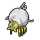 | [[Tarundel]]
 013 | 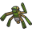 | [[Spinsidias]]
 014 |  | [[Micrick]]
 015 |  | [[Lextremo]]
 016 |  | [[Hoppspross]]
 017 |  | [[Hubelupf]]
 018 |  | [[Papungha]]
 019 |  | [[Dartiri]]
 020 | 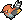 | [[Dartignis]]
 021 | 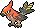 | [[Fiaro]]
 022 |  | [[Pamo]]
 023 |  | [[Pamamo]]
 024 |  | [[Pamomamo]]
 025 |  | [[Hunduster]]
 026 |  | [[Hundemon]]
 027 |  | [[Mangunior]]
 028 |  | [[Manguspektor]]
 029 | 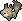 | [[Raffel]]
 030 |  | [[Schlaraffel]]
 031 |  | [[Sonnkern]]
 032 |  | [[Sonnflora]]
 033 |  | [[Zirpurze]]
 034 |  | [[Zirpeise]]
 035 |  | [[Purmel]]
 036 |  | [[Puponcho]]
 037 | | [[Vivillon]]
 038 | 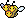 | [[Wadribie]]
 039 | 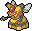 | [[Honweisel]]
 040 | 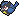 | [[Meikro]]
 041 | 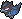 | [[Kranoviz]]
 042 | 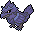 | [[Krarmor]]
 043 |  | [[Wonneira]]
 044 |  | [[Chaneira]]
 045 |  | [[Heiteira]]
 046 | 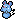 | [[Azurill]]
 047 |  | [[Marill]]
 048 | 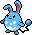 | [[Azumarill]]
 049 |  | [[Gehweiher]]
 050 |  | [[Maskeregen]]
 051 |  | [[Bamelin]]
 052 |  | [[Bojelin]]
 053 |  | [[Felino]]
 054 |  | [[Suelord]]
 055 |  | [[Enton]]
 056 |  | [[Entoron]]
 057 |  | [[Kamehaps]]
 058 | 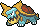 | [[Kamalm]]
 059 |  | [[Fluffeluff]]
 060 |  | [[Pummeluff]]
 061 |  | [[Knuddeluff]]
 062 | 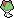 | [[Trasla]]
 063 | 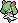 | [[Kirlia]]
 064 | 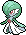 | [[Guardevoir]]
 065 | 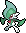 | [[Galagladi]]
 066 |  | [[Traumato]]
 067 |  | [[Hypno]]
 068 |  | [[Nebulak]]
 069 |  | [[Alpollo]]
 070 |  | [[Gengar]]
 071 |  | [[Zwieps]]
 072 |  | [[Famieps]]
 073 |  | [[Pichu]]
 074 |  | [[Pikachu]]
 075 |  | [[Raichu]]
 076 |  | [[Hefel]]
 077 | 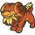 | [[Backel]]
 078 |  | [[Bummelz]]
 079 |  | [[Muntier]]
 080 |  | [[Letarking]]
 081 | 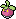 | [[Frubberl]]
 082 | 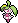 | [[Frubaila]]
 083 | 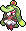 | [[Fruyal]]
 084 |  | [[Olini]]
 085 | 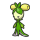 | [[Olivinio]]
 086 | 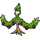 | [[Olithena]]
 087 | 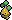 | [[Mobai]]
 088 | 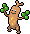 | [[Mogelbaum]]
 089 |  | [[Wuffels]]
 090 |  | [[Wolwerock]]
 091 | 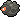 | [[Klonkett]]
 092 | 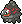 | [[Wagong]]
 093 | 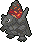 | [[Montecarbo]]
 094 | 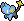 | [[Sheinux]]
 095 | 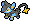 | [[Luxio]]
 096 |  | [[Luxtra]]
 097 |  | [[Staralili]]
 098 |  | [[Staravia]]
 099 |  | [[Staraptor]]
 100 |  | [[Choreogel]]
 101 |  | [[Voltilamm]]
 102 |  | [[Waaty]]
 103 |  | [[Ampharos]]
 104 | 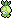 | [[Lilminip]]
 105 | 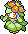 | [[Dressella]]
 106 |  | [[Knilz]]
 107 |  | [[Kapilz]]
 108 | 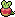 | [[Knapfel]]
 109 | 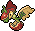 | [[Drapfel]]
 110 | 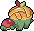 | [[Schlapfel]]
 111 |  | [[Spoink]]
 112 |  | [[Groink]]
 113 |  | [[Krawalloro]]
 114 |  | [[Traunfugil]]
 115 |  | [[Traunmagil]]
 116 |  | [[Makuhita]]
 117 |  | [[Hariyama]]
 118 |  | [[Krabbox]]
 119 |  | [[Krawell]]
 120 | 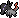 | [[Molunk]]
 121 | 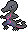 | [[Amfira]]
 122 |  | [[Phanpy]]
 123 |  | [[Donphan]]
 124 |  | [[Kupfanti]]
 125 |  | [[Patinaraja]]
 126 | 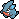 | [[Kaumalat]]
 127 | 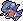 | [[Knarksel]]
 128 | 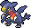 | [[Knakrack]]
 129 |  | [[Geosali]]
 130 | 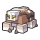 | [[Sedisal]]
 131 | 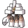 | [[Saltigant]]
 132 |  | [[Wingull]]
 133 | 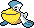 | [[Pelipper]]
 134 |  | [[Karpador]]
 135 |  | [[Garados]]
 136 | 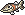 | [[Pikuda]]
 137 | 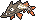 | [[Barrakiefa]]
 138 |  | [[Barschuft]]
 139 |  | [[Schluppuck]]
 140 |  | [[Schlukwech]]
 141 |  | [[Mauzi]]
 142 |  | [[Snobilikat]]
 143 |  | [[Driftlon]]
 144 | 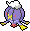 | [[Drifzepeli]]
 145 |  | [[Flabébé]]
 146 |  | [[Floette]]
 147 |  | [[Florges]]
 148 |  | [[Digda]]
 149 |  | [[Digdri]]
 150 |  | [[Qurtel]]
 151 |  | [[Camaub]]
 152 |  | [[Camerupt]]
 153 |  | [[Bronzel]]
 154 | 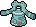 | [[Bronzong]]
 155 | 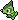 | [[Milza]]
 156 | 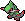 | [[Sharfax]]
 157 | 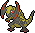 | [[Maxax]]
 158 |  | [[Menki]]
 159 |  | [[Rasaff]]
 160 |  | [[Epitaff]]
 161 |  | [[Meditie]]
 162 |  | [[Meditalis]]
 163 |  | [[Riolu]]
 164 |  | [[Lucario]]
 165 |  | [[Knarbon]]
 166 |  | [[Crimanzo]]
 167 |  | [[Azugladis]]
 168 |  | [[Schmerbe]]
 169 |  | [[Welsar]]
 170 |  | [[Blipp]]
 171 |  | [[Wampitz]]
 172 |  | [[Viscora]]
 173 |  | [[Viscargot]]
 174 |  | [[Viscogon]]
 175 |  | [[Glibunkel]]
 176 |  | [[Toxiquak]]
 177 |  | [[Voltrel]]
 178 |  | [[Voltrean]]
 179 |  | [[Evoli]]
 180 |  | [[Aquana]]
 181 |  | [[Blitza]]
 182 |  | [[Flamara]]
 183 |  | [[Psiana]]
 184 |  | [[Nachtara]]
 185 |  | [[Folipurba]]
 186 |  | [[Glaziola]]
 187 |  | [[Feelinara]]
 188 |  | [[Dummisel]]
 189 |  | [[Dummimisel]]
 190 |  | [[Sesokitz]]
 191 |  | [[Kronjuwild]]
 192 |  | [[Girafarig]]
 193 |  | [[Farigiraf]]
 194 |  | [[Sleima]]
 195 |  | [[Sleimok]]
 196 |  | [[Mobtiff]]
 197 |  | [[Mastifioso]]
 198 |  | [[Toxel]]
 199 |  | [[Riffex]]
 200 |  | [[Dedenne]]
 201 |  | [[Pachirisu]]
 202 |  | [[Sproxi]]
 203 |  | [[Affiti]]
 204 |  | [[Damhirplex]]
 205 |  | [[Tarnpignon]]
 206 |  | [[Hutsassa]]
 207 |  | [[[[Voltobal]]
 208 |  | [[Lektrobal]]
 209 |  | [[Magnetilo]]
 210 |  | [[Magneton]]
 211 |  | [[Magnezone]]
 212 |  | [[Ditto]]
 213 |  | [[Fukano]]
 214 |  | [[Arkani]]
 215 |  | [[Teddiursa]]
 216 |  | [[Ursaring]]
 217 |  | [[Sengo]]
 218 |  | [[Vipitis]]
 219 |  | [[Wablu]]
 220 |  | [[Altaria]]
 221 |  | [[Mähikel]]
 222 |  | [[Chevrumm]]
 223 |  | [[Tauros]]  (Paldea-Formen)
 224 |  | [[Leufeo]]
 225 |  | [[Pyroleo]]
 226 |  | [[Skunkapuh]]
 227 |  | [[Skuntank]]
 228 |  | [[Zorua]]
 229 |  | [[Zoroark]]
 230 |  | [[Sniebel]]
 231 |  | [[Snibunna]]
 232 |  | [[Kramurx]]
 233 |  | [[Kramshef]]
 234 |  | [[Mollimorba]]
 235 |  | [[Hypnomorba]]
 236 |  | [[Morbitesse]]
 237 |  | [[Fatalitee]]
 238 |  | [[Mortipot]]
 239 |  | [[Mimigma]]
 240 |  | [[Clavion]]
 241 |  | [[Servol]]
 242 |  | [[Weherba]]
 243 |  | [[Horrerba]]
 244 |  | [[Tentagra]]
 245 |  | [[Tenterra]]
 246 |  | [[Tropius]]
 247 |  | [[Imantis]]
 248 |  | [[Mantidea]]
 249 |  | [[Klibbe]]
 250 |  | [[Chilingel]]
 251 |  | [[Halupenjo]]
 252 |  | [[Tuska]]
 253 |  | [[Noktuska]]
 254 |  | [[Relluk]]
 255 |  | [[Skarabaks]]
 256 |  | [[Bluzuk]]
 257 |  | [[Omot]]
 258 |  | [[Tannza]]
 259 |  | [[Forstellka]]
 260 |  | [[Sichlor]]
 261 |  | [[Scherox]]
 262 |  | [[Skaraborn]]
 263 |  | [[Flattutu]]
 264 |  | [[Psiopatra]]
 265 |  | [[Hippopotas]]
 266 |  | [[Hippoterus]]
 267 |  | [[Ganovil]]
 268 |  | [[Rokkaiman]]
 269 |  | [[Rabigator]]
 270 |  | [[Salanga]]
 271 |  | [[Sanaconda]]
 272 |  | [[Pampuli]]
 273 |  | [[Pampross]]
 274 |  | [[Ignivor]]
 275 |  | [[Ramoth]]
 276 |  | [[Kindwurm]]
 277 |  | [[Draschel]]
 278 |  | [[Brutalanda]]
 279 |  | [[Forgita]]
 280 |  | [[Tafforgita]]
 281 |  | [[Granforgita]]
 282 |  | [[Brimova]]
 283 |  | [[Brimano]]
 284 |  | [[Silembrim]]
 285 |  | [[Bähmon]]
 286 |  | [[Pelzebub]]
 287 |  | [[Olangaar]]
 288 |  | [[Schligda]]
 289 |  | [[Schligdri]]
 290 |  | [[Adebom]]
 291 |  | [[Normifin]]
 292 |  | [[Delfinator]]
 293 |  | [[Knattox]]
 294 |  | [[Knattatox]]
 295 |  | [[Mopex]]
 296 |  | [[Schlurm]]
 297 |  | [[Zobiris]]
 298 |  | [[Shuppet]]
 299 |  | [[Banette]]
 300 |  | [[Legios]]
 301 |  | [[Resladero]]
 302 |  | [[Kryppuk]]
 303 |  | [[eF-eM]]
 304 |  | [[UHaFnir]]
 305 |  | [[Grolldra]]
 306 |  | [[Phandra]]
 307 |  | [[Katapuldra]]
 308 |  | [[Lumispross]]
 309 |  | [[Lumiflora]]
 310 |  | [[Rotom]]
 311 |  | [[Gruff]]
 312 |  | [[Friedwuff]]
 313 |  | [[Kommandutan]]
 314 |  | [[Quartermak]]
 315 |  | [[Koalelu]]
 316 |  | [[Larvitar]]
 317 |  | [[Pupitar]]
 318 |  | [[Despotar]]
 319 |  | [[Humanolith]]
 320 |  | [[Kubuin]]
 321 |  | [[Britzigel]]
 322 |  | [[Sankabuh]]
 323 |  | [[Colossand]]
 324 |  | [[Flegmon]]
 325 |  | [[Lahmus]]
 326 |  | [[Laschoking]]
 327 |  | [[Schalellos]]
 328 |  | [[Gastrodon]]
 329 |  | [[Muschas]]
 330 |  | [[Austos]]
 331 |  | [[Baldorfish]]
 332 |  | [[Liebiskus]]
 333 |  | [[Finneon]]
 334 |  | [[Lumineon]]
 335 |  | [[Knirfish]]
 336 |  | [[Mamolida]]
 337 |  | [[Algitt]]
 338 |  | [[Tandrak]]
 339 |  | [[Scampisto]]
 340 |  | [[Wummer]]
 341 |  | [[Zapplardin]]
 342 |  | [[Zapplalek]]
 343 |  | [[Zapplarang]]
 344 |  | [[Garstella]]
 345 |  | [[Aggrostella]]
 346 |  | [[Flaminkno]]
 347 |  | [[Dratini]]
 348 |  | [[Dragonir]]
 349 |  | [[Dragoran]]
 350 |  | [[Snomnom]]
 351 |  | [[Mottineva]]
 352 |  | [[Shnebedeck]]
 353 |  | [[Rexblisar]]
 354 |  | [[Botogel]]
 355 |  | [[Petznief]]
 356 |  | [[Siberio]]
 357 |  | [[Schneppke]]
 358 |  | [[Firnontor]]
 359 |  | [[Frosdedje]]
 360 |  | [[Frigometri]]
 361 |  | [[Flaniwal]]
 362 |  | [[Kolowal]]
 363 |  | [[Arktip]]
 364 |  | [[Arktilas]]
 365 |  | [[Geronimatz]]
 366 |  | [[Washakwil]]
 367 |  | [[Gladiantri]]
 368 |  | [[Caesurio]]
 369 |  | [[Gladimperio]]
 370 |  | [[Kapuno]]
 371 |  | [[Duodino]]
 372 |  | [[Trikephalo]]
 373 |  | [[Agiluza]]
 374 |  | [[Heerashai]]
 375 |  | [[Nigiragi]]
 376 |  | [[Riesenzahn]]
 377 |  | [[Brüllschweif]]
 378 |  | [[Wutpilz]]
 379 |  | [[Flatterhaar]]
 380 |  | [[Kriechflügel]]
 381 |  | [[Sandfell]]
 382 |  | [[Eisenrad]]
 383 |  | [[Eisenbündel]]
 384 |  | [[Eisenhand]]
 385 |  | [[Eisenhals]]
 386 |  | [[Eisenfalter]]
 387 |  | [[Eisendorn]]
 388 |  | [[Frospino]]
 389 |  | [[Cryospino]]
 390 |  | [[Espinodon]]
 391 |  | [[Gierspenst]]
 392 | | [[Monetigo]]
 393 | | [[Chongjian]]
 394 | | [[Baojian]]
 395 | | [[Dinglu]]
 396 | | [[Yuyu]]
 397 | | [[Donnersichel]]
 398 | | [[Eisenkrieger]]
 399 | | [[Koraidon]]
 400 | | [[Miraidon]]

#pokemon
