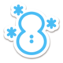

# Marks

In der Galar-Region gefangene Pokémon können ein sogenanntes Zeichen haben. Es handelt sich somit um ein Feature, das seit der achten Spielgeneration existiert.
Ein Zeichen wird ebenso wie Bänder im Bericht eines Pokémon angezeigt. Der Unterschied zu diesen liegt aber darin, dass ein Pokémon nur rein zufällig ein Zeichen trägt und somit nicht gezielt erhalten werden kann. Für einige Zeichen sind zwar bestimmte Bedingungen erforderlich, aber das Erfüllen dieser garantiert dennoch kein Zeichen beim Fang.
Hat ein Pokémon ein Zeichen, so kann in Pokémon Schwert und Schild im Pokémon-Bericht auch der entsprechende Titel ausgewählt werden, der angezeigt wird, wenn das Pokémon im Kampf eingesetzt wird.

 Icon                                      | Name                     | Titel          | Spielbeschreibung                                                            | Voraussetzung                                          
-------------------------------------------|--------------------------|----------------|------------------------------------------------------------------------------|--------------------------------------------------------
   | Mittags-Zeichen          | Magenknurrer   | Zeichen eines Pokémon, das großen Hunger hat.                                | Geringe Chance (12:00 – 18:59 Uhr)                
      | Mitternachts-Zeichen     | Schlafmütze    | Zeichen eines Pokémon, das schläfrig ist.                                    | Geringe Chance (20:00 – 23:59 Uhr)                
 | Abenddämmerungs-Zeichen  | Gähner         | Zeichen eines Pokémon, das langsam müde wird.                                | Geringe Chance (19:00 – 19:59 Uhr)                
   | Morgendämmerungs-Zeichen | Frühaufsteher  | Zeichen eines Pokémon, das früh aufgestanden ist.                            | Geringe Chance (06:00 – 11:59 Uhr)                
  | Wolken-Zeichen           | Wolkengucker   | Zeichen eines Pokémon, das gern die Wolken betrachtet.                       | Geringe Chance (während es bewölkt ist)           
  | Regen-Zeichen            | Regenplanscher | Zeichen eines Pokémon, das vom Regen klitschnass ist.                        | Geringe Chance (während es regnet)                
 | Gewitter-Zeichen         | Krachmacher    | Zeichen eines Pokémon, das bei Gewittern einen Aufstand macht.               | Geringe Chance (während es gewittert)             
  | Schneefall-Zeichen       | Schneetänzer   | Zeichen eines Pokémon, das im Schnee herumtollt.                             | Geringe Chance (während es schneit)               
  | Schneesturm-Zeichen      | Frostbeule     | Zeichen eines Pokémon, das vor Kälte zittert.                                | Geringe Chance (während eines Schneesturms)       
  | Dürre-Zeichen            | Trockenkehle   | Zeichen eines Pokémon, das mächtig Durst hat.                                | Geringe Chance (bei starkem Sonnenlicht)          
   | Sandsturm-Zeichen        | Sandwühler     | Zeichen eines Pokémon, das über und über mit Sand bedeckt ist.               | Geringe Chance (während eines Sandsturms)         
  | Nebel-Zeichen            | Nebelwanderer  | Zeichen eines Pokémon, das sich im Nebel verläuft.                           | Geringe Chance (während es neblig ist)            
  | Schicksals-Zeichen       | Schicksalsbote | Zeichen eines Pokémon, das etwas Schicksalhaftes an sich hat.                | ''unbekannt''                                          
  | Angel-Zeichen            | Fang des Tages | Zeichen eines Pokémon, das frisch an Land gezogen wurde.                     | Gute Chance (beim Angeln)                         
  | Curry-Zeichen            | Currykenner    | Zeichen eines Pokémon, das gerne Curry isst.                                 | Garantiert (durch dein gekochtes Curry angelockt) 
  | Gängigkeits-Zeichen      | Menschenfreund | Zeichen eines Pokémon, das an Menschen gewöhnt ist.                          | Geringe Chance                                         
  | Raritäts-Zeichen         | Eremit         | Zeichen eines Pokémon, das keine Erfahrung mit Menschen hat.                 | Extrem geringe Chance                                  
  | Raufbold-Zeichen         | Rowdy          | Zeichen eines Pokémon, das sich wie ein Rabauke verhält.                     | Sehr geringe Chance                                    
  | Sorglos-Zeichen          | Luftikus       | Zeichen eines Pokémon, das sich um nichts wirklich Gedanken macht.           | Sehr geringe Chance                                    
  | Spannungs-Zeichen        | Nervenbündel   | Zeichen eines Pokémon, das angespannt ist.                                   | Sehr geringe Chance                                    
  | Vorfreude-Zeichen        | Flitzebogen    | Zeichen eines Pokémon, das aufgeregt ist.                                    | Sehr geringe Chance                                    
  | Charisma-Zeichen         | Charismatiker  | Zeichen eines Pokémon, das eine besondere Ausstrahlung hat.                  | Sehr geringe Chance                                    
  | Gelassenheits-Zeichen    | Ruhepol        | Zeichen eines Pokémon, das stets gelassen ist.                               | Sehr geringe Chance                                    
  | Hitzkopf-Zeichen         | Heißsporn      | Zeichen eines Pokémon, das aggressiv ist.                                    | Sehr geringe Chance                                    
  | Achtlos-Zeichen          | Tagträumer     | Zeichen eines Pokémon, das nicht ganz bei der Sache ist.                     | Sehr geringe Chance                                    
   | Glücklichkeits-Zeichen   | Grinsebacke    | Zeichen eines Pokémon, das glücklich wirkt.                                  | Sehr geringe Chance                                    
  | Wut-Zeichen              | Choleriker     | Zeichen eines Pokémon, das ziemlich sauer ist.                               | Sehr geringe Chance                                    
  | Lächel-Zeichen           | Sonnenschein   | Zeichen eines Pokémon, das vor Freude strahlt.                               | Sehr geringe Chance                                    
  | Trübsal-Zeichen          | Heulsuse       | Zeichen eines Pokémon, das schluchzend weint.                                | Sehr geringe Chance                                    
  | Heiterkeits-Zeichen      | Optimist       | Zeichen eines Pokémon, das gut drauf ist.                                    | Sehr geringe Chance                                    
 | Missmut-Zeichen          | Muffel         | Zeichen eines Pokémon, das miese Laune hat.                                  | Sehr geringe Chance                                    
  | Verstands-Zeichen        | Schlaukopf     | Zeichen eines Pokémon, das Köpfchen hat.                                     | Sehr geringe Chance                                    
  | Impulsiv-Zeichen         | Krawallbürste  | Zeichen eines Pokémon, das wütet und tobt.                                   | Sehr geringe Chance                                    
  | Listigkeits-Zeichen      | Schlitzohr     | Zeichen eines Pokémon, das auf den richtigen Moment wartet, um zuzuschlagen. | Sehr geringe Chance                                    
  | Grimmig-Zeichen          | Griesgram      | Zeichen eines Pokémon, das ein böses Gesicht macht.                          | Sehr geringe Chance                                    
  | Sanftmut-Zeichen         | Gute Seele     | Zeichen eines Pokémon, das ein gutes Herz hat.                               | Sehr geringe Chance                                    
  | Panik-Zeichen            | Hektiker       | Zeichen eines Pokémon, das leicht in Panik gerät.                            | Sehr geringe Chance                                    
  | Ansporn-Zeichen          | Enthusiast     | Zeichen eines Pokémon, das voller Tatendrang steckt.                         | Sehr geringe Chance                                    
  | Lustlos-Zeichen          | Faulpelz       | Zeichen eines Pokémon, das keinen Bock auf nichts hat.                       | Sehr geringe Chance                                    
  | Selbstvertrauens-Zeichen | Angeber        | Zeichen eines Pokémon, das einiges auf sich hält.                            | Sehr geringe Chance                                    
   | Selbstzweifel-Zeichen    | Selbstzweifler | Zeichen eines Pokémon, das kein Selbstvertrauen hat.                         | Sehr geringe Chance                                    
 | Arglos-Zeichen           | Schussel       | Zeichen eines Pokémon, das einfach gestrickt ist.                            | Sehr geringe Chance                                    
  | Scheinheilig-Zeichen     | Wichtigtuer    | Zeichen eines Pokémon, das sich gerne in den Vordergrund spielt.             | Sehr geringe Chance                                    
  | Elan-Zeichen             | Energiebündel  | Zeichen eines Pokémon, das voller Energie steckt.                            | Sehr geringe Chance                                    
  | Formtief-Zeichen         | Durchhänger    | Zeichen eines Pokémon, das irgendwie einen Durchhänger hat.                  | Sehr geringe Chance                                    

#pokemon