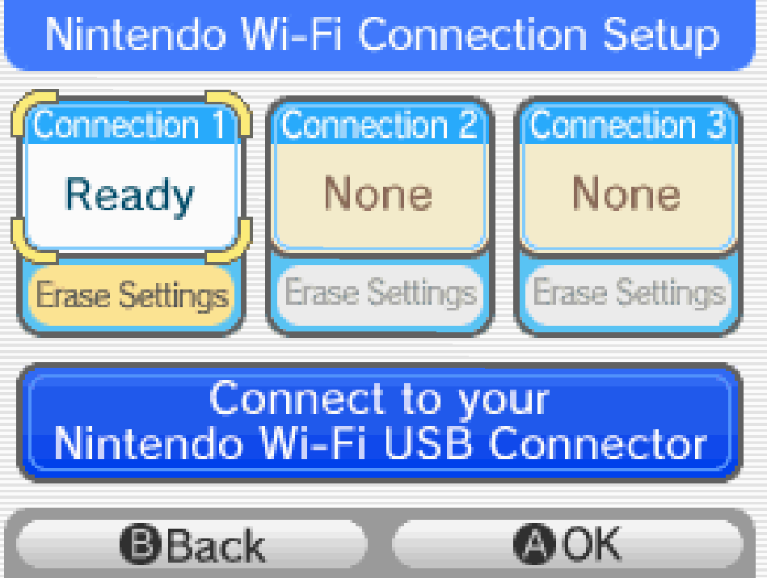

**Games:** Diamond / Pearl / Platinum (Generation 4)

**New ribbons:** 38

**Total ribbons:** 65

## Contest Ribbons (20)

**How to Obtain:**

-   Win Pokémon contests in each of the 4 ranks, for each of the 5 categories.

There are a total of 20 contests that you need to win in order to get all the ribbons in this category. Contests are broken down into three equally important stages in gen 4:

**Stage 1: Visual**

This stage is broken into two parts:

-   **Condition:** This is the same as the first stage in gen 3 contests, if you have already fully fed your Pokémon previously there is nothing to do here (Make sure to get the [scarves](https://www.google.com/url?q=https%3A%2F%2Fbulbapedia.bulbagarden.net%2Fwiki%2FScarf&sa=D&sntz=1&usg=AOvVaw3E84BX5tA-UcqP7vQR3SmK) again if you haven't already)

-   **Dress Up:** This is the part where you dress up your Pokémon with accessories. Before you start you will be given a category, remember this because each accessory is better in certain categories than others. To get the most points in these sections use the accessories that best match the category, also make sure to equip as many accessories as possible even if they don't match the category, they will all add to your score. Accessories and their category compatibility can be found [here](https://www.google.com/url?q=https%3A%2F%2Fbulbapedia.bulbagarden.net%2Fwiki%2FAccessory&sa=D&sntz=1&usg=AOvVaw0SMrQkDe6i-Axbvyylm9wM).

**Stage 2: Dance**

This is the stage that needs the least explaining, simply do your best at the rhythm minigame.

**Stage 3: Acting**

This stage is actually very different to gen 3. Contest combinations are gone and many moves act different to how they used to. There are also 3 judges now and you can choose who you appeal to, using moves in correct/incorrect categories now affect the voltage of the judge you appeal to, rather than affecting your personal score.

This means that there is less strategy needed compared to gen 3. Since combinations are gone it's usually best to spam moves with high appeal values. If you don't have moves of the same category that's also fine, you don't get punished for having moves of the wrong category anymore, just make sure to use those moves to sabotage judge voltage so the NPC's wont get bonuses.

If possible it's a big advantage to attempt these contests before you beat the Pokémon League, as named trainers with better Pokémon will start to appear in master tier contests and make them potentially a lot harder. I wouldn't recommend resetting an existing save to try this though unless you are struggling a lot.

## Sinnoh Champion Ribbon

**How to Obtain:**

-   Defeat Cynthia at the Pokémon League.

The champion ribbon of gen 4.

## Footprint Ribbon

**How to Obtain:**

-   Talk to Dr. Footstep on Route 213 when your lead Pokémon has max friendship.

To get this ribbon your lead party member will need to have its friendship maxed, there are a lot of ways to boost friendship but the easiest way in my opinion is to make your Pokémon hold a Soothe Bell while getting a massage at both Veilstone and the Ribbon Syndicate once per day.

This will take a couple of days if you only use massages, but other activities such as battles and contests will also slightly increase friendship so make sure to keep the Soothe Bell held until you get the ribbon.

## Daily Ribbons (7)

**How to Obtain:**

-   Talk to Julia in Sunyshore City each day of the week.

Simply talk to Julia in the northeast house in Sunyshore every day for a week. If you want to cheat the system and do this process faster, you can set your DS clock to 11:59pm and wait in game until 12:00am. This will trick the game into thinking that a day has passed, and will allow you to get the next days ribbon.

## Syndicate Ribbons (3)

**How to Obtain:**

-   Pay 10,000/100,000/999,999 PokéDollars at the Ribbon Syndicate in the Resort Area.

These ribbons are actually easier than they look, you can make a lot of money using the VS Seeker on Route 212 to battle the two rich trainers outside the Pokémon Mansion, make sure your lead Pokémon is holding an Amulet Coin and can beat a Chatot and Roselia quickly. If you have beaten the Pokémon League each rematch will give you 16,000p and if you have finished the Stark Mountain storyline you will get 24,000p.

Another option for earning money is to wait until after you finish the battle towers, and to use the earned BP to buy EV vitamins, and then sell them for PokéDollars.

It will take 47 battles to get all three ribbons which is less battles than a battle tower and a lot easier as well.

## Battle Tower Ribbons (6)

**How to Obtain:**

-   Defeat Palmer at both 21 and 49 consecutive wins in the Singles Battle Tower

-   Win 50 Consecutive Battles in the Double, Co-op Multi and AI Multi Battle Towers

-   Reach Rank 5 in the Wi-Fi Battle Tower

**IMPORTANT NOTE:** The World Ability Ribbon which you get from the Wi-Fi Battle Tower is not available through normal means since Nintendo WFC has been closed. There is a way to attempt this tower without hardware or software modifications (which will be explained in the "Wi-Fi Tower" section below), but most people consider this ribbon to be optional, so you can decide if you want to do it or not.

(This part of the guide assumes you have read the "General Battle Tower tips" section on the [Starting Tips](https://sites.google.com/view/athis-ribbon-handbook/home/starting-tips) page)

The D/P/Pt Battle Tower contains some of the hardest, if not the hardest ribbons currently obtainable, since each of the towers provide a unique challenge from one another I am going to divide this part of the guide into sections. There are version differences between D/P and Pt but they are rather minimal, so don't worry too much about which version you pick.

You can find the sets used in the tower here:

-   [Diamond / Pearl Trainers](https://www.google.com/url?q=https%3A%2F%2Fbulbapedia.bulbagarden.net%2Fwiki%2FList_of_Battle_Tower_Trainers_%28Generation_IV%29&sa=D&sntz=1&usg=AOvVaw1g0zZL3tqb4SIUcDGEjJvg)

-   [Platinum / Heart Gold / Soul Silver Trainers](https://www.google.com/url?q=https%3A%2F%2Fbulbapedia.bulbagarden.net%2Fwiki%2FList_of_Battle_Frontier_Trainers_%28Generation_IV%29&sa=D&sntz=1&usg=AOvVaw2Ywr5yED21e4-WfQvbkiQg)

-   [Palmer](https://www.google.com/url?q=https%3A%2F%2Fbulbapedia.bulbagarden.net%2Fwiki%2FPalmer%23Pok.C3.A9mon_Diamond_and_Pearl&sa=D&sntz=1&usg=AOvVaw0t52gyiqCn_5MLsroniWoL) [(](https://www.google.com/url?q=https%3A%2F%2Fbulbapedia.bulbagarden.net%2Fwiki%2FPalmer%23Pok.C3.A9mon_Diamond_and_Pearl&sa=D&sntz=1&usg=AOvVaw0t52gyiqCn_5MLsroniWoL)[Singles Tower,](https://www.google.com/url?q=https%3A%2F%2Fbulbapedia.bulbagarden.net%2Fwiki%2FPalmer%23Pok.C3.A9mon_Diamond_and_Pearl&sa=D&sntz=1&usg=AOvVaw0t52gyiqCn_5MLsroniWoL) [Battle](https://www.google.com/url?q=https%3A%2F%2Fbulbapedia.bulbagarden.net%2Fwiki%2FPalmer%23Pok.C3.A9mon_Diamond_and_Pearl&sa=D&sntz=1&usg=AOvVaw0t52gyiqCn_5MLsroniWoL) [21](https://www.google.com/url?q=https%3A%2F%2Fbulbapedia.bulbagarden.net%2Fwiki%2FPalmer%23Pok.C3.A9mon_Diamond_and_Pearl&sa=D&sntz=1&usg=AOvVaw0t52gyiqCn_5MLsroniWoL) [and](https://www.google.com/url?q=https%3A%2F%2Fbulbapedia.bulbagarden.net%2Fwiki%2FPalmer%23Pok.C3.A9mon_Diamond_and_Pearl&sa=D&sntz=1&usg=AOvVaw0t52gyiqCn_5MLsroniWoL) [49](https://www.google.com/url?q=https%3A%2F%2Fbulbapedia.bulbagarden.net%2Fwiki%2FPalmer%23Pok.C3.A9mon_Diamond_and_Pearl&sa=D&sntz=1&usg=AOvVaw0t52gyiqCn_5MLsroniWoL)[)](https://www.google.com/url?q=https%3A%2F%2Fbulbapedia.bulbagarden.net%2Fwiki%2FPalmer%23Pok.C3.A9mon_Diamond_and_Pearl&sa=D&sntz=1&usg=AOvVaw0t52gyiqCn_5MLsroniWoL)

### Singles Tower

This tower is very similar to the gen 3 tower, and as such it follows similar strategy. Compared to gen 3, gen 4's tower has better AI and less gimmick sets for you to face. Not much to say here, get used to these types of tower as there are a lot more in future games.

You receive two ribbons for this tower, both from beating Tower Tycoon Palmer at battles 21 and 49.

### Doubles Tower

This is the first tower that you will need to battle in the doubles format. If you have been doing battles in singles up until now you will need an extra member for your team as you need to use 4 in doubles.

If you are not familiar with doubles as a format, a big recommendation is to make use of Protect, if the AI has a super effective move against one of your Pokémon they will almost always use it against them. With Protect you can save your Pokémon from that move and your partner can attack the enemy that has the super effective move, turning a losing situation into a winning one.

You will receive a ribbon when you finish battle 50 in a streak.

### Co-op Multi Tower

For this tower you will need to connect to another game and complete the streak over wireless connection. If you are planning to obtain all the ribbons you should already have access to HG/SS and a 3DS, you can use these to connect to D/P/Pt. You can also transfer 2 of the 4 Pokémon you used into doubles over to the other game to make up your team. If either of the two games used are D/P the trainers that you will face will be the ones from D/P **NOT** Pt/HG/SS.

This tower is almost identical to the doubles tower, with the main difference being that you face two trainers rather than one. This means that if one trainer loses both their Pokémon the other trainer will be forced to fight you in a 1v2 situation. This makes focusing one side of the field a very good strategy here.

Like the doubles tower you will receive a ribbon when you finish battle 50 in a streak.

### NPC Multi Tower

Now this is where the gen 4 towers start to get hard, in my opinion this is the single hardest ribbon obtainable ribbon in any game. The reason this tower is so hard is that you have to rely on an NPC as your partner, and that takes a lot of control of the situation out of your hands. It is also very frustrating as there will be times you lose a streak even if you play perfectly.

You will receive a ribbon when you finish battle 50 in a streak.

The most important factor to increase your odds at this tower is partner selection. Like normal tower trainers, the NPC also pull from a set list of Pokémon available to them, when picking your partner they will tell you what Pokémon they use and what moves those Pokémon "like" or "is good at". This "like" is actually important to us in determining what set that Pokémon uses. Below are the lists that the NPC's choose from (scroll to the Battle Tower section):

The "like" move will always be in the top left slot from the above lists, for example if Mira is bringing an Alakazam that likes Psycho Cut and a Gengar that likes Shadow Ball, you know that her Alakazam will use the set with Psycho Cut in the top left slot and one of the two Gengars with Shadow Ball in the top left slot.

Now in my opinion you want to aim for NPC with as many attacking moves as possible. The AI is smart enough to pick effective moves against what it is attacking, but they will use status moves almost completely randomly, so aiming for sets with less status is almost always in your best interest.

I found that Mira and Riley are typically the better choices, but all of the NPC can get good options so make sure to check all of them before you continue your streak.

You are also not forced into the choices that are provided, you can reset the NPC options without resetting your streak by leaving the room and:

-   Setting your DS clock to 11:59pm and wait in game until 12:00am.

-   Win/Lose another battle tower battle (forfeiting a tower you have already completed is the fastest way)

Lastly just like the Coop Multi tower, similar strategy applies so focusing on attacking one side of the field can create 2v1 situations which will help a lot.

### Wi-Fi Tower

As mentioned above, this tower is not available through normal means as Nintendo WFC has been closed. We can however connect to replica servers made and up-kept by fans, this will allow us to earn this towers ribbon in the same fashion as if we were connected to official servers.

### ++ Connecting to a Replica Server

To connect to a replica server you will need 2 things

-   A Wi-Fi Connection (DS games require Unencrypted or WEP encrypted networks, a router or phone hotspot without a password works, but there are obvious risks involved with that, so be careful)

-   A replica server to connect to : I personally used [Poke Classic Network](https://www.google.com/url?q=https%3A%2F%2Fpkmnclassic.net%2F&sa=D&sntz=1&usg=AOvVaw0K6VoboF7_T8GuOujpaRtK)

Here are the steps to connect to the server:

1.  When you open your game go to "Nintendo WFC Settings"

2.  Click on "Nintendo Wi-Fi Connection Settings"

3.  Choose a connection slot

4.  Click on "Access Point" and choose your router (there might be an error after this, that is fine)

5.  Choose the same connection slot and change the settings so that:

    -   "Auto Obtain DNS" is off

    -   Change "Primary DNS" to that of your server ([Poke Classic Network](https://www.google.com/url?q=https%3A%2F%2Fpkmnclassic.net%2F&sa=D&sntz=1&usg=AOvVaw0K6VoboF7_T8GuOujpaRtK) is 178.62.43.212)

    -   Change "Secondary DNS" to 0.0.0.0

6.  Do a connection test, it might fail, if it does that is fine.

7.  Load your game and attempt to connect to any of the Wi-Fi Features, hopefully it should work here and you will be able to play the tower.

(If the above steps don't work you will have to troubleshoot your problems via Google etc.)

Now with the prep work done you can actually attempt the tower, this tower is unique in a lot of ways.

Firstly the teams you encounter are teams that other players used to attempt this battle tower, controlled by NPC. This means that the teams you face will be made up of other players teams, which will often be more powerful than the normal NPC trainers you are used to fighting. Due to glitches in gen 4 there are also ways to make illegal Pokémon (such as Wonderguard Spiritomb and No Guard Sheer Cold Machamp). Since the teams that you encounter are player made there is a chance that you will encounter them on your climb so be prepared.

Secondly progression is a bit different than the normal streak system. You start at rank 1, winning 7 consecutive battles will increase your rank, failing to win 7 consecutive battles 4 times in a row will drop your rank. To get the ribbon you need to reach rank 5.

Thirdly when you start your challenge you can pick a room from 1-50, this will only affect the teams that you face and nothing else, many say that the rooms 20-30 contain less glitched Pokémon on average. Attempting a 7 streak on a room will lock it for you for approx. 1 day(this will depend on when the server resets).

There is an option called “challenge earlier room”, attempting this room will not cause you to gain or lose ranks, it only allows you to play the last 7 battle streak again

I found the best way to climb this tower is to start with any room and do your best to beat it, if you lose don't change room, instead do "challenge earlier room" as many times as it takes to beat and write down everything that you face(trainer name, their Pokémon and move sets etc. ). Then come up with a somewhat reliable way to beat this room and attempt again when the server resets, when it does you will most likely face the same teams, but you have a huge advantage as you know their move sets and should have a plan for it.

When the server resets every player that attempted a room will be added to that room (for example if a team wins 3 battles that team will be the new 3rd team and push the other teams down) This means that you should be prepared to face the team that you initially used based on where you lost your streak.

### Returning Ribbons

**Effort Ribbon**

You can get this ribbon in Sunyshore Market when you show a Pokémon with maxed EV's.