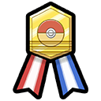
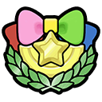

**Games:** Omega Ruby / Alpha Sapphire (Generation 6)

**New ribbons:** 7

**Total ribbons:** 80

## Hoenn Champion Ribbon

**How to Obtain:**

-   Defeat Steven at the Pokémon League.

This is the second time we are getting a ribbon for beating the Hoenn league, it should be just as easy this time.

## Contest Master Ribbons (6)

**How to Obtain:**

-   Win master rank Pokémon contests in each of the 5 contest categories.

Once you have beaten all 5 master rank contests you will be awarded the Contest Star ribbon as a bonus. If you have unlocked a master rank contest of a category already, any Pokémon can attempt that master rank contest straight away.

Since OR/AS are remakes of gen 3, the contests have been made very similar to the original Hoenn games. Strategy is very similar to the gen 3 contests as well, but there are a few notable differences:

-   There are no limits to the amount of PokéBlocks you can feed to a Pokémon. This means its a good idea to max out all 5 contest stats before attempting the contests.

-   PokéBlocks are a lot easier to make, simply make blocks from 4 different colored berries of any type. Rainbow blocks made this way will boost all contest stats at once.

-   [Contest Combinations](https://www.google.com/url?q=https%3A%2F%2Fbulbapedia.bulbagarden.net%2Fwiki%2FContest_combination%23Contest_Spectaculars&sa=D&sntz=1&usg=AOvVaw1SITnqD5ldJl4kYkPwRR_Y) are back, but many of the combinations have changed. The Rest + Snore / Sleep Talk is still a great combination that most Pokémon have access to.

-   Contest Combinations give 3 hearts rather than double the hearts of the second move.

Don't forget to obtain [Scarves](https://www.google.com/url?q=https%3A%2F%2Fbulbapedia.bulbagarden.net%2Fwiki%2FScarf&sa=D&sntz=1&usg=AOvVaw3E84BX5tA-UcqP7vQR3SmK) to use in the contests, as usual they will help make things easier.

### Returning Ribbons

**Effort Ribbon**

You can get this ribbon in Slateport Market when you show a Pokémon with maxed EV's.

**Syndicate Ribbons (3)**

You can get these ribbons in Mauville City when you spend 10,000/100,000/999,999 PokéDollars.

**Daily Ribbons (7)**

You can get these ribbons from Mauville Hills every day of the week.

**Footprint Ribbon**

You can get this ribbon in the Battle Resort when you show a Pokémon that has gained 30 levels since it was caught or received. This is different than the original method, and it's also missable, if your Pokémon cannot gain 30 levels.

**Best Friends Ribbon**

You can get this ribbon using Pokémon Amie in the exact same way you get it in Kalos.

**Training** **Ribbon**

You can get this ribbon from Dewford Town when your lead Pokémon has a medal for every course in  Super Training.
