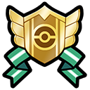

**Games:** Sword/ Shield (Generation 8)

**New ribbons:** 3

**Total ribbons:** 87

## Galar Champion Ribbon

**How to Obtain:**

-   Win the Champion Tournament at Wyndon Stadium.

Another easy champion ribbon, this is likely the easiest of its type so far as it only takes 3 battles rather than 5 and your Pokémon automatically get healed at the end of each battle.

## Tower Master Ribbon

**How to Obtain:**

-   Defeat Leon in Master Ball Tier at the Battle Tower.

To get the ribbon you must first reach the Master Ball tier, then continue battling until you reach and defeat Leon. If you are undefeated you will get this ribbon in 43 battles.

(This part of the guide assumes you have read the "General Battle Tower tips" section on the [Starting Tips](https://sites.google.com/view/athis-ribbon-handbook/home/starting-tips) page)

This battle tower functions a bit differently than previous gens:

-   You progress using the ranks system (explained below).

-   Restricted legendries are legal in this tower.

The above points, and the fact that you can Dynamax when most of your opponents cannot, makes this the easiest battle tower ribbon so far.

A really easy way to clear this tower is to just use strong legendary Pokémon, or to spam Dynamax. Having proper team building is not essential here.

You can find the sets used in the tower here:

-   [Trainers](https://www.google.com/url?q=https%3A%2F%2Fbulbapedia.bulbagarden.net%2Fwiki%2FList_of_Battle_Tower_Trainers_%28Generation_VIII%29&sa=D&sntz=1&usg=AOvVaw3Nms9feKeXA-qMZpUtyNO_)

-   [Leon](https://www.google.com/url?q=https%3A%2F%2Fbulbapedia.bulbagarden.net%2Fwiki%2FBattle_Tower_%28Generation_VIII%29%23Leon&sa=D&sntz=1&usg=AOvVaw2MgSbCjFaZJ-yvBmilUhnq)

### ++ How the Sw/Sh rank system works

In Sword and Shield, for both battle tower and ranked battles, you progress in a ranked system rather than relying on streaks like previous games.

This is measured with a rank from 1 to 11(11 is displayed as MAX), depending on your rank you will also have a tier, the tiers are as follows:

-   Beginner (Ranks 1-3)

-   Poke ball (Ranks 4-6)

-   Great Ball (Ranks 7-9)

-   Ultra Ball (Rank 10)

-   Master Ball (Rank MAX)

Winning enough games will cause your rank to increase, and losing will do the opposite, however you cannot drop into a lower tier once you have reached another (for example you can drop from rank 5 to 4, but you cant drop from 4 to 3 since you cannot fall out of the Pokéball tier)

## Master Rank Ribbon

**How to Obtain:**

-   Defeat a Master Ball Tier player in Ranked Battles.

This is the first actual PVP ribbon that you can get. To get it you must defeat another player who is already in Master Ball Tier, to be able to encounter players like this you will need to be Master Ball Tier yourself. You can do this in either Doubles or Singles.

If you are not very experienced with PvP or competitive Pokémon this will likely be a hard ribbon to obtain, but luckily ranked battles share the same rank system as the battle tower (explained above). That means that there is a level of loss protection involved, so with enough persistence you should be able to get it.

That being said it's hard to provide strategy for this ribbon as it is a live format, meaning that rules and allowed Pokémon are changed every month. Here are a few ideas that might help in picking a team for ranked battles:

-   [Pikalytics](https://www.google.com/url?q=https%3A%2F%2Fwww.pikalytics.com%2F&sa=D&sntz=1&usg=AOvVaw3ZmYUrcCnqW97CKEDHT1mk) shows you what Pokémon are being used and their most common sets, its a good indication of what is currently strong. You can use this to either help make your team, or to help mid battle to guess what the opponents sets might be.

-   Rental teams can be a good way to get into Master Ball Rank if you aren't confident in your team building skills, keep in mind that once you do reach Master Ball Tier you will need to use your own team to get the ribbon, but thanks to loss prevention you wont have to worry about losing at that point. You can find rental teams just about anywhere, but I've found that searching for "Pokémon Rental Team" on Reddit and YouTube provides a ton of results.

### Returning Ribbons

**Effort Ribbon**

You can get this ribbon in Hammerlocke when you show a Pokémon with maxed EV's.

**Best Friends Ribbon**

You can get this ribbon in Hammerlocke when you show a Pokémon that has maxed friendship. This is different from the original method (maxed affection in Amie).

A note about Marks

Marks are a new system introduced in Sword and Shield, they act like ribbons but are only given to Pokémon caught in the wild. Since these aren't earnable on Pokémon from previous gens I won't be including them as part of this guide. That being said if you plan to make a ribbon master originating from this generation, marks are a cool and often unique trait like shininess that can be a bonus when finding the Pokémon of your choice. If you are interested in Marks available in your game you can find them [here](https://www.google.com/url?q=https%3A%2F%2Fbulbapedia.bulbagarden.net%2Fwiki%2FMark%23Generation_VIII&sa=D&sntz=1&usg=AOvVaw2VKi3kUvKzj2VkGLnd15l2).
