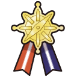

Games: Scarlet / Violet (Generation 9)

New ribbons:  4

Total ribbons: 93

A note about Marks

As of Scarlet/Violet there are some marks that act identically to ribbons, where you earn them from completing a task/talking to an NPC. I will be treating these particular marks as ribbons for the sake of the guide going forward (Marks that are only found on wild Pokémon and not earnable won't be included like normal)

## Paldea Champion Ribbon

How to Obtain:

-   Defeat Geeta at the Pokémon League OR win the Academy Ace Tournament

This is Paldea's champion ribbon and should be easy enough to get like all the previous iterations.

This ribbon is slightly different however compared to past generations as you cannot rematch the Pokémon League, luckily you are also able to earn it by beating the post game Academy Ace Tournament which is repeatable (although it is harder than the Pokémon League)

## Gourmand Mark

How to Obtain:

-   1/33 chance to acquire on party Pokémon after eating store bought food/picnic sandwiches.

The most efficient way to earn this mark is to find a cheap food store (ideally an outdoors vendor so you don't have to move between eating) and save (make sure auto-save is off), then proceed to buy food constantly until you get the mark.

This will likely take a while, so it is worth it to occasionally reset back to your save so that you don't have to spend excess PokéDollars on the mark.

Having less members in your party or eating higher quality food doesn't appear to boost your chances of making this mark appear.

## Itemfinder Mark

How to Obtain:

-   1/100 chance when picking up and item in Lets Go mode.

Simply use you Pokémon you want to get the mark with in Lets Go mode, and let the Pokémon gather all the glowing items that respawn on the ground, after a little while you will have the mark, its that simple.

## Partner Mark

How to Obtain:

-   1/100 chance every 10,000 steps for a party Pokémon with 200+ Friendship to obtain.

This mark will be automatically assigned as your title when you obtain it. To check a Pokémon's friendship you can talk to them during a Picnic, if 3+ hearts appear it means friendship is at 200 or higher (5 hearts is max friendship).

While the regular methods of boosting friendship work, I have found the most effective way to boost friendship is by repetitively washing your Pokémon during a picnic. You can wash a Pokémon a total of 5 times before they will stop gaining friendship from washing, but you can reset this counter by packing up your picnic and starting a new one, then wash and repeat.

Once you have your max friendship Pokémon, you can keep them in the party while you move around the region doing anything and you will eventually get the mark. However this will likely take a while, so if you are looking to get this with minimal effort you can find an open area while on Koraidon/Miraidon, and attach a rubber band to the left analog stick so it is pointing right or left (make sure the band is not too tight to avoid potentially damaging the controller). This will make you run in a circle and you can leave the game running while you do something else, and you will eventually get the mark.

### Returning Ribbons

Effort Ribbon

You can get this ribbon in Levincia when you show a Pokémon with maxed EV's.

Best Friends Ribbon

You can get this ribbon in Cascarrafa when you show a Pokémon that has maxed friendship. See Partner Mark above for how to boost friendship quickly.

Master Rank Ribbon

When you defeat a Master Ball Tier player in Ranked Battles, all the Pokémon in the party that won will receive the ribbon. I recommend using rental team codes found online if you are not familiar with PvP, and utilizing [Pikalytics](https://www.pikalytics.com/) to see what common Pokémon/Moves others are using.