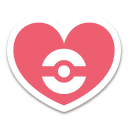
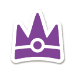
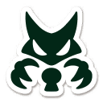
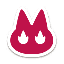

# Marks in Scarlet & Violot

## Marks on Pokémon
Marks make a return after their introduction in Pokémon Sword & Shield. These marks are like Ribbons in that they are attached to various Pokémon to show some of the unique things it has done or where it was caught.

While Pokémon Scarlet & Violet has the Ribbons which are attached when a Pokémon is caught, there are also now Marks that will be added to Pokémon as you achieve certain tasks.

In addition to that, there's a special Meal Power, the Title Power, which increases the chance of you getting a Mark on a Pokémon.

## Chances
 **Mark**         | **Chance**
------------------|------------
 Rare Mark        | 1 in 1000
 Personality Mark | 1 in 100
 Weather Mark     | 1 in 50
 Time Mark        | 1 in 50

## List of Marks

 **Picture**     | **Mark Name**   | **Description**            | **Title**            | **Method**   | **Chance**
--------------------------------|-----------------|---------------------------------------------------------------|----------------------|------------------------------------------------------------------------------------------------------------------|-----------------------
    | Destiny Mark    | A mark of a chosen Pokémon.     | the Chosen One       | Available randomly on wild Pokémon on the day set as your birthday            |
  | Itemfinder Mark | A mark for a Pokémon that likes to pick things up.            | the Treasure Hunter  |         | Currently Unavailable
 | Gourmand Mark   | A mark for a Pokémon gourmet.   | the Gourmet          | Make sandwiches with the Pokémon. Purchase a food item in a shop |
 | Jumbo Mark      | A mark for a Pokémon that's the largest it can be.            | the Great            | In Mesagoza, speak to a person with Pachirisu near flower eds in west. Given to Pokémon with maximum size values |
| Mightiest Mark  | A mark for a Pokémon caught in a seven-star Tera Raid Battle. | the Unrivaled        | Automatically attached to any Pokémon caught in a 7 Star Raid  |
| Mini Mark       | A mark for a Pokémon that's the smallest it can be.           | the Teeny            | In Mesagoza, speak to a person with Pachirisu near flower eds in west. Given to Pokémon with minimum size values
| Partner Mark    | A mark for a friendly Pokémon.                | the Reliable Partner | Have your Pokémon's friendship be at 200 or higher - Automatically added      |
 | Titan Mark      | A mark for a Pokémon that was an alpha.        | the Former Titan     | A mark given to a Pokémon that was a Titan      |
 |  Alpha Mark      | A mark for a Pokémon that was an alpha.        | the Former Alpha     | A mark given to a Pokémon that was an Alpha in Pokémon Legends Arceus