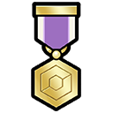

# Ribbons

## Ribbons on Pokémon
Ribbons make a return once again and continue .

While Pokémon Scarlet & Violet has the Ribbons which are attached when a Pokémon is caught, there are also now Ribbons that will be added to Pokémon as you achieve certain tasks throughhout the game.

Like Marks, you can have a specific Ribbon set as the main feature and with that, it will give your Pokémon a special title when it is sent into battle.

## List of Available Ribbons

 **Pictures**              | **Mark Name**             | **Description**                                                                         | **Title**            | **Method**
---------------------------|---------------------------|-----------------------------------------------------------------------------------------|----------------------|-----------------------------------------------------------------
  | Paldea Champion Ribbon    | A Ribbon awarded for becoming the Paldea Champion and entering the Paldea Hall of Fame. | the Paldea Champion  | Use the Pokémon in the Pokémon League or Academy Ace Tournament
  | Once-in-a-Lifetime Ribbon | A rare Ribbon found extremely infrequently on Pokémon obtained in a Surprise Trade.     | the One-in-a-Million | Given to a Pokémon randomly during a Surprise trade

 **Pictures**        | **Mark Name**       | **Description**                                                                           | **Title**             | **Method**
---------------------|---------------------|-------------------------------------------------------------------------------------------|-----------------------|-------------------------------------------------------------
  | Master Rank Ribbon  | A Ribbon awarded for winning against a Trainer in the Master Ball Tier of Ranked Battles. | the Rank Master       | Defeat a Master Ball tier trainer in Ranked Battle
 Effort Ribbon       | Effort Ribbon       | A Ribbon awarded for being an exceptionally hard worker.                                  | the Once Well-Trained | Show a Pokémon with max EVs to the girl in Levincia
 Best Friends Ribbon | Best Friends Ribbon | A Ribbon that can be given to a Pokémon with which you share a close and meaningful bond. | the Great Friend      | Show a Pokémon with max Happiness to the girl in Cascarrafa
 Classic Ribbon      | Classic Ribbon      | A Ribbon that proclaims love for Pokémon.                                                 | the Pokémon Fan       | Event Pokémon
 Premier Ribbon      | Premier Ribbon      | A Ribbon awarded for a special holiday.                                                   | the Celebratory       | Event Pokémon
 Event Ribbon        | Event Ribbon        | A Ribbon awarded for participating in a special Pokémon event.                            | the Festive           | Event Pokémon
 Birthday Ribbon     | Birthday Ribbon     | A Ribbon that commemorates a birthday.                                                    | the Best Buddy        | Event Pokémon
 Special Ribbon      | Special Ribbon      | A special Ribbon for a special day.                                                       | the Premium           | Event Pokémon
 Souvenir Ribbon     | Souvenir Ribbon     | A Ribbon for cherishing a special memory.                                                 | the Cherished         | Event Pokémon
 Wishing Ribbon      | Wishing Ribbon      | A Ribbon said to make your wish come true.                                                | the Wish Granter      | Event Pokémon

## List of Transfer Only Ribbons

### Hisui Ribbon
 **Pictures** | **Mark Name** | **Description**                                                                         | **Title**           | **Method**
--------------|---------------|-----------------------------------------------------------------------------------------|---------------------|-------------------------------------------------------------------------------------------
  | Hisui Ribbon | A Ribbon awarded to a Pokémon that posed for a photograph in Hisui in the distant past. | of the Distant Past | Available only on Pokémon that participated in the Photo Studio in Pokémon Legends Arceus

### HOME and Sword/Shield Ribbons

 **Pictures**               | **Mark Name**              | **Description**                                                                                       | **Title**               | **Method**
----------------------------|----------------------------|-------------------------------------------------------------------------------------------------------|-------------------------|------------------------------------------------------------
 Galar Champion Ribbon      | Galar Champion Ribbon      | A Ribbon awarded for becoming the Galar Champion and entering the Galar Hall of Fame.                 | the Galar Champion      | Defeat the Champion Cup
  | Tower Master Ribbon        | A Ribbon awarded for winning against a champion in the Battle Tower.                                  | the Tower Master        | Defeat Leon in one of the higher tiers of the Battle Tower
 Kalos Champion Ribbon      | Kalos Champion Ribbon      | A Ribbon awarded for beating the Kalos Champion and entering the Kalos Hall of Fame.                  | the Kalos Champion      | Transfer a Pokémon with this ribbon through Pokémon HOME
 Champion Ribbon            | Champion Ribbon            | A Ribbon awarded for clearing the Pokémon League and entering the Hall of Fame somewhere long ago.    | the Champion            | Transfer a Pokémon with this ribbon through Pokémon HOME
 Sinnoh Champion Ribbon     | Sinnoh Champion Ribbon     | A Ribbon awarded for beating the Sinnoh Champion and entering the Sinnoh Hall of Fame.                | the Sinnoh Champion     | Transfer a Pokémon with this ribbon through Pokémon HOME
 Best Friends Ribbon        | Best Friends Ribbon        | A Ribbon that can be given to a Pokémon with which you share a close and meaningful bond.             | the Great Friend        | Transfer a Pokémon with this ribbon through Pokémon HOME
 Training Ribbon            | Training Ribbon            | A Ribbon that can be given to a Pokémon that has overcome rigorous trials and training.               | the Tried and True      | Transfer a Pokémon with this ribbon through Pokémon HOME
 Skillful Battler Ribbon    | Skillful Battler Ribbon    | A Ribbon that can be given to a Pokémon that has achieved victory in difficult battles.               | the Veteran             | Transfer a Pokémon with this ribbon through Pokémon HOME
 Expert Battler Ribbon      | Expert Battler Ribbon      | A Ribbon that can be given to a brave Pokémon that has honed its battle skills to an art.             | the Master              | Transfer a Pokémon with this ribbon through Pokémon HOME
 Effort Ribbon              | Effort Ribbon              | A Ribbon awarded for being an exceptionally hard worker.                                              | the Once Well-Trained   | Transfer a Pokémon with this ribbon through Pokémon HOME
 Alert Ribbon               | Alert Ribbon               | A Ribbon for recalling an invigorating event that created life energy.                                | the Once Vigilant       | Transfer a Pokémon with this ribbon through Pokémon HOME
 Shock Ribbon               | Shock Ribbon               | A Ribbon for recalling a thrilling event that made life more exciting.                                | the Once Cowardly       | Transfer a Pokémon with this ribbon through Pokémon HOME
 Downcast Ribbon            | Downcast Ribbon            | A Ribbon for recalling feelings of sadness that added spice to life.                                  | the Once Shaken         | Transfer a Pokémon with this ribbon through Pokémon HOME
 Careless Ribbon            | Careless Ribbon            | A Ribbon for recalling a careless error that helped steer life decisions.                             | the Once Imperfect      | Transfer a Pokémon with this ribbon through Pokémon HOME
 Relax Ribbon               | Relax Ribbon               | A Ribbon for recalling a refreshing event that added sparkle to life.                                 | the Once Well-Rested    | Transfer a Pokémon with this ribbon through Pokémon HOME
 Snooze Ribbon              | Snooze Ribbon              | A Ribbon for recalling a deep slumber that made life soothing.                                        | the Once Sleepy         | Transfer a Pokémon with this ribbon through Pokémon HOME
 Smile Ribbon               | Smile Ribbon               | A Ribbon for recalling that smiles enrich the quality of life.                                        | the Once Cheery         | Transfer a Pokémon with this ribbon through Pokémon HOME
 Gorgeous Ribbon            | Gorgeous Ribbon            | An extraordinarily gorgeous and extravagant Ribbon.                                                   | the Gorgeous            | Transfer a Pokémon with this ribbon through Pokémon HOME
 Royal Ribbon               | Royal Ribbon               | An incredibly regal Ribbon with an air of nobility.                                                   | the Royal               | Transfer a Pokémon with this ribbon through Pokémon HOME
 Gorgeous Royal Ribbon      | Gorgeous Royal Ribbon      | A gorgeous and regal Ribbon that is the peak of fabulous.                                             | the Gorgeous Royal      | Transfer a Pokémon with this ribbon through Pokémon HOME
 Artist Ribbon              | Artist Ribbon              | A Ribbon awarded for being chosen as a super sketch model in the Hoenn region.                        | the Model for Paintings | Transfer a Pokémon with this ribbon through Pokémon HOME
 Footprint Ribbon           | Footprint Ribbon           | A Ribbon awarded to a Pokémon deemed to have a top-quality footprint.                                 | the Strutter            | Transfer a Pokémon with this ribbon through Pokémon HOME
 Record Ribbon              | Record Ribbon              | A Ribbon awarded for setting an incredible record.                                                    | the Record Holder       | Transfer a Pokémon with this ribbon through Pokémon HOME
 Legend Ribbon              | Legend Ribbon              | A Ribbon awarded for setting a legendary record.                                                      | the Living Legend       | Transfer a Pokémon with this ribbon through Pokémon HOME
 Country Ribbon             | Country Ribbon             | A Ribbon awarded to a Pokémon League Champion.                                                        | the Victor              | Transfer a Pokémon with this ribbon through Pokémon HOME
 National Ribbon            | National Ribbon            | A Ribbon awarded for overcoming all difficult challenges.                                             | the Triumphant          | Transfer a Pokémon with this ribbon through Pokémon HOME
 Earth Ribbon               | Earth Ribbon               | A Ribbon awarded for winning one hundred battles in a row.                                            | the 100× Victorious     | Transfer a Pokémon with this ribbon through Pokémon HOME
 World Ribbon               | World Ribbon               | A Ribbon awarded to a Pokémon League Champion.                                                        | the World Conqueror     | Transfer a Pokémon with this ribbon through Pokémon HOME
 Battle Champion Ribbon     | Battle Champion Ribbon     | A Ribbon awarded to a Battle Competition Champion.                                                    | the Battle Champion     | Transfer a Pokémon with this ribbon through Pokémon HOME
 Regional Champion Ribbon   | Regional Champion Ribbon   | A Ribbon awarded to a Regional Champion in the Pokémon World Championships.                           | the Regional Champion   | Transfer a Pokémon with this ribbon through Pokémon HOME
 National Champion Ribbon   | National Champion Ribbon   | A Ribbon awarded to a National Champion in the Pokémon World Championships.                           | the National Champion   | Transfer a Pokémon with this ribbon through Pokémon HOME
 World Champion Ribbon      | World Champion Ribbon      | A Ribbon awarded to a World Champion in the Pokémon World Championships.                              | the World Champion      | Transfer a Pokémon with this ribbon through Pokémon HOME
 Contest Memory Ribbon      | Contest Memory Ribbon      | A commemorative Ribbon representing all of the Ribbons you collected for contests somewhere long ago. | the Treasured Memory    | Transfer a Pokémon with this ribbon through Pokémon HOME
 Battle Memory Ribbon       | Battle Memory Ribbon       | A commemorative Ribbon representing all of the Ribbons you collected for battling somewhere long ago. | the Exciting Memory     | Transfer a Pokémon with this ribbon through Pokémon HOME
 Hoenn Champion Ribbon      | Hoenn Champion Ribbon      | A Ribbon awarded for beating the Hoenn Champion and entering the Hoenn Hall of Fame.                  | the Hoenn Champion      | Transfer a Pokémon with this ribbon through Pokémon HOME
 Contest Star Ribbon        | Contest Star Ribbon        | A Ribbon awarded to a Pokémon that has performed superbly in every kind of contest.                   | the Shining Star        | Transfer a Pokémon with this ribbon through Pokémon HOME
 Coolness Master Ribbon     | Coolness Master Ribbon     | A Ribbon awarded to a Pokémon that has perfectly embodied Coolness in Pokémon Contests.               | the Former Star         | Transfer a Pokémon with this ribbon through Pokémon HOME
 Beauty Master Ribbon       | Beauty Master Ribbon       | A Ribbon awarded to a Pokémon that has perfectly embodied Beauty in Pokémon Contests.                 | the Vintage Beauty      | Transfer a Pokémon with this ribbon through Pokémon HOME
 Cuteness Master Ribbon     | Cuteness Master Ribbon     | A Ribbon awarded to a Pokémon that has perfectly embodied Cuteness in Pokémon Contests.               | the Former Idol         | Transfer a Pokémon with this ribbon through Pokémon HOME
 Cleverness Master Ribbon   | Cleverness Master Ribbon   | A Ribbon awarded to a Pokémon that has perfectly embodied Cleverness in Pokémon Contests.             | the Historic Genius     | Transfer a Pokémon with this ribbon through Pokémon HOME
 Toughness Master Ribbon    | Toughness Master Ribbon    | A Ribbon awarded to a Pokémon that has perfectly embodied Toughness in Pokémon Contests.              | the Formerly Buff       | Transfer a Pokémon with this ribbon through Pokémon HOME
 Alola Champion Ribbon      | Alola Champion Ribbon      | A Ribbon awarded for becoming the Alola Champion and entering the Alola Hall of Fame.                 | the Alola Champion      | Transfer a Pokémon with this ribbon through Pokémon HOME
 Battle Royal Master Ribbon | Battle Royal Master Ribbon | A Ribbon that can be given to a Pokémon that has achieved victory in the Battle Royal.                | the Royal Master        | Transfer a Pokémon with this ribbon through Pokémon HOME
 Battle Tree Great Ribbon   | Battle Tree Great Ribbon   | A Ribbon awarded for winning against a Battle Legend in the Battle Tree.                              | the Tree Victor         | Transfer a Pokémon with this ribbon through Pokémon HOME
 Battle Tree Master Ribbon  | Battle Tree Master Ribbon  | A Ribbon awarded for winning against a Battle Legend in super battles in the Battle Tree.             | the Tree Master         | Transfer a Pokémon with this ribbon through Pokémon HOME
