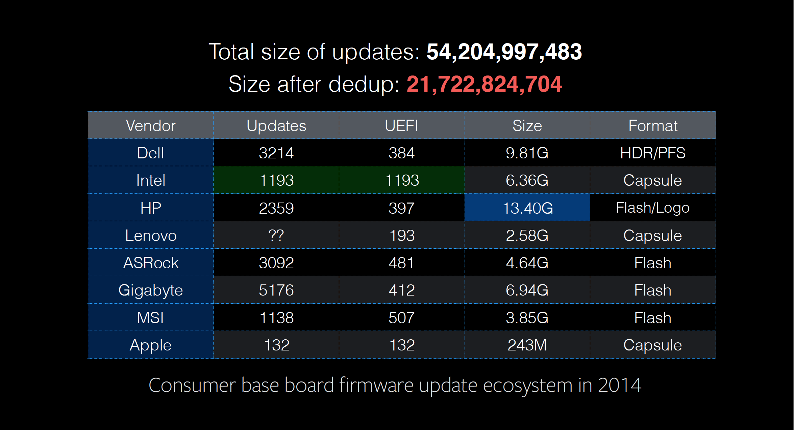
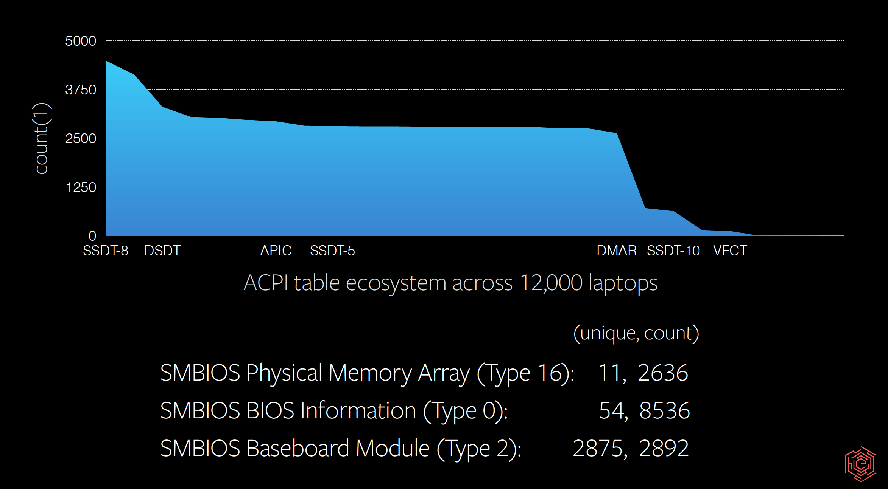
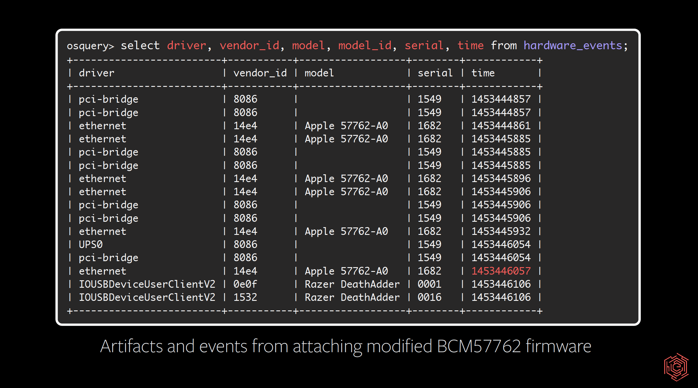
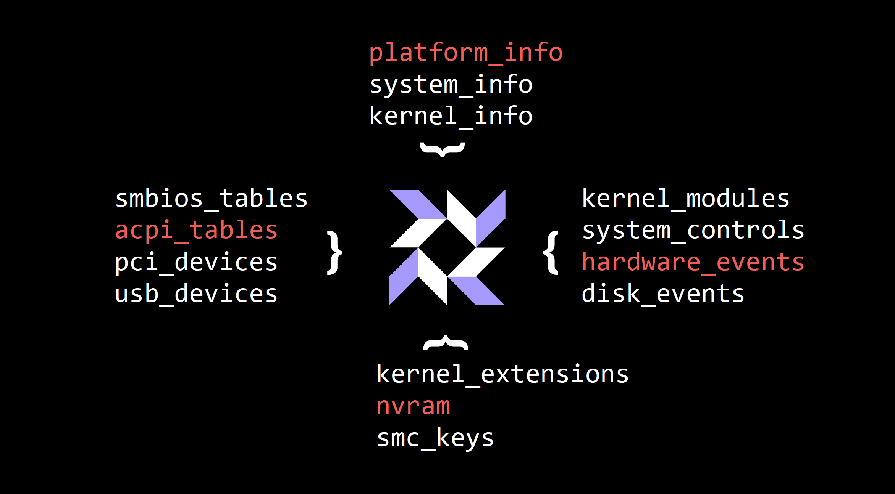

# Hardware and firmware attacks: Defending, detecting, and responding

• The attack landscape for firmware is maturing and needs more attention from defense and detection communities. Recent examples of firmware attacks include the Equation Group's attacks on drive firmware, Hacking Team's commercialized EFI RAT, Flame, and Duqu.
• Simple tools like osquery give defenders important insights about what's happening on their network so they can quickly detect a potential compromise. Facebook released osquery as an open source project in 2014.
• Facebook recently added hardware monitoring to osquery, which already aids security teams in vulnerability management, incident response, OS X attacks, and IT compliance.

Firmware on commodity laptops and servers is interesting to me as a security engineer for several reasons. This code often bootstraps trust protocols and protective architecture primitives. At the same time, it is a target for vulnerabilities aimed at bypassing those exact controls to unlock, jailbreak, and homebrew — for either good or malicious purposes.
Firmware is also a vector for virtualization escapes, hypervisor attacks, and extreme persistence. That risk is magnified by the same fragmentation problem plaguing Android devices, but with an even more complex ecosystem of developers and supported devices.

Recent examples of firmware attacks include the Equation Group's attacks on drive firmware, Hacking Team's commercialized EFI RAT, Flame, and Duqu. Trammell Hudson's Thunderstrike-style local system takeover is fast and effective. Drew Suarez's demonstrations of firmware flashing of Android devices take four seconds of a distracted local user's attention. Additionally, Computrace has used a UEFI DXE driver capable of injecting a RAT onto unencrypted NTFS partitions for several years.

All of this makes firmware security critical for protecting your enterprise.

This week, I shared recent work on firmware security at the Enigma 2016 Conference, hosted by USENIX. Since releasing osquery to open source in 2014, I've been using it to explore new ways to recognize vulnerable systems and potential compromise. Defensive security professionals should begin scoping firmware components and use simple tools like osquery to gather insight and signal from their corporate network.

## Opportunities for defense

Dedicated attention to firmware security provides an additional layer of insight and detection for defenders. Defense begins with visibility — baselining kernel drivers, kernels, boot loaders, ACPI table content, SMBIOS metadata — and continues with logging real-time OS API-generated hardware events. This information can fuel existing correlation and indicator of compromise (IoC) collections to identify “known good” and “known bad” events. Creating production recipes that are deployable and repeatable for these somewhat esoteric features is essential.

Code that runs before your kernel begins executing is intended to run quickly, initialize hardware in highly specific and often proprietary ways, bootstrap esoteric execution environments, and then leave with minimal trace before passing the instruction pointer to a bootloader. At this point it is already too late to perform forensics the way it is taught today. 

If you've seen the universal extensible firmware interface's block diagram, you'll notice at the point where a kernel starts, potentially hundreds of services, modules, and drivers have already executed. By default there is no execution log. A TPM and the TrEE may create a measurement log, but that is cleared from memory before a kernel can execute. At best, you might have a quotable TPM state that could be attested. The current state of art for measurement is the TrEE standards and a 2.0 TPM for which there isn't a complete software reference implementation. However, both Intel and IBM are working on open source implementations.

Further complications are caused by recent firmware vulnerabilities that use unsanitized input to code running in an ISA defined execution environment called system management mode (SMM). Before adding your bootloader within UEFI, code is added to a well-defined area in DRAM. After a few assembly calls and register writes, that area of DRAM is “locked” for reading and writing by all rings except for SMM. Entry points into SMM are defined and entered via interrupts, device configuration changes, or via an x86 instruction. These persist throughout the life of the OS and are unauditable on live (or production) systems.

On ARM devices this is similar to TrustZone, although the TrustZone feature set is more comprehensive and more closely resembles Intel's proprietary ME or TXE. These environments are the largest black boxes on commodity desktops, laptops, and servers. Ultimately, we have a lot of code executing before the kernel and still more code executing in a black box side by side with the kernel.

## Defense for software
The security industry only recently aligned firmware vulnerability patches with CVE announcements. Previously, they were either buried in update release notes or simply didn't exist. Firmware updates — BIOS/UEFI updates — should now be included in patch and vulnerability management plans.

A typical scope for the code in these environments might look something like this:

• Bootstrapping code in “actual ROM” (read: unmodifiable silicon): NO
• UEFI flash, most specifically, SPI regions that contain EC data, the pre-boot environment, network card firmware: YES
• Updatable firmware on other complicated peripherals like video cards and hard drives: YES
• Early-stage bootloaders and their runtime loadable modules: YES
• The kernel, optional ramdisk, and kernel modules/extensions/drivers: YES
• Associated configuration in NVRAM, in EEPROMs, and on disk: YES

This scope includes several security features and primitives that the kernel and userland applications rely on. They initialize protected input devices, network devices, memory regions, full disk encryption (FDE) storage for entropy input executing repeatably built applications like Tor, intrusion detection scripts, and OS credential and certificate stores.

Further, as we've seen from the industry's recent focus on vulnerability analysis of antivirus products, sometimes the tools designed to protect us introduce more risk. When purchasing security software, we should ask to what extent proprietary closed-source code has undergone security auditing and review. It's also valuable to question why that code remains proprietary and closed.

When investigating firmware and architectures, I also want to help vendors and developers ship safer software. Even if code has been reviewed from the OS and kernel perspective, be mindful of the implicit trust you're placing in these vendors and developers within your enterprise. Remember, this code bootstraps and maintains your trust. It is a dependency for providing security primitives. If you're not already having these conversations with your vendors, I encourage you to start immediately.

## Defense for kernel modules, extensions, and drivers

Security teams should track kernel version distributions and log loaded modules, extensions, and drivers. Collect this information, aggregate count each, sort ascending, and acquire the top 10 unique entries. This allows you to make better response decisions. For example, on OS X if you find the DirectHW extension or its equivalent, you should respond. This extension allows read and write access to physical memory and is used primarily by researchers.

Additionally, a root user loading an arbirtary kernel module within your infrastructure is a reason for concern. There are reliable rootkit examples like Jynx and Azazel that come with manuals, test code, and source code management, so you can expect that a variety of attackers will try to use them.

Fortunately, kernel tracking is easy to set up with osquery, which Facebook deploys to OS X, Ubuntu, and CentOS. With additional effort, you can also deploy to RHEL, Debian, FreeBSD, Fedora, or OEL — covering most of your client and server fleet.

Since the filesystem path of kernel code and modules is well-known, they should be treated as targets for replacement. Hash and apply file integrity monitoring (FIM) to those directories. Nearly every observed case of malicious kernel extensions uses simple comms APIs, most commonly IOCTL through a device node. By adding your device tree to the FIM, you won't see modifications, but you will notice additions.

In the case of these common extensions, the first kernel-mode action taken is a trampoline installation into filesystem-related syscalls, open/read/readlink, used to hide artifacts it creates. Yet when you beat an attacker to deployment, you can record the FIM events created from installation before the trampolines are installed.

## Defense for bootloaders and below

Bootloaders are arguably easier attack targets than the kernel or kernel modules. It's possible to compile GRUB or an OS X EFI bootloader and build in an FDE key exfiltration or NOP of kernel security features without destabilizing the OS. Attackers could also do this to disable FIM and then allow a purchased RAT to install the trampolines. Not watching bootloader locations is an easy way for defenders to forfeit the fight.
Auditing code running below and before the bootloader becomes tricky because FIM and hashing applied to kernels and bootloaders deteriorates. Successful projects like Intel's ChipSEC and MITRE's Copernicus use tools combining physical memory reads with device-specific MMIO offset configurations but also include a warning about using them in production environments.
Over the last year, the Facebook security team built an implementation in the form of userland daemon and optional kernel extension with privacy-preserving hardening, experience and restrictions to provide safety, and recommendations for deployment. Our approach is simple: Record as much signal as possible from the artifacts and effects of potential attacks.
Look for ACPI additions and unique IL, and then sort by unique hashes and aggregate using counts. Pair with SMBIOS metadata, one piece of signal to report expected hardware model or UEFI platform version.

Defenders and responders often create timelines for reconstructing attacks; let's include hardware events! Let's consider hardware attacks similar to NSA Playset's SLOTSCREAMER, the Thunderstrike vulnerabilities, and even Tensys as infection vectors. EFI firmware variables should be monitored too. They allow overriding bootloader selection, security protection disablement, and kernel debugging options.

This approach provides a stable signal that will reveal changes. Visualizing and correlating these across a fleet reveals coordination, but more important, it reveals anomalous behavior.

## Using osquery

Firmware and what lies below bootloaders is mostly a black box of compiled code. We can defend it!

My focus and passion is to make stable, reliable signals available for enterprises. The capability for measuring and collecting signals is available in osquery. We run these queries at Facebook scale without affecting performance or stability. The queries used to collect hardware-related data to build the visualizations I've described can be found here.

Some of this data is event-based — runtime hardware changes, hotplugging, mounting disks, attaching Thunderbolt devices — and the event stream is included. We've published a collection of events and artifacts that can be used for detection, especially if OptionROM will be used to write your SPI flash.

Build firmware updates into your patch and vulnerability mitigation plans. Use tools like osquery and the recommended queries to do anomaly detection continuously, and collect with fine precision event streams and hashes to be used for response. Build this data into existing alerting and intelligence-checking pipelines. CHIPsec is great for auditing new hardware purchases and firmware updates; if you're responsible for a large server fleet, use it during initial assessments of hardware purchases.

Within a few years, remote attestation for consumer devices will be pervasive and devices will be safer. I also hope more of the related execution environments will be open-sourced and audited publicly. Until then, keep your eyes on osquery. We will continue to add firmware and “deep systems style” forensics capabilities. 

Let's all continue to encourage responsible disclosure of firmware vulnerabilities, while focusing more research on securing firmware and the related ecosystem of updates, devices, and detection.