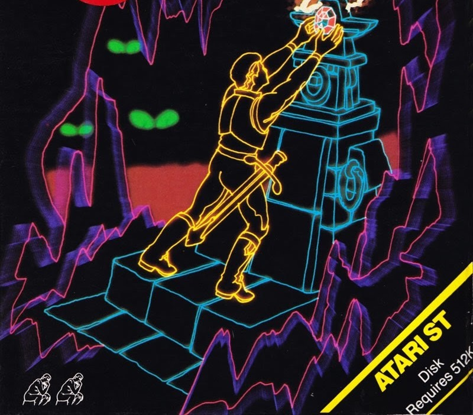
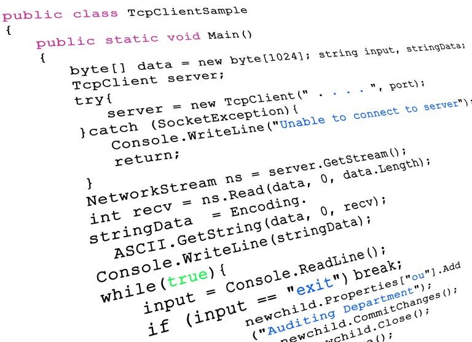

# What are Feature Toggles?

Changes in the way to develop and bring new features live.


---

# Common situation

A new feature needs to be developed but not immeadiatly to be active after a deployment.
* ex a business milestone (Rebranding)
* an external partner is changing apis and the change can happend with short notice.
* branching gets complicated to maintain the more developers are working

---

# Also common

One team finished a feature in software A but the accompaning software B is not ready.

* Different pace in teams.
* Or simple colleagues are on vacation, having incidents, getting sick.
---
# Other common situation

One does not know how a change will accepted by the customer and one want a test group.


---

# Consequence: Communication Islands

> "*Branches create distance between developers and we don't want that.*" 
> \- Frank Compagner, Guerilla Games (Horizon Zero, Killzone, Death Stranding)

---

# Difficulties

* Several installations of the same software but with different feature sets.
* Orchestrate application releated deployments and relase dates.

---


---
## Feature Toggles


<br/><br/><br/>

aka Feature **Flags**, Feature **Bits**, Feature **Flippers**


---

# Where are Feature Toggles supported?

Possible in every language allowing alternatitons.

<br/>
Yes, this includes SQL!

---
# Possible flags

Examples, limited only by imagination of developers.

* variable in config file
* inMemory variable
* database value
* permission of the user
* data
* costumer value




---
# variable in config file

A value in a file, most often called "config file".

Such a file can stored in a versioned way like in a git repository so every change can be tracked.

---
# inMemory variable

A value in Memory, not persisted.
Or loaded from a config file or database into a variable in memory for faster access.

After a restart of the application or server the variable needs to be loaded again.

An application should ensure to work with a suitable default value during the starting process.

Possible system can be a key value solution in Redis.


Redis: redis.io (In-Memory database)


---

# database value

The state of the flag is stored and persisted in the datebase. Therefore one need to trigger an update on the database to change the behaviour of the application.

Can be combined with an in memory value.

---

# Permission of the user

An external system manages permissions wich can be used to access to system or features.

There a user can request access to a feature or get it ordered by someone else.

**Benefit**: The permission and process of grating access is lined up with the group access standard (AS). Without further doings will compliant for auditors.

In Baloise context: DIM (Digital Identity Management) with acts as interface for the group active directory.

---

# data

The behaviour is depended on the data processed.

Not seen as a flag in the classical way.

---
# costumer value

The customer gets a different UI or mask presented depending on the value brought to the company so far.

For example: Money spend every year over value X.
Or ordered a special packed with a product.

Goes most of the time hand in hand with a data based flag.

---

# Categories of Toggles

* RELEASE TOGGLES
* EXPERIMENT TOGGLES
* PERMISSION TOGGLES
* OPS TOGGLES
  

Source:  https://martinfowler.com/articles/feature-toggles.html

---

# Categories of Toggles

A toggle can be introduced for different purposes. Most of the time we differentiate between four categories as also shown by Pete Hodgson on martinfowler.com.

---

# What can we also do with toggles?


## Canary releasing
Presenting a feature only to a small testing group but also in a environment where others need to work in the old way.

The testing group can be selected random or based on a dedicated value to recreate the selection of the testers.

---

## A/B Testing

Similar to canary releases but with a way larger testing cohort.

It origined by splitting the testers in two groups, group A and group B.

The outcome and adaption of a feature can decided with real data, not guesses or asumptions.

---
# Code examples

## Short java example



```
   public static void main(String args[]) throws IOException {

      Properties propertyDictionary = readPropertiesFile("flags.properties");
   
      if (   propertyDictionary.getProperty("isPHV").equals("true") ) {
         System.out.println("Hello PHV");
      }
      else {
         System.out.println("Welcome back, KFZ");
      }
   }
```

---

## Other generic short one


```
   if ( getEnvVar("hello") != "" ) {
      std::cout << "Hello World" << std::endl;
   }
   else {
      std::cout << "Hello Mars" << std::endl;
   }
```

---

## random generic example


```
function apiSaveOrder() {
  const useNewAPI = false;
  if (useNewAPI) {
    return apiNewSaveOrder();
  } else {
    return apiOldSaveOrder();
  }
}
```

---

## Example from martinfowler.com


before
```
function reticulateSplines() {
   // current implementation lives here
}
```

---

after


```
function reticulateSplinesOf() {
   var useNewAlgorithm = false:
   // useNewAlgorithm = true; // UNCOMMENT IF YOU ARE WORKING ON THE NEW SR ALGORITHM

   if( useNewAlgorithm ) {
      return enhancedSplineReticulation():
   } else {
      return oldFashionedSplineReticulation();
   }

   function oldFashionedSplineReticulation() {
      // current implementation lives here
   }

   function enhancedSplineReticulation() {
      // TODO: implement better SR algorithm
   }
}
```

---

# Sources

Sample code background image from: http://laurenthinoul.com/sample-programming-code/

This slide: https://gitlab.com/janhkrueger/notes/-/blob/main/Slides/WhatAreFeatureToggles.md