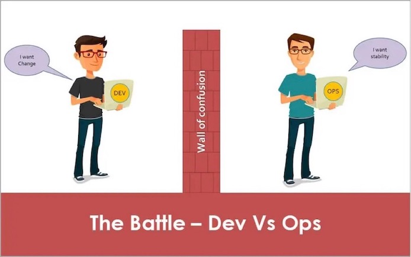
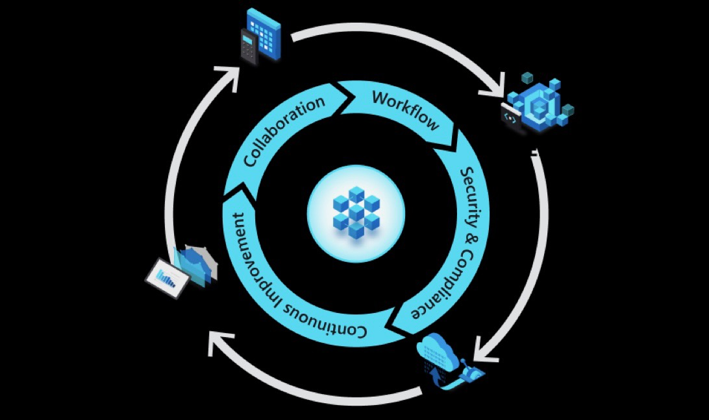
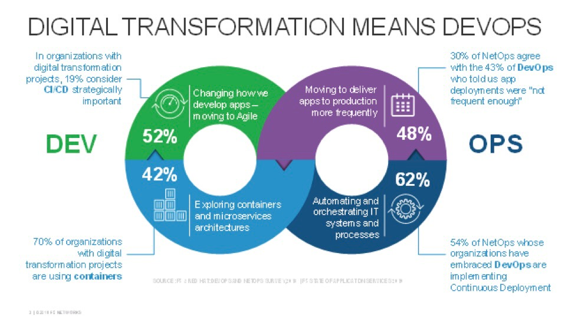
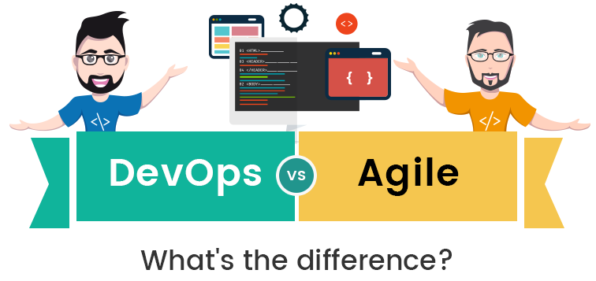
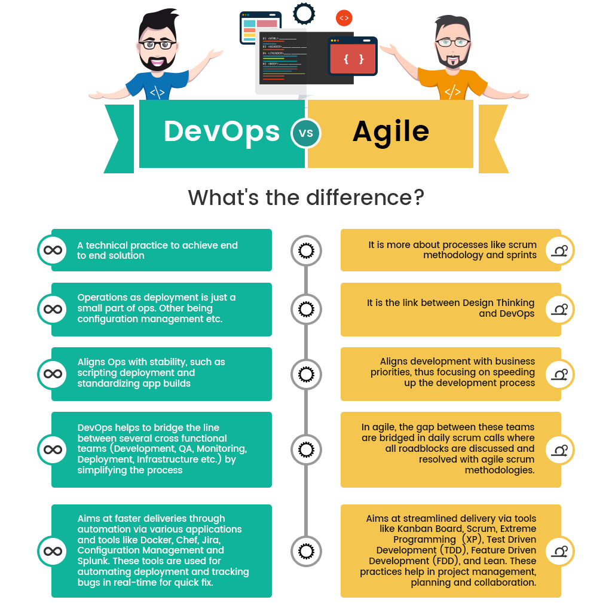
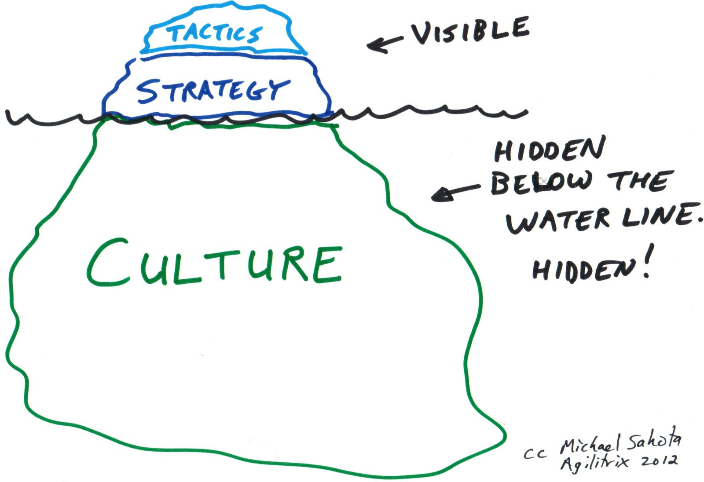
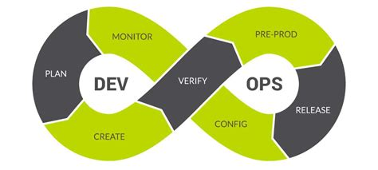
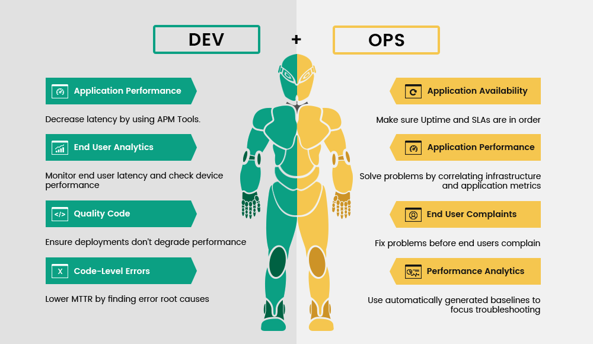
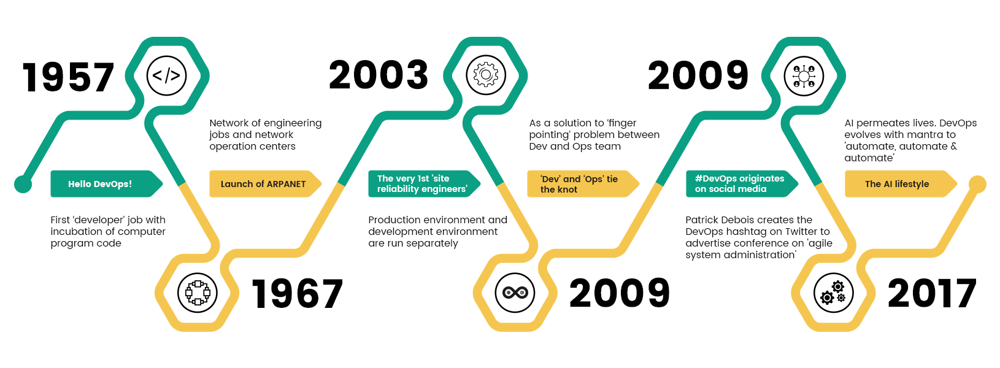
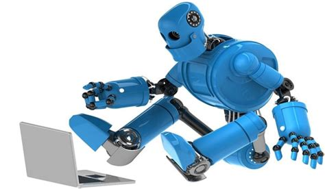

# What means Leading SAFE (for us)?

Anpassung im Entwicklungs- und Verantwortungsprozess

---
# DevOps lifecycle

* The DevOps lifecycle is more integrative than a siloed software delivery process. Deploying products and updates happens continuously, and less in a rigid, linear process. Because they work as a unit, each team member should be comfortable with each stage of the lifecycle, from initial ideation to assessing software quality and understanding user experience.
* Throughout the development process, DevOps teams work as a unit through planning, developing, delivering, and monitoring stages:

---

* In the planning stage, the team figures out the problems they are aiming to solve and how they might go about solving them.
* Next, they'll develop their product, using a testing or production environment—either a simulated environment or sampling of real-world users to try the updates before they're widely deployed—to build the best possible product.
* Then, they'll deliver the product to their wider audience.
*  Finally, they will constantly monitor performance and feedback to incorporate into later iterations and product updates—which will move them back to the planning stage.

Source: https://www.coursera.org/articles/what-is-devops

---

# Traditionell

Source: https://devopscube.com/what-is-devops-what-does-it-really-mean/

---

---
# DevOps is About CAMS

* **C**ulture: People and process ultimately make DevOps successful, and everybody needs to support the vision.
* **A**utomation: Continuously automate the most tedious or time-consuming tasks, and link all used tools together into a single (automated) process.
* **M**easurement: You need objective measurements to understand where to improve and automate first.
* **S**haring: As part of the culture, it is important to share ideas and improvements within the team, but also across other teams.

---
# DevOps bedeuted digitale Transformation

--- 
# Für uns bedeutet dies

Veränderung des Verständnisses wie in Basler DE Anforderungen für neue Funktionalitäten oder gar neue Services priorisiert, analysiert und umgesetzt werden mit einer über den produktiven Deploymentpunkt hinaus gehender Verantwortung für das Produkt.Eine Veränderungen wie die Bedürfnisse unserer Kunden erfüllt werden (IT als Serviceeinheit für das Business)

---

* Auflösung der harten Trennung von Entwicklung und Operations
* Bisher reine Entwicklungseinheiten werden in den produktiven Betrieb der Anwendungen stärker eingebunden.
* Stärkere Einbindung in die Priorisierung und Planung von kommenden Themen.
* KnowHow aus beiden Welten werden in den Teams gemeinsam vorhanden sein und angewendet.

---

* Dies führt zu einem geändertem Selbstverständises eines DevOps Teams. Wartung, Neuentwicklung, Monitoring, Betrieb über alle Umgebungen hinweg liegt in der Hand eines Teams.
* Durch Anpassungen im Skillset eines DevOps Teams kommt es zu einer höheren Selbstverantwortung aber auch Selbstständigkeit. („Enablement von Mitarbeitern Entscheidungen auch selbst zu treffen“, Weitere Einbindung in  Planung und Vernetzung und dadurch stärkeres Involvement / Mitgestaltung für die Zukunft der Basler.

--- 

* Eine Einheit kümmert sich um den gesamten LifeCycly über alle Umgebungen / Stacks hinweg → Produktverantwortung
  * Planung, Entwicklung, Deployment, Monitoring
* Infrastruktur- und Werkzeugbereitstellung kann in wenigen Teams noch stärker gebündelt werden (BITS, HCL, DevOps Systems).

---

* Veränderungen in den Verantwortlichkeiten auf Entwicklerebene
* Veränderungen im Weiterbildungsprozess
* Veränderungen im Einstellungsprozess
* Veränderungen in der Kapazitätsplanung bei der Transformation Anwendungsentwicklung → DevOps

---

* Adopting DevOps will vary between organizations.
* Some organizations change the culture and process of different teams to adopt DevOps.
* Some organizations will start building different skillset in the same team to adopt DevOps. So it’s all about a collaborative mindset.

---

# Was bedeuted DevOps nicht?

* Neue Tools und schon „ist man DevOps“
  * "Tools are just DevOps enablers."
  * "Automation is not DevOps"
* Tools sind lediglich Werkzeuge um die Aufgaben zu erleichtern
* Automation soll Prozesse beschleunigen und Fehlerquellen eleminieren („Den Mensch aus dem Prozess nehmen“).

---

# Is DevOps Agile?

The simple answer to that is No. Though both the terms are broadly synonymous, it would be incorrect to say that they are both the same. While DevOps is the concept to manage end-to-end engineering processes, Agile is a process used to manage complex projects. Agile is, in fact, one of the most essential parts of successful DevOps. Here are a few essential differences.

Source: https://dzone.com/articles/is-devops-agile

---

# DevOps vs Agile
## Whats the difference?

---

---
# Was benötigen wir?
* Werbung in der Basler IT um das Verständnis das es diese, für einige weitreichenden, Veränderungen geben wird und das sie mitgetragen werden sowie Unterstützung das dieser Weg auch begangen wird.
* Insbesondere bei jenen Kollegen welche Veränderungen in ihrem Tätigkeits- und Verwantwortungsfeld erfahren werden, auf allen Hierarchieebenen.

(Blöd formuliert, im Grunde hier der Part: das brauchen wir von dir Manuela etc)

---
# DevOps is about culture

Culture: People and process ultimately make DevOps successful, **and everybody needs to support the vision**.

---

---
# BackUp

---
# DevOps Cycle

---

# DevOps to Agile

Source: https://dzone.com/articles/is-devops-agile

---
# Evolution of DevOps

Source: https://dzone.com/articles/is-devops-agile

---
# 2017 - The Al lifestyle

Al permeates lives. DevOps evolves with mantra to automate, automate & automate

---
# 2009 - DevOps originates on social media

Patrick Debois creates the DevOps hashtag on Twitter to advertise conference on 'agile system administration

---
# 2009 - 'Dev' and 'Ops' tie the knot

As a solution to finger pointing' problem between Dev and Ops team

---
# 2003 - The very lst "site reliability engineers"

Production environment and development environment are run separately

---
# 1967 - Launch of ARPANET

Network of engineering jobs and network operation centers

---
# 1957 - Hello DevOps!

First 'developer job with incubation of computer program code

