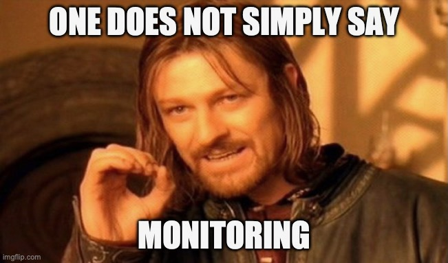

:revealjs_theme: moon
= Splunk in a corporate environment

== Base Question: What's happening?

== Solution One

Writing applications without errors.

(Narrator: Will never happen)

== Solution Two

Pay others to write applications without errors.

Nice try. But Nope.

(Narrator: No one will take the job and we don't have the money for this.)

== Solution Three

Let someone check the app all around the clock.

Again: nice try. But people tend to need sleep, go on vacations, have bad days, get sick or even quit their job.

== Solution Four

Automatic monitoring in a defined way.

== What's the goal?

=== Confidence

=== Transparency

=== Visibility

=== Alerting

== Or in other words

"With a good monitoring strategy in place, you’ll get better transparency and visibility into your operations with a well-timed alert system."
-- Andreas Prins

== "We need monitoring!"

=== Infrastructure

What is happening on and with the hardware.

=== Infrastructure: Solutions

* Zappix
* Grafana / Prometheus
* DynaTrace

=== application

- What is happening inside the application.
- What is the application doing?

=== application: Solutions

* Splunk
* Grafana / Prometheus
* DynaTrace (only CH and K2)

=== business

- Short: Are the brokers and the company happy?

=== business: Solutions

* DynaTrace

== Today's focus

- Application montoring with Splunk with samples from K2 / SIP and others.
- Also: short glimpse of an alerting Splunk to Teams.

== Splunk

"Collects and analyzes high volumes of machine generated data."

=== Why?

- Policy Center alone runs in 7 servers.
- The amount of log entries alone forbids to search manually in all files in a case of emergency to fast identify the source.
- Get the data always in a structured way.

=== Why?

SIP now consists of N services which write all their own logs.

Happy searching.

=== Why?

Already used and integration into the group since several years.

=== Why?

A well known tool on the market, no own implementation.

=== Why?

=== Why?

Humans are:

* Prone to errors
* Not reliable
* Depending on daily form

=== Why?

Humans easily lower their guard:

* "I know what I do"
* "I have done this since years."
* "Nothing happened the last times."
* "I do not make mistakes."

=== Why?

Cyber attack in 2022 want's to have a word with you.

=== Solution

* Take out the human factor regarding information collection.
* Agree on a common way what an how to log.
* Standardize the represenation in a fast and easy human readable form.

== Usage in the group
- Maintained from BITS
- Available for all who whish to use it and want to pay the data usage.

=== CH

Widely used since over 6 years.

=== DE

First introduced in DE with the start of Guidewire and SIP  in 2019.

== What is possible?

=== Simple listing of log entries

=== Draw a graph regarding incidents

=== Send alarms

* Email
* Teams

== How to use it

* Let BITS / HCL the splunk log ingestor on your servers.
* Defince a permission group for all your servers
* Order the permission via DIM for all who need to see your logs.

== Let's go

(samples for K2 Guidewire)

=== Search globally for errors.

[source,splunk]
----
index=js_gwde_p error
----

INSERT IMAGE

=== Search for user upload errors

INSERT QUERY

INSERT IMAGE

=== Group Timeslot

=== Trend

=== Save your query for later reusage

=== Organise several querys in a dashboard

== Just one more thing

== Alerting!

video::slidesimages/MinionsFireBeeDoo.mp4[opts="autoplay,controls", options=autoplay]