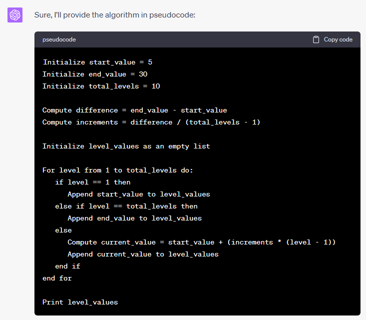
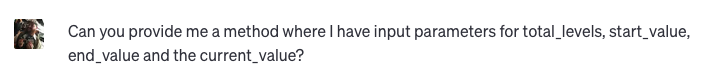

:revealjs_theme: solarized
= OpenAI for Engineers

== What even is ChatGPT?

ChatGPT is a chatbot developed by OpenAI

=== What is a chatbot?

A chatbot is a tool which can interpret human languange, written and verbal, and transform it into adeqate search queries on a big data foundation.

No queries or commands to learn, just write or say in natural language.

== Not only for business

Tools like ChatGPT can also be used by engineers to accelerate their work or improve current work.

=== Not only for business

It will not do you work. You still need to know what you want to achieve.

== Convert an application from one language to another

Possibiliy to fast translate from one source language to another

=== Given the following C++ code

=== Lets convert it

=== And in Rust

=== What about Java?

=== Arabic to Roman Conversation in Java

=== You still need to check the code

Despite fast results, you still need to make sure the code runs and gives desired results. Because ChatGPT is dumb on it's own, it can even produce wrong or not runnable code.

WARNING: You are responsible for code you check in.

== Write UnitTests for an application

If the source code is known, you can even let the bot write UnitTests for it.

=== Write UnitTests for an application

=== Write UnitTests for an application

=== Write UnitTests for an application

=== Write UnitTests for an application

=== Write UnitTests for an application

=== Write UnitTests for an application

== Does this magic always works?

No, it's still an application. Therefor it can inherit bugs on it's own and can only work with a given data basis. It can not think. It is dumb.

=== Example where ChatGPT fails

Given a C++ class of a fictional town in a fantasy game. The class and the current unit tests are presented to ChatGPT and it had given a proper summary.

It completely knows my source code.

IMPORTANT: Don't do this with work code.

=== Example where ChatGPT fails

=== Example where ChatGPT fails

=== Example where ChatGPT fails

=== Example where ChatGPT fails

=== Example where ChatGPT fails

=== Example where ChatGPT fails

=== Example where ChatGPT fails

There is zero understanding of your code.

=== Example where ChatGPT fails

Let's give ChatGPT the code again to memorize it.

=== Example where ChatGPT fails

It got the context right!

=== Example where ChatGPT fails

=== Example where ChatGPT fails

=== Example where ChatGPT fails

=== Example where ChatGPT fails

Again, it does not really knows your code. It still did not got it right that **_fame** is only a calculated value.

=== Example where ChatGPT fails

=== Example where ChatGPT fails

The correct value with 12456 in _residents is 498.

=== Example where ChatGPT fails

=== Example where ChatGPT fails

=== Example where ChatGPT fails

image::slidesimages/ChatGPT_TownUnitTest_016.PNG[]

=== Example where ChatGPT fails

At this point I stopped the dialog.

== Generate code just from a description

You can not only work with existing code, you can also let it generate new code just from a written description.

=== Generate code just from a description

"Number series with 10 levels. Level 1 has the value 5. Level 10 has the value 30.

What must the values in between be in order to obtain an even distribution?""

=== Generate code just from a description

=== Generate code just from a description

=== Generate code just from a description

=== Generate code just from a description

=== Generate code just from a description

=== Generate code just from a description

=== Generate code just from a description

=== Generate code just from a description

=== Generate code just from a description

=== Generate code just from a description

(Code copied into VSC for better visualiation)

=== Generate code just from a description

(Code copied into VSC for better visualiation)

= The work with ArabicToRomanLetters can be looked up

Source C++

https://gitlab.com/janhkrueger/TutorialConvertRomanLettersToArabicNumeralsforCpp/-/blob/main/main.cpp

ChatGPT dialog

https://chat.openai.com/share/12b4c378-3a0a-478b-aa99-280771801977

(Full links in source to this presentation)