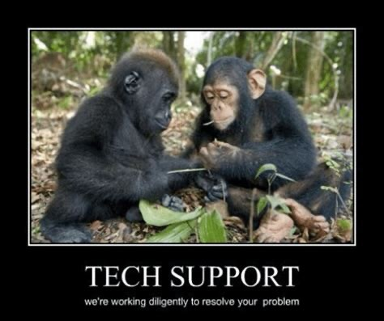
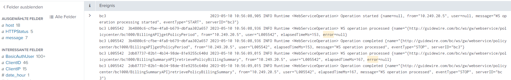
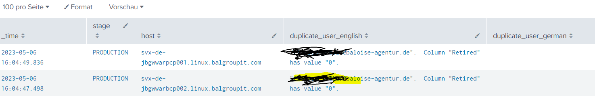
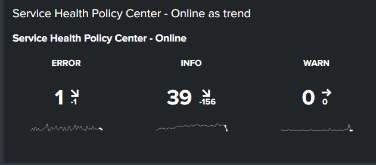
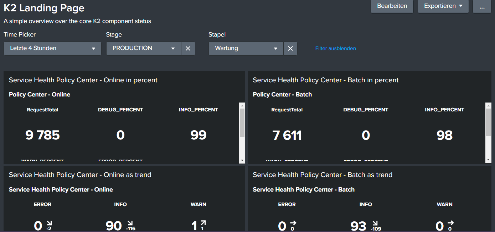
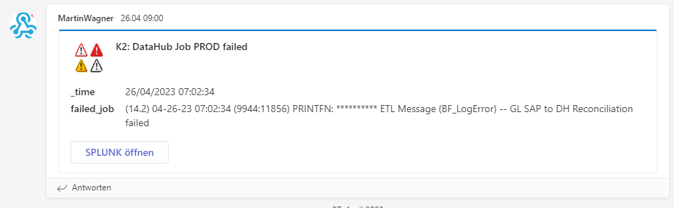

:revealjs_theme: beige

= Topic Transfer OIS1 to BillingCenter

== Base Question: What is is a

image::slidesimages/TravoltaWhatsHappening.gif[]

=== Builds

Code to App
SourceCode

=== Deployments

App to Hardware

=== Pipeline

Write the recipes to do

image::slidesimages/WatchingYouLol.jpeg[]

=== Solution Four

Automatic monitoring in a defined way.

image::slidesimages/ThisIsTheWay.jpeg[]

== What's the goal?

image::slidesimages/WhatIsThisGoal.jpeg[]

=== Confidence

Our partners can trust us that we know what is happending.

=== Transparency

It is public how we get to decisions and the why we do stuff. Or why not.

=== Visibility

We do not hide the status of the company and share it with all who are interested in an easy accessible way.

=== Alerting

We inform the right people in the right time in the case of an issue. With the right informations.

=== Simply

Know about an issue before the customer is phoning us.

== Or in other words

"With a good monitoring strategy in place, you’ll get better transparency and visibility into your operations with a well-timed alert system."
-- Andreas Prins

=== To transform this...

=== ... over this ...

=== ... to this

== "We need monitoring!"

image::slidesimages/OneDoesNotSimplySayMonuitoring.jpeg[]

=== Infrastructure

What is happening on and with the hardware.

=== Infrastructure: Solutions

* Zappix
* Grafana / Prometheus
* DynaTrace

=== application

- What is happening inside the application.
- What is the application doing?
- Why is the application doing stuff?

=== application: Solutions

* Splunk
* Grafana / Prometheus
* DynaTrace

=== business

- Short: Are the brokers and the company happy?

=== business: Solutions

* DynaTrace

=== Security

- Do we have security issues?
- Where are these issues?

=== Security: Solutions

Tenable.IO, Sonar, Flexera, Flexera Agents, Nexthink, Zabbix, Tivoli Assed Directory, Nivoli Netcool, QRadar, Tanium, Vectra, Jazzey, NetView, Z/OS Health Checker, Console Operating, ZOSMF, Beta 92, Beta UX, MVS Syslog, EZABROWS, OPERLOG, JES Spool, UC4 Logs, PD Tools, GTF, VTAM Trace, SolarWinds

=== Spoiler

=== Spoiler

- Future of DynaTrace is undecided.
- Expensive and only partly used.
- Currently in decision of K2 if it will used further. (20th of June)
- Possible decomissioning mid-year.

== Today's focus

Application monitoring with Splunk with samples from K2, SIP and others.

== Splunk

"Collects and analyzes high volumes of machine generated data."

=== Why?

- data to analyze is growing exponentially
- more services, more log files
- bigger log files
- systems get too complex to be overviewed by just one person

=== Why?

- Policy Center alone runs in 7 servers.
- The amount of log entries alone forbids to search manually in all files in a case of emergency to fast identify the source.
- Get the data always in a structured way.

=== Why?

SIP now consists of 40 services which write all their own logs.

Happy searching.

=== Why?

Already used and integration into the group since several years.

=== Why?

- A well known tool on the market, no own implementation.
- Changes are getting higher that new colleagues already know it.

=== Why?

- Searches are done with a query language.
- Those who can write SQL, can write Splunk queries.

=== Why?

image::slidesimages/TrustNoOne.jpeg[]

=== Why?

Humans are:

* Prone to errors
* Not reliable
* Depending on daily form

=== Why?

Humans easily lower their guard:

* "I know what I do"
* "I have done this since years."
* "Nothing happened the last times."
* "I do not make mistakes."

=== Why?

Cyber attack in 2022 want's to have a word with you.

image::slidesimages/InternetWantsToHaveAWordWithYou.jpeg[scale=80]

=== Solution

* Take out the human factor regarding information collection.
* Agree on a common way what and how to log.
* Standardize the representation in a fast and easy human readable form.

== Usage in the group
- Maintained from BITS
- Available for all who whish to use it and want to pay the data usage.
- In DE introduced for GW and SIP in 2019.
- OIS3 is primary responsible for monitory solutions in DE

== What is possible?

Wrong question.

=== What is possible?

video::slidesimages/WhatDoYouWant.mp4[opts="autoplay,controls", options=autoplay]

=== What do you need to know?

=== What do you need to know?

Without the answer what you need to know, you will only have data storage wasted.

=== What do you need to know?

What are the metrics you need to make reliable, informed decisions?

== How to use it

* Let BITS / HCL the splunk log ingestor on your servers
* Define a permission group for all your servers
* Order the permission via DIM for all who need to see your logs (LAS-compatible)

== Let's go

(samples for K2 Guidewire)

=== Search globally for errors.

[source,splunk]
----
index="jserv-de_gw_p" error
----

=== Search for user upload errors

[source,splunk]
----
index="jserv-de_gw_*" host="svx-de-jbgwwar*" "com.guidewire.pl.system.exception.DBDuplicateKeyException:" "Error during import"
| eval stage = CASE(index == "jserv-de_gw_t", "TEST", index == "jserv-de_gw_a", "ACCEPTANCE", index == "jserv-de_gw_i", "INTEGRATION", index == "jserv-de_gw_p", "PRODUCTION")
| rex field=_raw (?<duplicate_user_english>has.value.*\.)
| rex field=_raw (?<duplicate_user_german>hat.den.Wert.*\.)
| eval duplicate_user_english=SUBSTR(duplicate_user_english, 11)
| eval duplicate_user_german=SUBSTR(duplicate_user_german, 13)
| table _time, stage, host, duplicate_user_english, duplicate_user_german
| sort by _time desc
----

=== Trend

=== Trend

[source,splunk]
----
index="jserv-de_gw_*"
|search source = "*log.log"
|eval stage = CASE(index == "jserv-de_gw_t", "TEST", index == "jserv-de_gw_a", "ACCEPTANCE", index == "jserv-de_gw_i", "INTEGRATION", index == "jserv-de_gw_p", "PRODUCTION")
|search stage = "*PRODUCTION*"
|eval source = SUBSTR(source, 35)
|eval stackapp = SUBSTR(source, 1, 6)
|eval stack = SUBSTR(source, 1, 3)
|eval stack = CASE(stack == "war", "Wartung", stack == "pe1", "Migration", stack == "pe2", "Time Travel", stack == "pe3", "Data Hub")
|search stack = "*Wartung*"
|eval app = SUBSTR(source, 4, 3)
|eval app = CASE(app == "sip", "SIP - Service Integration Platform", app == "pcb", "Policy Center - Batch", app == "pco", "Policy Center - Online", app == "cmb", "Contact Manager - Batch", app == "cmo", "Contact Manager - Online", app == "ccb", "Claim Center - Batch", app == "cco", "Claim Center Online", app == "bcb", "Billing Center - Batch", app == "bco", "Billing Center - Online")
|search app = "Policy Center - Online"
|search RequestStatus IN ("DEBUG", "INFO", "WARN", "ERROR")
|timechart count by RequestStatus
----

=== Save your query for later reusage

=== Organise several querys in a dashboard

== Just one more thing

image::slidesimages/JustOneMoreThing.jpeg[]

== Alerting!

video::slidesimages/DangerWillRobinson.mp4[opts="autoplay,controls", options=autoplay]

=== Alerting

- Mail
- automated Jiratickets
- Teams

=== Teamsalerting

=== Teamsalerting

== What is necessary?

- Time
- Ideas
- Permissions
