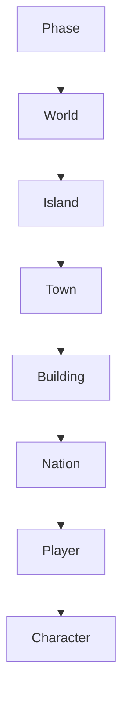
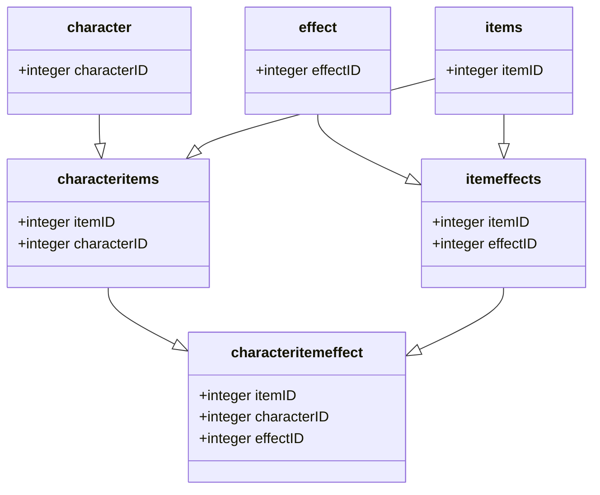

# Test

# Insulae

Overall Status [](https://gitlab.com/janhkrueger/insulae/)


## Motivation
Maintainance and development of Insulae. Possible sharing the codebase sometime with others. Also: code safety, to have always an backup of the source on a third party machine.

## Features
* written in C++
* new game objects can implemented just with the database
* test cases for core classes with [GoogleTest](https://github.com/google/googletest)

## Bug / Feature Request

If you find a bug (the website couldn't handle the query and / or gave irrelevant results), kindly open an issue [here](https://gitlab.com/janhkrueger/insulae/-/issues/new) by including your search query and the expected result.

If you'd like to request a new functionality, feel free to do so by opening an issue [here](https://gitlab.com/janhkrueger/insulae/-/issues/new) including some sample queries and their corresponding results.


## Dependencies
External Frameworks used during the compile of Insulae.

* [GoogelTest](https://github.com/google/googletest) - For running unit tests against the c++ classes.
* [curlpp](https://github.com/jpbarrette/curlpp) - Easy sending and getting curl requests from withing c++ apps.
* [libvault](https://github.com/abedra/libvault) - A C++ library for Hashicorp Vault
* [Pistache](https://github.com/pistacheio/pistache) - Main driver for the api server.
* [radidjson](https://github.com/Tencent/rapidjson) - Fast and easy handling of json content, used for the outout of the api server.
* [spdlog](https://github.com/gabime/spdlog) - Logging classes with small ressource footprint.


## Tools used for Static Code Analysis
The following tools will be executed with ```code-maintenance/codeMaintenance.sh``` and partly also with [Gitlabs own SAST tools](https://docs.gitlab.com/ee/user/application_security/sast/).

* [flawfinder](https://github.com/david-a-wheeler/flawfinder)
* [TsanCode](https://github.com/Tencent/TscanCode)

## Code Style
To make sure the c++ source code is always formatted in the same way, [astyle](http://astyle.sourceforge.net/astyle.html) is used.

### Call to astyle
```astyle --style=google --verbose --preserve-date --formatted --indent=spaces=2 --delete-empty-lines --indent-col1-comments --max-code-length=80 --break-after-logical --mode=c --suffix=none --lineend=linux $HOME/insulae/src/*.cpp $HOME/insulae/src/*.h > $HOME/insulae/code-maintenance/01_style_astyle.txt```

If desired, it is even possible to run, locally, a pre-commit hook to make sure all files are getting proper formatted. Please use the script [helpers/pre-commit.sh](https://gitlab.com/janhkrueger/insulae/-/blob/main/helpers/pre-commit.sh)


# Getting started
To set up Insulae for the first run, follow these steps:

### Cloning of the Code
At first, clone this repository. ```git clone git@gitlab.com:janhkrueger/insulae.git```


### Folder initialisation
Then execute the script [helpers/createFolders.sh](https://gitlab.com/janhkrueger/insulae/-/blob/main/helpers/createFolders.sh) to create necessary folders for Insulae to run. Make sure to run as the intended linux user the game should run as. Otherwise later the permissions need to be adjusted to make sure the application and make processes can write into the folders.


### Start Up the enviroment
The enviroment for Insulare is made with docker. Everything can be started the following command:
```CURRENT_UID=$(id -u):$(id -g) docker-compose up -d ```


### Docker compose
The docker files require a docker compose version of at least 1.29.1 to ensure docker files of v3.9 can be interpreted.

### PostGresql 13.2
If this is the first start, you need to import basic database data:

#### Load older backup
```
export postgres_ip=$(docker inspect -f '{{range .NetworkSettings.Networks}}{{.IPAddress}}{{end}}' insulae-db)
psql -h $postgres_ip -U insulae insulae < insulae_db_20180709_0508.dump
```

### PHP 7
As long as the frontend is still written in PHP, there is the need fo an PHP interpreter. Everything is handled in the docker-compose and the site configuration of the webserver. Nothing special to do.

### Redis
Insulae uses the In-Memory-database Redis for fast data retrieval and to reduce the need for real database queries.


To connect to redis from the host, for example to check and debug values during development, you need the redis-client tools which can be installed like this on debian based distributions.


See how [[MagicTraveling]] is working.

#### get redis-client tools
```
apt-get install redis-tools 
```

#### connect to redis-container
```
export redis_ip=$(docker inspect -f '{{range .NetworkSettings.Networks}}{{.IPAddress}}{{end}}' insulae-redis)
redis-cli -h $redis_ip
```

=============
### batches

#### RotierenPortale
Rotates all portals one step.

Usage:
```
chmod +x Insulae-RotierenPortale
./Insulae-RotierenPortale
```

#### RotierenStadt
Rotates all towns one step.

Usage:

```
chmod +x Insulae-RotierenStadt
./Insulae-RotierenStadt
```

#### Stadteingang
Ensures that every town has an entry. Just in case...

Usage:

```
chmod +x Insulae-Stadteingang
./Insulae-Stadteingang
```

#### Wachstum
Let's every resources grow on every field in the game. Default is 4 points for every basic resources and 2 for every special resources.

Usage:
```
chmod +x Insulae-Wachstum
./Insulae-Wachstum
```

#### XP-Gebaeude
Rewards every character in a building with some XP points.

Usage:
```
chmod +x Insulae-XP-Gebaeude
./Insulae-XP-Gebaeude
```

#### XP-Staedte
Rewards every character leading a town with some XP points.

Usage:
```
chmod +x Insulae-XP-Staedte
./Insulae-XP-Staedte
```

### Create Triggers

### Fill Goods into a town
For the case that the goods on the primary market is not filled when the town is created, the following trigger can be run manually.

```
CREATE TRIGGER tr_stadtwareneintraegen AFTER INSERT ON town.town FOR EACH ROW EXECUTE PROCEDURE town.warenbefuellung();
```

### Order of effect calculation



### Order of effect calculation



## Release History
* 1.0.0.0 - Initial release


Copyright 2002+ [Friedrichsdorf Germany][janhkrueger].

> [janhkrueger.gitlab.io](https://janhkrueger.gitlab.io/blog/) &nbsp;&middot;&nbsp;
> GitLab [janhkrueger][janhkrueger] &nbsp;&middot;&nbsp;
> Twitter [@janhkrueger](https://twitter.com/janhkrueger)

[janhkrueger]: https://gitlab.com/janhkrueger
[here]: https://gitlab.com/janhkrueger/insulae/issues/new

[//begin]: # "Autogenerated link references for markdown compatibility"
[MagicTraveling]: docs/MagicTraveling "MagicTraveling"
[//end]: # "Autogenerated link references"
